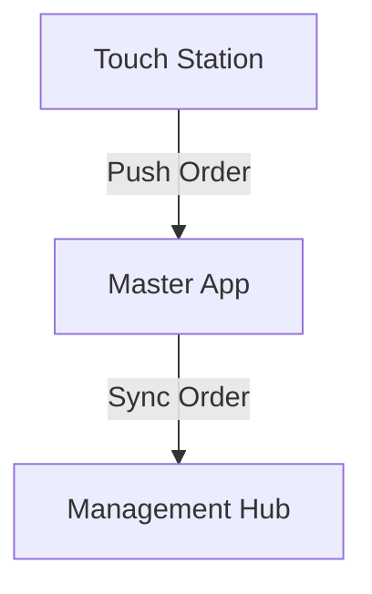

# Master App Architecture (Updated)

## Overview

The Master App is a sophisticated Electron-based desktop application for professional photography workflow management. It combines a React frontend with an Express backend, providing offline-first capabilities with cloud synchronization.

**Recent Updates**: Multi-master cloud synchronization, MoneyTrash monetization, and automated configuration system.

---

## System Architecture

```text
┌─────────────────────────────────────────────────────────────────────────────┐
│                        MASTER APP ARCHITECTURE                               │
│                     (With Multi-Master Cloud Sync)                           │
├─────────────────────────────────────────────────────────────────────────────┤
│                                                                              │
│  ┌─────────────────────────────────────────────────────────────────────┐   │
│  │  ELECTRON SHELL (Desktop Container)                                  │   │
│  │  ├── Main Process (Node.js)                                          │   │
│  │  └── Renderer Process (Chromium)                                     │   │
│  └─────────────────────────────────────────────────────────────────────┘   │
│                                    │                                        │
│  ┌─────────────────────────────────┼────────────────────────────────────┐ │
│  │                                 ▼                                    │ │
│  │  ┌────────────────────────────────────────────────────────────────┐ │ │
│  │  │  FRONTEND (React 19 + Vite)                                   │ │ │
│  │  │  ├── Components (12 modules)                                  │ │ │
│  │  │  ├── State Management (TanStack Query + Context)              │ │ │
│  │  │  ├── Services (API, Sync, AI, Cloud)                         │ │ │
│  │  │  └── Hooks (Custom React hooks)                              │ │ │
│  │  └────────────────────────────────────────────────────────────────┘ │ │
│  │                                 │                                    │ │
│  │  ┌──────────────────────────────┼────────────────────────────────┐ │ │
│  │  │                              ▼                                │ │ │
│  │  │  BACKEND (Express + SQLite + Cloud Sync)                     │ │ │
│  │  │  ├── REST API (25+ routes)                                  │ │ │
│  │  │  ├── WebSocket Server (Real-time kiosk sync)                │ │ │
│  │  │  ├── Cloud Sync Service (Management Hub + Gallery)          │ │ │
│  │  │  ├── Worker Pool (CPU-Parallel processing)                  │ │ │
│  │  │  ├── Parallel Queue Processor (Retention, Fulfillment, Face) │ │ │
│  │  │  └── Services (Business logic + MoneyTrash)                │ │ │
│  │  └──────────────────────────────────────────────────────────────┘ │ │
│  │                                                                    │ │
│  │  ┌────────────────────────────────────────────────────────────────┐ │ │
│  │  │  DATA LAYER                                                   │ │ │
│  │  │  ├── SQLite (Primary database)                                │ │ │
│  │  │  ├── Cloud Sync Tables (operation_logs, retention_queue)      │ │ │
│  │  │  ├── IndexedDB (Browser cache)                                │ │ │
│  │  │  └── File System (Photos, exports, trash_archive)            │ │ │
│  │  └────────────────────────────────────────────────────────────────┘ │ │
│  │                                                                    │ │
│  └────────────────────────────────────────────────────────────────────┘ │
│                                                                          │
│  ┌─────────────────────────────────────────────────────────────────────┐ │
│  │  CLOUD SYNCHRONIZATION LAYER                                       │ │
│  │  ┌─────────────────────────┐  ┌─────────────────────────┐          │ │
│  │  │  MANAGEMENT HUB        │  │  CUSTOMER GALLERY       │          │ │
│  │  │  (Cloudflare Workers)  │  │  (Cloudflare Pages)      │          │ │
│  │  │  ───────────────────── │  │  ─────────────────────   │          │ │
│  │  │  • D1 Database         │  │  • D1 Database           │          │ │
│  │  │  • Sync Operations     │  │  • Photo Storage         │          │ │
│  │  │  • Fleet Monitoring    │  │  • Customer Orders       │          │ │
│  │  │  • Payroll Aggregation │  │  • MoneyTrash Sales      │          │ │
│  │  │  • Multi-Master Coord  │  │  • Album Viewer          │          │ │
│  │  └─────────────────────────┘  └─────────────────────────┘          │ │
│  └─────────────────────────────────────────────────────────────────────┘ │
│                                                                          │
│  ┌─────────────────────────────────────────────────────────────────────┐ │
│  │  EXTERNAL SERVICES                                                   │ │
│  │  ├── AI/ML (TensorFlow.js, face-api)                                │ │
│  │  ├── Kiosk Sync (WebSocket)                                         │ │
│  │  ├── Stripe Payments                                                │ │
│  │  └── Email Services                                                 │ │
│  └─────────────────────────────────────────────────────────────────────┘ │
│                                                                          │
└──────────────────────────────────────────────────────────────────────────┘
```

---

## Cloud Synchronization Architecture

### Multi-Master Synchronization Flow

```text
┌─────────────────────────────────────────────────────────────────────────────┐
│                    MULTI-MASTER SYNC ARCHITECTURE                            │
├─────────────────────────────────────────────────────────────────────────────┤
│                                                                              │
│   MASTER STATION 1          MASTER STATION 2          MASTER STATION N      │
│   (Maldives)                (Dubai)                   (Bali)                │
│                                                                              │
│   ┌──────────────┐          ┌──────────────┐          ┌──────────────┐     │
│   │ Local SQLite │          │ Local SQLite │          │ Local SQLite │     │
│   │ • orders     │          │ • orders     │          │ • orders     │     │
│   │ • albums     │          │ • albums     │          │ • albums     │     │
│   │ • photos     │          │ • photos     │          │ • photos     │     │
│   │ • payroll    │          │ • payroll    │          │ • payroll    │     │
│   └──────┬───────┘          └──────┬───────┘          └──────┬───────┘     │
│          │                         │                         │             │
│          │    Sync Cycle (60s)     │                         │             │
│          │    ─────────────────    │                         │             │
│          │    • operation_logs     │                         │             │
│          │    • syncLedgerEntries  │                         │             │
│          │    • syncExpenses       │                         │             │
│          │    • syncInventory      │                         │             │
│          │    • syncOrdersToGallery│                         │             │
│          │    • sendHeartbeat      │                         │             │
│          ▼                         ▼                         ▼             │
│   ╔═══════════════════════════════════════════════════════════════════╗   │
│   ║                    CLOUDFLARE MANAGEMENT HUB                       ║   │
│   ║  ┌─────────────────────────────────────────────────────────────┐  ║   │
│   ║  │  D1 DATABASE (Aggregated Data)                               │  ║   │
│   ║  │  ─────────────────────────────────────────────────────────   │  ║   │
│   ║  │  • orders (desk_id, original_id)                            │  ║   │
│   ║  │  • photos (desk_id, original_id)                            │  ║   │
│   ║  │  • photographer_ledger (consolidated payroll)               │  ║   │
│   ║  │  • expenses (cross-desk reporting)                          │  ║   │
│   ║  │  • inventory (fleet stock levels)                           │  ║   │
│   ║  │  • destinations (fleet registry)                            │  ║   │
│   ║  │  • operation_logs (sync history)                            │  ║   │
│   ║  │  • sync_sequences (vector clocks)                           │  ║   │
│   ║  └─────────────────────────────────────────────────────────────┘  ║   │
│   ║                                                                   ║   │
│   ║  ┌─────────────────────────────────────────────────────────────┐  ║   │
│   ║  │  SERVICES                                                    │  ║   │
│   ║  │  • applyOperations() - Process incoming sync                 │  ║   │
│   ║  │  • getRemoteOperations() - Push to other masters             │  ║   │
│   ║  │  • updateFleetHeartbeat() - Health monitoring                │  ║   │
│   ║  │  • Conflict resolution (Last-Write-Wins)                     │  ║   │
│   ║  └─────────────────────────────────────────────────────────────┘  ║   │
│   ╚═══════════════════════════════════════════════════════════════════╝   │
│                                    │                                       │
│                                    ▼                                       │
│   ╔═══════════════════════════════════════════════════════════════════╗   │
│   ║                    CUSTOMER GALLERY (Cloud)                        ║   │
│   ║  ┌─────────────────────────────────────────────────────────────┐  ║   │
│   ║  │  • Order photos (high-res uploads from Master)               │  ║   │
│   ║  │  • Unsold photos (MoneyTrash retention uploads)              │  ║   │
│   ║  │  • Customer viewing & purchasing                             │  ║   │
│   ║  └─────────────────────────────────────────────────────────────┘  ║   │
│   ╚═══════════════════════════════════════════════════════════════════╝   │
│                                                                              │
└─────────────────────────────────────────────────────────────────────────────┘
```

---

## Directory Structure

```bash
apps/master/
├── src/                          # Frontend source
│   ├── components/               # React components
│   │   ├── albums/              # Album management
│   │   ├── bookings/            # Booking system
│   │   ├── common/              # Shared components
│   │   ├── culling/             # AI photo culling
│   │   ├── dashboard/           # Dashboard widgets
│   │   ├── error-boundaries/    # Error handling
│   │   ├── marketing/           # Marketing tools
│   │   ├── modals/              # Modal dialogs
│   │   ├── orders/              # Order management
│   │   ├── photographers/       # Photographer management
│   │   ├── products/            # Product catalog
│   │   └── settings/            # App settings
│   ├── context/                 # React context providers
│   ├── hooks/                   # Custom React hooks
│   ├── services/                # Frontend services
│   │   ├── api/                 # API services
│   │   ├── cloudSyncService.ts  # Cloud sync frontend
│   │   └── cloudApiService.ts   # Gallery API
│   ├── types/                   # TypeScript types
│   ├── utils/                   # Utility functions
│   └── workers/                 # Web workers
├── backend/                      # Backend source
│   ├── config/                  # Configuration
│   ├── controllers/             # Route controllers
│   ├── middleware/              # Express middleware
│   ├── migrations/              # DB migrations (52+ files)
│   │   ├── 052_add_sync_columns.sql     # NEW: Multi-master sync
│   │   └── 053_add_order_sync_status.sql # NEW: Order sync
│   ├── routes/                  # API routes
│   │   ├── cloud.ts             # NEW: Cloud sync endpoints
│   │   └── syncRoutes.js        # Gallery sync routes
│   ├── schemas/                 # Data schemas
│   ├── services/                # Business logic
│   │   ├── cloudSyncService.ts  # NEW: Cloud sync service
│   │   ├── LedgerService.ts     # NEW: Payroll tracking
│   │   ├── MoneyTrashService.ts # NEW: Unsold photo monetization
│   │   └── QueueProcessor.ts    # Retention & fulfillment queues
│   ├── setup/                   # NEW: Configuration system
│   │   ├── cloud-setup-wizard.js        # Interactive setup
│   │   ├── cloudflare-provision.js      # Cloud provisioning
│   │   ├── setup-master.sh              # Linux/Mac setup
│   │   ├── setup-master.bat             # Windows setup
│   │   └── config-template.env          # Configuration template
│   ├── shared/                  # Shared utilities
│   │   ├── db.ts                # SQLite manager (WAL + Migrations)
│   │   ├── WorkerPool.ts        # Generic worker thread management
│   │   └── photoProcessor.ts    # Parallel asset generation
│   ├── tests/                   # Backend tests
│   ├── types/                   # Backend types
│   └── workers/                 # Background workers (Photo, Face, etc.)
├── docs/                        # Documentation
└── scripts/                     # Build scripts
```

---

## Cloud Sync Services

### CloudSyncService (apps/master/backend/services/cloudSyncService.ts)

Central service for cloud synchronization.

**Methods**:

- `sync()` - Main sync cycle (runs every 60s)
- `syncOperationLogs()` - Core data sync
- `syncLedgerEntries()` - Payroll data sync
- `syncExpenses()` - Business expenses sync
- `syncInventory()` - Consumables stock sync
- `syncOrdersToGallery()` - Order sync to Gallery
- `sendHeartbeat()` - Fleet health reporting
- `uploadRetentionAsset()` - MoneyTrash photo upload
- `uploadHighRes()` - Order fulfillment upload

**Configuration**:

```typescript
interface SyncConfig {
  enabled: boolean;
  retentionDays: number;
  price: string;
}
```

### LedgerService (apps/master/backend/services/LedgerService.ts)

Photographer payroll tracking with cloud sync.

**Features**:

- Commission calculation per order
- Salary tracking
- Bonus/deduction entries
- Cloud sync to Management Hub



**Schema**:

```sql
CREATE TABLE photographer_ledger (
    id TEXT PRIMARY KEY,
    photographer_id TEXT NOT NULL,
    order_id TEXT,
    type TEXT, -- 'Commission', 'Salary', 'Bonus', 'Deduction'
    amount REAL,
    sync_status TEXT DEFAULT 'pending',
    sync_id TEXT
);
```

### MoneyTrashService (apps/master/backend/services/MoneyTrashService.ts)

Automated unsold photo monetization.

**Workflow**:

1. Detect unsold photos (not in paid orders)
2. Archive to retention queue
3. Watermark photos
4. Upload to Gallery cloud
5. Customer can purchase via Gallery

**Configuration**:

```typescript
interface MoneyTrashConfig {
  enabled: boolean;
  retentionMinutes: number; // Default: 120 (2 hours)
  emailTriggerTime: number; // Minutes before email
  discountPercentage: number; // Default: 50%
}
```

### QueueProcessor (apps/master/backend/services/QueueProcessor.ts)

Decoupled, parallelized queue processing for high-volume photo management.

**Parallel Loops**:

- **Fulfillment**: 10s interval, pushes processed orders to Cloud R2.
- **Watermark/Retention**: 30s interval, manages MoneyTrash lifecycle.
- **Face Indexing**: Continuous, utilizes **WorkerPool** for parallel CPU-heavy indexing.

### WorkerPool (apps/master/backend/shared/WorkerPool.ts)

Generic orchestration layer for Node.js `worker_threads`.

**Features**:

- **Concurrency Control**: Limits active threads to `os.cpus().length - 2`.
- **Job Queuing**: Maintains an internal FIFO queue for tasks exceeding capacity.
- **Error Isolation**: Automatically terminates and respawns failing workers.
- **Supported Tasks**: Face detection, image metadata extraction, and complex filtering.

---

## Sync Data Flow

```text
User Action / System Event
    │
    ▼
┌─────────────────────────────────────┐
│ Local Database Update               │
│ • INSERT/UPDATE/DELETE              │
└──────────────────┬──────────────────┘
                   │
    ┌──────────────┼──────────────┐
    │              │              │
    ▼              ▼              ▼
┌────────┐  ┌──────────┐  ┌──────────┐
│operation│  │photos    │  │orders    │
│_logs    │  │.sync_status│  │.sync_status│
└───┬────┘  └────┬─────┘  └────┬─────┘
    │            │             │
    └────────────┴─────────────┘
                   │
                   ▼ (Every 60s)
        ┌─────────────────────┐
        │ CloudSyncService    │
        │ .sync()             │
        └──────────┬──────────┘
                   │
    ┌──────────────┼──────────────┐
    │              │              │
    ▼              ▼              ▼
┌────────┐  ┌──────────┐  ┌──────────┐
│ sync   │  │ sync     │  │ sync     │
│Ledger  │  │Expenses  │  │Inventory │
│Entries │  │          │  │          │
└───┬────┘  └────┬─────┘  └────┬─────┘
    │            │             │
    └────────────┴─────────────┘
                   │
                   ▼
        ┌─────────────────────┐
        │ POST /api/cloud/    │
        │ sync/operations     │
        └──────────┬──────────┘
                   │
                   ▼
        ┌─────────────────────┐
        │ Management Hub      │
        │ (Cloudflare)        │
        └─────────────────────┘
```

---

## Configuration System

### Setup Wizard

Interactive CLI wizard for new Master stations:

```bash
node setup/cloud-setup-wizard.js
```

**Steps**:

1. Desk Identity (ID, Name, Location)
2. Management Hub Configuration
3. Gallery Configuration
4. Feature Toggles
5. Connection Testing
6. Configuration Saving
7. Database Initialization

### One-Command Setup

**Linux/Mac**:

```bash
./setup/setup-master.sh MASTER_MALDIVES_01 "Soneva Fushi" "Maldives"
```

**Windows**:

```batch
setup\setup-master.bat MASTER_MALDIVES_01 "Soneva Fushi" "Maldives"
```

### Environment Variables

```bash
# Desk Identity
DESK_ID=MASTER_MALDIVES_01
DESK_NAME="Soneva Fushi - Main Reception"
DESK_LOCATION="Maldives, Baa Atoll"

# Cloud Connectivity
CLOUD_API_URL=https://management.clickflash.app
CLOUD_EMAIL=admin@soneva.com
CLOUD_PASSWORD=secure-password
GALLERY_URL=https://gallery.clickflash.app

# Features
CLOUD_SYNC_ENABLED=true
MONEYTRASH_ENABLED=true
RETENTION_DAYS=15
```

---

## Technology Stack Updates

### Cloud Infrastructure

- **Cloudflare Workers**: Management Hub API
- **Cloudflare Pages**: Customer Gallery
- **Cloudflare D1**: Multi-tenant database
- **Cloudflare R2**: Photo storage (optional)

### New Services

- **Cloud Sync**: Parallel sync operations
- **MoneyTrash**: Unsold photo monetization
- **Ledger**: Payroll tracking
- **Fleet Monitor**: Multi-master health monitoring

---

## Security (Cloud)

1. **Authentication**: JWT tokens with desk_id claim
2. **Authorization**: Desk-level data isolation
3. **Data Protection**: HTTPS/TLS for all transfers
4. **Idempotency**: original_id prevents duplicates
5. **Conflict Resolution**: Vector clocks + LWW strategy

---

## Monitoring

### Fleet Monitor

Real-time visibility into all Master stations:

- Online/offline status
- Sync lag metrics
- Health statistics
- Version tracking

### Sync Metrics

```typescript
interface SyncMetrics {
  pendingOperations: number;
  lastSuccessfulSync: string;
  cloudConnection: "online" | "offline";
  queues: {
    retention: number;
    fulfillment: number;
  };
}
```

---

## Development Workflow

```bash
# Development (frontend + backend + cloud)
npm run dev:full

# Backend only
npm run dev:backend

# Setup new Master (interactive)
node backend/setup/cloud-setup-wizard.js

# Setup new Master (automated)
./backend/setup/setup-master.sh DESK_ID NAME LOCATION

# Testing
npm test
npm run test:e2e

# Build
npm run build
npm run package
```

---

## Documentation

- **[MASTER_SETUP_GUIDE.md](../../MASTER_SETUP_GUIDE.md)**: Complete setup guide
- **[MASTER_CLOUD_CONFIGURATION_SYSTEM.md](../../MASTER_CLOUD_CONFIGURATION_SYSTEM.md)**: Configuration system
- **[MULTI_MASTER_SYNC_FINAL.md](../../MULTI_MASTER_SYNC_FINAL.md)**: Sync architecture

---

_Last Updated: 2026-02-21_  
_Version: 5.0.0 (With Multi-Master Cloud Sync)_
