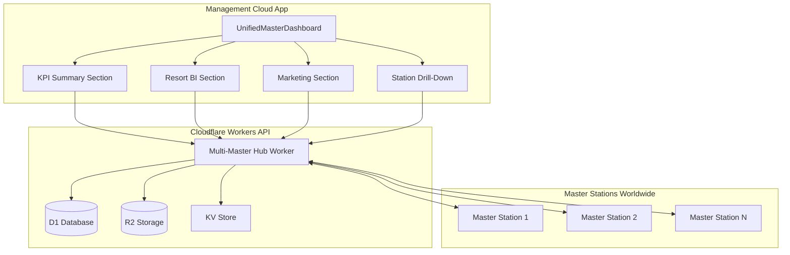

# Unified Multi-Master Dashboard Plan

## Objective

Create a unified dashboard in the Management Cloud App that combines all 3 Master app dashboards:

1. **Main Dashboard** - KPI cards, recent orders, top photographers, sales charts, album stats, product mix
2. **Resort BI Dashboard** - Business intelligence with trends, guest metrics, capture rates, session comparisons
3. **Marketing Dashboard** - Campaign management and analytics

The unified dashboard will show:

- **Aggregated data** from ALL Master stations worldwide
- **Per-station breakdown** with drill-down capability

---

## Architecture Overview



---

## Implementation Steps

### 1. Update Cloudflare Worker API

**File:** `apps/management/cloudflare/worker.ts`

Add new endpoints to the Management Hub Worker:

```typescript
// GET /api/dashboard/overview - Aggregated KPIs from all stations
// GET /api/dashboard/resort-bi - Trend data, guest metrics
// GET /api/dashboard/marketing - Campaign analytics
// GET /api/dashboard/station/:id - Single station data
// GET /api/dashboard/stations - All stations summary
```

### 2. Create Unified Dashboard Service

**File:** `apps/management/src/services/unifiedDashboardService.ts`

```typescript
interface UnifiedDashboardData {
  // KPIs
  kpis: {
    totalRevenueToday: number;
    totalRevenueWeek: number;
    totalRevenueMonth: number;
    totalOrdersToday: number;
    totalOrdersWeek: number;
    totalOrdersMonth: number;
    totalPhotosToday: number;
    albumsToProcess: number;
    pendingOrders: number;
  };

  // Resort BI
  resortBI: {
    trends: TrendPoint[];
    monthlyStatus: MonthlyStatus;
    comparison: Comparison;
    distribution: DistributionPoint[];
  };

  // Marketing
  marketing: {
    campaigns: Campaign[];
    analytics: CampaignAnalytics;
  };

  // Stations
  stations: Station[];
  aggregated: AggregatedStats;
}
```

### 3. Create Unified Master Dashboard Component

**File:** `apps/management/src/components/management/UnifiedMasterDashboard.tsx`

**Sections:**

#### A. KPI Summary Section

- 4-column grid with stat cards:
  - Today's Revenue (with trend indicator)
  - Today's Photos (with trend indicator)
  - Albums to Process
  - Pending Orders

#### B. Resort BI Section

- Time range selector (Today / 7D / 30D / 90D)
- Revenue & Orders trend chart (area chart)
- Monthly comparison table
- Guest metrics (arrivals, departures, capture rate)
- Per-station breakdown

#### C. Top Performers Section

- Top 5 stations by revenue
- Top 5 photographers across all stations
- Top albums

#### D. Marketing Section

- Active campaigns count
- Campaign performance summary
- Quick campaign stats

#### E. Station Drill-Down Panel

- Click any station to see detailed view
- Same widgets as Master app dashboard
- Station-specific trends, orders, photographers

### 4. Update Constants

**File:** `apps/management/src/constants.ts`

Add new view type:

```typescript
type ManagementView =
  | // ... existing views
  | "unified_master_dashboard";
```

### 5. Update Navigation

**File:** `apps/management/src/components/management/ManagementSidebar.tsx`

Add navigation item:

```typescript
{
  view: "unified_master_dashboard",
  label: "Master Dashboard",
  icon: LayoutDashboard,
  permission: "viewManagementDashboard"
}
```

### 6. Update Layout

**File:** `apps/management/src/components/management/ManagementLayout.tsx`

Add case for `unified_master_dashboard` view with import and lazy loading.

---

## Data Flow

1. User navigates to "Master Dashboard" in Management Cloud App
2. Component mounts and calls `unifiedDashboardService.getDashboardData()`
3. Service makes parallel API calls to Cloudflare Worker:
   - `/api/dashboard/overview` - KPIs
   - `/api/dashboard/resort-bi` - BI data
   - `/api/dashboard/marketing` - Marketing data
   - `/api/dashboard/stations` - Station list
4. Worker queries D1 database (synced from all Master stations)
5. Data is aggregated and returned
6. Component renders all sections with data

---

## Key Components to Create/Modify

| File                                                                       | Action | Description                  |
| -------------------------------------------------------------------------- | ------ | ---------------------------- |
| `apps/management/cloudflare/worker.ts`                                     | Modify | Add dashboard API endpoints  |
| `apps/management/src/services/unifiedDashboardService.ts`                  | Create | New service for unified data |
| `apps/management/src/components/management/UnifiedMasterDashboard.tsx`     | Create | Main dashboard component     |
| `apps/management/src/components/management/dashboard/KpiSection.tsx`       | Create | KPI cards widget             |
| `apps/management/src/components/management/dashboard/ResortBISection.tsx`  | Create | BI charts and metrics        |
| `apps/management/src/components/management/dashboard/MarketingSection.tsx` | Create | Marketing widgets            |
| `apps/management/src/components/management/dashboard/StationDrillDown.tsx` | Create | Station detail view          |
| `apps/management/src/constants.ts`                                         | Modify | Add view type                |
| `apps/management/src/components/management/ManagementSidebar.tsx`          | Modify | Add navigation               |
| `apps/management/src/components/management/ManagementLayout.tsx`           | Modify | Add route                    |

---

## Styling Guidelines

- Use dark theme with slate/zinc backgrounds
- Primary accent: `#38bdf8` (sky blue)
- Secondary accent: `#a78bfa` (violet for marketing)
- Success: `#34d399` (emerald)
- Warning: `#fbbf24` (amber)
- Error: `#f87171` (red)

- Use Tailwind CSS classes
- Support dark mode
- Responsive grid layouts
- Smooth transitions and animations
