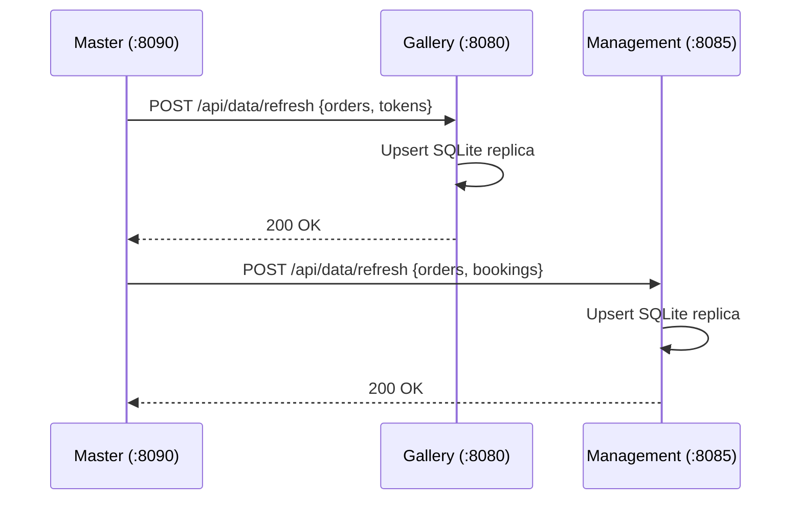
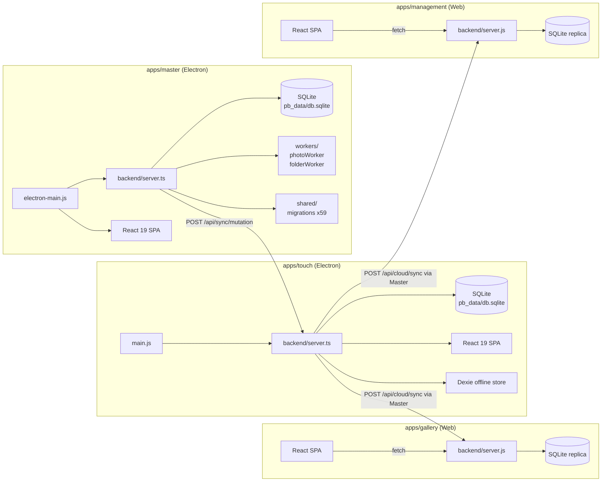

# ClickFlash — System Architecture

## Overview

ClickFlash is a multi-app photobooth platform. The system consists of:

| App | Runtime | Port | Deployment |
|-----|---------|------|------------|
| **master** | Electron + Express | 8090 | Windows desktop (.exe) |
| **touch** | Electron + Express | 8091 | Windows desktop (.exe) |
| **gallery** | Node.js + React (SPA) | 8080 / Cloudflare Pages | Docker / CF Pages |
| **management** | Node.js + React (SPA) | 8085 / Cloudflare Pages | Docker / CF Pages |
| **moneytrash** | Next.js | 3000 | Cloudflare Pages |
| **website** | Static / Next.js | — | Cloudflare Pages |
| **master-cpp** | Qt6 + C++ | — | Windows native binary |

---

## Network Topology

```mermaid
graph TB
    subgraph Venue LAN ["Venue LAN (192.168.x.x)"]
        direction TB
        MASTER["Master PC\n(master :8090)\nSQLite source-of-truth"]
        TOUCH1["Touch Kiosk 1\n(touch :8091)"]
        TOUCH2["Touch Kiosk 2\n(touch :8091)"]
        TOUCH3["Touch Kiosk N\n(touch :8091)"]
        PRINTER["Receipt Printer\n(USB/Network)"]
        RFID["RFID Reader\n(USB Serial)"]

        TOUCH1 -- "POST /api/sync/mutation\n(photo, order push)" --> MASTER
        TOUCH2 -- "POST /api/sync/mutation" --> MASTER
        TOUCH3 -- "POST /api/sync/mutation" --> MASTER
        MASTER -- "SSE /api/realtime\n(live updates)" --> TOUCH1
        MASTER -- "SSE /api/realtime" --> TOUCH2
        MASTER -. "Bonjour mDNS\n(auto-discovery)" .- TOUCH1
        TOUCH1 --> PRINTER
        TOUCH1 --> RFID
    end

    subgraph Cloud ["Cloudflare (cloud.clickflash.io)"]
        GALLERY["gallery\n(CF Pages / Docker :8080)"]
        MGMT["management\n(CF Pages / Docker :8085)"]
        MONEYTRASH["moneytrash\n(CF Pages :3000)"]
    end

    MASTER -- "cloud sync\nPOST /api/cloud/sync" --> GALLERY
    MASTER -- "cloud sync" --> MGMT
    CUSTOMER["Customer\n(mobile browser)"] --> GALLERY
    OPERATOR["Operator\n(browser)"] --> MGMT

---

## Data Flow — Photo Capture to Print

```mermaid
sequenceDiagram
    participant C as Customer (Kiosk)
    participant T as Touch Backend (:8091)
    participant M as Master Backend (:8090)
    participant P as Printer

    C->>T: POST /api/orders (select photos)
    T->>T: Generate order (UUID, price calc)
    T->>M: POST /api/sync/mutation {order}
    M->>M: Persist to SQLite, run face indexing
    M-->>T: 200 OK + orderId
    T-->>C: Order confirmed
    C->>T: POST /api/orders/:id/print
    T->>P: ESC/POS print job (USB)
    P-->>C: Receipt printed
    M->>M: POST /api/cloud/sync (background)
    Note over M: Pushes to gallery/management in cloud
```

---

## Data Flow — Sync (Master → Cloud)



---

## Authentication Model

| App | Method | Storage | Notes |
|-----|--------|---------|-------|
| master | JWT (bcrypt) | localStorage | Admin only, Electron context |
| touch | JWT (bcrypt) | localStorage | Kiosk operator login |
| gallery | JWT (bcrypt) | localStorage | Customer via order credentials |
| management | JWT (bcrypt) | localStorage | Operator, CF Worker target |
| moneytrash | Next-Auth / API key | httpOnly cookie | Hotel API keys |

**Known gap:** gallery + management use localStorage JWT — XSS risk. Tracked for CF Worker migration.

---

## Module Map


