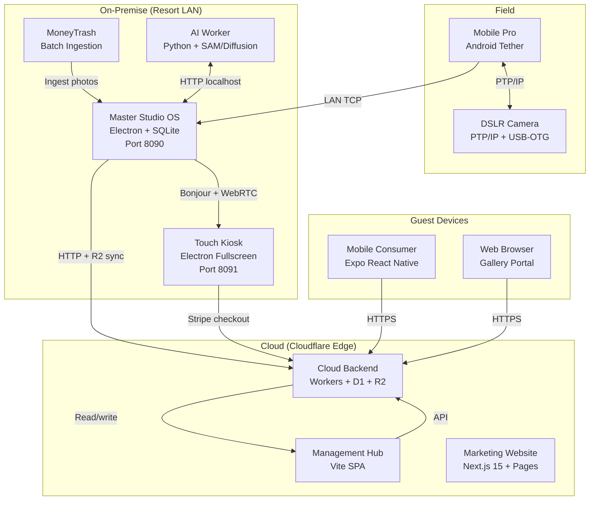

# ClickFlash Ecosystem V3.0 — Architecture Overview

## What is ClickFlash?

ClickFlash is an **enterprise-grade automated photography concession and edge-to-cloud resort media platform**. It automates the capture, quality grading, AI enhancement, guest delivery, and monetization of resort photography at scale — from the moment a photographer presses the shutter to the moment a guest purchases and shares their photos.

---

## Monorepo Structure

```
ClickFlash/
├── apps/
│   ├── backend/
│   │   ├── cloud-backend/     # Cloudflare Worker Edge API (D1, R2, KV)
│   │   └── mcp-server/        # AI Agent Studio Toolchain & Automation
│   ├── desktop/
│   │   ├── master/            # Electron Studio OS & Gateway (Port 8090)
│   │   ├── touch/             # Guest Touch Kiosk & Face Search (Port 8091)
│   │   ├── moneytrash/        # Batch Photo Ingestion Desktop App
│   │   ├── installer/         # Cross-Platform Desktop Installer Generator
│   │   └── license-generator/ # Hardware-Locked License Generator
│   ├── mobile/
│   │   ├── pro/               # Field Photographer Android Tether App (Expo)
│   │   └── consumer/          # Guest Mobile Photo Pass App (Expo)
│   ├── web/
│   │   ├── gallery/           # Guest Web Gallery + Stripe Checkout (Port 5176)
│   │   ├── management/        # Resort Executive Hub & Payroll (Port 5175)
│   │   └── website/           # Next.js 15 Marketing Website (Port 3001)
│   └── docs/                  # Interactive Documentation Portal
├── packages/
│   ├── ai/                    # @clickflash/ai — Gemini AI models + Zod schemas
│   ├── ai-core/               # @clickflash/ai-core — Core AI orchestration
│   ├── types/                 # @clickflash/types — Domain entity interfaces
│   ├── ui/                    # @clickflash/ui — Glassmorphic UI primitives
│   ├── logger/                # @clickflash/logger — Structured logging
│   └── wasm-sharpness/        # @clickflash/wasm-sharpness — WASM quality grading
├── workers/
│   ├── management-worker/     # Cloudflare Worker for management API
│   └── moneytrash-worker/     # Cloudflare Worker for ingestion
├── scripts/                   # Dev scripts, benchmarks, ecosystem verifier
└── .agents/                   # AI agent rules, skills, session state, ADRs
```

---

## System Architecture



---

## Data Architecture

### Local (On-Premise)
- **SQLite** (via `better-sqlite3`) in Master OS: albums, photos, orders, users, settings, products
- **FTS5 Virtual Table** (`photos_fts`): full-text search on title, tags, scene, mood
- **IndexedDB** in Touch Kiosk: offline sync queue, downloaded photo cache
- **SQLite** in MoneyTrash: ingestion session history, grading results

### Cloud (Cloudflare)
- **D1** (SQLite): guest orders, session tokens, payment records, social graph
- **R2** (Object Storage): original photos, enhanced photos, watermarked versions
- **KV** (`SESSION_KV`): guest session tokens with 24h TTL
- **R2** (Object Storage): photo delivery with signed URLs

---

## Network Topology

```
[Camera] --PTP/IP TCP:15740--> [Mobile Pro]
[Mobile Pro] --LAN HTTP:8090--> [Master OS]
[Master OS] --Bonjour mDNS--> [Touch Kiosk]
[Master OS / Touch] --WebRTC P2P--> [Touch Kiosk]
[Any App] --HTTPS--> [cloud-backend.clickflash.workers.dev]
[Management Hub] --HTTPS--> [cloud-backend.clickflash.workers.dev]
```

---

## Key Design Invariants

1. **IPC-First Data**: Master OS frontend never queries SQLite directly — all CRUD goes through `window.electron.invoke('repo:request', { repo, method, args })`.
2. **LAN Gateway**: Port 8090 Express server is the entry point for Touch Kiosks and Mobile Pro.
3. **Offline-First Kiosk**: Touch Kiosk works fully offline using IndexedDB; syncs when LAN is restored.
4. **No Camera Deletion**: Mobile Pro never deletes photos from camera cards.
5. **Fail-Closed Secrets**: Payload key generator refuses to write to any path inside the repository.
6. **Steganographic Watermarking**: All R2-delivered photos embed ownership metadata in LSBs.

---

## Shared Packages

| Package | npm Name | Contents |
|---------|----------|----------|
| `packages/ai` | `@clickflash/ai` | `AIScore`, `EditParams`, `TagResult` Zod schemas + Gemini prompt templates |
| `packages/ai-core` | `@clickflash/ai-core` | Gemini REST client, retry logic, response parsers |
| `packages/types` | `@clickflash/types` | `Album`, `Photo`, `Order`, `User`, `Product`, `Setting` TypeScript interfaces |
| `packages/ui` | `@clickflash/ui` | `GlassPanel`, `FluidButton`, `GradientBadge` React 19 components |
| `packages/logger` | `@clickflash/logger` | Structured JSON logger with log levels and correlation IDs |
| `packages/wasm-sharpness` | `@clickflash/wasm-sharpness` | WASM-compiled Laplacian sharpness scorer |

---

## Developer Runbook

### Setup
```bash
pnpm install
```

### Development
```bash
pnpm run dev:master      # Master Studio OS (localhost:8090)
pnpm run dev:touch       # Touch Kiosk (localhost:8091)
pnpm run dev:management  # Management Hub (localhost:5175)
pnpm run dev:gallery     # Gallery Portal (localhost:5176)
pnpm run dev:website     # Marketing Website (localhost:3001)
```

### Verification (Non-Negotiable Before Every PR)
```bash
npm run typecheck:all    # Must exit 0
npm run lint:all         # Must exit 0
pnpm --filter clickflash-master test
pnpm --filter clickflash-touch test
pnpm --filter star-master-management test
pnpm --filter star-master-customer test
```

### Benchmarks
```bash
npm run benchmark        # Runs all benchmark suites
npm run benchmark:ipc    # IPC round-trip latency
npm run benchmark:ai     # AI scoring throughput
npm run benchmark:face   # Face search index latency
```

---

## Branch Strategy

- `main`: Production-stable, protected
- `v3.0/ecosystem-delivery`: Current V3.0 delivery branch (14+ commits ahead of main)
- Feature branches: `feature/<scope>/<description>`
- Hotfixes: `hotfix/<scope>/<description>`

### Commit Convention
```
feat(scope): description
fix(scope): description
docs(scope): description
chore(scope): description
test(scope): description
```

---

## ADRs (Architecture Decision Records)

| ADR | Decision | Rationale |
|-----|----------|-----------|
| ADR-001 | IPC-first data layer | Security isolation between renderer and main process |
| ADR-002 | FTS5 for photo search | Zero-dependency full-text search in SQLite |
| ADR-003 | Cloudflare Workers for edge API | Low latency, global CDN, D1/R2 bindings |
| ADR-004 | Expo managed workflow | Simplifies build chain for field photographer app |
| ADR-005 | WASM for sharpness scoring | 10x faster than JS for pixel computation |
| ADR-006 | LSB steganographic watermarking | Invisible ownership proof in delivered images |
| ADR-007 | MediaPipe Hands for gesture control | Runs 100% in browser, no server round-trip |
| ADR-008 | Changesets for package versioning | Monorepo-aware changelog generation |
