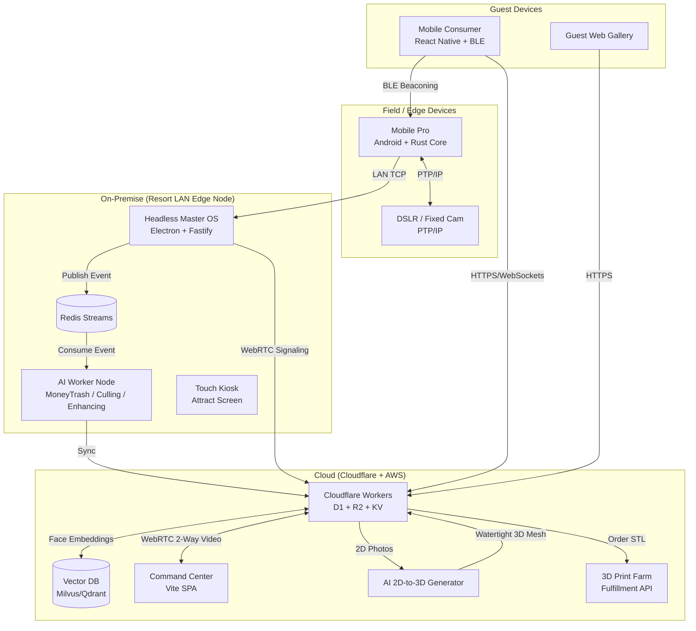

# ClickFlash Ecosystem V7.0 — The Omni-Modal Architecture Overview

## What is ClickFlash?
ClickFlash is the world's most advanced, **Omni-Modal photography and 3D media ecosystem**. It bridges edge computing, artificial intelligence, and physical merchandise. By utilizing biometric vectors, BLE proximity, and AI generative technologies, ClickFlash provides a "zero-click" frictionless experience for both operators and guests.

---

## Omni-Modal Operational Tiers
To cater to the entire spectrum of the photography market, ClickFlash configures itself into three distinct operational modes:

1. **Studio Mode (Legacy Foundation)**: The Master OS provides a physical UI for local tethering, manual editing, and instant dye-sublimation printing. Ideal for Santa grottos, mall kiosks, and traditional portrait studios.
2. **SaaS Cloud Mode (Agency Foundation)**: A pure cloud web portal. Independent photographers pay a subscription to upload photos, use our cloud AI tools, and sell directly to their clients via our Gallery.
3. **Autonomous Mode (Enterprise Theme Parks)**: A fully headless edge deployment. The Master OS runs silently, ingesting photos via Redis Streams. It relies entirely on biometric linking, BLE proximity, and automated background workers to process millions of assets.

---

## System Architecture (Autonomous Edge Mode)

---

## Core Technologies & Invariants

1. **Event-Driven Redis Streams**: Replaces traditional synchronous SQLite inserts to handle high-throughput burst photography from rollercoasters and rapid-fire portraits.
2. **Biometric "Selfie-First" Vector Linking**: Guests upload one selfie. The cloud extracts a facial embedding and stores it in the Vector DB. All incoming photos are automatically matched against the vector space in milliseconds.
3. **Rust Mobile Core**: The `clickflash-rust-core` inside the React Native `mobile/pro` app handles heavy processing (SQLite offline syncing, cryptographic hashing, WebRTC streams) to drastically save battery life.
4. **AI Generative Pipeline**: Background workers curate Beat-Matched Reels (for TikTok/IG), 16:9 Slideshows, and photobooks autonomously using advanced computer vision and LLMs.
5. **AI 3D Figurine Generation**: The architecture natively supports sending 2D photos to a generative AI pipeline (e.g., Meshy AI or Neural4D), converting them into watertight `.OBJ`/`.STL` 3D meshes without hardware booths, rendering digital AR avatars, and securely routing physical orders to binder-jet 3D printers.
6. **Live WebRTC Command Center**: Resort managers no longer patrol the park physically. They use the web `apps/management` dashboard to drop into live 2-way POV video/audio feeds from any photographer's mobile device.
