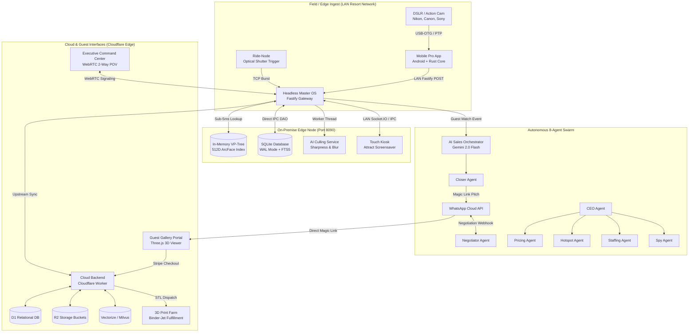

# ClickFlash Ecosystem V7.0 — The Omni-Modal Architecture Specification

> **Universal Architecture Blueprint for ClickFlash Monorepo**  
> ADRs in [`.agents/rules/adrs/`](file:///c:/Users/alamo/Desktop/ClickFlash/.agents/rules/adrs/) and [`docs/ADR/`](file:///c:/Users/alamo/Desktop/ClickFlash/docs/ADR/). C4 Specifications in [`docs/architecture/c4-architecture.md`](file:///c:/Users/alamo/Desktop/ClickFlash/docs/architecture/c4-architecture.md).

---

## 1. Executive Overview

ClickFlash is an enterprise-grade automated photography concession and edge-to-cloud resort media platform. It bridges edge computing, on-device machine learning, autonomous multi-agent swarms, and physical merchandise. By utilizing biometric vectors (512D ArcFace), BLE proximity beaconing, and AI generative technologies, ClickFlash provides a "zero-click" frictionless experience for both resort operators and guests.

---

## 2. Omni-Modal Operational Tiers

ClickFlash reconfigures dynamically across three distinct commercial concession tiers:

```text
┌───────────────────────────────────────────────────────────────────────────────────┐
│                           OMNI-MODAL CONCESSION TIERS                            │
├─────────────────────────┬─────────────────────────┬───────────────────────────────┤
│    1. Studio Mode       │   2. SaaS Cloud Mode    │     3. Autonomous Mode        │
│   (Legacy Foundation)   │   (Agency Foundation)   │  (Enterprise Theme Parks)     │
├─────────────────────────┼─────────────────────────┼───────────────────────────────┤
│ • Master OS Desktop UI  │ • Zero-install Web PWA  │ • Headless Fastify (Port 8090)│
│ • Local DSLR Tethering  │ • Photographer Portal   │ • In-Memory C++ VP-Tree Index │
│ • Instant Dye-Sub Print │ • Cloudflare Worker API │ • 8-Agent Swarm Intelligence  │
│ • Santa Grottos / Malls │ • Freelance Events      │ • Rollercoasters & Waterparks │
└─────────────────────────┴─────────────────────────┴───────────────────────────────┘
```

---

## 3. Monorepo Map & Subsystem Topology

| Application / Package | Technology Stack | Port / Protocol | Primary Purpose |
| --- | --- | --- | --- |
| `apps/desktop/master` | Electron 39 + Fastify + SQLite | Port 8090 / IPC | Headless Edge Node, Ingestion Engine, Local VP-Tree Hub |
| `apps/desktop/touch` | Electron 39 + React 19 + Radix | Port 8091 / IPC | Guest Touch Kiosk, Attract Screensaver, WASM HNSW Search |
| `apps/desktop/moneytrash` | Electron 39 + Next.js + WASM | Port 3000 / IPC | High-Throughput Batch Ingestion & Edge Quality Grading |
| `apps/desktop/installer` | Electron 39 + NSIS | N/A | Authenticode EV Code-Signed Desktop Installer Builder |
| `apps/desktop/license-generator` | Electron 39 + Ed25519 | N/A | Cryptographic Hardware-Locked License Generator |
| `apps/management` | Vite + React 19 + Radix UI | Port 5175 | Resort Command Center, 8-Agent Swarm AI, WebRTC POV Receiver |
| `apps/self-service` | Vite + React 19 + PWA | Port 5177 | Guest Mobile Self-Service PWA, Instant Downloads |
| `apps/photographer-portal` | Vite + React 19 + WASM | Port 5178 | Zero-Install Web Uploader for Freelance Photographers |
| `apps/gallery` | React 19 + Tailwind + Stripe | Port 5176 | Guest 3D Holographic Gallery, AR Quick Look, Stripe Checkout |
| `apps/backend/cloud-backend` | Cloudflare Worker (D1+R2+KV) | HTTPS Edge | Global Cloud API, Dynamic Yield Pricing, Stripe Webhooks |
| `apps/backend/mcp-server` | MCP SDK + TypeScript | Stdio / SSE | Autonomous AI Agent Toolchain & Automation Engine |
| `apps/backend/ai-worker` | FastAPI + Python + PyTorch | Port 8000 | Computer Vision, ArcFace Embeddings, 2D-to-3D Reconstruction |
| `apps/mobile/pro` | Expo React Native + Rust Core | USB-OTG / PTP | Field Photographer Android Tether, Local Offline Sync Queue |
| `apps/mobile/consumer` | Expo React Native | BLE GATT / HTTPS | Guest Photo Pass, BLE Beaconing, NLP Smart Album Search |
| `packages/ai` | TypeScript + Gemini 2.0 REST | In-Process | Shared AI Prompts, Schemas, Guardrails & Quality Gates |
| `packages/types` | TypeScript | In-Process | Universal Domain Entities & Data Contracts |
| `packages/ui` | React 19 + Tailwind CSS | In-Process | Shared Glassmorphic UI Components & Design Tokens |
| `packages/licensing` | TypeScript + Ed25519 | In-Process | Cryptographic Hardware License Verification |
| `packages/logger` | TypeScript + Pino | In-Process | Structured Multi-Transport Logging Engine |
| `packages/errors` | TypeScript | In-Process | Standardized Domain Error Codes & Error Taxonomy |

---

## 4. End-to-End System Architecture



---

## 5. Architectural Invariants & Non-Negotiable Rules

1. **Direct IPC DAO Pattern**: Desktop renderers (`master`, `touch`, `installer`, `license-generator`) must query SQLite strictly via typed IPC DAO (`dataService.ts` / `window.electron.invoke('repo:request')`). No localhost HTTP roundtrips.
2. **Biometric Privacy & Local Vectors**: Raw facial biometric photos NEVER leave edge nodes or user devices. Only anonymized 512D mathematical float embeddings are synced upstream (GDPR, CCPA, BIPA compliance).
3. **Sub-5ms Face Search**: On-premise face matching must use the in-memory C++ VP-Tree or WASM SIMD HNSW vector index.
4. **Offline-First Resilience**: Field mobile apps and Touch Kiosks must function 100% offline with zero data loss using local queue synchronization.
5. **No Camera-Card Deletion**: Field mobile apps must NEVER delete original photos from camera memory cards. All cropping and color grading are non-destructive JSON recipes.
6. **Workspace Package Resolution**: Cross-boundary imports must use canonical workspace packages (`@clickflash/types`, `@clickflash/ai`, `@clickflash/errors`) rather than relative paths.
7. **Strict Verification Cycle**: Every code modification must pass `npm run typecheck:all` with 0 errors.

---

## 6. Architecture Decision Records (ADRs) Index

| ADR | Title | Status | Link |
| --- | --- | --- | --- |
| `ADR-001` | Direct IPC DAO Pattern for Master OS | Accepted | [ADR-001](file:///c:/Users/alamo/Desktop/ClickFlash/.agents/rules/adrs/ADR-001-direct-ipc-dao.md) |
| `ADR-002` | Biometric Privacy & Local ArcFace Embeddings | Accepted | [ADR-002](file:///c:/Users/alamo/Desktop/ClickFlash/.agents/rules/adrs/ADR-002-biometric-privacy-local-embedding.md) |
| `ADR-003` | Offline-First Synchronization & Event Queues | Accepted | [ADR-003](file:///c:/Users/alamo/Desktop/ClickFlash/.agents/rules/adrs/ADR-003-offline-first-sync-protocol.md) |
| `ADR-004` | Autonomous Swarm Multi-Agent Orchestration | Accepted | [ADR-004](file:///c:/Users/alamo/Desktop/ClickFlash/.agents/rules/adrs/ADR-004-swarm-agent-orchestration.md) |
| `ADR-005` | Hierarchical Vector Search Strategy | Accepted | [ADR-005](file:///c:/Users/alamo/Desktop/ClickFlash/.agents/rules/adrs/ADR-005-hierarchical-vector-search.md) |
| `ADR-006` | Generative Media & 2D-to-3D Figurine Pipeline | Accepted | [ADR-006](file:///c:/Users/alamo/Desktop/ClickFlash/.agents/rules/adrs/ADR-006-generative-media-3d-pipeline.md) |
| `ADR-007` | Omni-Modal Concession Tier Matrix | Accepted | [ADR-007](file:///c:/Users/alamo/Desktop/ClickFlash/.agents/rules/adrs/ADR-007-omni-modal-tier-matrix.md) |
| `ADR-008` | Enterprise Prompt Engineering Lifecycle | Accepted | [ADR-008](file:///c:/Users/alamo/Desktop/ClickFlash/.agents/rules/adrs/ADR-008-prompt-engineering-lifecycle.md) |
