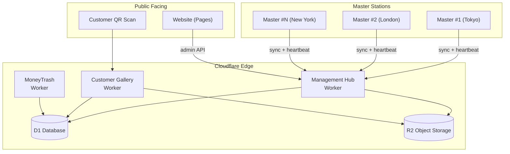
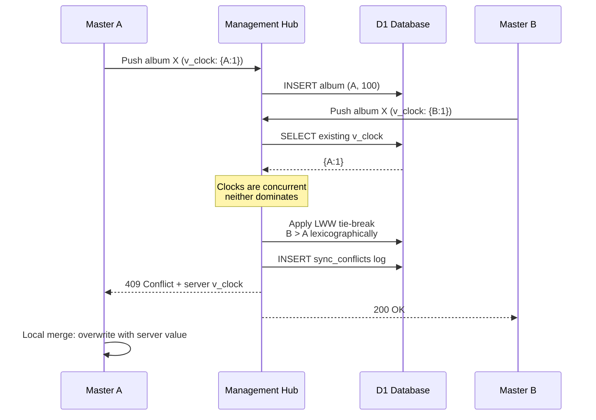
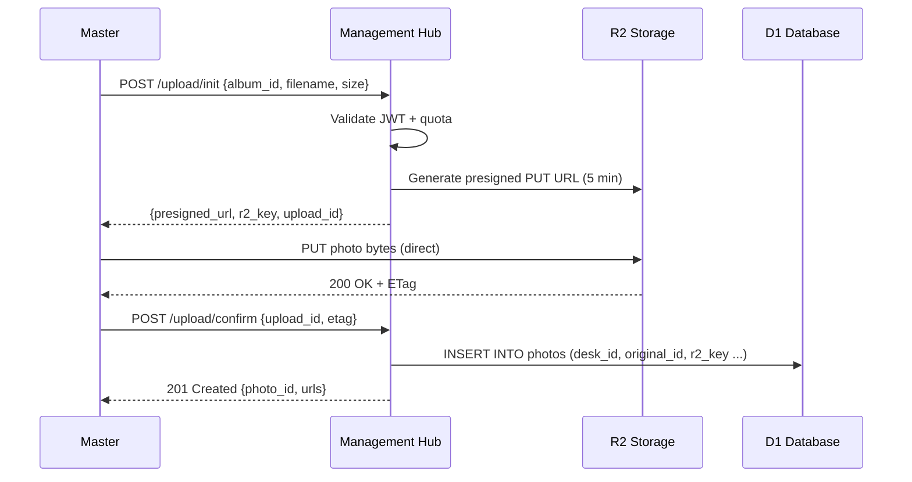
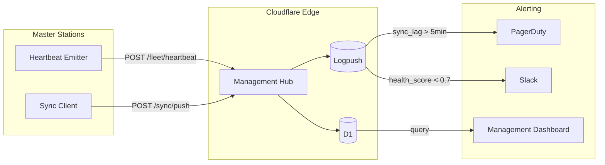

# Cloudflare Integration Architecture

> **Multi-Master Global Sync Backend for ClickFlash**
>
> Version: 1.0 | Last Updated: June 2026

---

## Table of Contents

1. [Architecture Overview](#1-architecture-overview)
2. [Multi-Master Data Model](#2-multi-master-data-model)
3. [D1 Database Schema](#3-d1-database-schema)
4. [R2 Storage](#4-r2-storage)
5. [Workers](#5-workers)
6. [Sync Protocol](#6-sync-protocol)
7. [Fleet Registration](#7-fleet-registration)
8. [Security](#8-security)
9. [Deployment](#9-deployment)
10. [Monitoring](#10-monitoring)

---

## 1. Architecture Overview

ClickFlash operates a distributed fleet of **Master stations** (Electron + React 19 photo booths) worldwide. All stations sync to a unified Cloudflare backend, enabling real-time fleet management, customer galleries, and global order fulfillment.

### High-Level Flow

```
┌─────────────────┐     ┌─────────────────┐     ┌─────────────────┐
│   Master #1     │     │   Master #2     │     │   Master #N     │
│  (Tokyo)        │     │  (London)       │     │  (New York)     │
│  Port 8090      │     │  Port 8090      │     │  Port 8090      │
└────────┬────────┘     └────────┬────────┘     └────────┬────────┘
         │                       │                       │
         │  HTTPS / RS256 JWT    │  HTTPS / RS256 JWT    │
         │  60s sync cycle       │  60s sync cycle       │
         ▼                       ▼                       ▼
┌─────────────────────────────────────────────────────────────────┐
│                     Cloudflare Edge Network                       │
│  ┌─────────────────────────────────────────────────────────────┐  │
│  │              Management Hub (Cloudflare Worker)               │  │
│  │  • Fleet registration & JWT issuance                          │  │
│  │  • Sync orchestration & conflict resolution                   │  │
│  │  • Heartbeat collection & health scoring                    │  │
│  │  • Settings propagation & remote commands                   │  │
│  └────────────────────┬────────────────────────────────────────┘  │
│                       │                                           │
│  ┌────────────────────▼────────────────────────────────────────┐  │
│  │              D1 — Global SQLite Database                      │  │
│  │  destinations | albums | photos | orders | fleet_heartbeats   │  │
│  │  sync_sequences | settings | operation_logs                   │  │
│  └─────────────────────────────────────────────────────────────┘  │
│                       │                                           │
│  ┌────────────────────▼────────────────────────────────────────┐  │
│  │              R2 — Object Storage                              │  │
│  │  uploads/{desk_id}/photos/     — Original + thumbnail        │  │
│  │  uploads/{desk_id}/retention/  — Time-lapse backups           │  │
│  │  uploads/{desk_id}/fulfillment/— Print-ready exports            │  │
│  └─────────────────────────────────────────────────────────────┘  │
│                       │                                           │
│  ┌────────────────────▼────────────────────────────────────────┐  │
│  │           Customer Gallery (Cloudflare Worker)                │  │
│  │  • Public share links (no auth)                               │  │
│  │  • QR-code resolved galleries                                 │  │
│  │  • Stripe checkout integration                                │  │
│  └─────────────────────────────────────────────────────────────┘  │
│                       │                                           │
│  ┌────────────────────▼────────────────────────────────────────┐  │
│  │           MoneyTrash (Cloudflare Worker)                      │  │
│  │  • Tip/donation processing                                    │  │
│  │  • Webhook handling for payment providers                     │  │
│  └─────────────────────────────────────────────────────────────┘  │
│                       │                                           │
│  ┌────────────────────▼────────────────────────────────────────┐  │
│  │           ClickFlash Website (Cloudflare Pages)               │  │
│  │  • Marketing site (Next.js 15 + Tailwind 4)                   │  │
│  │  • Admin dashboard (React + Vite)                           │  │
│  └─────────────────────────────────────────────────────────────┘  │
└─────────────────────────────────────────────────────────────────┘
```

### Mermaid: Request Flow



---

## 2. Multi-Master Data Model

### Core Principle

Every record created by a Master carries a **globally unique composite key**:

```
PRIMARY KEY (desk_id, original_id)
```

- `desk_id` — UUID assigned at fleet registration (e.g., `desk_a1b2c3d4`)
- `original_id` — Auto-increment or UUID generated locally on the Master

This design guarantees that two Masters creating albums in Tokyo and London simultaneously will never collide.

### Vector Clocks

Each sync-capable table includes a `vector_clock` column:

| Column | Type | Purpose |
|--------|------|---------|
| `vector_clock` | `TEXT` | JSON object: `{"desk_a1b2": 42, "desk_x9y8": 7}` |
| `modified_at` | `INTEGER` | Unix epoch seconds (last writer wins tie-break) |
| `modified_by` | `TEXT` | `desk_id` of the node that last mutated the row |

### Conflict Resolution Strategy

1. **Last-Write-Wins (LWW)** — Default for settings, fleet metadata  
   Tie-breaker: higher `modified_at` wins; if equal, lexicographically greater `desk_id` wins.

2. **Merge-Additive** — Default for albums, photos, orders  
   If both sides edited the same album title, the higher vector-clock value wins.  
   If vector clocks are concurrent (neither dominates), the lexicographically greater `desk_id` wins and the losing value is logged to `sync_conflicts` for manual review.

3. **Delete Wins** — A tombstone (`deleted_at` timestamp) always beats a live record.

### Mermaid: Conflict Resolution Flow



---

## 3. D1 Database Schema

### Key Tables

#### `destinations`

```sql
CREATE TABLE destinations (
    desk_id       TEXT NOT NULL,
    original_id   INTEGER NOT NULL,
    name          TEXT NOT NULL,
    description   TEXT,
    price_cents   INTEGER DEFAULT 0,
    currency      TEXT DEFAULT 'USD',
    vector_clock  TEXT NOT NULL DEFAULT '{}',
    modified_at   INTEGER NOT NULL DEFAULT (strftime('%s','now')),
    modified_by   TEXT NOT NULL,
    deleted_at    INTEGER,
    PRIMARY KEY (desk_id, original_id)
);
```

#### `albums`

```sql
CREATE TABLE albums (
    desk_id       TEXT NOT NULL,
    original_id   INTEGER NOT NULL,
    title         TEXT NOT NULL,
    destination_id TEXT,          -- FK composite: (desk_id, destination_id)
    cover_photo_id TEXT,          -- FK composite: (desk_id, cover_photo_id)
    is_public     INTEGER DEFAULT 0,
    share_token   TEXT,
    vector_clock  TEXT NOT NULL DEFAULT '{}',
    modified_at   INTEGER NOT NULL DEFAULT (strftime('%s','now')),
    modified_by   TEXT NOT NULL,
    deleted_at    INTEGER,
    PRIMARY KEY (desk_id, original_id)
);
```

#### `photos`

```sql
CREATE TABLE photos (
    desk_id       TEXT NOT NULL,
    original_id   INTEGER NOT NULL,
    album_id      TEXT NOT NULL,  -- FK composite: (desk_id, album_id)
    filename      TEXT NOT NULL,
    r2_key        TEXT NOT NULL,  -- R2 object key
    thumbnail_key TEXT,
    width         INTEGER,
    height        INTEGER,
    file_size     INTEGER,
    taken_at      INTEGER,
    vector_clock  TEXT NOT NULL DEFAULT '{}',
    modified_at   INTEGER NOT NULL DEFAULT (strftime('%s','now')),
    modified_by   TEXT NOT NULL,
    deleted_at    INTEGER,
    PRIMARY KEY (desk_id, original_id)
);
```

#### `orders`

```sql
CREATE TABLE orders (
    desk_id       TEXT NOT NULL,
    original_id   INTEGER NOT NULL,
    album_id      TEXT NOT NULL,
    customer_email TEXT,
    status        TEXT DEFAULT 'pending',  -- pending | paid | fulfilled | cancelled
    total_cents   INTEGER,
    currency      TEXT DEFAULT 'USD',
    stripe_session_id TEXT,
    vector_clock  TEXT NOT NULL DEFAULT '{}',
    modified_at   INTEGER NOT NULL DEFAULT (strftime('%s','now')),
    modified_by   TEXT NOT NULL,
    deleted_at    INTEGER,
    PRIMARY KEY (desk_id, original_id)
);
```

#### `fleet_heartbeats`

```sql
CREATE TABLE fleet_heartbeats (
    desk_id       TEXT PRIMARY KEY,
    last_seen_at  INTEGER NOT NULL DEFAULT (strftime('%s','now')),
    ip_address    TEXT,
    version       TEXT,           -- Master app version
    os            TEXT,
    photos_count  INTEGER DEFAULT 0,
    albums_count  INTEGER DEFAULT 0,
    pending_sync_count INTEGER DEFAULT 0,
    health_score  REAL DEFAULT 1.0  -- 0.0 - 1.0
);
```

#### `sync_sequences`

```sql
CREATE TABLE sync_sequences (
    desk_id       TEXT PRIMARY KEY,
    last_sequence INTEGER NOT NULL DEFAULT 0,
    updated_at    INTEGER NOT NULL DEFAULT (strftime('%s','now'))
);
```

Per-desk monotonic sequence numbers used to order `operation_logs`.

#### `settings`

```sql
CREATE TABLE settings (
    desk_id       TEXT NOT NULL,
    key           TEXT NOT NULL,
    value         TEXT NOT NULL,
    vector_clock  TEXT NOT NULL DEFAULT '{}',
    modified_at   INTEGER NOT NULL DEFAULT (strftime('%s','now')),
    modified_by   TEXT NOT NULL,
    PRIMARY KEY (desk_id, key)
);
```

#### `operation_logs` (Sync Journal)

```sql
CREATE TABLE operation_logs (
    desk_id       TEXT NOT NULL,
    sequence      INTEGER NOT NULL,
    table_name    TEXT NOT NULL,
    record_key    TEXT NOT NULL,  -- "desk_id:original_id"
    operation     TEXT NOT NULL,  -- INSERT | UPDATE | DELETE
    payload       TEXT,           -- JSON diff or full row
    vector_clock  TEXT NOT NULL,
    created_at    INTEGER NOT NULL DEFAULT (strftime('%s','now')),
    PRIMARY KEY (desk_id, sequence)
);
```

### Indexes

```sql
CREATE INDEX idx_albums_destination ON albums(desk_id, destination_id) WHERE deleted_at IS NULL;
CREATE INDEX idx_photos_album ON photos(desk_id, album_id) WHERE deleted_at IS NULL;
CREATE INDEX idx_orders_status ON orders(desk_id, status) WHERE deleted_at IS NULL;
CREATE INDEX idx_operation_logs_created ON operation_logs(created_at);
CREATE INDEX idx_operation_logs_record ON operation_logs(table_name, record_key);
```

---

## 4. R2 Storage

### Prefix Isolation

Every `desk_id` receives its own top-level prefix. This enables:

- **Per-desk lifecycle policies** (retention, tiering)
- **Easy data export / deletion** for GDPR requests
- **Parallel sync** without key collisions

```
R2 Bucket: clickflash-uploads
│
├── uploads/
│   ├── {desk_id}/
│   │   ├── photos/
│   │   │   ├── 2026/06/06/{photo_uuid}_original.jpg
│   │   │   ├── 2026/06/06/{photo_uuid}_thumb_300.jpg
│   │   │   └── 2026/06/06/{photo_uuid}_thumb_1200.jpg
│   │   ├── retention/
│   │   │   └── {album_id}/
│   │   │       └── daily_backup_{date}.zip
│   │   └── fulfillment/
│   │       └── {order_id}/
│   │           ├── print_4x6_{photo_uuid}.jpg
│   │           ├── print_5x7_{photo_uuid}.jpg
│   │           └── manifest.json
│   └── ... (next desk)
└── public/
    └── gallery-assets/
        ├── logo.svg
        └── watermark.png
```

### Upload Flow

1. Master POSTs to Management Hub with metadata.
2. Hub returns a **presigned R2 URL** (valid 5 minutes).
3. Master uploads directly to R2 (bypassing Worker CPU/bandwidth).
4. Master confirms upload; Hub writes `photos` row to D1.

### Mermaid: Direct-to-R2 Upload



---

## 5. Workers

### 5.1 Management Hub

**Route:** `https://api.clickflash.io/v1/*`

| Endpoint | Method | Auth | Purpose |
|----------|--------|------|---------|
| `/fleet/register` | POST | None (one-time token) | New Master onboarding |
| `/fleet/heartbeat` | POST | JWT | Health ping + metrics |
| `/fleet/peers` | GET | JWT | Discover other desks in fleet |
| `/sync/push` | POST | JWT | Upload local operation logs |
| `/sync/pull` | GET | JWT | Download remote operation logs |
| `/sync/resolve` | POST | JWT | Conflict resolution override |
| `/settings` | GET/PUT | JWT | Read/write desk settings |
| `/admin/fleet` | GET | Admin JWT | Fleet dashboard data |
| `/admin/command` | POST | Admin JWT | Remote command (restart, update) |

**Key Behaviors:**

- Batches D1 writes (max 50 ops per transaction)
- Enforces idempotency via `client_request_id` deduplication (KV, 24h TTL)
- Circuit breaker: if D1 error rate > 10% in 60s, return 503 with `Retry-After: 30`
- DLQ: failed webhooks written to `dlq_failed_webhooks` table for replay

### 5.2 Customer Gallery

**Route:** `https://gallery.clickflash.io/*`

| Endpoint | Method | Auth | Purpose |
|----------|--------|------|---------|
| `/{share_token}` | GET | None | Public gallery page |
| `/{share_token}/photos` | GET | None | JSON list of photos |
| `/{share_token}/checkout` | POST | None | Create Stripe session |
| `/webhook/stripe` | POST | Stripe sig | Payment confirmation |

**Key Behaviors:**

- Serves presigned R2 URLs for thumbnails (15-minute expiry)
- Caches gallery metadata in Cloudflare Cache API (5 minutes)
- Rate-limited: 100 requests/min per IP

### 5.3 MoneyTrash

**Route:** `https://tips.clickflash.io/*`

| Endpoint | Method | Auth | Purpose |
|----------|--------|------|---------|
| `/tip` | POST | None | Create tip session |
| `/tip/{session_id}` | GET | None | Tip status |
| `/webhook/{provider}` | POST | Provider sig | Async payment confirmation |

**Key Behaviors:**

- Supports Stripe, PayPal, and Square webhooks
- Idempotency via `idempotency_key` in KV (24h)
- Tips linked back to `desk_id` for revenue attribution

---

## 6. Sync Protocol

### 6.1 Cycle Overview

Each Master runs a background sync loop every **60 seconds**:

```
┌─────────────┐
│   START     │
└──────┬──────┘
       ▼
┌─────────────┐
│ 1. PULL     │◄──── Fetch operation_logs from Hub
│   remote    │       since last_sequence
└──────┬──────┘
       ▼
┌─────────────┐
│ 2. MERGE    │◄──── Apply remote ops locally,
│   + resolve │       resolve conflicts
└──────┬──────┘
       ▼
┌─────────────┐
│ 3. PUSH     │◄──── Upload local operation_logs
│   local     │       since last_sync_sequence
└──────┬──────┘
       ▼
┌─────────────┐
│ 4. HEARTBEAT│◄──── Report health + pending count
└──────┬──────┘
       ▼
┌─────────────┐
│   SLEEP 60s │
└─────────────┘
```

### 6.2 Operation Log Format

```json
{
  "desk_id": "desk_a1b2c3d4",
  "sequence": 1523,
  "table_name": "albums",
  "record_key": "desk_a1b2c3d4:4821",
  "operation": "UPDATE",
  "payload": {
    "title": "Summer Wedding 2026",
    "is_public": 1
  },
  "vector_clock": {"desk_a1b2c3d4": 1523, "desk_x9y8z7w6": 890},
  "created_at": 1717752000
}
```

### 6.3 Batching

- **Pull batch size:** 100 operation logs per request
- **Push batch size:** 50 operation logs per request
- If more logs exist, Hub returns `X-Has-More: true`; Master immediately requests next batch

### 6.4 Idempotency

Every sync request includes a `client_request_id` (UUID v4). The Hub stores handled IDs in **KV** with a 24-hour TTL. Duplicate requests return `200 OK` with cached response body.

### 6.5 Circuit Breaker

Master-side circuit breaker state machine:

| State | Trigger | Behavior |
|-------|---------|----------|
| `CLOSED` | Default | Normal sync |
| `OPEN` | 5 consecutive failures | Skip sync; log locally only |
| `HALF_OPEN` | After 60s in OPEN | Send single probe request |

If probe succeeds → `CLOSED`. If probe fails → `OPEN` for another 60s.

### 6.6 Dead Letter Queue (DLQ)

Failed pushes (HTTP 5xx or timeout after 30s) are stored in Master's local SQLite `dlq` table:

```sql
CREATE TABLE dlq (
    id INTEGER PRIMARY KEY AUTOINCREMENT,
    payload TEXT NOT NULL,      -- JSON operation log batch
    error TEXT,
    retry_count INTEGER DEFAULT 0,
    next_retry_at INTEGER,
    created_at INTEGER DEFAULT (strftime('%s','now'))
);
```

Retry schedule: 1 min, 5 min, 15 min, 1 hour, then manual review.

### Mermaid: Full Sync Sequence

```mermaid
sequenceDiagram
    participant M as Master
    participant MH as Management Hub
    participant D1 as D1 Database
    participant KV as Workers KV

    loop Every 60 seconds
        M->>M: Read last_sequence from local meta
        M->>MH: GET /sync/pull?since=1520&limit=100<br/>Authorization: Bearer {jwt}
        MH->>D1: SELECT * FROM operation_logs<br/>WHERE desk_id != ? AND sequence > ?<br/>ORDER BY sequence LIMIT 100
        D1-->>MH: [op_1521, op_1522, ...]
        MH->>KV: Check client_request_id (dedup)
        MH-->>M: 200 OK + logs + X-Has-More
        M->>M: Merge logs, resolve conflicts<br/>Update local SQLite

        M->>M: Read local operation_logs since last_push
        M->>MH: POST /sync/push {batch, client_request_id}
        MH->>KV: Store client_request_id (24h TTL)
        MH->>D1: BEGIN; INSERT operation_logs ...; COMMIT
        D1-->>MH: OK
        MH-->>M: 200 OK {accepted: 50, conflicts: 0}

        M->>MH: POST /fleet/heartbeat {stats}
        MH->>D1: UPSERT fleet_heartbeats
    end
```

---

## 7. Fleet Registration

### 7.1 New Master Onboarding

```
Step 1: Operator opens Master app
Step 2: App generates ephemeral keypair (Ed25519)
Step 3: App displays QR code containing public key + nonce
Step 4: Admin scans QR in Management Dashboard
Step 5: Dashboard calls POST /admin/fleet/register
        → Hub generates desk_id, stores pubkey
        → Hub returns one-time registration token
Step 6: Token transmitted to Master (via LAN or manual entry)
Step 7: Master calls POST /fleet/register {token, pubkey, nonce}
Step 8: Hub verifies token, issues long-lived RS256 JWT
Step 9: Master stores JWT in OS keychain; begins sync
```

### 7.2 JWT Token Format

```json
{
  "sub": "desk_a1b2c3d4",
  "desk_id": "desk_a1b2c3d4",
  "role": "master",
  "iat": 1717752000,
  "exp": 1759288000,
  "jti": "tok_abc123",
  "aud": "https://api.clickflash.io"
}
```

- **Algorithm:** RS256 (asymmetric)
- **Key rotation:** New public key published via `/.well-known/jwks.json`
- **Expiry:** 1 year for Masters; 24 hours for admin dashboard sessions

### 7.3 Peer Discovery

Masters occasionally need to know about other desks (e.g., for multi-desk events).

```
GET /fleet/peers
Authorization: Bearer {jwt}

Response:
{
  "peers": [
    {"desk_id": "desk_x9y8z7w6", "location": "London", "last_seen": 1717751900, "version": "4.3.0"},
    {"desk_id": "desk_m3n4o5p6", "location": "Paris",  "last_seen": 1717751950, "version": "4.3.1"}
  ],
  "self": {"desk_id": "desk_a1b2c3d4", "location": "Tokyo"}
}
```

Peers are filtered by the Hub to only include desks in the same **fleet group** (configured during registration).

---

## 8. Security

### 8.1 Authentication

| Layer | Mechanism |
|-------|-----------|
| Master ↔ Hub | RS256 JWT in `Authorization: Bearer` header |
| Gallery (public) | No auth; rate-limited by IP |
| Admin Dashboard | RS256 JWT + MFA TOTP (separate admin role claim) |
| Webhooks | Provider-specific signature verification (Stripe `Stripe-Signature`, PayPal `PAYPAL-TRANSMISSION-ID`) |

### 8.2 Authorization Claims

```json
{
  "desk_id": "desk_a1b2c3d4",
  "role": "master",        // or "admin"
  "fleet_group": "corp_east_asia",
  "permissions": ["sync", "upload", "read_settings"]
}
```

The Hub rejects any request where the URL `desk_id` parameter does not match the JWT `desk_id` claim (unless `role: admin`).

### 8.3 Transport

- **HTTPS only** — HTTP requests return 301 redirect to HTTPS
- **TLS 1.3** required; TLS 1.2 allowed for legacy compatibility
- **HSTS** header: `max-age=63072000; includeSubDomains; preload`

### 8.4 CORS

```
Access-Control-Allow-Origin: https://admin.clickflash.io, https://gallery.clickflash.io
Access-Control-Allow-Methods: GET, POST, PUT, DELETE, OPTIONS
Access-Control-Allow-Headers: Authorization, Content-Type, X-Client-Request-Id
Access-Control-Max-Age: 86400
```

Preflight requests are cached at the edge.

### 8.5 Data Protection

- **R2 encryption:** SSE-S3 (server-side encryption at rest)
- **D1 encryption:** Cloudflare-managed encryption at rest
- **Sensitive fields:** `customer_email` in `orders` is hashed with SHA-256 for analytics; raw value only accessible via Customer Gallery Worker with row-level permission check

---

## 9. Deployment

### 9.1 Wrangler Configuration

```toml
# wrangler.toml (Management Hub)
name = "clickflash-management-hub"
main = "src/index.ts"
compatibility_date = "2026-06-01"

[env.production]
routes = [
  { pattern = "api.clickflash.io/v1/*", custom_domain = true }
]

[[env.production.d1_databases]]
binding = "DB"
database_name = "clickflash-prod"
database_id = "xxxxxxxx-xxxx-xxxx-xxxx-xxxxxxxxxxxx"

[[env.production.r2_buckets]]
binding = "UPLOADS"
bucket_name = "clickflash-uploads"

[[env.production.kv_namespaces]]
binding = "IDEMPOTENCY"
id = "yyyyyyyy-yyyy-yyyy-yyyy-yyyyyyyyyyyy"
```

### 9.2 D1 Migrations

Migrations live in `migrations/` and are applied via Wrangler:

```bash
# Create a new migration
npx wrangler d1 migrations create clickflash-prod add_fleet_heartbeats

# Apply pending migrations to local dev
npx wrangler d1 migrations apply clickflash-prod --local

# Apply to production
npx wrangler d1 migrations apply clickflash-prod --remote
```

Migration files are named sequentially:

```
migrations/
├── 0001_initial.sql
├── 0002_add_vector_clocks.sql
├── 0003_add_operation_logs.sql
├── 0004_add_fleet_heartbeats.sql
└── 0005_add_sync_sequences.sql
```

### 9.3 Environment Variables

| Variable | Scope | Description |
|----------|-------|-------------|
| `JWT_PUBLIC_KEY` | Worker | RS256 public key (PEM) for verification |
| `JWT_PRIVATE_KEY` | Worker | RS256 private key (PEM) for signing (Hub only) |
| `STRIPE_SECRET_KEY` | Customer Gallery | Stripe API key |
| `STRIPE_WEBHOOK_SECRET` | Customer Gallery | Stripe endpoint secret |
| `ADMIN_API_KEY` | Management Hub | Internal admin operations |
| `DLQ_ALERT_THRESHOLD` | Management Hub | DLQ depth before paging (default: 100) |
| `SYNC_BATCH_SIZE` | Management Hub | Max ops per sync batch (default: 50) |

Secrets are injected via Wrangler:

```bash
npx wrangler secret put JWT_PRIVATE_KEY --env production
```

### 9.4 Deployment Pipeline

```bash
# 1. Lint & typecheck
npm run lint && npm run typecheck

# 2. Run migrations
npx wrangler d1 migrations apply clickflash-prod --remote

# 3. Deploy Workers
npx wrangler deploy --env production

# 4. Smoke tests
npm run test:smoke:production

# 5. Purge CDN cache (if needed)
npx wrangler cache purge --env production
```

---

## 10. Monitoring

### 10.1 Fleet Dashboard

The Management Dashboard (`apps/management/`) consumes the Hub's `/admin/fleet` endpoint to render:

| Metric | Source | Alert Threshold |
|--------|--------|-----------------|
| Online desks | `fleet_heartbeats` | — |
| Average health score | `health_score` | < 0.7 warning |
| Photos synced (24h) | `operation_logs` | — |
| Pending sync backlog | `pending_sync_count` | > 500 warning |
| Sync lag (max) | `last_seen_at` vs now | > 5 min critical |
| DLQ depth | `dlq_failed_webhooks` | > 100 critical |
| R2 egress (daily) | Cloudflare Analytics | > 80% quota warning |

### 10.2 Heartbeat Metrics

Each heartbeat payload includes:

```json
{
  "desk_id": "desk_a1b2c3d4",
  "timestamp": 1717752000,
  "version": "4.3.0",
  "os": "win32",
  "uptime_seconds": 86400,
  "photos_count": 15234,
  "albums_count": 420,
  "pending_sync_count": 12,
  "last_sync_at": 1717751980,
  "disk_free_gb": 45.2,
  "memory_used_mb": 512,
  "camera_status": "ok",
  "printer_status": "ok"
}
```

The Hub writes these to `fleet_heartbeats` and emits structured logs:

```json
{
  "event": "heartbeat.received",
  "desk_id": "desk_a1b2c3d4",
  "health_score": 0.98,
  "latency_ms": 45
}
```

### 10.3 Sync Lag Alerts

Sync lag is computed per desk as:

```
sync_lag_seconds = now() - last_sync_at
```

Alert routing:

| Lag | Severity | Action |
|-----|----------|--------|
| > 2 min | Warning | Log + dashboard indicator |
| > 5 min | Critical | PagerDuty alert + auto-DLQ inspection |
| > 15 min | Outage | Mark desk offline; queue commands for replay |

### 10.4 Structured Logging

All Workers emit JSON logs compatible with Cloudflare Logpush:

```json
{
  "timestamp": "2026-06-06T12:00:00Z",
  "service": "management-hub",
  "level": "INFO",
  "trace_id": "trace_abc123",
  "method": "POST",
  "path": "/sync/push",
  "desk_id": "desk_a1b2c3d4",
  "status": 200,
  "duration_ms": 120,
  "db_queries": 3,
  "batch_size": 50
}
```

### 10.5 Mermaid: Monitoring Data Flow



---

## Appendix A: Glossary

| Term | Definition |
|------|------------|
| **Master** | ClickFlash photo booth station (Electron app) |
| **Desk** | Synonym for a single Master instance; identified by `desk_id` |
| **Operation Log** | Immutable journal entry describing a single row mutation |
| **Vector Clock** | JSON map of `{desk_id: sequence}` used to determine causality |
| **DLQ** | Dead Letter Queue — holding area for failed sync pushes |
| **Fleet Group** | Logical grouping of desks (e.g., by region or event) |
| **Share Token** | Short opaque string granting public access to a customer gallery |

---

## Appendix B: Changelog

| Version | Date | Changes |
|---------|------|---------|
| 1.0 | 2026-06-06 | Initial architecture documentation |

---

*Document maintained by the ClickFlash Infrastructure Team.*  
*Questions: `#infrastructure` on Slack or infra@clickflash.io*
