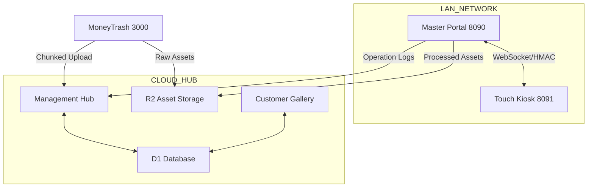

# ECOSYSTEM SYNC AUDIT PLAN 🛰️

> [!IMPORTANT]
> This audit serves as the technical substrate for Phase 1 of the ClickFlash Industrial Hardening mandate. All identified vulnerabilities must be addressed in subsequent execution phases.

## 1. Pipeline Map

### 1.1 LOCAL LAN SYNC (Master ↔ Touch)
- **Path**: `apps/master/backend` (8090) ↔ `apps/touch/backend` (8091)
- **Primary Protocol**: WebSocket (Real-time state updates).
- **Fallback Protocol**: HTTP POST `/sync/mutation` (Offline-first resilience).
- **Hardening Status**:
  - **Auth**: HMAC-SHA256 Signing enforced via `lanSigningMiddleware`. Uses `x-kiosk-id`, `x-timestamp`, `x-signature`.
  - **Data Integrity**: Vector Clocks implemented in `SyncManager.ts` to prevent out-of-order execution in concurrent multi-kiosk setups.
  - **IP Restriction**: `isPrivateIp` check enforced for all LAN requests.

### 1.2 LOCAL-TO-CLOUD SYNC (Master ↔ Hub)
- **Path**: `apps/master/backend/services/CloudSyncService.ts` ↔ Cloudflare Workers (Hub).
- **Sync Model**: Persistent Queueing via SQLite `operation_logs` table.
- **Protocols**: HTTPS REST.
- **Hardening Status**:
  - **Resilience**: Exponential backoff with jitter and `executeWithRetry` utility.
  - **Security**: Hardware hashing (`HardwareService.getMachineId()`) + JWT Authentication.
  - **Conflicts**: Currently uses Timestamp LWW (Last Write Wins) for most entities; sequence numbers for operations.

### 1.3 CLOUD INGESTION (MoneyTrash ↔ Hub)
- **Path**: `apps/moneytrash` ↔ Hub.
- **Mechanism**: Chunked uploads (1MB chunks configured in Master, but needs alignment with MoneyTrash 5MB mandate).
- **Notification**: Webhooks/Push notification from R2 to Hub on complete reassembly.

---

## 2. Vulnerability & Hardening Report

| Pipeline | Risk Level | Description | Recommended Fix |
| :--- | :--- | :--- | :--- |
| **Master ↔ Touch** | Low | Potential race condition when multi-touch update same record concurrently with unstable LAN. | Strengthen Vector Clock merge logic; implement explicit "Partial Conflict" UI. |
| **Local ↔ Cloud** | Medium | EMFILE/Memory leak when processing high-volume photo metadata sync. | Implement aggressive batching and worker_thread offloading for metadata extraction. |
| **Bulk Upload** | High | Browser crash in MoneyTrash when handling 100GB+ libraries. | Enforce 5MB chunking and strictly limit concurrency to 3. Implement persistent upload state. |
| **Security** | Medium | JWT Secret rotation and expiration handling in CloudSync is static. | Implement Refresh Token flow for long-lived Master-to-Cloud connections. |

---

## 3. Execution Roadmap

### Step 1: Shared Package Standardization [PHASE 2]
- [ ] Implement strict Zod schemas for all shared types in `packages/types`.
- [ ] Audit `packages/ui` for Next.js 15 / React 19 compatibility.

### Step 2: Master Backend Offloading [PHASE 3]
- [ ] Move `exif` extraction and watermarking to Worker Threads.
- [ ] Refactor `SyncManager` to handle larger batches without blocking the event loop.

### Step 3: MoneyTrash Ingestion Hardening [PHASE 4]
- [ ] Implement Chunked Uplink API in Cloud Hub.
- [ ] Build retry-resilient `Uploader` component in MoneyTrash app.

### Step 4: Multi-Cloud Deployment [PHASE 5]
- [ ] Configure `wrangler.toml` for zero-touch deployment of Hub (D1/R2).
- [ ] Set up WAF rules for rate-limiting bulk operations.

---

## 4. Architectural Summary

