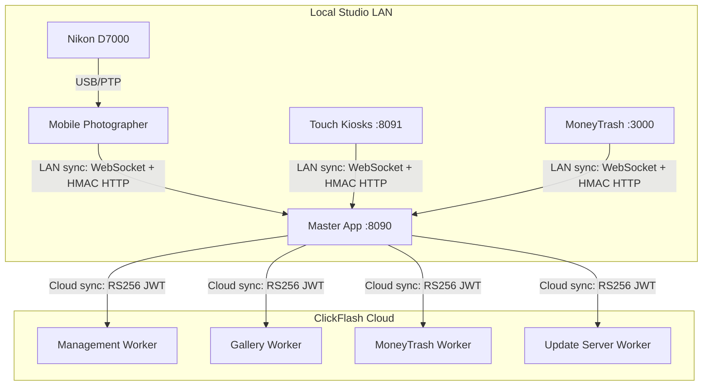

# 📸 ClickFlash Photography Ecosystem

> **A complete 17-app platform for professional photography businesses**

[](https://github.com/alaeddinekhemiri/ClickFlash/actions/workflows/ci.yml)
[](https://github.com/alaeddinekhemiri/ClickFlash/actions/workflows/cd.yml)

[](./apps/master/)
[](./apps/touch/)
[](./apps/moneytrash/)
[](./apps/management/)
[](./apps/gallery/)
[](./apps/website/)

### 🔄 Autonomous Build Loop Status
- **Last Scan:** August 2026
- **Web & Electron Builds:** ✅ Passing (Zero compilation or test errors)
- **Resolved Issues:** Fixed unused `syncRoutes`, `settingsRoutes`, and `shiftRoutes` imports in `master` typecheck. Removed stale `src/pages` and disabled `outputFileTracingRoot` in `next.config.ts` to resolve `icon.png.nft.json` ENOENT build errors for `main-website` caused by lockfile mismatch. Restored `Skeleton.tsx` exports to fix `apps/management` Rollup build failure. Confirmed `tsc` and `build` commands pass for all targeted apps. Updated `clickflash-touch` offlineQueue tests to correctly mock and assert AES-GCM (AEAD) encryption behavior instead of the legacy HMAC-SHA256 signature logic, resolving the test suite failure. Integrated new `tlsRoutes` in `clickflash-master` backend setup. Resolved `vite/client` type resolution issue in `apps/gallery` via updated `tsconfig.json`. Addressed high-severity security vulnerabilities (`image-size`, `js-yaml`, `nanoid`) across the workspace using `pnpm.overrides`.
[](https://nodejs.org/)
[](https://www.typescriptlang.org/)
[](https://react.dev/)
[](LICENSE)

## 🏢 Architecture Overview



---

## 🔒 Security

ClickFlash adheres strictly to a **zero-paid-SaaS mandate** (No Vercel, Auth0, Clerk, Pusher, Algolia, OpenAI, Adobe). We control 100% of our security and infrastructure.

- **Offline-First for Studio/Kiosk**: The master and touch applications can function securely in a fully offline environment.
- **LAN Sync**: Uses WebSocket + HMAC-SHA256 signed HTTP requests.
- **Cloud Sync**: Secured via RS256 JWT + hardware fingerprinting.
- **Cryptography**: Ed25519 licensing, AES-256-GCM data encryption, HMAC-SHA256 validation.
- **Data Validation**: Strict schema enforcement across all boundaries via Zod.
- **Payments**: Integrated securely with Stripe (the only external payment provider).

---

## 📱 Apps Overview (17 Apps)

The Monorepo (pnpm workspaces + Turborepo) contains the following 17 applications:

| App | Description |
|---|---|
| **master** | Master Portal (Electron/React 19). Core studio management system. Port: 8090 |
| **touch** | Touch Kiosk (Electron/React 19). Customer self-service kiosk (offline-first). Port: 8091 |
| **management** | Management Hub. Fully online business dashboard. |
| **gallery** | Customer Gallery portal. Online customer access to photos. |
| **moneytrash** | Money Trash gateway. Port: 3000 |
| **website** | Main Marketing Website. Port: 3001 |
| **installer** | Desktop installer utility |
| **license-generator** | Ed25519 license generator for ClickFlash nodes |
| **mobile-photographer** | Android app. USB/PTP tether to Nikon D7000 (Expo SDK) |
| **mobile-customer** | Mobile app for customer gallery access |
| **mobile-staff** | Mobile app for studio staff management |
| **mobile-client** | Mobile application for clients |
| **mcp-server** | Machine Control Protocol server |
| **ride-node** | Background sync node |
| **docs** | Documentation platform |
| **cloud-backend** | Cloudflare Workers integration |
| **pb_data** | Local database wrapper/PocketBase data |

---

## 📦 Packages Overview (13 Packages)

The workspace also shares these 13 common packages:

| Package | Description |
|---|---|
| **api** | Shared API bindings and route definitions |
| **config** | Global workspace and build configurations |
| **database** | SQLite/better-sqlite3 database schemas and connections |
| **errors** | Common error definitions and exception handling |
| **licensing** | Ed25519 license validation and generation logic |
| **logger** | Structured logging utilities |
| **shared** | Common logic shared between client and server |
| **telemetry-web** | Analytics and telemetry for web applications |
| **test-utils** | Test stubs, mocks, and fixtures |
| **types** | Shared TypeScript interfaces and types |
| **ui** | Shared Tailwind CSS + React 19 UI component library |
| **utils** | General purpose utility functions |
| **validation** | Zod schemas and data validation logic |

---

## 🛠️ Technology Stack

| Category | Technology |
|---|---|
| **Core** | React 19, TypeScript, Tailwind CSS |
| **Desktop** | Electron 39, Tauri 2 |
| **Mobile** | Expo SDK 51+, React Native |
| **Backend** | Express, SQLite (better-sqlite3), Cloudflare Workers/D1/R2 |
| **Build & Tooling** | pnpm 10.28, Turborepo 2.10, Vite, Next.js 15/16 |
| **Security** | Ed25519, AES-256-GCM, HMAC-SHA256, Zod |
| **Payments** | Stripe |
| **Testing** | Vitest, Playwright, Jest, Maestro |

---

## 🚀 Quick Start

```bash
pnpm install              # Install all dependencies
pnpm run dev:master       # Start Master studio
pnpm run dev:touch        # Start Touch kiosk
pnpm run dev:management   # Start Management hub
pnpm run dev:gallery      # Start Gallery portal
pnpm run test:all         # Run all tests
pnpm run build            # Build everything
```

---

## 📚 Documentation

- [Architecture](./ARCHITECTURE.md) - System design & data flow
- [API Reference](./API.md) - API endpoints and contracts
- [Deployment Guide](./DEPLOYMENT.md) - Production deployment procedures
- [Setup Guide](./SETUP.md) - Development environment setup
- [Testing Guide](./TESTING_GUIDE.md) - Test strategy and execution
- [Monitoring](./docs/MONITORING.md) - Production observability
- [Disaster Recovery](./docs/DISASTER_RECOVERY.md) - Recovery procedures
- [Data Sync](./docs/DATA_SYNC.md) - Sync architecture and offline support
- [Changelog](./CHANGELOG.md) - Version history

---

## 📝 License

Private - ClickFlash Photography Solutions

---

**Last Updated:** August 2026  
**Version:** 2.0.0
