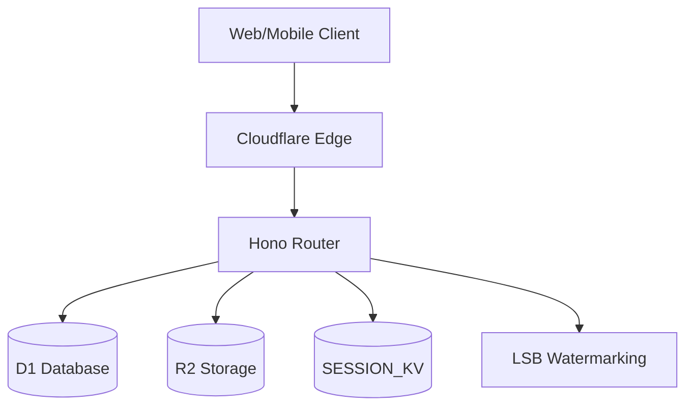

# Cloud Backend — Architecture

## Overview
The ClickFlash Cloud Backend is a serverless application built on Cloudflare Workers. It acts as the central cloud infrastructure, handling gallery delivery, API rate limiting, and synchronization with on-prem Master apps. It leverages Cloudflare D1 for relational data, R2 for media storage (supporting range requests for efficient video/image serving), and KV for session management. It also includes an advanced LSB (Least Significant Bit) watermarking service and a centralized face search API.

## Process / Runtime Model
Stateless serverless functions running on the Cloudflare edge network, utilizing V8 isolates for minimal cold starts.

## Key Components
| Component | File | Responsibility |
|-----------|------|----------------|
| Entry Point | `apps/cloud-backend/src/index.ts` | Hono.js router setup and middleware configuration. |
| Gallery Routes | `apps/cloud-backend/src/routes/gallery.ts` | Endpoints for guest gallery access and metadata. |
| Delivery Routes | `apps/cloud-backend/src/routes/delivery.ts` | Handles secure media delivery from R2. |
| Watermark Service | `apps/cloud-backend/src/services/watermark.ts` | Applies invisible LSB watermarks to purchased images. |
| Config | `apps/cloud-backend/wrangler.toml` | Defines bindings (D1, R2, KV) and environment variables. |

## Data Flow Diagram

## Key Interfaces
- `Env`: Defines the Cloudflare bindings injected into the worker (D1, R2, KV).
- `GallerySession`: Structure stored in KV to track active guest sessions.
- `DeliveryRequest`: Schema validating requests for media downloads.

## Configuration
- Managed entirely via `wrangler.toml` and Cloudflare dashboard secrets.
- Bindings: `DB` (D1), `MEDIA_BUCKET` (R2), `SESSION_KV` (KV).

## Testing Strategy
- **Unit Tests**: Business logic tested with standard Vitest.
- **Integration Tests**: Uses `unstable_dev` from Wrangler to test endpoints against local Miniflare instances.

## Known Constraints
- Cloudflare Workers have a 50ms CPU time limit on the free tier (10s on paid), requiring heavy watermarking to be highly optimized.
- D1 database size and write concurrency limits must be monitored.
