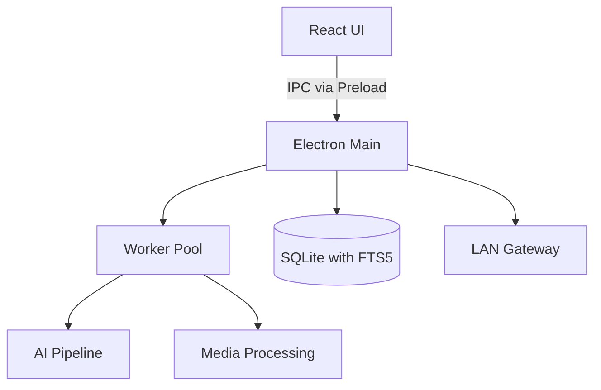

# Master App — Architecture

## Overview
The ClickFlash Master App is the central on-premises hub for the ClickFlash ecosystem. Built on Electron, it handles heavy lifting for media ingestion, processing, and localized storage. It features a robust IPC-first data layer, a worker pool for compute-heavy tasks like AI processing and raw conversion, FTS5-powered local search, and acts as a LAN gateway for other on-prem devices like the Touch Kiosks and Mobile Pro apps.

## Process / Runtime Model
The architecture is split into a main Node.js process and a renderer process, adhering to modern Electron security standards.

## Key Components
| Component | File | Responsibility |
|-----------|------|----------------|
| IPC Handlers | `apps/master/electron-main.ts` | Routes messages from the renderer to backend services. |
| Context Bridge | `apps/master/preload.ts` | Exposes a secure API to the renderer process. |
| Repositories | `apps/master/backend/repositories/` | Manages SQLite database interactions and FTS5 search. |
| Worker Pool | `apps/master/backend/workers/workerPool.ts` | Manages background threads for AI pipelines and media processing. |
| Data Service | `apps/master/src/services/dataService.ts` | Frontend service for querying data via IPC. |
| IPC Schemas | `apps/master/ipc-schemas.ts` | Zod schemas for validating IPC payloads. |

## Data Flow Diagram

## Key Interfaces
- `IpcPayload<T>`: Standardized interface for all IPC communications.
- `AIProcessingResult`: Defines the structure of outputs from the AI pipeline.
- `WorkerTask`: Interface for scheduling background tasks.

## Configuration
- `CLICKFLASH_ENV`: Controls development vs production modes.
- `LAN_GATEWAY_PORT`: Port for the local network API server.
- `WORKER_COUNT`: Number of threads to allocate in the worker pool.

## Testing Strategy
- **Unit Tests**: Business logic and repositories tested with Vitest.
- **IPC Mocks**: The preload API is mocked in the renderer to allow UI testing without Electron.
- **E2E Tests**: Playwright is used to test the compiled Electron application.

## Known Constraints
- Requires Windows 10/11 or macOS 12+ for full hardware acceleration.
- SQLite concurrent writes are bottlenecked through a single connection pool.
- LAN Gateway discovery relies on mDNS, which can be blocked by strict corporate firewalls.
