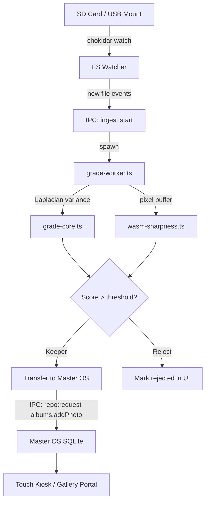

# MoneyTrash Uploader — Architecture

## Overview

MoneyTrash is an Electron + Next.js desktop application purpose-built for rapid batch photo ingestion from SD cards and camera imports. It provides multi-threaded quality grading using Laplacian Variance sharpness detection, WASM-accelerated pixel analysis, and AI-powered curation, delivering only keeper-quality images into the ClickFlash Master OS pipeline.

---

## Process / Runtime Model

```
┌─────────────────────────────────────────────────────┐
│                 Electron Main Process                │
│  ┌─────────────────┐   ┌──────────────────────────┐ │
│  │  FS Watcher     │   │  IPC Handlers            │ │
│  │  (chokidar)     │──▶│  - ingest:start          │ │
│  │  watches SD/USB │   │  - ingest:grade          │ │
│  └─────────────────┘   │  - ingest:transfer       │ │
│                        └──────────┬───────────────┘ │
└───────────────────────────────────┼─────────────────┘
                                    │ contextBridge
┌───────────────────────────────────▼─────────────────┐
│                 Renderer Process (Next.js)           │
│  ┌──────────────────────────────────────────────┐   │
│  │           Batch Ingestion Dashboard          │   │
│  │  ┌────────────┐  ┌─────────────────────────┐ │   │
│  │  │DropZone    │  │ GradingResultsGrid      │ │   │
│  │  │SD Card     │  │ - sharpness score badge │ │   │
│  │  │Browser     │  │ - keeper/reject toggle  │ │   │
│  │  └────────────┘  └─────────────────────────┘ │   │
│  └──────────────────────────────────────────────┘   │
└─────────────────────────────────────────────────────┘
                          │
         ┌────────────────▼────────────────┐
         │     Worker Threads (Node.js)    │
         │  ┌─────────────────────────────┐│
         │  │ grade-worker.ts             ││
         │  │  - Laplacian variance       ││
         │  │  - WASM sharpness module    ││
         │  │  - EXIF extraction          ││
         │  │  - Color histogram          ││
         │  └─────────────────────────────┘│
         └────────────────────────────────┘
```

---

## Key Components

| Component | File | Responsibility |
|-----------|------|----------------|
| Grade Worker | [`src/components/workers/grade-worker.ts`](src/components/workers/grade-worker.ts) | Per-image quality scoring in background thread |
| Grade Core | [`src/components/workers/grade-core.ts`](src/components/workers/grade-core.ts) | Pure Laplacian variance + histogram algorithms |
| WASM Sharpness | [`src/components/workers/wasm-sharpness.ts`](src/components/workers/wasm-sharpness.ts) | WASM-accelerated sharpness computation |
| Desktop Bridge | [`src/services/desktopBridge.ts`](src/services/desktopBridge.ts) | IPC abstraction for file system access |
| WASM Copy Script | [`scripts/copy-wasm-sharpness.mjs`](scripts/copy-wasm-sharpness.mjs) | Build-time WASM module copy |

---

## Data Flow Diagram



---

## Grading Algorithm

The sharpness score is computed as **Laplacian variance** of the luminance channel:

$$\text{score} = \text{Var}(\nabla^2 L)$$

Where $L$ is the luminance channel and $\nabla^2$ is the discrete Laplacian kernel:

$$\begin{bmatrix} 0 & 1 & 0 \\ 1 & -4 & 1 \\ 0 & 1 & 0 \end{bmatrix}$$

Higher variance = sharper image. Threshold is configurable (default: 100).

---

## Key Interfaces

```typescript
interface GradeResult {
  photoPath: string;
  sharpnessScore: number;    // 0-1000 Laplacian variance
  isKeeper: boolean;          // score > threshold
  exif: {
    camera: string;
    lens: string;
    iso: number;
    aperture: string;
    shutterSpeed: string;
    captureDate: string;
  };
  histogram: {
    r: number[]; g: number[]; b: number[]; // 256-bin
  };
}

interface IngestSession {
  sessionId: string;
  sourcePath: string;
  totalFiles: number;
  graded: number;
  keepers: number;
  rejects: number;
  startedAt: Date;
}
```

---

## Configuration

| Variable | Default | Description |
|----------|---------|-------------|
| `SHARPNESS_THRESHOLD` | `100` | Laplacian variance threshold for keeper classification |
| `WORKER_POOL_SIZE` | `4` | Number of concurrent grade worker threads |
| `WASM_MODULE_PATH` | `public/wasm/sharpness.wasm` | Path to compiled WASM module |
| `TRANSFER_TARGET_HOST` | `localhost:8090` | Master OS LAN gateway address |

---

## Testing Strategy

| Test | File | Runner |
|------|------|--------|
| Grade core algorithm | `src/components/workers/__tests__/grade-core.test.ts` | Jest (Node) |
| WASM module loading | Skipped in CI (binary dep) | — |

Run: `pnpm --filter moneytrash-uploader test`

---

## Known Constraints

- WASM module must be copied to `public/wasm/` before build (handled by `scripts/copy-wasm-sharpness.mjs`)
- Worker threads use `worker_threads` Node.js module — not available in renderer process
- SD card paths on Windows may use drive letters (`E:\DCIM\`) — paths are normalized to forward slashes internally
- Maximum ingestion batch: ~10,000 images (limited by SQLite write throughput to Master OS)
