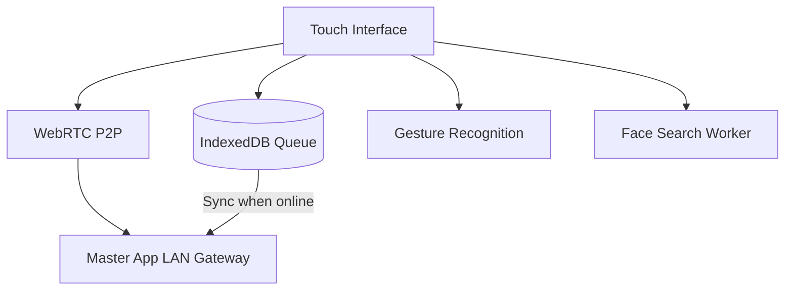

# Touch App — Architecture

## Overview
The ClickFlash Touch app is a customer-facing kiosk interface built on Electron. It provides an intuitive interface for guests to browse, discover, and interact with their photos. It relies heavily on local network discovery, using Bonjour to locate the Master App, and employs WebRTC for fast P2P media transfers. It functions offline-first, leveraging an IndexedDB queue for actions, and features interactive elements like a media pipe gesture service and a face search worker.

## Process / Runtime Model
Designed to run in Electron's kiosk mode, restricting user access to the underlying OS. It uses Web Workers for computationally intensive UI tasks.

## Key Components
| Component | File | Responsibility |
|-----------|------|----------------|
| Touch Sync Client | `apps/touch/src/services/touchSyncClient.ts` | Manages synchronization state with the Master App. |
| Gesture Service | `apps/touch/src/services/mediaPipeGestureService.ts` | Interprets hand gestures using MediaPipe for touchless interaction. |
| Face Search Worker | `apps/touch/src/workers/faceSearch.worker.ts` | Background worker for comparing embeddings in local search. |
| Voice Assistant | `apps/touch/src/hooks/useVoiceAssistant.ts` | React hook integrating offline voice commands. |
| Main Process | `apps/touch/electron-main.ts` | Configures kiosk mode, Bonjour discovery, and window management. |

## Data Flow Diagram

## Key Interfaces
- `SyncQueueItem`: Defines an action queued in IndexedDB.
- `GestureEvent`: Represents a parsed physical gesture from the camera.
- `FaceSearchResult`: Output format of the face search worker.

## Configuration
- Kiosk Mode: Enabled via Electron window configuration (fullscreen, always on top).
- `BONJOUR_SERVICE_NAME`: The identifier used to find the Master app on the network.

## Testing Strategy
- **Component Tests**: React components tested with React Testing Library.
- **Worker Tests**: Web Workers tested independently using Vitest.
- **Hardware Mocks**: Camera and microphone inputs are mocked for CI testing.

## Known Constraints
- Requires specific hardware specs (GPU) for smooth MediaPipe gesture recognition.
- WebRTC P2P connection can fail on overly restrictive guest Wi-Fi networks; fallback to standard HTTP is required.
