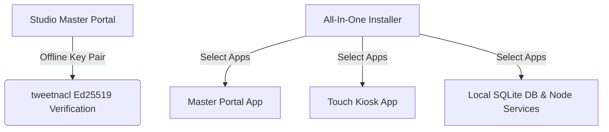

# All-In-One Installer & Cryptographic Licensing Architecture

## Overview

ClickFlash uses a 100% custom, offline-capable packaging and licensing architecture designed for photography studios, kiosks, and theme park deployments. No third-party SaaS license servers are required.

## 1. Cryptographic License Keys (`tweetnacl`)

ClickFlash licenses are digitally signed using Ed25519 signatures (`nacl.sign.detached`).

### Key Structure
Each license payload consists of:
- **Studio ID & Name**: Identifier of the licensed studio.
- **Hardware Binding**: SHA-256 fingerprint of CPU + Motherboard serials + MAC address.
- **Feature Flags**: Bitmask/JSON array of allowed apps (`master`, `touch`, `cloud-sync`, `ai-face`).
- **Expiration Timestamp**: Unix epoch (or `0` for perpetual licenses).
- **Signature**: 64-byte Ed25519 detached signature generated by `apps/license-generator`.

### Verification Logic
When `apps/master` or `apps/touch` boots up:
1. Reads `license.dat` from local AppData.
2. Verifies the Ed25519 signature against the compiled-in Public Key.
3. Checks hardware fingerprint match against local system information.
4. Grants feature access without making any external network requests.

## 2. All-In-One Installer

The `apps/installer` bundle lets operators install the entire suite or select specific components:

- **Step 1: Welcome & EULA** — Offline End-User License Agreement.
- **Step 2: Component Selection** — Toggle Master Portal (Port 8090), Touch Kiosk (Port 8091), Background Services, and Shared Core.
- **Step 3: Configuration** — Local network settings, SQLite database initialization path, and printer configuration.
- **Step 4: Installation & Verification** — Automated extraction and healthcheck ping.
