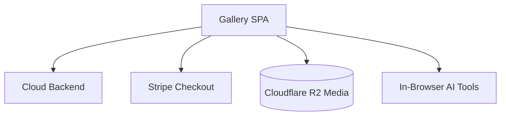

# Gallery App — Architecture

## Overview
The ClickFlash Gallery App is a customer-facing Vite Single Page Application (SPA) where users can view and purchase their photos. It features a modern, responsive design and integrates advanced AI tools like background swapping and a magic eraser directly in the browser. It securely handles payments via a Stripe checkout flow, authenticates users via gallery tokens, and optimizes media delivery using Cloudflare R2 with HTTP range requests.

## Process / Runtime Model
A client-side rendered SPA deployed statically on Cloudflare Pages, interacting with the Cloudflare Workers backend.

## Key Components
| Component | File | Responsibility |
|-----------|------|----------------|
| Cloud API Service | `apps/gallery/src/services/cloudApiService.ts` | Handles all communication with the cloud backend. |
| Magic Eraser | `apps/gallery/src/components/customer/MagicEraserTool.tsx` | UI component for removing unwanted objects from photos. |
| Face Search Modal | `apps/gallery/src/components/customer/GuestFaceSearchModal.tsx` | Allows guests to search for photos containing their face. |
| Mask Utils | `apps/gallery/src/utils/maskUtils.ts` | Utility functions for processing image masks for AI editing. |

## Data Flow Diagram

## Key Interfaces
- `GalleryToken`: JWT structure used for authenticating gallery access.
- `CheckoutSession`: Represents the state of a Stripe transaction.
- `ImageMask`: Structure for defining edited areas in the magic eraser tool.

## Configuration
- `VITE_CLOUD_API_URL`: The endpoint for the cloud backend.
- `VITE_STRIPE_PUBLIC_KEY`: Public key for Stripe elements.

## Testing Strategy
- **Unit Tests**: Utility functions like `maskUtils` are heavily tested.
- **Component Tests**: UI components tested using React Testing Library.
- **E2E Tests**: Cypress is used for critical paths like the checkout flow.

## Known Constraints
- In-browser AI tools (Magic Eraser) rely on WebGL and may have performance issues on older mobile devices.
- Range requests for large media files require proper CORS configuration on the R2 bucket.
