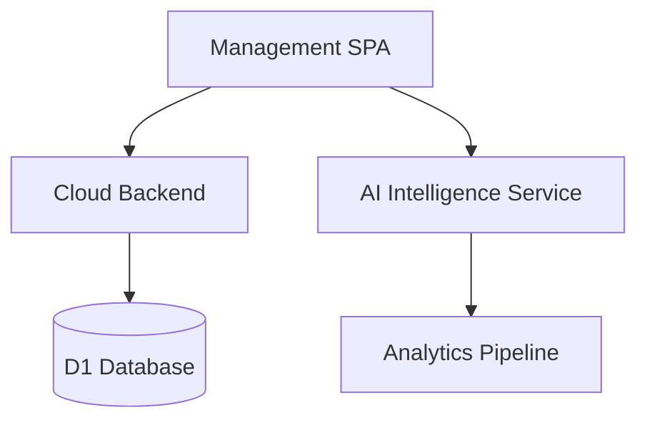

# Management App — Architecture

## Overview
The ClickFlash Management App is an internal dashboard for franchise operators and system administrators. Built as a Vite SPA, it provides comprehensive tools for managing the ClickFlash ecosystem. Key features include the AI Swarm Command Center for monitoring automated tasks, an AI-powered intelligence service for demand forecasting, a franchise setup wizard, and a complex commission engine for calculating payouts.

## Process / Runtime Model
A client-side Vite SPA, typically deployed via Cloudflare Pages, interacting with protected endpoints on the cloud backend.

## Key Components
| Component | File | Responsibility |
|-----------|------|----------------|
| AI Intelligence | `apps/management/src/services/aiIntelligenceService.ts` | Interfaces with the backend to fetch predictive analytics. |
| Swarm Command | `apps/management/src/components/ai/AISwarmCommandCenter.tsx` | Dashboard for monitoring and controlling AI worker nodes. |
| Demand Forecasting | `apps/management/src/components/management/analytics/AIDemandForecasting.tsx` | Visualizes projected foot traffic and photo demand. |

## Data Flow Diagram

## Key Interfaces
- `FranchiseConfig`: Configuration schema for a new franchise location.
- `CommissionReport`: Structure detailing calculated payouts for a given period.
- `SwarmNodeStatus`: Real-time status metric for an AI worker node.

## Configuration
- `VITE_ADMIN_API_URL`: URL for the administrative backend endpoints.
- Authentication relies on secure HTTP-only cookies and strict RBAC (Role-Based Access Control).

## Testing Strategy
- **Unit Tests**: Complex logic like the commission engine is rigorously tested with Vitest.
- **Integration Tests**: API service layers are tested against mock backend responses.

## Known Constraints
- Rendering complex analytics charts can be memory-intensive on lower-end administrative machines.
- Real-time swarm monitoring relies on WebSocket connections which may need keep-alive handling.
