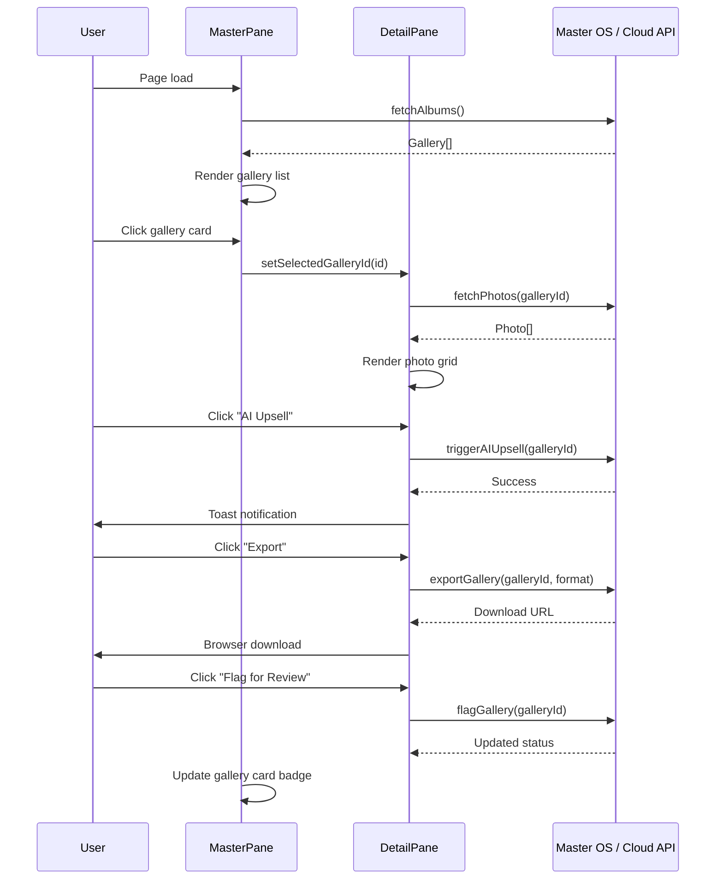

# Customer Galleries Oversight — UI Specification

> **Panel location:** `apps/management` → Sidebar nav → **Galleries** (`/galleries`)
> **Author:** Photographer / Creative Lead
> **Date:** 2026-08-15
> **Status:** Draft — Ready for Engineering Review

---

## 1. Design System Reference

This panel **must** reuse the established ClickFlash Management Hub design language.
All token values below are sourced from the audited codebase:

| Source File | Role |
|---|---|
| [`index.css`](file:///c:/Users/alamo/Desktop/ClickFlash/apps/management/src/index.css) | Tailwind `@theme` — app-level color overrides |
| [`tokens.css`](file:///c:/Users/alamo/Desktop/ClickFlash/packages/ui/src/styles/tokens.css) | CSS custom properties (light/dark), glass utilities |
| [`design-tokens.json`](file:///c:/Users/alamo/Desktop/ClickFlash/packages/ui/src/tokens/design-tokens.json) | Semantic token map consumed by Tailwind config |

### 1.1 Color Palette (Dark Mode — the Management Hub default)

| Token | HSL Value | Hex Approximation | Usage |
|---|---|---|---|
| `--background` | `222 47% 8%` | `#0B111F` | Page canvas |
| `--foreground` | `210 40% 98%` | `#F8FAFC` | Primary text |
| `--primary` | `189 94% 43%` | `#06B6D4` (Cyan) | Primary actions, focus rings |
| `--secondary` | `258 90% 66%` | `#8B5CF6` (Violet) | Secondary accents |
| `--muted` | `222 44% 13%` | `#131C31` | Card / surface fill |
| `--muted-foreground` | `215 20% 65%` | `#94A3B8` | Secondary text |
| `--border` | `222 44% 20%` | `#1E3050` | Dividers, card borders |
| `--card` | `222 44% 13%` | `#131C31` | Card background |
| `--success` | `142 76% 36%` | `#22C55E` | Sold / Complete badges |
| `--warning` | `38 92% 50%` | `#F59E0B` | Pending / Partial badges |
| `--danger` | `0 84% 60%` | `#EF4444` | Expired / Flagged badges |

> [!IMPORTANT]
> The Management Hub **always** runs in dark mode. The `@theme` block in `index.css` sets `--color-background: #0f172a` (Slate-950) and `--color-surface: #1e293b` (Slate-800).
> Card panels across the codebase use `bg-slate-900 border border-slate-800 rounded-xl` — replicate this exactly.

### 1.2 Existing Component Library (`packages/ui`)

The following shared primitives **must** be used instead of rolling custom alternatives:

| Primitive | Import | Notes |
|---|---|---|
| [`Button`](file:///c:/Users/alamo/Desktop/ClickFlash/packages/ui/src/components/Button.tsx) | `@clickflash/ui` | Variants: `primary`, `secondary`, `outline`, `ghost`, `danger`, `glass`, `premium`, `success`. Sizes: `sm`, `md`, `lg`, `xl`, `icon`. |
| [`Card`](file:///c:/Users/alamo/Desktop/ClickFlash/packages/ui/src/components/Card.tsx) | `@clickflash/ui` | Variants: `default`, `glass`, `outline`, `ghost`. Auto-padding `p-4 sm:p-5 md:p-6`. Uses `rounded-2xl`. |
| [`Skeleton`](file:///c:/Users/alamo/Desktop/ClickFlash/packages/ui/src/components/Skeleton.tsx) | `@clickflash/ui` | `animate-pulse bg-zinc-800`. Apply height/width via className. |
| [`PhotoCard`](file:///c:/Users/alamo/Desktop/ClickFlash/packages/ui/src/components/PhotoCard.tsx) | `@clickflash/ui` | Accepts `Photo` type. Has built-in selected state (blue ring), culling status badge, resolution overlay. |
| [`ProgressiveImage`](file:///c:/Users/alamo/Desktop/ClickFlash/packages/ui/src/components/ProgressiveImage.tsx) | `@clickflash/ui` | BlurHash → full image transition. Has skeleton fallback. **Use this for every photo thumbnail.** |
| [`Modal`](file:///c:/Users/alamo/Desktop/ClickFlash/packages/ui/src/components/Modal.tsx) | `@clickflash/ui` | Compound component: `Modal.Root`, `.Content`, `.Header`, `.Title`, `.Body`, `.Footer`, `.Close`. |
| [`Spinner`](file:///c:/Users/alamo/Desktop/ClickFlash/packages/ui/src/components/Spinner.tsx) | `@clickflash/ui` | Inline loading indicator. |
| [`Toast`](file:///c:/Users/alamo/Desktop/ClickFlash/packages/ui/src/components/Toast.tsx) | `@clickflash/ui` | Success / error notifications. |

### 1.3 Iconography

- **Library:** [Lucide React](https://lucide.dev/) — already used throughout the Management Hub.
- **Icon size:** `w-5 h-5` for inline actions; `w-4 h-4` for button icons; `w-8 h-8` for section headers.
- **Icon color:** Inherit from text color or use status-specific tints (`text-emerald-400`, `text-amber-400`, etc.).

---

## 2. Layout Architecture

### 2.1 Master-Detail Split View

The Oversight panel replaces the current card-grid layout in [`GalleriesView.tsx`](file:///c:/Users/alamo/Desktop/ClickFlash/apps/management/src/views/GalleriesView.tsx) with a **persistent master-detail split**.

```
┌──────────────────────────────────────────────────────────────────────┐
│ HEADER BAR (Page title + KPI summary strip + Refresh)               │
├──────────────────────┬───────────────────────────────────────────────┤
│                      │                                               │
│   GALLERY LIST       │       PHOTO PREVIEW GRID                      │
│   (Master Pane)      │       (Detail Pane)                           │
│                      │                                               │
│   ┌───────────────┐  │  ┌──────┬──────┬──────┬──────┐               │
│   │ Gallery Card  │◄─┼─►│      │      │      │      │               │
│   │ (selected)    │  │  │ img  │ img  │ img  │ img  │               │
│   ├───────────────┤  │  ├──────┼──────┼──────┼──────┤               │
│   │ Gallery Card  │  │  │      │      │      │      │               │
│   ├───────────────┤  │  │ img  │ img  │ img  │ img  │               │
│   │ Gallery Card  │  │  ├──────┼──────┼──────┼──────┤               │
│   │               │  │  │      │      │      │      │               │
│   └───────────────┘  │  │ img  │ img  │ img  │ img  │               │
│                      │  └──────┴──────┴──────┴──────┘               │
│                      │                                               │
│                      │  ┌───────────────────────────────────────┐    │
│                      │  │ ACTION BAR                            │    │
│                      │  │ [AI Upsell] [Export] [Flag for Review]│    │
│                      │  └───────────────────────────────────────┘    │
└──────────────────────┴───────────────────────────────────────────────┘
```

### 2.2 Pane Dimensions

| Pane | Width | Constraints |
|---|---|---|
| **Master (Gallery List)** | `w-[380px]` fixed | `min-w-[320px]`, `max-w-[420px]`. Scrollable `overflow-y-auto`. Full viewport height minus header. |
| **Detail (Photo Grid)** | `flex-1` | Fills remaining space. Scrollable independently. |
| **Divider** | `w-px` | `bg-slate-800`. No draggable resize (simplicity). |

### 2.3 Structural CSS Classes

```
/* Outer container — inherits from MainLayout p-8 */
.oversight-root {
  @apply flex gap-0 h-[calc(100vh-4rem)] -m-8;  /* bleed into parent padding */
}

/* Master pane */
.oversight-master {
  @apply w-[380px] min-w-[320px] max-w-[420px] bg-slate-950 
         border-r border-slate-800 flex flex-col;
}

/* Detail pane */
.oversight-detail {
  @apply flex-1 flex flex-col bg-slate-950 overflow-hidden;
}
```

---

## 3. Header Bar

The header sits **above** the split, spanning the full width.

### 3.1 Structure

```
┌─────────────────────────────────────────────────────────────────────┐
│  🖼️  Customer Galleries Oversight            [Search···]  [Refresh]│
│  Monitor digital passes, AI upsells, and customer engagement.      │
├─────────┬─────────┬──────────┬──────────────────────────────────────┤
│ 📊 57%  │ 📈 38%  │ ✨ 4     │ 64 Total │ 24 Paid │ 18 Pending    │
│ Opened  │ Sold    │ AI Leads │                                      │
└─────────┴─────────┴──────────┴──────────────────────────────────────┘
```

### 3.2 Typography

| Element | Font | Size | Weight | Color | Tracking |
|---|---|---|---|---|---|
| Page title | Inter (sans) | `text-3xl` (30px) | `font-bold` (700) | `text-white` | Default |
| Subtitle | Inter | `text-base` (16px) | `font-normal` (400) | `text-slate-400` | Default |
| KPI value | Inter | `text-3xl` (30px) | `font-bold` (700) | `text-white` | Default |
| KPI label | Inter | `text-sm` (14px) | `font-normal` (400) | `text-slate-400` | Default |
| KPI sub-note | Inter | `text-xs` (12px) | `font-normal` (400) | `text-slate-500` | Default |

### 3.3 KPI Strip

Reuse the existing bento-box pattern from the current [`GalleriesView.tsx`](file:///c:/Users/alamo/Desktop/ClickFlash/apps/management/src/views/GalleriesView.tsx#L106-L183), but collapsed into a **single horizontal row** with smaller cards to save vertical space:

- Container: `flex gap-3 overflow-x-auto pb-2`
- Each KPI pill: `bg-slate-900 border border-slate-800 rounded-xl px-4 py-3 flex items-center gap-3 min-w-fit`
- AI Leads pill gets the gradient: `bg-gradient-to-br from-indigo-900/50 to-slate-900 border-indigo-500/30`

---

## 4. Master Pane — Gallery List

### 4.1 Search & Filter Bar

Positioned at the top of the master pane, sticky.

```
┌─────────────────────────────────────┐
│ 🔍 Search galleries...              │
│ ┌─────────┐ ┌──────────┐            │
│ │All      ▼│ │Date range▼│           │
│ └─────────┘ └──────────┘            │
└─────────────────────────────────────┘
```

- **Search input:** `bg-slate-900 border border-slate-800 rounded-xl pl-10 pr-4 py-3 text-sm` — matches existing filter bar pattern.
- **Status filter:** `<select>` with same styling. Options: All, Preview, Partial, Anchor, Sold, Expired.
- **Date filter:** Optional date range picker. Same select styling for MVP.

### 4.2 Gallery Card (List Item)

Each card is a **compact horizontal strip** optimized for scanning.

```
┌──────────────────────────────────────┐
│ ┌────────┐                           │
│ │ cover  │  The Johnson Family   🟢  │
│ │  img   │  📷 By Alex K.           │
│ │ 64x64  │  8/24 photos bought      │
│ └────────┘  ✨ Hot Lead              │
│             Aug 14 · Preview         │
└──────────────────────────────────────┘
```

#### Dimensions & Styling

| Property | Value |
|---|---|
| Card container | `p-3 rounded-xl border border-slate-800 cursor-pointer transition-all duration-200` |
| Cover thumbnail | `w-16 h-16 rounded-lg object-cover` — rendered with `<ProgressiveImage>` |
| Spacing | `gap-3 flex items-start` |
| Background (default) | `bg-slate-900` |
| Background (hover) | `hover:bg-slate-800/80 hover:border-slate-700` |
| Background (selected) | `bg-slate-800 border-indigo-500/60 shadow-lg shadow-indigo-500/10` |
| Gap between cards | `space-y-2` in the scrollable list |

#### Typography

| Element | Size | Weight | Color |
|---|---|---|---|
| Gallery title | `text-sm` (14px) | `font-semibold` (600) | `text-white` |
| Photographer | `text-xs` (12px) | `font-normal` | `text-slate-400` |
| Photo count | `text-xs` (12px) | `font-medium` | `text-slate-300` (bought count in `text-white font-semibold`) |
| Date + Status | `text-xs` (12px) | `font-medium` | `text-slate-500` |
| AI status badge | `text-[10px]` | `font-bold uppercase tracking-wider` | Per status color below |

#### Status Badge Colors

Reuse the exact badge pattern from the existing [`GalleriesView.tsx`](file:///c:/Users/alamo/Desktop/ClickFlash/apps/management/src/views/GalleriesView.tsx#L235-L248):

| Status | Background | Text | Border |
|---|---|---|---|
| Preview | `bg-amber-500/20` | `text-amber-300` | `border-amber-500/30` |
| Partial | `bg-indigo-500/20` | `text-indigo-300` | `border-indigo-500/30` |
| Anchor | `bg-sky-500/20` | `text-sky-300` | `border-sky-500/30` |
| Sold | `bg-emerald-500/20` | `text-emerald-300` | `border-emerald-500/30` |
| Expired | `bg-red-500/20` | `text-red-300` | `border-red-500/30` |
| Hot Lead (AI) | `bg-fuchsia-500/20` | `text-fuchsia-300` | `border-fuchsia-500/30` |

### 4.3 Interactive States

| State | Visual Treatment |
|---|---|
| **Default** | `bg-slate-900 border-slate-800` |
| **Hover** | `bg-slate-800/80 border-slate-700` — 200ms ease transition. Cover image scales to `scale-105` with `duration-500`. |
| **Selected** | `bg-slate-800 border-indigo-500/60 shadow-lg shadow-indigo-500/10` — Left edge indicator: `border-l-2 border-l-indigo-500`. |
| **Focus (keyboard)** | `ring-2 ring-indigo-500/50 ring-offset-2 ring-offset-slate-950` |
| **Loading (skeleton)** | Replace card content with `<Skeleton>` strips — see §7. |

### 4.4 Scroll Behavior

- `overflow-y-auto` with custom scrollbar (thin, slate-700 thumb, slate-900 track).
- Virtualize with `react-window` if gallery count exceeds 100 items. Below that, native scroll is fine.
- Selected card auto-scrolls into view via `scrollIntoView({ block: 'nearest', behavior: 'smooth' })`.

---

## 5. Detail Pane — Photo Preview Grid

### 5.1 Detail Header

When a gallery is selected, the detail pane shows a contextual header:

```
┌──────────────────────────────────────────────────────────────────┐
│  The Johnson Family            Preview · Aug 14 · 24 photos     │
│  📷 Alex K. · 📧 johnson@email.com · 📱 +1 555-0123            │
│                                                                  │
│  [AI Upsell ✨]  [Export ⬇]  [Flag for Review 🚩]              │
└──────────────────────────────────────────────────────────────────┘
```

#### Typography

| Element | Size | Weight | Color |
|---|---|---|---|
| Gallery title | `text-2xl` (24px) | `font-bold` (700) | `text-white` |
| Metadata line | `text-sm` (14px) | `font-normal` | `text-slate-400` |
| Status badge | `text-xs` (12px) | `font-semibold` | Per status table in §4.2 |

### 5.2 Photo Grid

#### Layout Mode: Uniform Grid (not masonry)

Masonry introduces layout complexity and inconsistent scanning patterns.
A **uniform aspect-ratio grid** provides faster visual parsing for operational oversight.

| Property | Value |
|---|---|
| Grid container | `grid gap-2` |
| Column template (desktop ≥ 1280px) | `grid-cols-4` |
| Column template (large ≥ 1024px) | `grid-cols-3` |
| Column template (medium ≥ 768px) | `grid-cols-2` |
| Aspect ratio per cell | `aspect-[3/2]` (standard photography ratio) |
| Cell border radius | `rounded-lg` |
| Cell overflow | `overflow-hidden` |

#### Photo Cell Composition

Each cell wraps the shared `<ProgressiveImage>` component with an overlay layer:

```tsx
<div className="relative aspect-[3/2] rounded-lg overflow-hidden group">
  <ProgressiveImage
    src={photo.thumbnailUrl}
    blurhash={photo.blurhash}
    alt={photo.filename}
    className="absolute inset-0"
    imageClassName="group-hover:scale-105 transition-transform duration-500"
  />
  
  {/* Hover overlay */}
  <div className="absolute inset-0 bg-gradient-to-t from-black/60 via-transparent to-transparent 
                  opacity-0 group-hover:opacity-100 transition-opacity duration-300 
                  flex flex-col justify-end p-3">
    <span className="text-xs text-white font-medium truncate">{photo.filename}</span>
    <span className="text-[10px] text-white/70">{photo.resolution}MP</span>
  </div>

  {/* Selection checkbox (top-right) */}
  <div className="absolute top-2 right-2 opacity-0 group-hover:opacity-100 transition-opacity">
    <Checkbox />
  </div>
  
  {/* Culling status dot (top-left) */}
  {photo.cullingStatus && (
    <div className="absolute top-2 left-2">
      <StatusDot status={photo.cullingStatus} />
    </div>
  )}
</div>
```

#### Lazy Loading Strategy

1. **Native lazy loading:** All `<ProgressiveImage>` components use `loading="lazy"` by default (the component already does this).
2. **BlurHash placeholders:** If a `blurhash` is available for the photo, the `<ProgressiveImage>` component decodes it to a canvas for an instant color preview.
3. **Skeleton fallback:** When no blurhash exists, the component shows `animate-pulse bg-slate-800/60`.
4. **Intersection Observer:** For grids exceeding 50 photos, implement viewport-aware rendering — only mount images within ±2 rows of the visible viewport. Use `IntersectionObserver` with `rootMargin: '200px'`.
5. **Priority loading:** First 8 photos (2 visible rows) use `priority={true}` to load eagerly.

### 5.3 Photo Grid Scroll

- `overflow-y-auto` with momentum scrolling.
- A subtle `bg-gradient-to-b from-slate-950 to-transparent h-6` fade at the top when scrolled down, indicating more content above.

---

## 6. Action Bar

Pinned to the bottom of the detail pane. Visible only when a gallery is selected.

### 6.1 Structure

```
┌──────────────────────────────────────────────────────────────────┐
│  ☑ 3 photos selected                                            │
│                                                                  │
│  [✨ AI Upsell]   [⬇ Export]   [🚩 Flag for Review]    [···]   │
└──────────────────────────────────────────────────────────────────┘
```

### 6.2 Container Styling

```css
/* Action bar */
.action-bar {
  @apply border-t border-slate-800 bg-slate-900/80 backdrop-blur-xl 
         px-6 py-4 flex items-center justify-between gap-4;
}
```

### 6.3 Button Specifications

All buttons use the shared `<Button>` component from `@clickflash/ui`.

| Button | Variant | Size | Left Icon | Label | Notes |
|---|---|---|---|---|---|
| **AI Upsell** | `premium` | `md` | `<Sparkles className="w-4 h-4" />` | "AI Upsell" | Only enabled when gallery has `aiStatus === 'Hot Lead'`. Shows `isLoading` spinner during API call. Gradient bg via the `premium` variant. |
| **Export** | `outline` | `md` | `<Download className="w-4 h-4" />` | "Export" | Opens dropdown: "Export as ZIP", "Export CSV Report", "Send to Cloud". |
| **Flag for Review** | `danger` | `md` | `<Flag className="w-4 h-4" />` | "Flag for Review" | Toggleable — when flagged, switches to `success` variant with label "Flagged ✓". |
| **More** | `ghost` | `icon` | `<MoreVertical className="w-4 h-4" />` | — | Dropdown: "Delete Gallery", "Resend to Guest", "View Analytics". |

### 6.4 Selection Counter

When one or more photos are checked in the grid:

```
<span className="text-sm text-slate-300">
  <span className="text-white font-semibold">{count}</span> photo{count !== 1 ? 's' : ''} selected
</span>
```

When no photos are selected, show a dimmed instruction:

```
<span className="text-sm text-slate-500 italic">Select photos to batch-action</span>
```

---

## 7. Loading States & Skeletons

### 7.1 Gallery List Skeleton

While `fetchAlbums()` is in flight, render **6 skeleton cards** in the master pane:

```tsx
{Array.from({ length: 6 }).map((_, i) => (
  <div key={i} className="flex items-start gap-3 p-3 rounded-xl border border-slate-800 bg-slate-900">
    <Skeleton className="w-16 h-16 rounded-lg" />
    <div className="flex-1 space-y-2">
      <Skeleton className="h-4 w-3/4 rounded" />
      <Skeleton className="h-3 w-1/2 rounded" />
      <Skeleton className="h-3 w-1/3 rounded" />
    </div>
  </div>
))}
```

### 7.2 Photo Grid Skeleton

While photos for a selected gallery are loading, render a **4×3 grid of skeleton cells**:

```tsx
<div className="grid grid-cols-4 gap-2">
  {Array.from({ length: 12 }).map((_, i) => (
    <Skeleton key={i} className="aspect-[3/2] rounded-lg" />
  ))}
</div>
```

### 7.3 Transition Between Galleries

When the user clicks a different gallery in the master list:
1. Detail pane header instantly updates (text swap, no animation).
2. Photo grid crossfades: current grid fades to `opacity-0` over 150ms, skeleton appears, then new photos fade in over 300ms.
3. Use `key={selectedGalleryId}` on the grid container to trigger React re-mount and natural skeleton → loaded transitions.

---

## 8. Empty States

### 8.1 No Galleries Exist

Displayed in the **master pane** when the API returns zero galleries.

```
┌─────────────────────────────────────┐
│                                     │
│         🖼️ (64px, slate-600)       │
│                                     │
│     No galleries yet                │
│     Galleries appear here           │
│     when photographers create       │
│     sessions on the kiosk.          │
│                                     │
│     [ Open Live Ops → ]             │
│                                     │
└─────────────────────────────────────┘
```

- Icon: `<Images className="w-16 h-16 text-slate-600 mx-auto" />`
- Title: `text-lg font-semibold text-slate-300`
- Description: `text-sm text-slate-500 text-center max-w-[240px] mx-auto mt-2 leading-relaxed`
- CTA: `<Button variant="outline" size="sm">` linking to `/fleet`

### 8.2 No Gallery Selected (Detail Pane Placeholder)

Displayed on initial load before the user selects a gallery.

```
┌──────────────────────────────────────────────────────────────────┐
│                                                                  │
│                                                                  │
│               ← Select a gallery to preview                      │
│               Click any gallery on the left                      │
│               to view its photos and actions.                    │
│                                                                  │
│                                                                  │
└──────────────────────────────────────────────────────────────────┘
```

- Icon: `<MousePointerClick className="w-12 h-12 text-slate-700 mx-auto" />`
- Title: `text-base font-medium text-slate-400`
- Subtitle: `text-sm text-slate-600 mt-1`
- Center both vertically and horizontally in the pane.

### 8.3 Gallery Has No Photos

When a selected gallery contains zero photos.

```
┌──────────────────────────────────────────────────────────────────┐
│                                                                  │
│              📸 (48px, slate-600)                                │
│                                                                  │
│          No photos in this gallery                               │
│          Photos will appear when the                             │
│          photographer uploads them.                              │
│                                                                  │
│          [ Refresh ↻ ]                                           │
│                                                                  │
└──────────────────────────────────────────────────────────────────┘
```

- Icon: `<Camera className="w-12 h-12 text-slate-600 mx-auto" />`
- Title: `text-base font-medium text-slate-400`
- CTA: `<Button variant="ghost" size="sm" leftIcon={<RefreshCw />}>Refresh</Button>`

### 8.4 Search Yields No Results

In the master pane when the search/filter returns nothing:

- Icon: `<SearchX className="w-10 h-10 text-slate-600 mx-auto" />`
- Title: `text-sm font-medium text-slate-400` — "No galleries match your search"
- Subtitle: `text-xs text-slate-500` — "Try different keywords or clear filters"
- CTA: `<button className="text-xs text-indigo-400 hover:text-indigo-300 underline">Clear search</button>`

---

## 9. Responsive Breakpoints

The Management Hub runs on **desktop and large tablets** (it is a back-office tool, not consumer-facing).

### 9.1 Breakpoint Table

| Breakpoint | Width | Layout Behavior |
|---|---|---|
| **Desktop XL** | `≥ 1440px` | Full split: 380px master + flex-1 detail. Photo grid `grid-cols-5`. |
| **Desktop** | `≥ 1280px` | Full split: 380px master + flex-1 detail. Photo grid `grid-cols-4`. |
| **Large Tablet / Small Desktop** | `≥ 1024px` | Narrower master: `w-[320px]`. Photo grid `grid-cols-3`. |
| **Tablet Portrait** | `≥ 768px` | **Stacked layout:** Master list is full width at top (max-height `40vh`, scrollable), detail pane below. Photo grid `grid-cols-3`. |
| **Below 768px** | `< 768px` | **Sheet navigation:** Master list is full width. Selecting a gallery pushes a full-screen detail view with a back arrow. Photo grid `grid-cols-2`. |

### 9.2 Responsive Implementation Notes

```css
/* Tailwind classes on the root container */
.oversight-root {
  @apply flex flex-col md:flex-row h-[calc(100vh-4rem)];
}

/* Master pane */
.oversight-master {
  @apply w-full max-h-[40vh] md:max-h-none md:w-[320px] lg:w-[380px];
}

/* Detail pane */
.oversight-detail {
  @apply flex-1 min-h-0;
}
```

---

## 10. Animations & Micro-Interactions

All animations **must** respect `prefers-reduced-motion: reduce`.

| Interaction | Animation | Duration | Easing |
|---|---|---|---|
| Gallery card hover → bg change | Background color transition | `200ms` | `ease` |
| Gallery card hover → thumbnail zoom | `scale(1.05)` | `500ms` | `ease-in-out` |
| Gallery card selection → border glow | Border color + shadow | `200ms` | `ease-out` |
| Photo cell hover → image zoom | `scale(1.05)` | `500ms` | `ease-in-out` |
| Photo cell hover → overlay fade-in | Opacity 0 → 1 | `300ms` | `ease` |
| Button press → scale | `scale(0.95)` | Instant | Spring (via `active:scale-95`) |
| Skeleton pulse | Opacity oscillation | `2s` cycle | `ease-in-out` (Tailwind default) |
| Detail pane photo grid entry | Fade-in + slight `translateY(8px)` | `300ms` staggered | `cubic-bezier(0.22, 1, 0.36, 1)` |
| Toast notifications | Slide-in from top-right | `300ms` | `ease-out` |

### 10.1 Reduced Motion

```css
@media (prefers-reduced-motion: reduce) {
  *, *::before, *::after {
    animation-duration: 0.01ms !important;
    transition-duration: 0.01ms !important;
  }
}
```

---

## 11. Accessibility Requirements

| Requirement | Implementation |
|---|---|
| Keyboard navigation | Gallery list is navigable with `↑` / `↓` arrow keys. `Enter` selects. `Tab` moves focus to detail pane. |
| Focus indicators | All interactive elements show `focus-visible:ring-2 ring-indigo-500/50`. |
| ARIA roles | Master list: `role="listbox"`. Gallery cards: `role="option"`, `aria-selected`. Photo grid: `role="grid"`. |
| Screen reader labels | Action buttons have descriptive `aria-label`. Empty states are announced. |
| Color contrast | All text meets WCAG AA (4.5:1 for body text, 3:1 for large text). Slate-400 on Slate-900 = ~5.5:1 ✓. |
| Image alt text | Every `<ProgressiveImage>` receives `alt={photo.filename || 'Gallery photo'}`. |

---

## 12. Data Flow Summary



---

## 13. File Placement

When implementing this specification, create the following files:

| File | Purpose |
|---|---|
| `apps/management/src/views/GalleriesOversightView.tsx` | Root view component — replaces the current GalleriesView rendering |
| `apps/management/src/components/GalleryListPane.tsx` | Master pane — gallery search, filter, list |
| `apps/management/src/components/GalleryListCard.tsx` | Individual gallery card in the master list |
| `apps/management/src/components/PhotoGridPane.tsx` | Detail pane — photo grid, detail header, action bar |
| `apps/management/src/components/PhotoGridCell.tsx` | Individual photo cell wrapper around ProgressiveImage |
| `apps/management/src/components/GalleryActionBar.tsx` | Bottom action bar with AI Upsell, Export, Flag |
| `apps/management/src/components/GalleryEmptyStates.tsx` | All empty state illustrations (no galleries, no selection, no photos, no results) |

---

*End of specification.*
