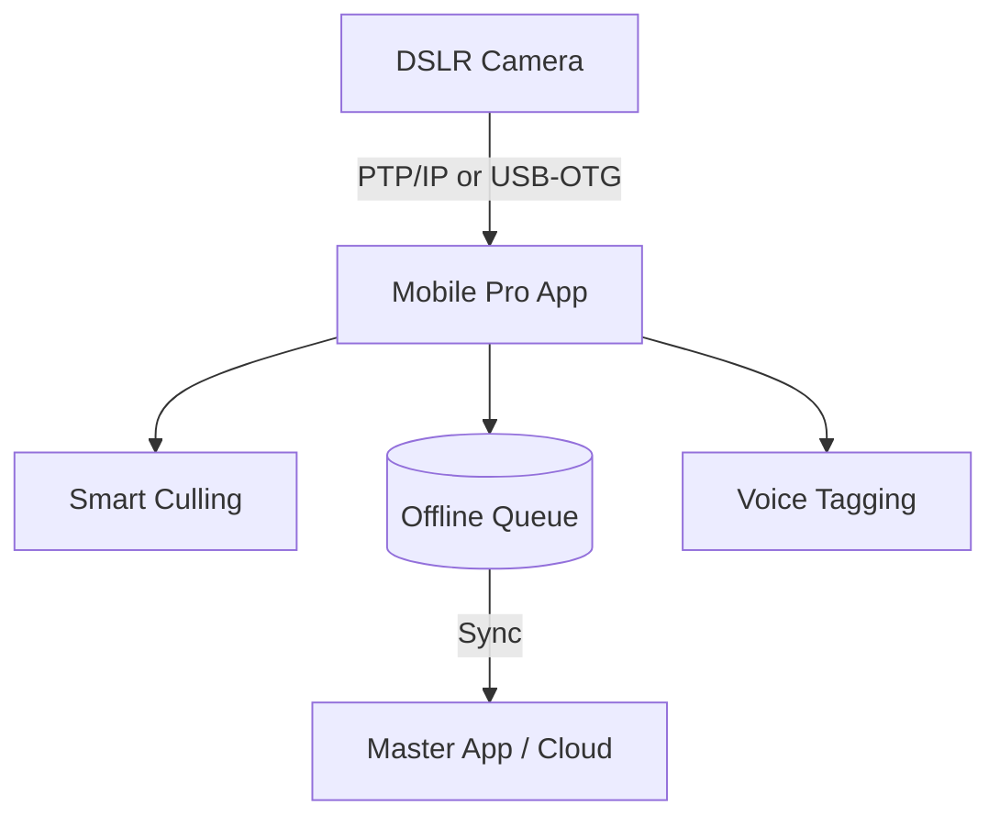

# Mobile Pro App — Architecture

## Overview
The ClickFlash Mobile Pro app is designed for roaming photographers. Built using the Expo managed workflow (React Native) for Android, it handles robust field operations. Key features include tethering to DSLR/Mirrorless cameras via the PTP/IP protocol, USB-OTG ingestion for quick media dumps, an offline-first upload queue, voice tagging for metadata, and on-device field quality assessment.

## Process / Runtime Model
A React Native application running primarily on Android devices, utilizing native modules for USB and network communications.

## Key Components
| Component | File | Responsibility |
|-----------|------|----------------|
| PTP/IP Client | `apps/mobile-pro/src/services/PtpIpClient.ts` | Manages wireless tethering and image transfer from cameras. |
| Shift Manager | `apps/mobile-pro/src/services/ShiftManager.ts` | Tracks photographer shifts, locations, and time logs. |
| Smart Culling | `apps/mobile-pro/src/services/SmartCullingService.ts` | Assesses image quality (blur, exposure) on-device. |
| Voice Tagging | `apps/mobile-pro/src/components/VoiceTaggingSheet.tsx` | UI for appending voice memos to photo batches. |
| Tests | `apps/mobile-pro/tests/` | Test suites for the mobile app. |

## Data Flow Diagram

## Key Interfaces
- `CameraEvent`: Represents an event received over PTP/IP (e.g., ObjectAdded).
- `UploadJob`: Defines an image and its metadata in the offline queue.
- `QualityScore`: The output of the Smart Culling service.

## Configuration
- Managed via `app.json` (Expo config) and `.env` files for build-specific variables.
- Requires specific Android permissions for USB host mode and background location.

## Testing Strategy
- **Unit Tests**: Jest is used for testing business logic and services.
- **Component Tests**: React Native Testing Library for UI components.
- **Device Testing**: Physical Android devices are essential for testing PTP/IP and USB-OTG.

## Known Constraints
- Windows build constraints: EAS Build is primarily used, but local Android builds on Windows require specific NDK and SDK versions.
- PTP/IP implementations vary wildly between camera manufacturers, requiring specific adapter layers.
- USB-OTG ingestion speed is limited by the Android device's USB controller capabilities.
