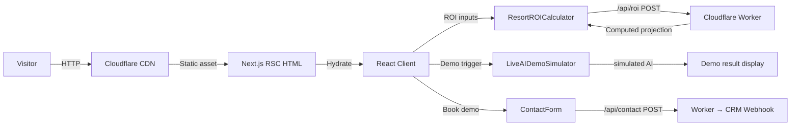

# ClickFlash Website — Architecture

## Overview

The ClickFlash marketing website is a Next.js 15 application with Tailwind CSS 4, deployed to Cloudflare Pages. It serves as the primary conversion surface for resort clients and operators, featuring an interactive ROI calculator, a live AI demo simulator, a booking flow, and a full CMS-driven blog. The site is statically generated at build time with selective client-side hydration for interactive components.

---

## Process / Runtime Model

```
┌──────────────────────────────────────────────────────────────┐
│                   Cloudflare Pages (CDN Edge)                │
│                                                              │
│  ┌────────────────────────────────────────────────────────┐  │
│  │              Next.js 15 App Router                     │  │
│  │                                                        │  │
│  │  Server Components (RSC)        Client Components      │  │
│  │  ┌──────────────────────┐      ┌───────────────────┐  │  │
│  │  │ /app/(marketing)/    │      │ ROICalculator     │  │  │
│  │  │  - page.tsx (hero)   │      │ LiveAIDemo        │  │  │
│  │  │  - features/page     │      │ BookingCalendar   │  │  │
│  │  │  - pricing/page      │      │ ContactForm       │  │  │
│  │  │  - blog/[slug]/page  │      │ CookieConsent     │  │  │
│  │  └──────────────────────┘      └───────────────────┘  │  │
│  └────────────────────────────────────────────────────────┘  │
│                                                              │
│  ┌──────────────────────────────────────────────────────┐    │
│  │  Cloudflare Worker (wrangler.toml: website-worker)   │    │
│  │  - /api/booking  (demo booking request)              │    │
│  │  - /api/contact  (lead capture → CRM webhook)        │    │
│  │  - /api/roi      (ROI calculation with real data)    │    │
│  └──────────────────────────────────────────────────────┘    │
└──────────────────────────────────────────────────────────────┘
```

---

## Key Components

| Component | File | Responsibility |
|-----------|------|----------------|
| Hero Section | [`src/app/(marketing)/page.tsx`](src/app/(marketing)/page.tsx) | Landing page with animated headline |
| ROI Calculator | [`src/components/sections/ResortROICalculator.tsx`](src/components/sections/ResortROICalculator.tsx) | Interactive financial model with Recharts |
| Live AI Demo | [`src/components/sections/LiveAIDemoSimulator.tsx`](src/components/sections/LiveAIDemoSimulator.tsx) | Browser-based AI feature playground |
| Redirects | [`public/_redirects`](public/_redirects) | Cloudflare Pages SPA routing |

---

## Data Flow Diagram



---

## Key Pages

| Route | Type | Description |
|-------|------|-------------|
| `/` | Static + RSC | Hero, features overview, social proof |
| `/features` | Static | Detailed feature breakdown |
| `/pricing` | Static | Pricing tiers with feature matrix |
| `/roi` | Client | Interactive ROI Calculator |
| `/demo` | Client | Live AI Demo Simulator |
| `/blog/[slug]` | ISR | CMS-driven blog posts |
| `/book` | Client | Demo booking form |

---

## Key Interfaces

```typescript
// ROI Calculator inputs
interface ROIInputs {
  dailyGuests: number;         // avg daily resort guests
  captureRate: number;         // % of guests photographed (0-1)
  avgPackagePrice: number;     // EUR per package
  operatingDaysPerYear: number;
  currentPhotographerCount: number;
}

// ROI Calculator outputs
interface ROIProjection {
  annualRevenue: number;
  monthlyRevenue: number;
  revenuePerPhotographer: number;
  roi12Month: number;          // percentage
  paybackMonths: number;
  chartData: { month: string; revenue: number; cumulative: number }[];
}
```

---

## Configuration

| Variable | Description |
|----------|-------------|
| `NEXT_PUBLIC_API_URL` | Cloudflare Worker API base URL |
| `NEXT_PUBLIC_APP_URL` | Canonical site URL for SEO |
| `CRM_WEBHOOK_URL` | HubSpot / Pipedrive webhook for lead capture |

Build: `next build` → static export to `out/` → Cloudflare Pages deployment.

---

## SEO Strategy

- All pages use `generateMetadata()` for dynamic `<title>` and `<meta description>`
- `sitemap.ts` generates XML sitemap with all marketing pages
- `robots.ts` controls crawler access (blog allowed, `/api/*` disallowed)
- Schema.org `Organization` and `Product` structured data on homepage
- Core Web Vitals targets: LCP < 2.5s, CLS < 0.1, FID < 100ms

---

## Testing Strategy

No dedicated test suite (marketing copy + UI). Visual regression testing via Playwright E2E:
```bash
npx playwright test apps/website/e2e/
```

---

## Known Constraints

- CMS route (`/api/cms/pages`) is disabled (`route.ts.disabled`) — static content only for now
- ROI Calculator requires JavaScript — non-JS fallback shows static pricing table
- Cloudflare Pages free tier: 500 deployments/month, 100,000 requests/day
