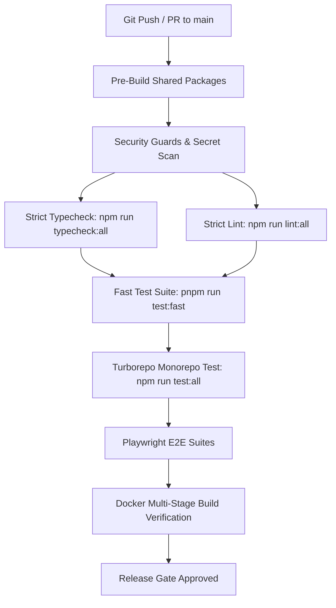

# ClickFlash CI/CD & GitOps Plan

> **V6 Autonomous Pipeline & Verification Architecture**

---

## 1. Local Hygiene & Pre-Commit Gates
- **Hooks**: Husky enforcing `lint-staged` and Conventional Commits (`commitlint`).
- **Secret Scanning**: `scripts/check-tracked-private-key-filenames.mjs` blocks accidental `.env` or key file commits.
- **Air-Gap AST Guard**: `scripts/check-biometric-airgap.mjs` statically asserts that biometric 512D vectors are never sent across public API interfaces.

---

## 2. GitHub Actions (CI) Workflow Pipeline

### Pipeline Milestones
1. **Dependency Installation**: `pnpm install --frozen-lockfile` with immutable action pinning (`dtinth/setup-github-actions-caching-for-turbo@cc723b4600e40a6b8815b65701d8614b91e2669e`).
2. **Quality Gates**:
   - `npm run typecheck:all` (0 errors across 14 apps and 11 packages).
   - `npm run lint:all` (0 warnings/errors).
   - `pnpm run test:security-guards` (100% pass).
   - `pnpm run test:fast` (100% pass).
3. **Artifact Verification**:
   - Verify Electron Master and Touch build packages.
   - Verify multi-stage Dockerfiles (`ai-worker`, `management`, `gallery`) build without root user privileges.

---

## 3. Continuous Delivery (CD) & Release Channels
- **Cloudflare Edge Services**: Automated Wrangler deployment of Hono worker on push to `main`.
- **Electron Master & Touch**: Cryptographically signed Windows executables (`signtool` / EV code sign) published to GitHub Releases.
- **Edge Fleet Auto-Updater**: Zero-downtime hot reload via Electron Auto-Updater with Ed25519 payload checksums.

---

## 4. Multi-Environment Configuration
- `.env.cloud`: Production Cloudflare Worker endpoints & D1 database bindings.
- `.env.test_master`: Local edge test harness and mocked camera tethering.
- `.env.sim`: Phase 4 isolated Docker simulation environment (`172.28.0.0/16`).
