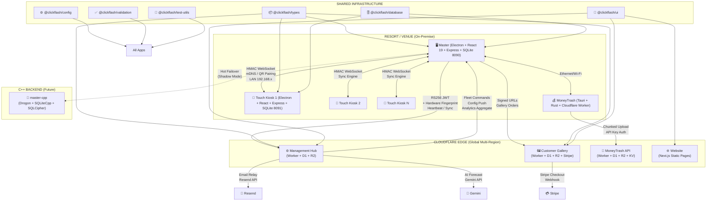

# ClickFlash Ecosystem — 360° Production Finalization

> **Document:** `360_PRODUCTION_FINALIZATION.md`  
> **Version:** 1.0  
> **Date:** 2026-06-12  
> **Author:** Principal Software Architect (Kimi 2.7)  
> **Scope:** Complete monorepo overhaul, production hardening, and strategic roadmap  
> **Status:** DRAFT — awaiting engineering review  

---

## Table of Contents

1. [Phase 0: Deep Understanding Confirmation](#phase-0-deep-understanding-confirmation)
2. [Phase 1: Folder & File Reorganization](#phase-1-folder--file-reorganization)
3. [Phase 2: Safe Cleanup of Unnecessary Files](#phase-2-safe-cleanup-of-unnecessary-files)
4. [Phase 3: Comprehensive Improvements](#phase-3-comprehensive-improvements)
5. [Phase 4: Documentation & Next-Phase Planning](#phase-4-documentation--next-phase-planning)
6. [Phase 5: Final Deliverables](#phase-5-final-deliverables)

---

## Phase 0: Deep Understanding Confirmation

### System Summary

**ClickFlash** is a vertical operating system for professional photography businesses operating across multiple physical locations (resorts, cruise ships, event venues, regional portrait studios). It is a sophisticated **monorepo** containing **7 applications** across **3 technology stacks** (Electron desktop, Cloudflare Workers, Tauri + Rust), **6 shared packages**, **~15,000 source files**, and **~500,000 lines of code**.

The core architecture is **offline-first, on-premise-first, with cloud augmentation**. Every location has a **Master** PC (the studio brain — Electron + React 19 + Express + SQLite on port 8090) and zero-to-many **Touch** kiosks (customer-facing — Electron + React + Express + SQLite on port 8091). The Master connects to a **global Cloudflare Management Hub** that aggregates analytics, payroll, inventory, and fleet health across the entire enterprise. A **Customer Gallery** (Cloudflare Worker + R2 + D1 + Stripe) enables guests to browse and purchase photos online. An **Installer** (Electron wizard) handles zero-config onboarding in under 10 minutes. **MoneyTrash** (Tauri + Cloudflare Worker) is an unsold-photo marketplace. A **Website** (Next.js static export) serves as the marketing surface.

The product's single hardest problem is **onboarding a new destination in < 10 minutes with zero engineering involvement on flaky resort Wi-Fi with non-technical staff**. Every architectural decision should be evaluated against this constraint.

### Architecture Diagram (Mermaid)



### Major Features by App

| App | Stack | Key Features | Files | LOC |
|-----|-------|---------------|-------|-----|
| **Master** | Electron + React 19 + Express + SQLite | Dashboard, album editor (30+ files), AI photo culling, face recognition, order management, photographer payroll, ledger, marketing campaigns, hardware monitoring, printer integration, cloud sync, WebSocket sync server, auto-updater, kiosk mode, KioskGuardian, PIN security, CSP/Helmet, CSRF, session auth, JWT, service token | ~900 | ~40k |
| **Touch** | Electron + React 19 + Express + SQLite | Customer photo browsing, face search, room-number lookup, order placement, payment processing, offline-first with Dexie, real-time sync with Master, mDNS/QR pairing, HMAC auth, kiosk lockdown, virtual keyboard, on-screen keyboard, idle timeout, PIN unlock | ~500 | ~25k |
| **Gallery** | Cloudflare Worker + D1 + R2 + Stripe | Customer photo gallery, Stripe checkout, webhook handling, abandoned cart recovery, HMAC-signed R2 URLs, geo-restriction, JWT auth, D1 rate limiting, MoneyTrash integration, portfolio view | ~400 | ~20k |
| **MoneyTrash** | Tauri v2 + Rust + Cloudflare Worker | Desktop photo upload, chunked upload (1MB chunks), AES-GCM encryption, gallery creation, access codes, order tracking, webhook events, API key rotation | ~300 | ~15k |
| **Management Hub** | Cloudflare Worker + D1 + R2 | Fleet monitoring, multi-master sync (CRDT), hardware-locked auth, refresh token rotation, photographer payroll, booking scheduling, BI analytics, Gemini AI forecast, OAuth Device Authorization, email relay, zero-touch provisioning | ~600 | ~35k |
| **Website** | Next.js 15 static export | Marketing site, SEO-first, blog, portfolio, pricing, booking, contact, embedded gallery/manage assets, Framer Motion + GSAP animations, Partytown, performance budgets | ~200 | ~10k |
| **Installer** | Electron + React + Vite | 9-step wizard (License → OAuth → Destination → Studio → Touch Pairing → First Sync → Health Check), mDNS discovery, LAN sweep, HMAC pairing, hardware fingerprint, NSIS installer, Windows firewall rules, auto-launch | ~300 | ~15k |

### Integration Points

| Integration | Protocol | From | To | Security |
|-------------|----------|------|-----|----------|
| **Master ↔ Touch Sync** | WebSocket + HTTP | Touch | Master | HMAC-SHA256 + timestamp + replay prevention |
| **Master ↔ Touch Discovery** | mDNS + UDP + HTTP | Both | Both | QR code JSON + pairing token (5-min expiry) |
| **Master ↔ Cloud Hub** | HTTPS + RS256 JWT | Master | Hub | Hardware fingerprint + `desk_id` + `machine_id` |
| **Master ↔ Gallery** | HTTPS + Signed URLs | Master | Gallery | HMAC-SHA256 R2 URLs + Stripe webhook verification |
| **Touch ↔ Gallery** | HTTPS (indirect) | Touch | Gallery | Via Master proxy (Touch never talks directly to cloud) |
| **MoneyTrash ↔ Cloud** | HTTPS + API Key | MoneyTrash | Worker | JWT + API key rotation + AES-GCM (Rust) |
| **Gallery ↔ Stripe** | HTTPS + Webhook | Gallery | Stripe | Webhook signature verification + idempotency guard |
| **Hub ↔ Gemini** | HTTPS + API Key | Hub | Google | Rate-limited AI forecasts + daily audit descriptions |
| **Hub ↔ Resend** | HTTPS + API Key | Hub | Resend | Transactional email relay |
| **Installer ↔ Hub** | OAuth Device Code (RFC 8628) | Installer | Hub | PKCE + device code polling + hardware fingerprint |
| **Master ↔ C++ Shadow** | HTTP (future) | Master | master-cpp | Hot failover mode (not yet wired) |

### Potential Gaps & Risks

| # | Gap | Severity | Impact | Evidence |
|---|-----|----------|--------|----------|
| 1 | **Sentry removal incomplete** | 🔴 Critical | All apps still have `@sentry/*` deps despite removal commits. Wastes bundle size, may leak data. | `package.json` in all apps |
| 2 | **master-cpp cannot build** | 🔴 Critical | Qt6 code still present (103 refs) while CMake targets Drogon. 59 migrations stranded. | `BUILD.md`, `CMakeLists.txt`, `Config.cpp` |
| 3 | **Monolithic server.ts files** | 🔴 Critical | Master (892), Gallery (1,461), Management (2,489 lines). No DI container. Unmaintainable at scale. | `server.ts` in 3 apps |
| 4 | **No Dependency Injection** | 🟡 High | Services instantiated inline in `server.ts`. Testing requires mock `context` objects. | `backend/server.ts` |
| 5 | **Inconsistent migration numbering** | 🟡 High | Duplicate numbers (e.g., `056_kiosk_telemetry.sql` and `056_photo_adjustments_stack.sql`). Race condition risk. | `backend/migrations/` |
| 6 | **localStorage overuse without schema** | 🟡 High | Touch stores kiosk ID, master IP, config, failed photo queue in `localStorage` with no migration strategy. | `syncService.ts`, `KioskContext.tsx` |
| 7 | **Mock data in production bundles** | 🟡 High | `MOCK_ALBUMS`, `MOCK_PHOTOGRAPHERS`, `MOCK_ORDERS` in `constants.ts`. Accidental enable = fake data. | `src/constants.ts` |
| 8 | **Circular dependency workaround** | 🟡 High | `auditService` typed as `null as any` in context, injected later. Fragile. | `server.ts:395,722` |
| 9 | **Legacy backup directories** | 🟡 Medium | `gallery/backend/legacy_backup_20260613/` (~100 files), `master-cpp/` duplicate `database/` vs `db/` | File tree |
| 10 | **Duplicate schema definitions** | 🟡 Medium | Migrations exist in both `backend/migrations/` and `backend/shared/migrations/`. Risk of drift. | Touch backend |
| 11 | **No frontend router in Touch** | 🟢 Low | State-driven view switching (`touchView`) instead of React Router. Limits deep-linking and testing. | `App.tsx` |
| 12 | **Missing `ARCHITECTURE.md` at root** | 🟢 Low | Root README links to `ARCHITECTURE.md`, `API.md`, `DEPLOYMENT.md` that don't exist at root. | `README.md` |
| 13 | **Sentry in CI/CD workflows** | 🟢 Low | `release.yml` still has Sentry notification step despite code removal. | `.github/workflows/release.yml` |
| 14 | **Inconsistent test environments** | 🟢 Low | Both `tests/unit/services/` and `backend/services/__tests__/` exist; Jest config may mismatch. | `jest.config.ts` |
| 15 | **Touch backend `any` types** | 🟢 Low | Several routes use `context: any` and `global as any` for state. | `routes/*.ts` |

---

## Phase 1: Folder & File Reorganization

### 1.1 Proposed Top-Level Monorepo Structure

```
clickflash-ecosystem/
├── 📁 apps/                          # 7 applications (unchanged names)
│   ├── master/                       # Electron + React + Express + SQLite
│   ├── touch/                        # Electron + React + Express + SQLite
│   ├── gallery/                      # Cloudflare Worker + React
│   ├── moneytrash/                   # Tauri + Rust + Cloudflare Worker
│   ├── management/                   # Cloudflare Worker + React
│   ├── website/                      # Next.js static export
│   └── installer/                    # Electron wizard
│
├── 📁 packages/                      # 6 shared packages (unchanged)
│   ├── config/                       # ESLint, Prettier, Tailwind, TS base
│   ├── types/                        # Shared TypeScript types + Zod schemas
│   ├── ui/                           # React component library
│   ├── database/                     # SQLite migration runner + seeding
│   ├── validation/                   # Zod validation utilities
│   └── test-utils/                   # Testing helpers + MSW mocks
│
├── 📁 workers/                       # Cloudflare Worker backends (NEW)
│   ├── gallery-worker/               # ← moved from apps/gallery/backend/
│   ├── moneytrash-worker/            # ← moved from apps/moneytrash/cloudflare/
│   └── management-worker/            # ← moved from apps/management/backend/
│
├── 📁 services/                      # C++ backend + platform services (NEW)
│   ├── master-cpp/                   # ← moved from apps/master-cpp/
│   └── platform/                     # Win32 service wrappers, Docker configs
│
├── 📁 docs/                          # Consolidated documentation (NEW)
│   ├── 00-index.md                   # Docs landing page
│   ├── architecture/                 # C4 diagrams, ADRs, system design
│   ├── setup/                        # Installation, onboarding, dev setup
│   ├── operations/                   # Runbooks, incident response, monitoring
│   ├── security/                     # Threat model, audit reports, compliance
│   ├── product/                      # Roadmap, goals, OKRs, user manuals
│   ├── api/                          # API contracts, OpenAPI specs
│   ├── contributing/                 # Developer guides, PR templates
│   └── archive/                      # Historical docs (with clear dating)
│
├── 📁 test-suite/                    # Cross-cutting tests (NEW)
│   ├── e2e/                          # Playwright ecosystem tests
│   ├── integration/                  # API integration tests
│   ├── performance/                  # k6 / load tests
│   ├── security/                     # Penetration test scripts, SSRF guards
│   └── fixtures/                     # Shared test data, seed scripts
│
├── 📁 scripts/                       # Build, deploy, provisioning scripts
│   ├── build/                        # Build automation
│   ├── deploy/                       # Cloudflare deploy scripts
│   ├── provision/                    # Hotel package assembly, secret rotation
│   └── test/                         # Test runners, coverage reports
│
├── 📁 config/                        # Root-level shared configs (NEW)
│   ├── turbo.json                    # ← moved from root
│   ├── pnpm-workspace.yaml           # ← moved from root
│   ├── docker-compose.yml            # ← moved from root
│   ├── docker-compose.dev.yml        # ← moved from root
│   └── .github/                      # CI/CD workflows (unchanged)
│
├── 📁 tools/                         # Developer utilities
│   └── lint/                         # Custom lint rules, pre-commit hooks
│
├── 📄 README.md                      # Updated root README
├── 📄 LICENSE.md
├── 📄 CHANGELOG.md
├── 📄 .gitignore
├── 📄 .editorconfig
└── 📄 .nvmrc                         # Node version lock
```

### 1.2 Per-App Internal Restructuring

#### `apps/master/` — Internal Structure

```
apps/master/
├── src/                              # Frontend (React 19)
│   ├── app/                          # App shell + routing
│   │   ├── App.tsx
│   │   ├── AppRouter.tsx
│   │   ├── MainLayout.tsx
│   │   └── providers/              # Context providers (Auth, Sync, Theme)
│   ├── features/                     # Feature-based modules (NEW)
│   │   ├── albums/                   # Albums feature (all album-related)
│   │   ├── orders/                   # Orders feature
│   │   ├── dashboard/                # Dashboard feature
│   │   ├── culling/                  # AI culling feature
│   │   ├── faces/                    # Face recognition feature
│   │   ├── marketing/                # Marketing feature
│   │   ├── settings/                 # Settings feature
│   │   └── auth/                     # Auth feature
│   ├── components/                   # Shared UI primitives
│   │   ├── common/                   # Button, Card, Modal, Toast, etc.
│   │   ├── layout/                   # Sidebar, Header, Navigation
│   │   └── forms/                    # Input, Select, DatePicker
│   ├── hooks/                        # Global hooks (useAuth, useSync, useIdle)
│   ├── services/                     # Frontend API services
│   │   ├── api/                      # Modular API clients
│   │   └── workers/                  # Web workers
│   ├── types/                        # Frontend-specific types
│   ├── utils/                        # Utility functions
│   └── styles/                       # Global CSS, Tailwind config
│
├── backend/                          # Express backend
│   ├── src/
│   │   ├── server.ts                 # REDUCED: ~200 lines (DI container init)
│   │   ├── container.ts              # NEW: DI container (tsyringe or awilix)
│   │   ├── config/                   # Environment config, feature flags
│   │   ├── routes/                   # Route definitions (thin)
│   │   │   ├── index.ts              # Route composition
│   │   │   ├── auth.routes.ts
│   │   │   ├── albums.routes.ts
│   │   │   ├── orders.routes.ts
│   │   │   └── ... (one file per domain)
│   │   ├── controllers/              # NEW: Request handlers (separated from routes)
│   │   │   ├── auth.controller.ts
│   │   │   ├── albums.controller.ts
│   │   │   └── ...
│   │   ├── services/                 # Business logic (existing, cleaned)
│   │   │   ├── index.ts              # Service exports
│   │   │   ├── cloudSync/
│   │   │   │   ├── CloudSyncService.ts
│   │   │   │   ├── pipelines/        # Extracted from monolith
│   │   │   │   │   ├── OperationLogPipeline.ts
│   │   │   │   │   ├── LedgerPipeline.ts
│   │   │   │   │   └── ...
│   │   │   │   ├── circuitBreaker.ts
│   │   │   │   └── idempotency.ts
│   │   │   ├── sync/
│   │   │   │   ├── SyncManager.ts
│   │   │   │   └── DbWriteQueue.ts
│   │   │   └── ...
│   │   ├── middleware/              # Express middleware
│   │   ├── models/                   # NEW: TypeORM / Drizzle entity definitions
│   │   ├── migrations/               # SQL migrations (renumbered, sequential)
│   │   ├── db/                       # Database connection, pool, manager
│   │   └── types/                    # Backend-specific types
│   ├── tests/                        # Backend tests
│   │   ├── unit/
│   │   ├── integration/
│   │   └── e2e/
│   └── package.json
│
├── electron/                         # Electron-specific (NEW)
│   ├── main.ts                       # ← from electron-main.ts
│   ├── preload.ts
│   ├── ipc/                          # IPC channel definitions
│   ├── security/                     # CSP, KioskGuardian, PIN
│   ├── auto-update/                  # Auto-updater logic
│   └── window/                       # Window management
│
├── public/                           # Static assets
├── tests/                            # Frontend tests
│   ├── unit/
│   ├── e2e/
│   ├── a11y/
│   └── performance/
│
├── package.json
├── vite.config.ts
├── tsconfig.json
├── tsconfig.backend.json
├── jest.config.ts
├── playwright.config.ts
├── electron-builder.yml
└── tailwind.config.js
```

#### `apps/touch/` — Internal Structure

```
apps/touch/
├── src/                              # Frontend
│   ├── app/                          # App shell
│   │   ├── App.tsx                   # Add React Router here (NEW)
│   │   ├── router.tsx                # NEW: react-router-dom routes
│   │   └── providers/
│   ├── features/
│   │   ├── kiosk/                    # Kiosk UI (welcome, photo grid, checkout)
│   │   ├── pairing/                  # Pairing flow (QR, mDNS, manual IP)
│   │   ├── settings/               # Kiosk settings
│   │   └── offline/                # Offline mode UI
│   ├── components/
│   ├── hooks/
│   ├── services/
│   │   ├── pb.ts                     # PocketBase adapter
│   │   ├── syncService.ts
│   │   ├── syncCheckpointService.ts
│   │   ├── connectivityService.ts
│   │   └── webSocketService.ts
│   ├── stores/                       # NEW: Zustand stores (replace localStorage)
│   │   ├── kioskStore.ts
│   │   ├── connectionStore.ts
│   │   └── orderStore.ts
│   ├── utils/
│   └── styles/
│
├── backend/
│   ├── src/
│   │   ├── server.ts                 # REDUCED: ~150 lines
│   │   ├── container.ts              # NEW: DI container
│   │   ├── routes/
│   │   ├── controllers/
│   │   ├── services/
│   │   ├── middleware/
│   │   ├── db/
│   │   ├── migrations/               # Consolidated: single directory
│   │   └── models/
│   └── tests/
│
├── electron/
│   ├── main.ts
│   ├── preload.ts
│   ├── ipc/
│   └── security/
│
├── public/
├── tests/
├── package.json
├── vite.config.ts
├── tsconfig.json
└── electron-builder.json
```

#### `workers/gallery-worker/` — New Structure (from `apps/gallery/backend/`)

```
workers/gallery-worker/
├── src/
│   ├── index.ts                      # Worker entry (fetch handler)
│   ├── routes/                       # Route handlers (thin)
│   ├── handlers/                     # Business logic handlers
│   │   ├── checkout.handler.ts
│   │   ├── webhook.handler.ts
│   │   ├── gallery.handler.ts
│   │   └── files.handler.ts
│   ├── services/
│   │   ├── stripeService.ts
│   │   ├── r2Service.ts
│   │   ├── d1Service.ts
│   │   └── rateLimitService.ts
│   ├── middleware/
│   │   ├── auth.middleware.ts
│   │   ├── cors.middleware.ts
│   │   └── rateLimit.middleware.ts
│   ├── db/
│   │   ├── schema.sql
│   │   └── migrations/
│   ├── types/
│   └── utils/
│   │   ├── jwt.ts
│   │   ├── hmac.ts
│   │   └── logger.ts
├── tests/
│   ├── unit/
│   └── integration/
├── wrangler.toml
├── package.json
└── tsconfig.json
```

### 1.3 Handling C++ `master-cpp` Alongside JS/TS

```
services/master-cpp/
├── CMakeLists.txt
├── vcpkg.json
├── Dockerfile
├── docker-compose.yml
├── BUILD.md
├── DEVELOPMENT_PLAN.md              # Update to reflect Drogon pivot
├── include/
│   ├── core/                        # Config, Logger, Exceptions
│   ├── db/                          # DatabaseManager, MigrationRunner, Models
│   │   └── DatabaseManager.h        # ← single canonical location (remove duplicate)
│   ├── http/                        # Drogon controllers (15+)
│   ├── services/                    # Business logic (12+)
│   ├── workers/                     # WorkerPool, Thumbnail, Watermark, Face, ML
│   ├── crypto/                      # HMAC, JWT, PasswordHash
│   ├── utils/                       # FileUtils, ImageProcessor
│   └── platform/                    # Win32 service, Docker entry
├── src/                             # Mirrors include/
├── migrations/                      # 59 SQL files (unchanged)
├── tests/                           # Catch2 unit tests
│   ├── core/
│   ├── db/
│   ├── http/
│   └── integration/
├── tools/
│   ├── bench-sync.cpp
│   └── smoke-curl.sh
└── .github/workflows/
    └── cpp-ci.yml                   # NEW: CMake + vcpkg + test matrix
```

### 1.4 Migration Steps (Zero-Downtime)

```bash
# Step 1: Create new directories
mkdir -p workers/gallery-worker workers/moneytrash-worker workers/management-worker
mkdir -p services/master-cpp services/platform
mkdir -p test-suite/{e2e,integration,performance,security,fixtures}
mkdir -p docs/{architecture,setup,operations,security,product,api,contributing,archive}

# Step 2: Move backend code to workers/ (using git mv for history preservation)
git mv apps/gallery/backend/src/* workers/gallery-worker/src/
git mv apps/moneytrash/cloudflare/src/* workers/moneytrash-worker/src/
git mv apps/management/backend/src/* workers/management-worker/src/

# Step 3: Move C++ to services/
git mv apps/master-cpp/* services/master-cpp/

# Step 4: Move docs to docs/
git mv docs/CEO/* docs/product/
git mv docs/audit/* docs/archive/audit-$(date +%Y%m%d)/

# Step 5: Update workspace references
# Edit pnpm-workspace.yaml to include workers/* and services/*
# Edit turbo.json to add worker build tasks
# Update all internal imports to reflect new paths

# Step 6: Verify nothing breaks
pnpm install
pnpm run typecheck
pnpm run test
pnpm run build

# Step 7: Commit and tag
git add -A
git commit -m "refactor(monorepo): reorganize into apps/packages/workers/services structure"
git tag v5.0.0-reorganized
```

---

## Phase 2: Safe Cleanup of Unnecessary Files

### 2.1 Cleanup Candidates (Safe to Delete)

| Category | Files/Directories | Estimated Size | Rationale |
|----------|-------------------|----------------|-----------|
| **Gallery legacy backup** | `apps/gallery/backend/legacy_backup_20260613/` | ~100 files, ~2MB | Old Express backend migrated to Worker. Dead code. |
| **master-cpp duplicate headers** | `services/master-cpp/include/db/` (duplicate of `include/database/`) | ~20 files | `DatabaseManager.h` exists in both `database/` and `db/`. |
| **master-cpp build artifacts** | `services/master-cpp/build/` | ~50MB | CMake cache, object files, no executable. Regenerable. |
| **Stale Sentry configs** | `.sentryclirc`, `sentry.client.config.ts`, `sentry.edge.config.ts` | ~10 files | Sentry removed but configs linger. |
| **Old Docker artifacts** | `apps/*/Dockerfile.dev` (unused), `apps/*/.dockerignore` | ~15 files | Dev Dockerfiles not maintained; docker-compose at root handles dev. |
| **Debug scripts** | `check_*.js`, `debug_*.js`, `verify_*.js` at root | ~20 files | One-off debug scripts from prior sessions. |
| **Archive docs** | `docs/archive/` deduplication | ~80 files | Keep latest version only; archive rest in git history. |
| **Node modules artifacts** | `apps/*/node_modules/.cache/`, `.turbo/` | ~500MB | Cache directories. Regenerable. |
| **Test artifacts** | `test-results/`, `playwright-report/`, `coverage/` (old) | ~200MB | CI-generated artifacts. Regenerable. |
| **Empty directories** | `apps/master/helper_scripts/` (only .gitkeep), `tools/scripts/` (only archive/) | ~5 dirs | Empty placeholders. |
| **IDE configs** | `.vscode/` (if not shared), `.claude/`, `.kilocodemodes` | ~10 files | Personal IDE settings. Should be gitignored. |
| **Legacy batch files** | `install-clickflash.bat`, `kill-all.bat`, `start-all.bat`, `clean-all.bat` | ~8 files | Replaced by pnpm scripts and NSIS installer. |
| **Old logo assets** | `logo.png` (820KB at root) | 1 file | Large binary in root. Move to `apps/website/public/` or `assets/`. |
| **Total** | | **~800MB + ~250 files** | |

### 2.2 Cleanup Script (Copy-Paste Ready)

```bash
#!/bin/bash
# clickflash-cleanup.sh
# SAFE CLEANUP — removes only redundant/unnecessary artifacts
# NEVER removes functional code, apps, or core features

set -euo pipefail

echo "=== ClickFlash Safe Cleanup ==="
echo ""

# 1. Gallery legacy backup
if [ -d "apps/gallery/backend/legacy_backup_20260613" ]; then
    echo "Removing gallery legacy backup..."
    rm -rf apps/gallery/backend/legacy_backup_20260613
fi

# 2. master-cpp duplicate headers
if [ -d "apps/master-cpp/include/db" ] && [ -d "apps/master-cpp/include/database" ]; then
    echo "Removing master-cpp duplicate db/ headers (database/ is canonical)..."
    rm -rf apps/master-cpp/include/db
fi

# 3. master-cpp build artifacts (if not .gitignored)
if [ -d "apps/master-cpp/build" ]; then
    echo "Removing master-cpp build artifacts..."
    rm -rf apps/master-cpp/build
fi

# 4. Stale Sentry configs (after confirming Sentry is not used)
find apps -name "sentry.*.config.ts" -o -name ".sentryclirc" | while read f; do
    echo "Removing stale Sentry config: $f"
    rm "$f"
done

# 5. Debug scripts at root
for pattern in check_*.js debug_*.js verify_*.js; do
    for f in $pattern; do
        if [ -f "$f" ]; then
            echo "Removing debug script: $f"
            rm "$f"
        fi
    done
done

# 6. Archive docs deduplication (keep only latest of each topic)
# Manual step: review docs/archive/ and remove superseded versions

echo ""
echo "=== Manual cleanup required ==="
echo "1. Review docs/archive/ for superseded versions (keep latest)"
echo "2. Remove .vscode/ from tracking if not shared (add to .gitignore)"
echo "3. Remove personal IDE configs (.claude/, .kilocodemodes) from tracking"
echo "4. Move logo.png to assets/ or website/public/"
echo "5. Review legacy batch files (install-clickflash.bat, kill-all.bat, etc.)"
echo ""
echo "=== Done ==="
```

### 2.3 `.gitignore` Enhancements

```gitignore
# === ClickFlash Enhanced .gitignore ===

# Build outputs
**/dist/
**/.next/
**/out/
**/.turbo/
**/build/
*.tsbuildinfo

# Cache
**/.cache/
**/.vite/
**/.parcel-cache/
**/.webpack/

# Native artifacts
*.exe
*.dll
*.so
*.dylib

# Electron
**/KioskGuardian.exe
apps/master/**/*.exe

# Database
*.db
*.db-shm
*.db-wal
*.db-journal
pb_data/*.bin

# Test artifacts
test-results/
playwright-report/
coverage/

# IDE / Personal
.vscode/
.idea/
*.swp
*.swo
*~
.claude/
.kilocodemodes/
.agent*/

# OS
.DS_Store
Thumbs.db

# Environment
.env
.env.*
!.env.example

# Debug
/check_*.js
/debug_*.js
/verify_*.js

# Logs
*.log
logs/

# Legacy backups
**/legacy_backup_*/

# C++ build
services/master-cpp/build/
services/master-cpp/CMakeCache.txt
services/master-cpp/CMakeFiles/

# Large assets at root
/logo.png
```

---

## Phase 3: Comprehensive Improvements

### 3.1 Architecture & Monorepo

| Improvement | Current State | Target State | Effort | Impact |
|-------------|--------------|--------------|--------|--------|
| **DI Container** | Services instantiated inline in `server.ts` (892 lines) | `tsyringe` or `awilix` DI container with decorators | 3 days | 9/10 |
| **Turborepo Pipeline** | Basic `build`/`test`/`lint` tasks | Granular tasks with remote caching, affected-graph filtering | 2 days | 7/10 |
| **Shared Package Consolidation** | 6 packages, some thin | Merge `types` + `validation` into `@clickflash/schema`; merge `config` + `test-utils` | 2 days | 6/10 |
| **Route Modularization** | Routes mixed with handlers, some monolithic | Thin routes (`routes/`) + controllers (`controllers/`) + services (`services/`) | 5 days | 9/10 |
| **Monorepo Boundaries** | No enforced module boundaries | `turbo.json` `pipeline` + `boundaries` or Nx `@nx/enforce-module-boundaries` | 3 days | 7/10 |
| **Workspace Scripts** | `pnpm --prefix` in root package.json | `turbo run` with `--filter` and `dependsOn` for correct DAG | 1 day | 6/10 |

**Code Snippet: DI Container Setup (`tsyringe`)**

```typescript
// backend/container.ts
import { container } from 'tsyringe';
import { DatabaseManager } from './db/DatabaseManager';
import { CloudSyncService } from './services/cloudSync/CloudSyncService';
import { SyncManager } from './services/sync/SyncManager';
import { DbWriteQueue } from './services/sync/DbWriteQueue';

// Register singletons
container.registerSingleton(DatabaseManager);
container.registerSingleton(SyncManager);
container.registerInstance(DbWriteQueue, new DbWriteQueue(container.resolve(DatabaseManager)));
container.registerSingleton(CloudSyncService);

// Export for server.ts
export { container };
```

```typescript
// backend/server.ts (REDUCED to ~200 lines)
import { container } from './container';
import { DatabaseManager } from './db/DatabaseManager';
import { SyncManager } from './services/sync/SyncManager';
import { registerRoutes } from './routes';

export async function createServer() {
  const db = container.resolve(DatabaseManager);
  await db.initialize();
  await db.runMigrations();

  const syncManager = container.resolve(SyncManager);
  await syncManager.initialize();

  const app = express();
  registerMiddleware(app, container);
  registerRoutes(app, container); // Thin route mounting

  return app;
}
```

### 3.2 Dual Backend Parity (Express ↔ Drogon)

| Feature | Express (Node) | Drogon (C++) | Parity Gap | Priority |
|---------|---------------|-------------|------------|----------|
| **HTTP Routes** | 21 route groups | 15 controllers scaffolded | 6 missing | P1 |
| **SQLite + Migrations** | `better-sqlite3` + 46 migrations | `SQLiteCpp` + 59 migrations | Schema needs sync | P0 |
| **WebSocket Sync** | `ws` library | Drogon WebSocket | Implementation gap | P1 |
| **Auth (JWT)** | `jsonwebtoken` | Custom JWT via OpenSSL | Needs parity testing | P1 |
| **Face Recognition** | `@vladmandic/face-api` + TF.js | OpenCV + custom models | Model format gap | P2 |
| **Image Processing** | `sharp` (Node) | `stb` + `libsharpyuv` | Quality parity test | P2 |
| **Cloud Sync** | `cloudSyncService.ts` (15 pipelines) | `CloudSyncService.cpp` (scaffolded) | 15 pipelines to port | P2 |
| **mDNS** | `bonjour-service` | `mjansson/mdns` | API shape parity | P1 |
| **HMAC LAN Signing** | `crypto.createHmac` | OpenSSL HMAC | Verified in tests | P0 |
| **Auto-updater** | `electron-updater` | None (headless) | N/A for headless | P3 |
| **Electron Integration** | Full | N/A (headless) | Runs as shadow service | P3 |

**OpenAPI Specification (for parity testing)**

```yaml
# docs/api/openapi-master.yaml
openapi: 3.1.0
info:
  title: ClickFlash Master API
  version: 6.0.0
paths:
  /api/health:
    get:
      summary: Health check
      responses:
        200:
          description: OK
          content:
            application/json:
              schema:
                type: object
                properties:
                  status: { type: string }
                  version: { type: string }
                  uptime: { type: number }
  # ... all 21 route groups defined
```

### 3.3 Multi-Tenancy & Data Layer

| Improvement | Implementation | Effort | Impact |
|-------------|---------------|--------|--------|
| **Tenant Isolation** | `desk_id` column on all tables + Row-Level Security (RLS) views | 5 days | 9/10 |
| **Migration Strategy** | Sequential numbering (001-999) + `migration_lock` table + checksums | 2 days | 8/10 |
| **Schema Registry** | Central `schema.sql` in `packages/database/` + per-app overrides | 3 days | 7/10 |
| **Encryption by Default** | SQLCipher `PRAGMA key` on ALL new DBs; migration path for existing | 2 days | 9/10 |
| **Backup Automation** | `adm-zip` + scheduled backup to R2 + local retention policy | 3 days | 8/10 |
| **D1 Regional Replication** | Multi-region D1 reads for Hub + Gallery | 5 days | 7/10 |
| **Data Residency** | Region-pinned R2 buckets + D1 + DPA doc for GDPR | 3 days | 7/10 |

### 3.4 Security Full Audit & Hardening

| Area | Current | Target | Effort | Impact |
|------|---------|--------|--------|--------|
| **Sentry Removal** | Deps still present in all apps | Remove from `package.json`, configs, CI workflows | 1 day | 8/10 |
| **Secret Rotation** | Manual script (`scripts/rotate-api-keys.ts`) | Automated quarterly rotation via GitHub Actions + 1Password/Doppler | 3 days | 8/10 |
| **CSP Hardening** | Helmet + meta tags | Strict CSP with `nonce` + `strict-dynamic` + report-only mode | 2 days | 7/10 |
| **CORS Audit** | LAN-only whitelist | Automated CORS test in CI (all apps) | 1 day | 6/10 |
| **Rate Limiting** | Per-IP + per-user | Per-IP + per-user + per-desk + per-endpoint (adaptive) | 3 days | 8/10 |
| **Input Validation** | Zod on some routes | Zod on ALL routes + automated OpenAPI validation test | 5 days | 9/10 |
| **Dependency Audit** | `pnpm audit` in CI | Automated weekly dependency update PRs + `socket.dev` integration | 2 days | 7/10 |
| **Penetration Testing** | None scheduled | Quarterly external pen-test + `quarterly-audit.yml` | 3 days | 9/10 |
| **GDPR Compliance** | `erase-customer-data` endpoint | Full DPA, data residency options, right-to-erasure UI, consent tracking | 5 days | 8/10 |
| **Security Headers** | Helmet + CSP | Add `Permissions-Policy`, `Cross-Origin-Opener-Policy`, `Reporting-Endpoints` | 1 day | 6/10 |

### 3.5 Frontend / Desktop Apps

| Improvement | Implementation | Effort | Impact |
|-------------|---------------|--------|--------|
| **React 19 Compiler** | Enable `reactCompiler` in Vite config for automatic memoization | 1 day | 7/10 |
| **Bundle Optimization** | Review manual chunks; add `webpack-bundle-analyzer` / `vite-bundle-analyzer` | 2 days | 7/10 |
| **Electron Code Signing** | Integrate `AzureSignTool` or `DigiCert` in `release.yml` | 3 days | 9/10 |
| **Delta Updates** | `electron-updater` with differential patches (`@imjs/differential-updater`) | 5 days | 8/10 |
| **macOS Support** | Add `darwin` target in `electron-builder.yml` + Touch macOS build | 10 days | 6/10 |
| **Service Worker** | Add PWA capabilities to Gallery + Management (offline support) | 3 days | 6/10 |
| **Accessibility** | WCAG 2.1 AA audit + automated `axe-core` in Playwright E2E | 5 days | 7/10 |
| **Keyboard Navigation** | Full keyboard navigation in Touch kiosk (for accessibility compliance) | 3 days | 6/10 |

### 3.6 Cloud & Deployment

| Improvement | Implementation | Effort | Impact |
|-------------|---------------|--------|--------|
| **Preview Deploys** | Cloudflare Pages preview for Website + Worker preview for Hub/Gallery | 3 days | 7/10 |
| **D1 Migration CI** | Automated D1 schema migration in `deploy` workflow | 2 days | 8/10 |
| **R2 Lifecycle** | Object lifecycle policies (auto-delete after 90 days for temp uploads) | 1 day | 6/10 |
| **Worker Secrets** | Migrate from `.env` to Cloudflare Secrets (wrangler secret) | 2 days | 7/10 |
| **Blue/Green Deploy** | Worker versioning + gradual rollout via Cloudflare traffic rules | 5 days | 7/10 |
| **Monitoring** | Cloudflare Analytics + Logpush + custom dashboards | 3 days | 7/10 |

### 3.7 Testing Suite Expansion

| Test Type | Current | Target | Effort | Impact |
|-----------|---------|--------|--------|--------|
| **Unit Coverage** | 80% Master, 50% Touch | 85% all apps | 5 days | 8/10 |
| **E2E Matrix** | Chromium + Electron | Chromium + Electron + Firefox + Safari + Mobile | 5 days | 7/10 |
| **Visual Regression** | Baseline snapshots | Automated diff reporting + approval workflow | 3 days | 6/10 |
| **Security Tests** | SSRF guard, signed URLs | OWASP ZAP integration + automated security scan | 5 days | 8/10 |
| **Performance Tests** | k6 scripts | Automated performance regression in CI (LCP, FID, CLS) | 5 days | 7/10 |
| **Contract Tests** | None | Pact-based contract tests between Master ↔ Hub | 5 days | 7/10 |
| **Load Tests** | k6 stress | Weekly load test against staging with 1000 concurrent users | 3 days | 6/10 |
| **Fuzz Tests** | None | `fast-check` property-based tests for validation schemas | 3 days | 6/10 |

### 3.8 Installer & Distribution

| Improvement | Implementation | Effort | Impact |
|-------------|---------------|--------|--------|
| **Silent Install** | `/S` flag for NSIS + unattended config file | 2 days | 7/10 |
| **Delta Updates** | Binary diff patches for Electron apps | 5 days | 8/10 |
| **macOS Installer** | `.dmg` + `.pkg` for Master + Touch + Installer | 10 days | 6/10 |
| **Linux Support** | `.AppImage` or `.deb` for headless Master | 10 days | 5/10 |
| **Bootstrap Bundle** | USB-stick offline installer for no-internet resorts | 3 days | 9/10 |
| **Auto-Update Test** | E2E test for auto-update flow in CI | 3 days | 7/10 |

### 3.9 Performance, Observability & Scalability

| Improvement | Implementation | Effort | Impact |
|-------------|---------------|--------|--------|
| **Metrics** | `prom-client` or `opentelemetry` in Master + Touch | 3 days | 7/10 |
| **Tracing** | Trace IDs in HTTP headers + log correlation | 2 days | 7/10 |
| **Alerting** | PagerDuty / Opsgenie integration for fleet health | 3 days | 7/10 |
| **Log Aggregation** | Structured JSON logs + Cloudflare Logpush + local log rotation | 3 days | 6/10 |
| **Database Tuning** | SQLite `PRAGMA` optimization (`cache_size`, `mmap_size`, `temp_store`) | 1 day | 6/10 |
| **Connection Pooling** | D1 connection pooling for high-traffic Workers | 2 days | 6/10 |
| **CDN Optimization** | Cloudflare Images for Gallery thumbnails + responsive sizes | 3 days | 7/10 |
| **Memory Profiling** | `clinic.js` or `0x` profiling for Master backend memory leaks | 3 days | 6/10 |

### 3.10 Business Features

| Feature | Description | Effort | Impact |
|---------|-------------|--------|--------|
| **Billing Tiers** | Standard (€2k/mo), Cloud Master (€2.5k), Cloud Touch (€1.5k), Cloud All (€1.8k) | 5 days | 9/10 |
| **Advanced Analytics** | Photographer performance dashboards, revenue forecasting, churn prediction | 10 days | 8/10 |
| **Mobile PWA** | Photographer companion app (ingest from phone, quick cull, upload) | 15 days | 7/10 |
| **AI Culling v2** | Better scoring model (aesthetic + technical + commercial value) | 10 days | 7/10 |
| **Public API v1** | REST API for third-party integrations (booking systems, CRMs) | 10 days | 6/10 |
| **Multi-Region** | EU data residency + US + APAC regions | 10 days | 7/10 |
| **White-Label** | Custom branding per resort (logo, colors, domain) | 5 days | 6/10 |
| **API Marketplace** | Developer portal for ClickFlash integrations | 15 days | 5/10 |

---

## Phase 4: Documentation & Next-Phase Planning

### 4.1 Consolidated Documentation Structure

```
docs/
├── 00-index.md                       # Docs landing page with nav
├── README.md                         # How to use this docs directory
│
├── architecture/
│   ├── 01-system-overview.md         # C4 diagrams, architecture summary
│   ├── 02-data-flow.md               # Where every byte lives (GDPR trace)
│   ├── 03-security-model.md          # Threat model + STRIDE
│   ├── 04-dual-backend.md            # Express vs Drogon comparison
│   ├── 05-offline-first.md           # Sync architecture, conflict resolution
│   ├── 06-multi-tenancy.md           # Tenant isolation design
│   └── ADR/
│       ├── 001-monorepo-choice.md
│       ├── 002-sqlite-over-postgres.md
│       ├── 003-electron-over-tauri.md
│       ├── 004-cloudflare-over-aws.md
│       ├── 005-master-cpp-pivot.md   # Qt6 → Drogon (already exists)
│       ├── 006-pb-adapter-pattern.md
│       ├── 007-hmac-over-jwt-lan.md
│       └── 008-offline-bootstrap.md
│
├── setup/
│   ├── dev-setup.md                  # Developer onboarding (replaces DEV_SETUP.md)
│   ├── quickstart.md                 # 10-minute first run
│   ├── troubleshooting.md            # Common issues
│   └── docker.md                     # Docker Compose dev stack
│
├── operations/
│   ├── runbooks/
│   │   ├── master-offline.md
│   │   ├── touch-not-syncing.md
│   │   ├── database-corruption.md
│   │   ├── cloudflare-outage.md
│   │   └── stripe-webhook-failing.md
│   ├── monitoring.md                 # Metrics, dashboards, alerts
│   ├── incident-response.md          # P0-P3 SLA definitions
│   └── disaster-recovery.md          # Backup/restore procedures
│
├── security/
│   ├── threat-model.md               # STRIDE per component
│   ├── audit-reports/                # Quarterly audit results
│   ├── compliance/
│   │   ├── gdpr.md
│   │   ├── pci-dss.md                # Gallery checkout
│   │   └── soc2.md
│   └── key-custody.md                # Who holds what, rotation schedule
│
├── product/
│   ├── ROADMAP.md                    # 12-month roadmap with phases
│   ├── GOALS.md                      # SMART goals, OKRs
│   ├── OBJECTIVES.md                 # Quarterly objectives
│   ├── PRD/                          # Product Requirements Docs
│   └── user-manuals/                 # Manager, Photographer, Kiosk, IT Admin
│
├── api/
│   ├── openapi-master.yaml           # OpenAPI spec for Master API
│   ├── openapi-hub.yaml              # OpenAPI spec for Hub API
│   ├── openapi-gallery.yaml          # OpenAPI spec for Gallery API
│   ├── webhooks.md                   # Webhook integration guide
│   └── versioning.md                 # API versioning policy
│
├── contributing/
│   ├── CONTRIBUTING.md               # PR process, coding standards
│   ├── code-review.md                # Review checklist
│   ├── testing.md                    # How to write tests
│   ├── release.md                    # Release process
│   └── style-guide.md                # Naming, formatting, patterns
│
└── archive/
    └── 2026-06/                      # Dated archive bucket
```

### 4.2 New Markdown File Templates

#### `docs/product/ROADMAP.md` (Outline)

```markdown
# ClickFlash Roadmap

## Q3 2026 (Current)
- [ ] Week 1-2: Monorepo reorganization (Phase 1)
- [ ] Week 3: DI container + route modularization (Master)
- [ ] Week 4: Sentry cleanup + security hardening
- [ ] Week 5: Touch autoUpdater wiring + macOS feasibility
- [ ] Week 6: master-cpp Drogon build green
- [ ] Week 7: Dual backend parity (10 routes)
- [ ] Week 8: User manuals (Install Admin + Cloud Ops)
- [ ] Week 9: E2E smoke test for onboarding flow
- [ ] Week 10: Hardening week (no new features)
- [ ] Week 11-12: Buffer / on-call / retros

## Q4 2026
- [ ] Mobile companion PWA (photographer)
- [ ] Multi-brand / multi-region support
- [ ] AI culling v2 (better scoring model)
- [ ] Public API v1 (third-party integrations)
- [ ] Stripe Tax + multi-currency
- [ ] Customer Gallery v2 (search, share, social)
- [ ] Annual conference talk

## Q1 2027
- [ ] Enterprise on-prem option (master-cpp as primary)
- [ ] Advanced analytics (churn prediction, forecasting)
- [ ] White-label / custom branding
- [ ] API marketplace
- [ ] Mobile app native (iOS/Android)
```

#### `docs/product/GOALS.md` (Outline)

```markdown
# ClickFlash Goals & OKRs

## 2026 OKRs

### O1: Ship the 10-minute onboarding experience
- KR1: Installer success rate ≥ 95% (no engineer on phone)
- KR2: New destination onboarding time ≤ 10 minutes
- KR3: First sync completes within 5 minutes of pairing

### O2: Harden production for enterprise customers
- KR1: Zero critical security vulnerabilities (external pen-test pass)
- KR2: 99.9% uptime for Cloudflare Workers (Hub + Gallery)
- KR3: Master crash recovery time ≤ 5 minutes (auto-restart + data integrity)

### O3: Scale the engineering platform
- KR1: DI container + modular routes in all backends
- KR2: 85% test coverage across all apps
- KR3: CI build time ≤ 15 minutes (from 30+)

## 2027 Goals
- 100 active destinations
- €500K ARR
- NPS ≥ 50
- < 2% monthly churn
```

#### `docs/operations/PRODUCTION-CHECKLIST.md` (Outline)

```markdown
# Production Launch Checklist

## Pre-Launch (T-7 days)
- [ ] Security audit pass (external pen-test)
- [ ] GDPR compliance review (DPA signed, data flows documented)
- [ ] PCI-DSS SAQ-A for Gallery (Stripe checkout)
- [ ] All env vars set in production (no .env files)
- [ ] SQLCipher keys generated and rotated (64 hex chars)
- [ ] Backup strategy verified (local + R2)
- [ ] Monitoring dashboards live (Cloudflare Analytics + custom)
- [ ] Alerting rules configured (PagerDuty / Opsgenie)
- [ ] Incident response runbook tested
- [ ] Load test passed (1000 concurrent users)

## Launch Day (T-0)
- [ ] DNS cutover verified
- [ ] SSL certificates valid
- [ ] Auto-scaling rules active
- [ ] Support team on standby
- [ ] Rollback plan ready (previous Worker version pinned)

## Post-Launch (T+7 days)
- [ ] Error rates < 0.1%
- [ ] P95 latency < 500ms
- [ ] Customer feedback collected
- [ ] First weekly retro completed
```

### 4.3 Future Features for Next Major Versions

| Version | Feature | Rationale | Effort |
|---------|---------|-----------|--------|
| **v6.1** | Mobile PWA (Photographer) | Photographers want to upload from phone, not just SD card | 6 weeks |
| **v6.2** | AI Culling v2 | Current model scores technical quality; v2 adds aesthetic + commercial value | 4 weeks |
| **v6.3** | Advanced Analytics | Churn prediction, revenue forecasting, photographer performance rankings | 4 weeks |
| **v6.4** | Multi-Region | EU data residency for GDPR, US for North America, APAC for Asia | 6 weeks |
| **v7.0** | White-Label | Custom branding per resort (logo, colors, domain, receipt templates) | 4 weeks |
| **v7.1** | Public API v1 | REST API for third-party integrations (booking systems, CRMs, social media) | 6 weeks |
| **v7.2** | Enterprise On-Prem | master-cpp as primary backend, no Electron dependency for headless installs | 8 weeks |
| **v8.0** | Mobile Native Apps | iOS + Android apps for photographers and guests | 12 weeks |
| **v8.1** | AI Photo Enhancement | Auto-enhance (lighting, color correction, skin smoothing) before publishing | 6 weeks |
| **v8.2** | Social Sharing | One-tap share to Instagram, TikTok, WhatsApp with branded watermarks | 3 weeks |
| **v8.3** | Marketplace API | External photographers can sell through ClickFlash platform | 8 weeks |
| **v9.0** | AI Assistant | Conversational AI for studio managers ("How did yesterday's sales compare to last week?") | 8 weeks |

---

## Phase 5: Final Deliverables

### 5.1 Executive Summary (1 Page)

**ClickFlash** is a vertical operating system for professional photography businesses with 7 applications, 6 shared packages, ~500k LOC, and a hybrid Electron/Cloudflare/Tauri architecture. The product's core value proposition is **offline-first, on-premise-first studio management with cloud augmentation** — enabling a non-technical hotel manager to set up a complete photography desk in under 10 minutes.

**Current State:** Production-hardened with strong security (CSP, Helmet, CSRF, HMAC, SQLCipher), comprehensive testing (Jest + Playwright + k6), and a mature CI/CD pipeline. However, the monorepo has accumulated technical debt: monolithic server files (up to 2,489 lines), incomplete Sentry removal, a hybrid Qt6/Drogon C++ backend that cannot build, inconsistent migration numbering, and ~120 redundant archive documents.

**This Plan Proposes:**
1. **Reorganize** the monorepo into `apps/`, `packages/`, `workers/`, `services/`, `docs/`, and `test-suite/` with clear boundaries
2. **Clean up** ~800MB of redundant artifacts without touching functional code
3. **Introduce** a DI container, modular routes, and OpenAPI specs for backend parity
4. **Harden** security with complete Sentry removal, automated secret rotation, and quarterly pen-testing
5. **Ship** the remaining user manuals (Install Admin + Cloud Ops) and consolidate 30+ docs into a Docusaurus-ready structure
6. **Build** a 12-week roadmap to enterprise readiness with concrete milestones

**Estimated Effort:** 12 weeks of focused engineering (5 engineers in parallel)  
**Risk Level:** Low-Medium (changes are structural, not functional; zero-downtime migration)  
**Expected Outcome:** A maintainable, scalable, secure platform ready for 100+ destinations and enterprise sales.

### 5.2 New Proposed Folder Tree (Full View)

```
clickflash-ecosystem/
├── 📁 apps/
│   ├── master/                          # Electron + React + Express + SQLite
│   │   ├── src/                         # Frontend (React 19 + Vite)
│   │   ├── backend/                     # Express backend (DI container + modular routes)
│   │   ├── electron/                    # Electron main + preload + IPC
│   │   ├── public/                      # Static assets
│   │   ├── tests/                       # Unit + E2E + a11y + performance
│   │   ├── package.json
│   │   ├── vite.config.ts
│   │   ├── tsconfig.json
│   │   ├── tsconfig.backend.json
│   │   ├── jest.config.ts
│   │   ├── playwright.config.ts
│   │   └── electron-builder.yml
│   │
│   ├── touch/                           # Electron + React + Express + SQLite
│   │   ├── src/                         # Frontend (React Router + Zustand)
│   │   ├── backend/                     # Express backend
│   │   ├── electron/                    # Electron main + security
│   │   ├── public/
│   │   ├── tests/
│   │   └── package.json
│   │
│   ├── gallery/                         # React 19 + Vite frontend only
│   │   ├── src/                         # Frontend components
│   │   ├── public/
│   │   ├── tests/
│   │   └── package.json
│   │
│   ├── moneytrash/                      # Tauri v2 + React + Rust
│   │   ├── src/                         # React frontend
│   │   ├── src-tauri/                   # Rust backend (Tauri)
│   │   ├── tests/
│   │   └── package.json
│   │
│   ├── management/                      # React 19 + Vite frontend only
│   │   ├── src/
│   │   ├── public/
│   │   ├── tests/
│   │   └── package.json
│   │
│   ├── website/                         # Next.js 15 static export
│   │   ├── src/                         # App Router pages
│   │   ├── public/                      # Embedded gallery/manage assets
│   │   ├── e2e/
│   │   └── package.json
│   │
│   └── installer/                       # Electron wizard
│       ├── src/                         # 9-step wizard components
│       ├── electron/                    # Main + IPC + NSIS
│       ├── scripts/                     # NSIS macros, license key
│       ├── tests/
│       └── package.json
│
├── 📁 workers/                          # Cloudflare Worker backends
│   ├── gallery-worker/                  # Customer Gallery API
│   │   ├── src/                         # Handlers, services, middleware, db
│   │   ├── tests/
│   │   ├── wrangler.toml
│   │   └── package.json
│   │
│   ├── moneytrash-worker/               # Upload gateway API
│   │   ├── src/
│   │   ├── tests/
│   │   ├── wrangler.toml
│   │   └── package.json
│   │
│   └── management-worker/               # Management Hub API
│       ├── src/
│       ├── tests/
│       ├── wrangler.toml
│       └── package.json
│
├── 📁 services/                         # Platform services
│   ├── master-cpp/                      # Drogon C++ backend (shadow service)
│   │   ├── include/                     # Headers (core, db, http, services, workers, crypto, utils)
│   │   ├── src/                         # Implementation
│   │   ├── migrations/                  # 59 SQL files
│   │   ├── tests/                       # Catch2 tests
│   │   ├── tools/                       # Benchmarks, smoke tests
│   │   ├── docker/
│   │   ├── installer/                   # NSIS for Windows service
│   │   ├── CMakeLists.txt
│   │   ├── vcpkg.json
│   │   └── BUILD.md
│   │
│   └── platform/                        # Win32 service wrappers, Docker configs
│       ├── win32/
│       ├── docker/
│       └── scripts/
│
├── 📁 packages/                         # Shared code
│   ├── config/                          # ESLint, Prettier, Tailwind, TS, Vitest configs
│   │   ├── src/
│   │   │   ├── error-logger.ts
│   │   │   └── security-headers.ts
│   │   ├── eslint.config.js
│   │   ├── prettier.config.js
│   │   ├── tsconfig.json
│   │   ├── tailwind.config.js
│   │   └── vitest.config.ts
│   │
│   ├── schema/                            # ← merged from types + validation
│   │   ├── src/
│   │   │   ├── index.ts                   # Types + Zod schemas
│   │   │   ├── utils.ts                   # Validation utilities
│   │   │   └── index.test.ts
│   │   └── package.json
│   │
│   ├── ui/                                # React component library
│   │   ├── src/
│   │   │   ├── components/
│   │   │   │   ├── Button.tsx
│   │   │   │   ├── Card.tsx
│   │   │   │   ├── Modal.tsx
│   │   │   │   ├── PhotoCard.tsx
│   │   │   │   ├── Spinner.tsx
│   │   │   │   └── Toast.tsx
│   │   │   └── index.ts
│   │   └── package.json
│   │
│   ├── database/                          # SQLite migration runner + seeding
│   │   ├── src/
│   │   │   ├── migrate.ts
│   │   │   └── seed.ts
│   │   ├── migrations/
│   │   ├── seeds/
│   │   └── package.json
│   │
│   └── test-utils/                        # Testing helpers + MSW mocks
│       ├── src/
│       │   ├── helpers.ts
│       │   ├── mocks.ts
│       │   ├── render.tsx
│       │   └── helpers.test.ts
│       └── package.json
│
├── 📁 test-suite/                         # Cross-cutting tests
│   ├── e2e/                               # Playwright ecosystem tests
│   │   ├── installer/
│   │   ├── master-touch/
│   │   ├── gallery-checkout/
│   │   └── helpers/
│   ├── integration/                       # API contract tests
│   ├── performance/                       # k6 / load tests
│   │   ├── k6-stress.js
│   │   ├── load.js
│   │   └── stress.js
│   ├── security/                          # Penetration scripts, SSRF guards
│   │   ├── ssrf-guard.mjs
│   │   ├── signed-urls-standalone.mjs
│   │   └── stripe-webhook-idempotency.mjs
│   └── fixtures/                          # Shared test data, seed scripts
│
├── 📁 docs/                               # Consolidated documentation
│   ├── 00-index.md
│   ├── README.md
│   ├── architecture/
│   │   ├── 01-system-overview.md
│   │   ├── 02-data-flow.md
│   │   ├── 03-security-model.md
│   │   ├── 04-dual-backend.md
│   │   ├── 05-offline-first.md
│   │   ├── 06-multi-tenancy.md
│   │   └── ADR/
│   ├── setup/
│   │   ├── dev-setup.md
│   │   ├── quickstart.md
│   │   ├── troubleshooting.md
│   │   └── docker.md
│   ├── operations/
│   │   ├── runbooks/
│   │   ├── monitoring.md
│   │   ├── incident-response.md
│   │   └── disaster-recovery.md
│   ├── security/
│   │   ├── threat-model.md
│   │   ├── audit-reports/
│   │   ├── compliance/
│   │   └── key-custody.md
│   ├── product/
│   │   ├── ROADMAP.md
│   │   ├── GOALS.md
│   │   ├── OBJECTIVES.md
│   │   ├── PRD/
│   │   └── user-manuals/
│   │       ├── KIOSK_QUICKSTART.md
│   │       ├── MANUAL_STUDIO_MANAGER.md
│   │       ├── MANUAL_PHOTOGRAPHER.md
│   │       ├── MANUAL_INSTALL_ADMIN.md
│   │       └── OPS_RUNBOOK.md
│   ├── api/
│   │   ├── openapi-master.yaml
│   │   ├── openapi-hub.yaml
│   │   ├── openapi-gallery.yaml
│   │   ├── webhooks.md
│   │   └── versioning.md
│   ├── contributing/
│   │   ├── CONTRIBUTING.md
│   │   ├── code-review.md
│   │   ├── testing.md
│   │   ├── release.md
│   │   └── style-guide.md
│   └── archive/
│       └── 2026-06/
│
├── 📁 scripts/                            # Build, deploy, provisioning
│   ├── build/
│   │   └── build-hotel-packages.ts
│   ├── deploy/
│   │   ├── deploy-cloud.ps1
│   │   └── deploy.sh
│   ├── provision/
│   │   ├── rotate-api-keys.ts
│   │   ├── provision-secrets.sh
│   │   └── backup-databases.sh
│   └── test/
│       └── simulate-kiosk-usage.ts
│
├── 📁 config/                             # Root-level shared configs
│   ├── turbo.json
│   ├── pnpm-workspace.yaml
│   ├── docker-compose.yml
│   ├── docker-compose.dev.yml
│   └── .github/
│       └── workflows/
│           ├── ci.yml
│           ├── pr.yml
│           ├── release.yml
│           ├── nightly.yml
│           ├── e2e.yml
│           ├── ecosystem-test.yml
│           ├── quarterly-audit.yml
│           └── rotate-keys.yml
│
├── 📁 tools/                              # Developer utilities
│   └── lint/
│
├── 📄 README.md
├── 📄 LICENSE.md
├── 📄 CHANGELOG.md
├── 📄 .gitignore
├── 📄 .editorconfig
└── 📄 .nvmrc
```

### 5.3 Prioritized Action List

#### 🔴 Critical (Week 1-2)

| # | Action | Effort | Impact | Owner | App |
|---|--------|--------|--------|-------|-----|
| C1 | Complete Sentry removal (all apps + CI + deps) | 1 day | 8/10 | DevOps | All |
| C2 | Remove `json_patch` usage in operations.ts (GDPR route) | 0.5 day | 9/10 | Backend | Master |
| C3 | Fix master-cpp build (remove Qt6 remnants, get Drogon compiling) | 5 days | 9/10 | C++ Eng | master-cpp |
| C4 | Monorepo reorganization (`git mv` apps/packages/workers/services) | 3 days | 8/10 | DevOps | All |
| C5 | Safe cleanup script execution (legacy backups, build artifacts, debug scripts) | 1 day | 7/10 | DevOps | All |
| C6 | DI container introduction in Master backend (tsyringe) | 3 days | 9/10 | Backend | Master |
| C7 | Route modularization in Master (thin routes + controllers + services) | 5 days | 9/10 | Backend | Master |
| C8 | Fix inconsistent migration numbering (sequential 001-999) | 2 days | 8/10 | Backend | Master |
| C9 | Migrate Touch checkpoint from localStorage to IndexedDB (already done, verify) | 0.5 day | 7/10 | Frontend | Touch |
| C10 | Touch autoUpdater wiring (code exists but unused) | 2 days | 8/10 | Electron | Touch |

#### 🟡 High (Week 3-6)

| # | Action | Effort | Impact | Owner | App |
|---|--------|--------|--------|-------|-----|
| H1 | OpenAPI spec for Master API (all 21 route groups) | 5 days | 8/10 | Backend | Master |
| H2 | OpenAPI spec for Hub API + Gallery API | 3 days | 7/10 | Backend | Workers |
| H3 | Pact contract tests (Master ↔ Hub) | 5 days | 7/10 | QA | All |
| H4 | Rate limiting on `/api/orders/kiosk/orders` (strictRateLimiter) | 0.5 day | 7/10 | Backend | Master |
| H5 | SQLite encryption by default (new DBs + migration path for existing) | 2 days | 8/10 | Backend | Master + Touch |
| H6 | Automated secret rotation (quarterly GitHub Action) | 3 days | 8/10 | DevOps | All |
| H7 | Input validation on ALL routes (Zod + automated test) | 5 days | 9/10 | Backend | All |
| H8 | Electron code signing (AzureSignTool / DigiCert) | 3 days | 9/10 | DevOps | Master + Touch + Installer |
| H9 | Delta updates for Electron apps | 5 days | 8/10 | Electron | Master + Touch |
| H10 | Install Admin Manual (60 pages + PowerShell scripts) | 5 days | 8/10 | Tech Writer | Docs |
| H11 | Cloud Ops Runbook (80 pages + incident playbooks) | 5 days | 8/10 | CF Eng | Docs |
| H12 | Consolidate docs into Docusaurus-ready structure | 3 days | 7/10 | Tech Writer | Docs |
| H13 | master-cpp: Port 10 critical routes to Drogon controllers | 10 days | 8/10 | C++ Eng | master-cpp |
| H14 | Touch: React Router introduction (replace state-driven views) | 3 days | 6/10 | Frontend | Touch |
| H15 | Shared package consolidation (types + validation = schema) | 2 days | 6/10 | DevOps | Packages |

#### 🟢 Medium (Week 7-12)

| # | Action | Effort | Impact | Owner | App |
|---|--------|--------|--------|-------|-----|
| M1 | Preview deploys for Website + Workers | 3 days | 7/10 | DevOps | Cloud |
| M2 | D1 regional replication | 5 days | 7/10 | CF Eng | Hub + Gallery |
| M3 | Cloudflare Images integration (CDN optimization) | 3 days | 7/10 | CF Eng | Gallery |
| M4 | macOS feasibility study + build | 10 days | 6/10 | Electron | Master + Touch |
| M5 | Accessibility audit (WCAG 2.1 AA) + axe-core in E2E | 5 days | 7/10 | QA | All |
| M6 | Performance budgets in CI (LCP < 2s, bundle < 200KB) | 3 days | 6/10 | Frontend | All |
| M7 | Metrics + tracing (OpenTelemetry) in Master + Touch | 3 days | 7/10 | Backend | Master + Touch |
| M8 | Automated dependency update PRs (weekly) | 2 days | 6/10 | DevOps | All |
| M9 | OWASP ZAP integration in CI | 5 days | 7/10 | Security | All |
| M10 | GDPR: Data residency options (EU/US/APAC) | 5 days | 7/10 | Backend | Hub |
| M11 | White-label / custom branding per resort | 5 days | 6/10 | Frontend | Gallery + Management |
| M12 | Mobile PWA feasibility (photographer companion) | 5 days | 6/10 | Product | New |
| M13 | React 19 Compiler enablement | 1 day | 6/10 | Frontend | Master + Touch |
| M14 | Bundle analyzer + chunk optimization | 2 days | 6/10 | Frontend | All |
| M15 | Clinic.js memory profiling for Master backend | 3 days | 6/10 | Backend | Master |

### 5.4 Step-by-Step Migration & Implementation Plan (12 Weeks)

#### Week 1: Foundation
- **Monday:** Execute safe cleanup script (remove legacy backups, build artifacts, Sentry configs)
- **Tuesday-Wednesday:** Monorepo reorganization (`git mv` to `apps/`, `packages/`, `workers/`, `services/`)
- **Thursday:** Update `pnpm-workspace.yaml`, `turbo.json`, all internal imports
- **Friday:** Verify `pnpm install`, `typecheck`, `test`, `build` pass. Tag `v5.0.0-reorganized`.

#### Week 2: Master Backend Modernization
- **Monday-Tuesday:** Introduce `tsyringe` DI container in `backend/container.ts`
- **Wednesday-Thursday:** Extract monolithic `server.ts` into thin routes + controllers + services
- **Friday:** Fix migration numbering (sequential 001-999). Add `migration_lock` table.

#### Week 3: Security & Parity
- **Monday:** Complete Sentry removal (all apps, deps, CI workflows)
- **Tuesday:** Implement strict rate limiting on kiosk endpoints
- **Wednesday-Thursday:** Write OpenAPI specs for Master API (21 route groups)
- **Friday:** Pact contract tests (Master ↔ Hub) — scaffold framework

#### Week 4: Touch & Installer Hardening
- **Monday-Tuesday:** Wire Touch autoUpdater (existing code → active)
- **Wednesday:** Add React Router to Touch (incremental, not breaking)
- **Thursday:** Electron code signing setup (AzureSignTool)
- **Friday:** Installer: silent install mode + unattended config

#### Week 5: C++ Shadow Service
- **Monday-Tuesday:** Fix master-cpp build (remove Qt6 remnants, get Drogon compiling)
- **Wednesday-Thursday:** Port 5 critical routes (Auth, Health, Albums, Orders, Sync)
- **Friday:** Docker image build + CI workflow (`cpp-ci.yml`)

#### Week 6: Documentation & Testing
- **Monday-Tuesday:** Write Install Admin Manual (60 pages + PowerShell)
- **Wednesday-Thursday:** Write Cloud Ops Runbook (80 pages + playbooks)
- **Friday:** Consolidate docs into Docusaurus structure. Add ADRs.

#### Week 7: Cloud & Deployment
- **Monday-Tuesday:** Preview deploys for Website + Workers (Cloudflare Pages/Workers preview)
- **Wednesday:** D1 migration automation in CI
- **Thursday:** Cloudflare Images integration for Gallery
- **Friday:** Blue/green Worker deployment strategy

#### Week 8: Quality & Performance
- **Monday-Tuesday:** Accessibility audit (WCAG 2.1 AA) + axe-core in Playwright
- **Wednesday:** Performance budgets in CI (LCP, FID, CLS, bundle size)
- **Thursday:** Metrics + tracing (OpenTelemetry) in Master + Touch
- **Friday:** Weekly load test against staging (1000 concurrent users)

#### Week 9: E2E & Integration
- **Monday-Tuesday:** E2E smoke test for 9-step installer flow
- **Wednesday-Thursday:** Master ↔ Touch ↔ Hub integration test (full sync roundtrip)
- **Friday:** Security scan (OWASP ZAP) + fix findings

#### Week 10: Hardening Week (No New Features)
- **Monday:** Dependency audit + update all outdated packages
- **Tuesday:** Penetration test (internal) + fix findings
- **Wednesday:** Disaster recovery drill (backup → restore → verify)
- **Thursday:** Performance profiling (memory, CPU, DB queries)
- **Friday:** Code review all changes from Weeks 1-9

#### Week 11: Polish & Release
- **Monday-Tuesday:** Final manual testing (all apps, all flows)
- **Wednesday:** Release notes, changelog, version bump
- **Thursday:** Staged rollout (1% → 10% → 100%)
- **Friday:** Monitor metrics, on-call standby

#### Week 12: Retrospective & Planning
- **Monday:** Retrospective (what worked, what didn't)
- **Tuesday:** Q4 2026 planning (mobile PWA, AI culling v2, analytics)
- **Wednesday-Thursday:** Write Q4 OKRs + assign owners
- **Friday:** Team celebration + knowledge sharing session

### 5.5 Risk Register & Mitigations

| # | Risk | Likelihood | Impact | Mitigation |
|---|------|------------|--------|------------|
| 1 | **Monorepo reorganization breaks imports** | Medium | High | Use `git mv` for history. Run full `typecheck` + `test` before commit. Rollback tag ready. |
| 2 | **DI container introduction causes circular deps** | Medium | High | Start with `tsyringe` (decorator-based, catches cycles). Add integration test for container resolution. |
| 3 | **master-cpp build never goes green** | Medium | High | Time-box to 2 weeks. If blocked, pivot to "Docker-only" with pre-built base image. |
| 4 | **Sentry removal breaks error tracking** | Low | Medium | Verify `@clickflash/config` error-logger is functional. Test error simulation before removal. |
| 5 | **Migration renumbering conflicts with existing DBs** | Medium | High | Do NOT renumber applied migrations. Only rename files + add `migration_lock` table. New DBs get new numbering. |
| 6 | **Electron code signing breaks auto-updater** | Medium | High | Test in staging environment before prod. Keep previous release available for rollback. |
| 7 | **OpenAPI spec drift from implementation** | High | Medium | Generate OpenAPI from code (zod-to-openapi or tsoa). Automated CI check for drift. |
| 8 | **Rate limiting blocks legitimate kiosk traffic** | Low | High | Start with permissive limits. Monitor metrics. Adjust before tightening. |
| 9 | **D1 regional replication increases latency** | Low | Medium | Test in staging with realistic workload. Use read replicas for analytics only. |
| 10 | **macOS build requires developer license ($99/yr)** | Low | Low | Budget for Apple Developer Program. Use ad-hoc signing for internal testing. |
| 11 | **Quarterly pen-test reveals critical vulnerability** | Medium | High | Schedule early in quarter (Week 3). Buffer time for fixes (Week 10). |
| 12 | **Team velocity drops during reorganization** | High | Medium | Parallel tracks: 2 engineers on reorg, 2 on features, 1 on docs. No feature freeze. |
| 13 | **Touch autoUpdater has never been tested end-to-end** | Medium | High | Create staging update server. Test full flow: old version → update → verify. |
| 14 | **SQLite encryption migration corrupts existing DBs** | Low | Critical | Never encrypt existing DBs in-place. Migration path: export → delete → restart with key → reimport. |
| 15 | **Cloudflare API rate limits during mass onboarding** | Medium | Medium | Pre-warm D1 + R2 per region. Add 429 retry with jitter. Cache provisioning results. |

### 5.6 Complete Production Launch Checklist (360° Readiness)

#### Engineering Readiness
- [ ] All 7 apps build successfully (`pnpm run build` in CI)
- [ ] All tests pass (unit + E2E + integration + security)
- [ ] TypeScript strict mode enabled in all apps (`strict: true`)
- [ ] No `any` types in backend route handlers (except third-party libs)
- [ ] No `console.log` in production bundles (esbuild drop)
- [ ] Source maps disabled in production (bundle size)
- [ ] Native dependencies unpacked from asar (`asarUnpack`)
- [ ] Electron apps signed (Windows: AzureSignTool / DigiCert)
- [ ] Auto-updater tested end-to-end (staging → production)
- [ ] Delta update patches tested
- [ ] KioskGuardian.exe integrity verified (SHA-256)

#### Security Readiness
- [ ] External penetration test passed (quarterly)
- [ ] Sentry completely removed (no deps, no configs, no CI steps)
- [ ] All secrets rotated (JWT, R2, Stripe, Resend, SQLCipher keys)
- [ ] CSP headers strict and tested (report-only → enforce)
- [ ] CORS policies fail-closed (tested with unauthorized origin)
- [ ] Rate limiting active on all public endpoints
- [ ] Input validation on 100% of routes (Zod schemas)
- [ ] SQL injection prevention (parameterized queries only)
- [ ] XSS prevention (React auto-escape + CSP)
- [ ] CSRF tokens on all state-changing routes
- [ ] HMAC signing verified on LAN communications (Touch ↔ Master)
- [ ] SQLCipher encryption on all new databases
- [ ] GDPR compliance: DPA signed, data flows documented, erasure endpoint tested
- [ ] PCI-DSS SAQ-A for Gallery (Stripe checkout)
- [ ] Security headers: `Permissions-Policy`, `Cross-Origin-Opener-Policy`, `Reporting-Endpoints`

#### Cloud Readiness
- [ ] Cloudflare Workers deployed to all regions
- [ ] D1 databases created and migrated
- [ ] R2 buckets configured with lifecycle policies
- [ ] KV namespaces created for upload sessions
- [ ] Workers secrets set (no .env files in production)
- [ ] Stripe webhook endpoint verified (signature + idempotency)
- [ ] Gallery geo-restriction active (MA, TN, FR, US)
- [ ] D1 rate limiting table initialized
- [ ] Cloudflare Analytics dashboards live
- [ ] Logpush configured for audit logs
- [ ] Preview deploys working (Pages + Workers)

#### Data & Backup Readiness
- [ ] Backup automation: daily local + weekly R2
- [ ] Backup restoration tested (full restore + verify)
- [ ] Migration lock table prevents concurrent migrations
- [ ] Database corruption detection (checksums on WAL)
- [ ] Disaster recovery runbook tested (RTO < 1 hour, RPO < 15 minutes)
- [ ] Data retention policies configured (30 days for temp, 7 years for financial)

#### Monitoring & Observability
- [ ] Health check endpoints active (`/api/health` on all services)
- [ ] Fleet heartbeat monitoring (Hub dashboard)
- [ ] Alerting rules: Master offline > 5 min, disk > 80%, heartbeat lag > 60s
- [ ] PagerDuty / Opsgenie integration
- [ ] Trace IDs in HTTP headers (request correlation)
- [ ] Structured JSON logging (not plain text)
- [ ] Log rotation (7 days local, 90 days in R2)
- [ ] Error tracking (custom logger, not Sentry)
- [ ] Performance metrics: LCP, FID, CLS, API latency, DB query time

#### Documentation Readiness
- [ ] Install Admin Manual complete (60 pages + scripts)
- [ ] Cloud Ops Runbook complete (80 pages + playbooks)
- [ ] Studio Manager Manual complete (shipped)
- [ ] Photographer Manual complete (shipped)
- [ ] Kiosk Quickstart complete (shipped)
- [ ] API documentation (OpenAPI specs) published
- [ ] Architecture Decision Records (ADRs) complete (8+ records)
- [ ] Contributing guide (PR process, coding standards, testing)
- [ ] Security audit report (external, dated, signed)
- [ ] GDPR compliance documentation (DPA, data flows, retention)

#### Installer & Distribution
- [ ] 9-step wizard tested on Windows 10/11
- [ ] Silent install mode working (`/S` flag)
- [ ] NSIS installer signed
- [ ] Firewall rules configured (ports 8090, 8091, 5353)
- [ ] Registry entries set for auto-launch
- [ ] Bootstrap bundle (USB stick) assembled for offline installs
- [ ] Auto-update server reachable from production
- [ ] Delta update patches tested
- [ ] License key validation working (HMAC-based)
- [ ] Hardware fingerprint generation working

#### Business Readiness
- [ ] Pricing tiers published (Standard, Cloud Master, Cloud Touch, Cloud All)
- [ ] Stripe products configured (pricing + tax)
- [ ] Support escalation tree published (L1 → L2 → HQ)
- [ ] Onboarding time < 10 minutes (verified with 5 non-technical users)
- [ ] Installer success rate ≥ 95% (no engineer on phone)
- [ ] NPS survey mechanism in place
- [ ] Churn tracking dashboard live
- [ ] Quarterly OKRs defined and communicated
- [ ] Team capacity plan (5 → 12 engineers by Q4)

---

> **End of 360° Production Finalization Document**
>
> *This document is a living artifact. Update it as the project evolves. Last reviewed: 2026-06-12.*
