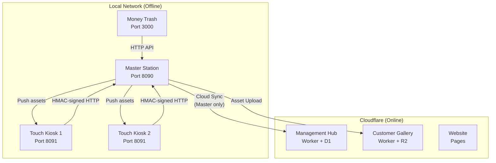

# ClickFlash — Ecosystem Architecture

## System Overview

ClickFlash is an offline-first photography management platform for resorts and event venues. The system processes, manages, and delivers high-resolution photographs exceeding 100GB per deployment.



## Application Inventory

| App | Type | Port | Runtime | Role |
|-----|------|------|---------|------|
| **Master Station** | Local (Electron) | 8090 | Express + SQLite | Photo processing, face recognition, cloud sync gateway |
| **Touch Kiosk** | Local (Electron) | 8091 | Express + SQLite | Customer-facing selection and order creation |
| **Money Trash** | Local (Tauri) | — | Tauri + React | Photo upload gateway |
| **Management Hub** | Cloud | — | Cloudflare Worker + D1 | Business analytics and centralized management |
| **Customer Gallery** | Cloud | — | Cloudflare Worker + R2 | Customer photo access and purchase |
| **Website** | Cloud | — | Cloudflare Pages | Marketing and public presence |

## Port Map

| Port | Protocol | Service |
|------|----------|---------|
| 8090 | TCP/UDP | Master Station backend + WebSocket |
| 8091 | TCP/UDP | Touch Kiosk backend + WebSocket |
| 3000 | TCP | Money Trash Uploader |
| 5173 | TCP | Master Vite dev server (dev only) |
| 5174 | TCP | Touch Vite dev server (dev only) |
| 5353 | UDP | mDNS / Bonjour service discovery |

## Directory Structure

```
ClickFlash/
├── apps/
│   ├── master/          # Master Station (Electron + Express)
│   │   ├── backend/     # Express API, routes, shared modules
│   │   ├── src/         # React frontend
│   │   └── main.js      # Electron main process
│   ├── touch/           # Touch Kiosk (Electron + Express)
│   │   ├── backend/     # Express API, order export
│   │   ├── src/         # React frontend
│   │   └── main.js      # Electron main process
│   ├── moneytrash/      # Money Trash (Next.js)
│   ├── management/      # Management Hub (Cloudflare Worker)
│   │   ├── backend/     # Worker source (wrangler)
│   │   └── src/         # React frontend
│   ├── gallery/         # Customer Gallery (Cloudflare Worker)
│   │   ├── backend/     # Worker source (wrangler)
│   │   └── src/         # React frontend
│   └── website/         # Main Website (Next.js static export)
├── packages/
│   ├── types/           # @clickflash/types — shared TypeScript types
│   └── ui/              # @clickflash/ui — shared UI components
├── scripts/             # Operational scripts (build, deploy, rotate keys)
├── docs/                # Production guides + archived dev records
├── start-all.bat        # Launch all local apps
├── kill-all.bat         # Terminate all local processes
├── install-all.bat      # Install all local dependencies
├── clean-all.bat        # Remove build artifacts
├── status.bat           # Check service status
└── scripts/deploy-cloud.ps1 # Validate and deploy canonical Cloudflare services
```

## API Routes

### Master Station (21 routes)

| Route Prefix | File | Purpose |
|-------------|------|---------|
| `/api/auth` | `auth.ts` | Login, signup, session management |
| `/api/collections` | `collections.ts` | Generic CRUD for all tables |
| `/api/cloud` | `cloud.ts` | Cloud sync status and control |
| `/api/orders` | `orders.ts` | Order fulfillment and management |
| `/api/faces` | `faces.ts` | Face recognition search and reindex |
| `/api/culling` | `culling.ts` | Photo culling and analysis |
| `/api/session-types` | `sessionTypes.ts` | Session type management |
| `/api/gallery` | `gallery.ts` | Gallery watermark generation |
| `/api/gallery-auth` | `galleryAuth.ts` | Gallery authentication |
| `/api/gallery-checkout` | `galleryCheckout.ts` | Gallery purchase flow |
| `/api/analytics` | `analytics.ts` | Analytics and reporting |
| `/api/marketing` | `marketing.ts` | Marketing campaigns |
| `/api/dashboard` | `dashboard.ts` | Dashboard widgets |
| `/api/ledger` | `ledger.ts` | Financial ledger |
| `/api/pairing` | `pairing.ts` | Kiosk pairing (QR + HMAC) |
| `/api/sync` | `sync.ts` | Offline mutation sync |
| `/api/files` | `files.ts` | File upload and management |
| `/api/system` | `system.ts` | Health, IP, printers, diagnostics |
| `/api/realtime` | `realtime.ts` | SSE real-time events |
| `/api/notification` | `notification.ts` | Customer notifications |
| `/api/assistance` | `assistance.ts` | Assistance requests |

### Touch Kiosk (8 routes)

| Route Prefix | File | Purpose |
|-------------|------|---------|
| `/api/auth` | `auth.ts` | Local authentication |
| `/api/collections` | `collections.ts` | Local data CRUD |
| `/api/orders` | `orders.ts` | Order creation |
| `/api/orders/:id/export-to-master` | `orderExport.ts` | HMAC-signed export to Master |
| `/api/files` | `files.ts` | Local asset serving |
| `/api/sync` | `sync.ts` | Sync with Master |
| `/api/system` | `system.ts` | Health and diagnostics |
| `/api/realtime` | `realtime.ts` | SSE events |

## Security Model

### LAN Communication (Phase 34)

- **HMAC-SHA256 Request Signing**: All Touch → Master requests include `X-Kiosk-ID`, `X-Timestamp`, `X-Signature` headers
- **Replay Prevention**: 5-minute timestamp window
- **Secret Management**: 32-byte signing secret generated during pairing, persisted to both Master and Touch DBs

### Network Isolation

- **Touch App**: Strict LAN-only (`setupNetworkIsolation` in `main.js`). Blocks all non-private IPs, restricts ports, strips Referer headers.
- **Master App**: Offline-first with optional cloud sync. Only Master communicates with Cloudflare.

## Synchronization Architecture

### Master ↔ Touch Kiosk (LAN)
- **Transport**: WebSocket (primary) + HTTP fallback (`/api/sync/mutation`)
- **Conflict Resolution**: Vector clocks per entity. Each mutation carries `vectorClock: { [clientId]: number }`.
- **Idempotency**: `mutation_ack_log` table keyed by `(client_id, mutation_id)`. Duplicates receive `ALREADY_APPLIED` ack without re-applying.
- **Mutation Validation**: All mutations pass through Zod schema validation before database transaction.
- **Order Sync**: Touch pushes pending orders to `/api/orders/kiosk/orders` with `clientMutationId`. Master deduplicates via `orders.client_mutation_id`.

### Master ↔ Cloud Hub
- **Transport**: HTTPS with RS256 JWT + hardware fingerprinting
- **Batching**: Operation logs are grouped by pipeline and sent in batches
- **Idempotency**: `X-Idempotency-Key` header per batch = `sha256(desk_id + pipeline + sequence_number + timestamp)`
- **Circuit Breaker**: Per-pipeline failure tracking. Global counter only resets when all 15+ pipelines succeed.
- **Retry Policy**: Exponential backoff with jitter. DLQ after 5 consecutive failures.

### Touch Offline-First
- **Local Storage**: IndexedDB (Dexie) for albums/orders cache + PocketBase for structured local backend
- **Queue**: Orders saved to IndexedDB first (never blocks), then PocketBase, then Master
- **Checkpoint/Resume**: `syncCheckpointService` tracks album/photo progress in `localStorage`. Interruptions resume from last checkpoint.
- **Conflict Flag**: If an order is edited on both Touch and Master while disconnected, Master sets `conflict_flag = 1` for staff review.

### Persistent Write Queue (Master)
- **Purpose**: Deferred database writes that survive power cycles
- **Table**: `pending_writes` — `id, table_name, record_id, payload_json, priority, status, retry_count, created_at, updated_at`
- **Flow**: `enqueue()` → INSERT into `pending_writes` → add to in-memory Map → `flush()` → UPDATE target table → DELETE from `pending_writes`
- **Recovery**: On boot, `DbWriteQueue` hydrates pending rows and immediately flushes before accepting new writes.

### Authentication

- **Master**: JWT + Express sessions, CSRF protection
- **Cloud Hub**: RS256 JWT with hardware fingerprinting
- **Gallery**: Token-based access per order

## Deployment

### Local Setup (per PC)

```
1_INSTALL.bat     → Install dependencies
2_BUILD.bat       → Build frontend + backend
3_SETUP_PC.bat    → Firewall, kiosk mode, data dirs
3_START_DEV.bat   → Development mode (hot reload)
4_START.bat       → Production mode
4_START_PROD.bat  → Production with auto-build
5_HARD_RESET.bat  → Wipe and reinstall (Master only)
```

### Cloud Deployment

```powershell
.\scripts\deploy-cloud.ps1 -Environment production -WhatIf
# Validates: Gallery, Management, MoneyTrash, and Update Workers plus Pages builds
# Applies: binding-specific D1 migrations only after explicit deployment approval
```

## Database

| Database | App | Engine | Key Tables |
|----------|-----|--------|------------|
| `master.db` | Master | SQLite (better-sqlite3) | photos, albums, orders, kiosks, settings, operation_logs, pending_writes, mutation_ack_log |
| `touch.db` | Touch | SQLite (better-sqlite3) | orders, settings, sync_state |
| `clickflash-hub-db` | Management + Gallery | Cloudflare D1 | desks, orders, photos, daily_objectives, campaigns |
