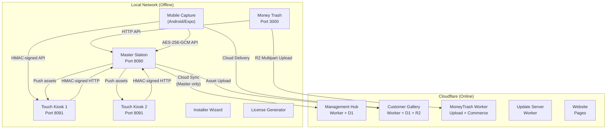

# ClickFlash — Ecosystem Architecture

## System Overview

ClickFlash is an offline-first photography management platform for resorts and event venues. The system processes, manages, and delivers high-resolution photographs exceeding 100GB per deployment.



## Application Inventory

| App | Type | Port | Runtime | Role |
|-----|------|------|---------|------|
| **master** | Desktop (Electron 39) | 8090 | Express + SQLite + React 19 | Photo processing, face recognition, cloud sync gateway, auto-editor |
| **touch** | Desktop (Electron 39) | 8091 | Express + SQLite + React 19 | Customer kiosk, order creation, offline identity |
| **moneytrash** | Desktop (Tauri 2) | 3000 | Next.js 16 + React 19 | Bulk RAW/JPEG SD ingestor, R2 multipart upload |
| **management** | Cloud (CF Pages) | — | Vite + React 19 | Business analytics, fleet management, PixelFounder AI |
| **gallery** | Cloud (CF Pages) | — | Vite + React 19 + Stripe | Customer photo gallery, magic-link auth, checkout |
| **website** | Cloud (CF Pages) | 3001 | Next.js 15 + Tailwind 4 | Marketing website, SEO |
| **installer** | Desktop (Electron 39) | — | React 19 | Studio installer wizard, Ed25519 payload verification |
| **license-generator** | Desktop (Electron 39) | — | React 19 | Offline license signing, hardware binding |
| **mobile-photographer**| Mobile (Expo) | — | React Native + Kotlin | Android Nikon D7000 USB/PTP tether, roaming capture |
| **mobile-customer** | Mobile (Expo) | — | React Native | Camera + TensorFlow.js face detection |
| **mobile-staff** | Mobile (Expo) | — | React Native | QR ticket scanner |
| **mobile-client** | Mobile (Expo) | — | React Native | Customer mobile app |
| **mcp-server** | Dev tooling | — | Node.js | MCP development server |
| **cloud-backend** | Cloud | — | Cloudflare Worker | D1 + R2 + Stripe |
| **ride-node** | Service | — | Node.js | Ride service node |
| **docs** | Documentation | — | — | Internal documentation |
| **pb_data** | Data | — | PocketBase | Legacy data layer |

## Port Map

| Port | Protocol | Service |
|------|----------|---------|
| 8090 | TCP/UDP | Master Station backend + WebSocket |
| 8091 | TCP/UDP | Touch Kiosk backend + WebSocket |
| 3000 | TCP | Money Trash Uploader |
| 3001 | TCP | Website |
| 5173 | TCP | Master Vite dev server (dev only) |
| 5174 | TCP | Touch Vite dev server (dev only) |
| 5353 | UDP | mDNS / Bonjour service discovery |

## Directory Structure

```
ClickFlash/
├── apps/
│   ├── master/                # Master Station (Electron + Express)
│   ├── touch/                 # Touch Kiosk (Electron + Express)
│   ├── moneytrash/            # Money Trash (Tauri + Next.js)
│   ├── management/            # Management Hub (Vite + React)
│   ├── gallery/               # Customer Gallery (Vite + React)
│   ├── website/               # Main Website (Next.js)
│   ├── installer/             # Studio installer wizard (Electron)
│   ├── license-generator/     # Offline license signing (Electron)
│   ├── mobile-photographer/   # Android Nikon tether app (Expo)
│   ├── mobile-customer/       # Customer camera app (Expo)
│   ├── mobile-staff/          # Staff QR scanner app (Expo)
│   ├── mobile-client/         # Customer mobile app (Expo)
│   ├── mcp-server/            # MCP dev tooling
│   ├── cloud-backend/         # Cloudflare Worker backend
│   ├── ride-node/             # Ride service node
│   ├── docs/                  # Internal documentation
│   └── pb_data/               # Legacy data layer
├── packages/
│   ├── api/                   # Shared API clients
│   ├── config/                # Centralized configuration
│   ├── database/              # Database schema and utilities
│   ├── errors/                # Error handling classes
│   ├── licensing/             # Ed25519 licensing logic
│   ├── logger/                # Structured logger
│   ├── shared/                # Shared utilities
│   ├── telemetry-web/         # Web telemetry
│   ├── test-utils/            # Testing helpers
│   ├── types/                 # TypeScript interfaces
│   ├── ui/                    # Shared React UI components
│   ├── utils/                 # General utilities
│   └── validation/            # Zod validation schemas
├── workers/
│   ├── gallery-worker/        # D1 + R2 + Stripe
│   ├── management-worker/     # D1 backend
│   ├── moneytrash-worker/     # Upload + Commerce
│   └── update-server/         # Auto-updater worker
├── services/
│   ├── master-cpp/            # Qt6/C++ native helpers
│   └── platform/              # Cross-platform abstractions
├── scripts/                   # Operational scripts (build, deploy, rotate keys)
├── docs/                      # Production guides + archived dev records
└── ...
```

## API Routes

### Master Station

| Route Prefix | File | Purpose |
|-------------|------|---------|
| `/api/auth` | `auth.ts` | Login, signup, session management |
| `/api/collections` | `collections.ts` | Generic CRUD for all tables |
| `/api/cloud` | `cloud.ts` | Cloud sync status and control |
| `/api/orders` | `orders.ts` | Order fulfillment and management |
| `/api/faces` | `faces.ts` | Face recognition search and reindex |
| `/api/culling` | `culling.ts` | Photo culling and analysis |
| `/api/session-types` | `sessionTypes.ts` | Session type management |
| `/api/gallery` | `gallery.ts` | Gallery watermark generation |
| `/api/gallery-auth` | `galleryAuth.ts` | Gallery authentication |
| `/api/gallery-checkout` | `galleryCheckout.ts` | Gallery purchase flow |
| `/api/analytics` | `analytics.ts` | Analytics and reporting |
| `/api/marketing` | `marketing.ts` | Marketing campaigns |
| `/api/dashboard` | `dashboard.ts` | Dashboard widgets |
| `/api/ledger` | `ledger.ts` | Financial ledger |
| `/api/pairing` | `pairing.ts` | Kiosk pairing (QR + HMAC) |
| `/api/sync` | `sync.ts` | Offline mutation sync |
| `/api/files` | `files.ts` | File upload and management |
| `/api/system` | `system.ts` | Health, IP, printers, diagnostics |
| `/api/realtime` | `realtime.ts` | SSE real-time events |
| `/api/notification` | `notification.ts` | Customer notifications |
| `/api/assistance` | `assistance.ts` | Assistance requests |
| `/api/mobile-capture/*` | `mobileCapture.ts` | Mobile photographer API routes |
| `/api/photographer` | `photographer.ts` | Photographer command center routes |

### Touch Kiosk

| Route Prefix | File | Purpose |
|-------------|------|---------|
| `/api/auth` | `auth.ts` | Local authentication |
| `/api/collections` | `collections.ts` | Local data CRUD |
| `/api/orders` | `orders.ts` | Order creation |
| `/api/orders/:id/export-to-master` | `orderExport.ts` | HMAC-signed export to Master |
| `/api/files` | `files.ts` | Local asset serving |
| `/api/sync` | `sync.ts` | Sync with Master |
| `/api/system` | `system.ts` | Health and diagnostics |
| `/api/realtime` | `realtime.ts` | SSE events |

### MoneyTrash Worker

| Route Prefix | Purpose |
|-------------|---------|
| `/api/upload` | Multipart R2 upload endpoint |
| `/api/commerce` | Commerce and transactional routes |

## Security Model

### LAN Communication (Phase 34)

- **HMAC-SHA256 Request Signing**: All Touch → Master requests include `X-Kiosk-ID`, `X-Timestamp`, `X-Signature` headers
- **AES-256-GCM Encrypted Transport (SEC-007)**: Mobile to Master APIs utilize AES-256-GCM encryption for payload protection
- **HKDF-SHA256 Key Derivation**: Standard key derivation for secure multi-device communication
- **Replay Prevention**: 5-minute timestamp window
- **Secret Management**: 32-byte signing secret generated during pairing, persisted to both Master and Touch DBs

### Licensing (Ed25519)

- **Offline License Verification**: Installer and desktop apps use Ed25519 payload verification for hardware binding and offline licensing validation.

### Network Isolation

- **Touch App**: Strict LAN-only (`setupNetworkIsolation` in `main.js`). Blocks all non-private IPs, restricts ports, strips Referer headers.
- **Master App**: Offline-first with optional cloud sync. Only Master communicates with Cloudflare.

## Synchronization Architecture

### Master ↔ Touch Kiosk (LAN)
- **Transport**: WebSocket (primary) + HTTP fallback (`/api/sync/mutation`)
- **Conflict Resolution**: Vector clocks per entity. Each mutation carries `vectorClock: { [clientId]: number }`.
- **Idempotency**: `mutation_ack_log` table keyed by `(client_id, mutation_id)`. Duplicates receive `ALREADY_APPLIED` ack without re-applying.
- **Mutation Validation**: All mutations pass through Zod schema validation before database transaction.
- **Order Sync**: Touch pushes pending orders to `/api/orders/kiosk/orders` with `clientMutationId`. Master deduplicates via `orders.client_mutation_id`.

### Mobile Capture ↔ Ecosystem
- **Mobile → Master**: AES-256-GCM encrypted API channel for immediate tethered photo offloading.
- **Mobile → Kiosk**: Direct HMAC-signed interaction when the Master is unreachable or for specific distributed workflows.
- **Mobile → Cloud**: Direct fallback delivery lane to Customer Gallery or Hub if local network degrades.

### Master ↔ Cloud Hub
- **Transport**: HTTPS with RS256 JWT + hardware fingerprinting
- **Batching**: Operation logs are grouped by pipeline and sent in batches
- **Idempotency**: `X-Idempotency-Key` header per batch = `sha256(desk_id + pipeline + sequence_number + timestamp)`
- **Circuit Breaker**: Per-pipeline failure tracking. Global counter only resets when all 15+ pipelines succeed.
- **Retry Policy**: Exponential backoff with jitter. DLQ after 5 consecutive failures.

### Touch Offline-First
- **Local Storage**: IndexedDB (Dexie) for albums/orders cache + PocketBase for structured local backend
- **Queue**: Orders saved to IndexedDB first (never blocks), then PocketBase, then Master
- **Checkpoint/Resume**: `syncCheckpointService` tracks album/photo progress in `localStorage`. Interruptions resume from last checkpoint.
- **Conflict Flag**: If an order is edited on both Touch and Master while disconnected, Master sets `conflict_flag = 1` for staff review.

### Persistent Write Queue (Master)
- **Purpose**: Deferred database writes that survive power cycles
- **Table**: `pending_writes` — `id, table_name, record_id, payload_json, priority, status, retry_count, created_at, updated_at`
- **Flow**: `enqueue()` → INSERT into `pending_writes` → add to in-memory Map → `flush()` → UPDATE target table → DELETE from `pending_writes`
- **Recovery**: On boot, `DbWriteQueue` hydrates pending rows and immediately flushes before accepting new writes.

### Authentication

- **Master**: JWT + Express sessions, CSRF protection
- **Cloud Hub**: RS256 JWT with hardware fingerprinting
- **Gallery**: Token-based access per order

## Licensing Architecture

The licensing system provides a robust, zero-trust offline mechanism:
- Uses Ed25519 asymmetric cryptography.
- `license-generator` signs JSON payloads combining features, limits, and hardware binding IDs (MAC address / Disk serials).
- Applications like `master` and `installer` verify signatures at runtime using hardcoded public keys.

## Desktop Packaging

- **master & touch**: Packaged via Electron 39 using standard native Node.js addons and SQLite drivers.
- **moneytrash**: Leverages Tauri 2 + Rust backend to efficiently ingest massive SD card payloads and multipart upload them directly to R2.
- **installer**: Electron 39 wizard ensuring required environment, dependencies, and valid studio licenses are present before setup.
- **master-cpp**: Integrates via native IPC/N-API to offload intensive tasks (face recognition processing, hardware PTP polling).

## Worker Architecture

- **gallery-worker**: Handles dynamic watermarking, magic-link generation, Stripe webhooks, and direct D1 queries.
- **management-worker**: Central hub logic, aggregating D1 telemetry, processing fleet updates.
- **moneytrash-worker**: R2 presigned URLs, multipart part assembly, commerce notifications.
- **update-server**: Serves delta updates for desktop apps based on version telemetry.

## Deployment

### Local Setup (per PC)

```
1_INSTALL.bat     → Install dependencies
2_BUILD.bat       → Build frontend + backend
3_SETUP_PC.bat    → Firewall, kiosk mode, data dirs
3_START_DEV.bat   → Development mode (hot reload)
4_START.bat       → Production mode
4_START_PROD.bat  → Production with auto-build
5_HARD_RESET.bat  → Wipe and reinstall (Master only)
```

### Cloud Deployment

```powershell
.\scripts\deploy-cloud.ps1 -Environment production -WhatIf
# Validates: Gallery, Management, MoneyTrash, and Update Workers plus Pages builds
# Applies: binding-specific D1 migrations only after explicit deployment approval
```

## Database

| Database | App | Engine | Key Tables |
|----------|-----|--------|------------|
| `master.db` | Master | SQLite (better-sqlite3) | photos, albums, orders, kiosks, settings, operation_logs, pending_writes, mutation_ack_log |
| `touch.db` | Touch | SQLite (better-sqlite3) | orders, settings, sync_state |
| `mobile.db` | Mobile | SQLite | local_cache, capture_queue |
| `clickflash-hub-db` | Management | Cloudflare D1 | desks, orders, photos, daily_objectives, campaigns |
| `gallery-db` | Gallery | Cloudflare D1 | sessions, purchases, links |
| `moneytrash-db` | MoneyTrash | Cloudflare D1 | uploads, events, sd_cards |
| `clickflash-website-db` | Website | Cloudflare D1 | leads, analytics |
