# ClickFlash Ecosystem Map (V4.0 Architecture Specification)

```
========================================================================================
           CLICKFLASH V4 ENTERPRISE AUTONOMOUS CONCESSION ECOSYSTEM MAP
========================================================================================
```

## 1. Monorepo Topology Overview

```mermaid
graph TB
    subgraph "Edge Resort Appliance (Port 8090)"
        Master["apps/desktop/master<br/>(Electron 39 + Node 22 + Fastify)"]
        MasterCpp["services/master-cpp<br/>(High-Perf C++ Ingest)"]
        SQLite["SQLite WAL<br/>(Encrypted SQLCipher)"]
        SDAuto["Zero-Click SD Auto-Ingest"]
        PrintSpool["Thermal Print Spooler<br/>(Win32 GDI)"]
        
        Master --> SQLite
        Master --> SDAuto
        Master --> PrintSpool
        MasterCpp -.-> SQLite
    end

    subgraph "Touch Kiosk Fleet (Port 8091)"
        Touch["apps/desktop/touch<br/>(Electron 39 + React 19)"]
        TouchSync["TouchSyncClient<br/>(WebRTC P2P + HTTP Fallback)"]
        TouchLocal["Local Upload Cache"]
        Gesture["MediaPipe Gesture Nav"]
        
        Touch --> TouchSync
        Touch --> TouchLocal
        Touch --> Gesture
    end

    subgraph "Operations & Command Center (Port 5175)"
        Management["apps/management<br/>(Vite + React 19 + Radix UI)"]
        Studio["Ingestion Studio"]
        AgentStudio["AI Agent Studio & Swarm"]
        WebRTCGrid["Live Video Dispatch Grid"]
        
        Management --> Studio
        Management --> AgentStudio
        Management --> WebRTCGrid
    end

    subgraph "Mobile Platforms"
        MobilePro["apps/mobile/pro<br/>(Expo React Native + Rust)"]
        MobileConsumer["apps/mobile/consumer<br/>(Expo React Native + PassKit)"]
    end

    subgraph "Guest Web Experience (Ports 5176 - 5178)"
        Gallery["apps/gallery<br/>(React 19 + 3D Holographic)"]
        SelfService["apps/self-service<br/>(PWA + Biometric Linking)"]
        PhotographerPortal["apps/photographer-portal<br/>(WASM Edge Ingest)"]
    end

    subgraph "Cloud & AI Infrastructure"
        CloudBackend["apps/backend/cloud-backend<br/>(Cloudflare Workers + D1 + R2)"]
        AIWorker["apps/backend/ai-worker<br/>(FastAPI + SAM3 + ArcFace)"]
        MCPServer["apps/backend/mcp-server<br/>(MCP 104 Domain Tools)"]
    end

    subgraph "Shared Packages Layer"
        PkgAI["@clickflash/ai"]
        PkgAICore["@clickflash/ai-core"]
        PkgTypes["@clickflash/types"]
        PkgUI["@clickflash/ui"]
        PkgLogger["@clickflash/logger"]
        PkgErrors["@clickflash/errors"]
        PkgValidation["@clickflash/validation"]
        PkgUtils["@clickflash/utils"]
        PkgLicensing["@clickflash/licensing"]
        PkgWasmSharpness["@clickflash/wasm-sharpness"]
    end

    %% Network & Data Flows
    Master <== "WebRTC P2P / LAN HTTP" ==> TouchSync
    Master <== "LAN WebSocket / REST (8090)" ==> Management
    MobilePro <== "LAN Ingest / Offline Sync" ==> Master
    Master <== "Cloud Sync / Yield Webhook" ==> CloudBackend
    Management <== "MCP Orchestration" ==> MCPServer
    Master <== "Inpainting / SAM3" ==> AIWorker
    SelfService <== "Instant Pass Sync" ==> CloudBackend
    Gallery <== "Asset Streaming" ==> CloudBackend
    
    %% Package Dependencies
    Master --> PkgTypes
    Master --> PkgLogger
    Master --> PkgErrors
    Touch --> PkgUI
    Management --> PkgAI
    Management --> PkgUI
    CloudBackend --> PkgTypes
```



---

## 2. Application Directory Inventory (14 Projects)

| Application | Path | Technology | Primary Role |
|---|---|---|---|
| **Master Edge Station** | `apps/desktop/master` | Electron 39, Node 22, Fastify, SQLCipher | Headless/Interactive Edge Node (Port 8090), Ingestion Engine, GDI Print Spooler |
| **Touch Kiosk** | `apps/desktop/touch` | Electron 39, React 19, Tailwind CSS | Guest Touch Kiosk (Port 8091), MediaPipe gestures, Attract Screensaver |
| **Management Hub** | `apps/management` | Vite, React 19, Radix UI, Lucide | HQ & Concession Command Center (Port 5175), WebRTC Tracking, Ingestion Studio |
| **Guest Self-Service** | `apps/self-service` | Vite, React 19, PWA | Guest Self-Service PWA (Port 5177), Instant Downloads, Biometric Linking |
| **Photographer Portal** | `apps/photographer-portal` | Vite, React 19, WASM | Zero-Install Edge Web Uploader for Freelance Photographers (Port 5178) |
| **Holographic Gallery** | `apps/gallery` | React 19, Tailwind, Stripe, WebGL | 3D Holographic Gallery Showcase (Port 5176), Looking Glass Light Field |
| **Desktop Installer** | `apps/desktop/installer` | Electron 39, TypeScript | Cross-Platform Desktop Installer & Auto-Updater Generator |
| **License Generator** | `apps/desktop/license-generator` | Electron 39, Ed25519 Crypto | Cryptographic Hardware-Locked License Generator |
| **Mobile Pro** | `apps/mobile/pro` | Expo React Native, Rust Core, WebRTC | Roving Photographer Field App, UWB/BLE Beacon, Offline Sync |
| **Mobile Consumer** | `apps/mobile/consumer` | Expo React Native, Apple PassKit | Guest Mobile Pass, BLE Proximity Linking, NLP Smart Search |
| **Cloud Backend** | `apps/backend/cloud-backend` | Cloudflare Worker, D1, R2, Queues | Edge API, Dynamic Yield Pricing, Ingest & Webhooks |
| **MCP Server** | `apps/backend/mcp-server` | Model Context Protocol SDK | Autonomous AI Agent Studio Toolchain & Automation Engine (104 tools) |
| **AI Worker** | `apps/backend/ai-worker` | FastAPI, Python, ONNX, PyTorch | Local/Cloud Computer Vision, ArcFace & SAM3 Inferencing |
| **C++ Master Core** | `services/master-cpp` | C++20, CMake, SQLite | Ultra-high performance native image ingest alternative |

---

## 3. Shared Packages Layer (11 Packages)

| Package | Path | Purpose | Key Exports |
|---|---|---|---|
| `@clickflash/ai` | `packages/ai` | Gemini AI integration & prompts | `GeminiClient`, `PromptBuilder`, `SemanticSearch` |
| `@clickflash/ai-core` | `packages/ai-core` | Vector mathematics & normalization | `normalizeL2`, `euclideanDistance`, `cosineSimilarity` |
| `@clickflash/types` | `packages/types` | Canonical domain data contracts | `Photo`, `Album`, `Kiosk`, `User`, `Order`, `YieldOffer` |
| `@clickflash/ui` | `packages/ui` | Shared luxury glassmorphic components | `Button`, `StatCard`, `Badge`, `GaussianSplatViewer` |
| `@clickflash/logger` | `packages/logger` | Structured JSON Winston logging | `logger`, `Logger`, `createChildLogger` |
| `@clickflash/errors` | `packages/errors` | AppError taxonomy & error codes | `AppError`, `NotFoundError`, `UnauthorizedError` |
| `@clickflash/validation` | `packages/validation` | Zod schemas & runtime guards | `photoSchema`, `albumSchema`, `kioskSchema` |
| `@clickflash/utils` | `packages/utils` | General utilities & formatters | `formatCurrency`, `formatDate`, `calculateYieldPrice` |
| `@clickflash/telemetry-web` | `packages/telemetry-web` | Client-side metrics tracking | `trackEvent`, `initTelemetry` |
| `@clickflash/licensing` | `packages/licensing` | Ed25519 license verification | `verifyLicense`, `validateHardwareFingerprint` |
| `@clickflash/wasm-sharpness` | `packages/wasm-sharpness` | Rust WebAssembly Sobel sharpness | `computeSharpnessScore` |

---

## 4. Architectural Boundaries & Invariants

1. **Biometric Air-Gap (ADR-012 / GDPR Art. 9 / BIPA)**:
   - ArcFace 512D biometric vectors reside exclusively in encrypted SQLCipher storage on the Master appliance.
   - Vector embeddings are NEVER emitted in `metadata.json`, WebSocket messages, or unencrypted LAN sync.
   - Touch kiosks receive only opaque face identifiers (`faceId: string`) without coordinate vectors.

2. **Zero Camera-Card Deletion Invariant**:
   - `importFromRemovableDrive` uses `fs.promises.copyFile` exclusively.
   - Neither `fs.unlinkSync`, `fs.promises.unlink`, nor `rmdir` can be called against any file on a removable drive.

3. **Hybrid Appliance Topology (ADR-012)**:
   - On physical Windows cash-desk appliances, Master runs inside Windows Interactive Session 1 to ensure Win32 GDI thermal printing contexts and WPD USB camera arrival message pumps (`WM_DEVICECHANGE`) remain active.
   - On Linux servers and cloud containers, Fastify backend runs as a headless service.

4. **Deterministic Concurrency & Concurrency Limiting**:
   - Kiosk file transfers and photo processing utilize `limitConcurrency(8)` to prevent disk thrashing.
   - Vitest runs under `pool: 'forks'` on Windows to isolate native C++ SQLite addons from Node worker-thread memory crashes.
