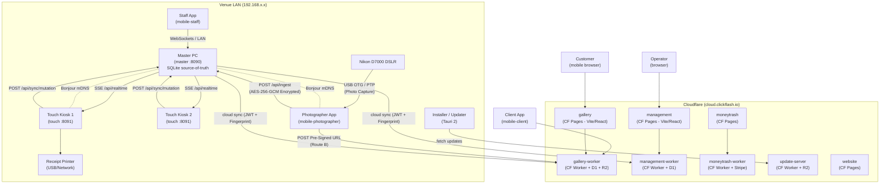
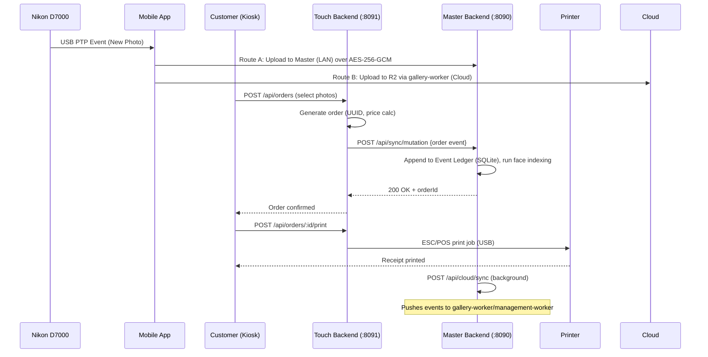
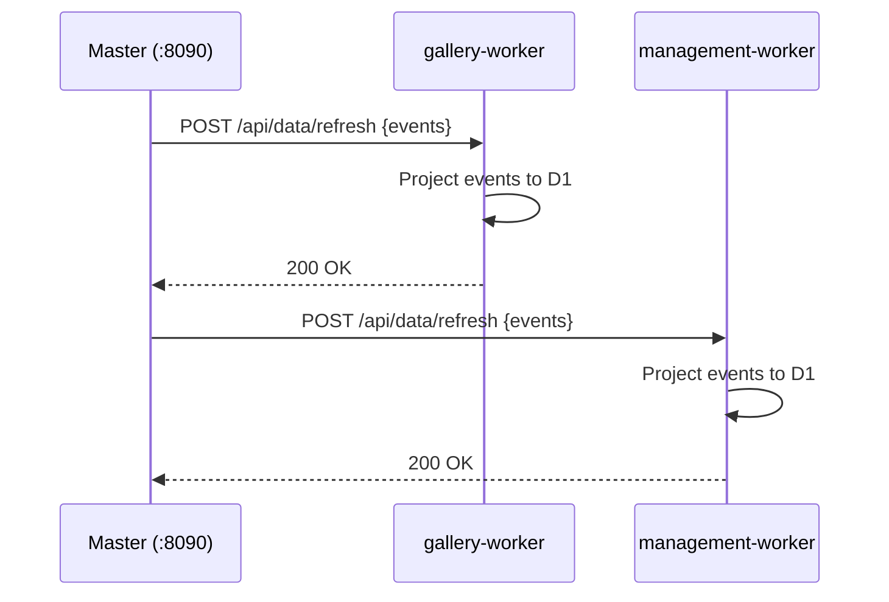

# ClickFlash — System Architecture

## Overview

ClickFlash is a multi-app photobooth platform. The system consists of:

| App | Runtime | Port | Deployment |
|-----|---------|------|------------|
| **master** | Electron 39 + Express | 8090 | Windows desktop (.exe) |
| **touch** | Electron 39 + Express | 8091 | Windows desktop (.exe) |
| **gallery** | Vite + React 19 (SPA) | — | Cloudflare Pages |
| **management** | Vite + React 19 (SPA) | — | Cloudflare Pages |
| **moneytrash** | Next.js 16 + Tauri 2 | 3000 | Windows desktop (.exe) |
| **website** | Static / Next.js 16 | 3001 | Cloudflare Pages |
| **installer** | Tauri 2 + Rust | — | Windows native installer (.exe) |
| **license-generator** | Next.js 15 | — | Cloudflare Pages |
| **master-cpp** | Qt6 + C++ | — | Windows native binary |
| **mobile-photographer**| Expo / React Native | — | Android APK/AAB |
| **mobile-staff** | Expo / React Native | — | Android APK/AAB |
| **mobile-client** | Expo / React Native | — | iOS / Android App |

---

## Worker Architecture

The Cloudflare Workers ecosystem manages cloud routing, syncing, and external access:

- **gallery-worker**: Handles scoped JWT generation, queries to D1 for photo orders, and serving pre-signed R2 URLs for customers.
- **management-worker**: Facilitates remote studio management, syncing with Master, and D1 writes for bookings and configurations.
- **moneytrash-worker**: Backend logic for the MoneyTrash app, verifying API keys and communicating with Stripe.
- **update-server**: Manages OTA updates and binaries distribution for Windows Electron/Tauri clients and Android APKs.

All workers bind to **Cloudflare D1** (SQLite) and **Cloudflare R2** (Blob Storage).

---

## Event Ledger Architecture

The system uses an **append-only, trigger-protected Event Ledger** to ensure a reliable source-of-truth across offline and online components.

- All mutations (orders, photo creations, settings changes) are appended as immutable events in the local SQLite database.
- SQLite triggers protect the ledger against arbitrary updates or deletions.
- The sync engine reads the ledger to determine diffs for Cloudflare D1 synchronization.
- Workers ingest event batches from Master and project them into the D1 read-models.

---

## Licensing Architecture

ClickFlash uses a 100% custom, offline-capable licensing system based on **Ed25519** public-key cryptography.

- `license-generator` creates Ed25519-signed license keys using a private key kept securely offline or in a secure environment.
- The license contains hardware fingerprinting data and the studio's limits.
- `master` and `touch` verify the signature locally using the embedded Ed25519 public key.
- No paid SaaS or external servers are required for license validation, ensuring local kiosk functionality even without internet access.

---

## Network Topology



---

## Data Flow — Photo Capture to Print



---

## Data Flow — Sync (Master → Cloud)



---

## Authentication Model

| App | Method | Storage | Notes |
|-----|--------|---------|-------|
| master | JWT (bcrypt) | localStorage | Admin only, Electron context |
| touch | JWT (bcrypt) | localStorage | Kiosk operator login |
| gallery | Scoped JWT via Worker | D1 / CF Worker | Customer via order credentials |
| management | JWT (bcrypt) | localStorage | Operator, CF Worker target |
| moneytrash | API key + JWT | httpOnly cookie | Hotel API keys / Stripe |
| mobile-photographer | PIN / JWT | AsyncStorage | Secure device-bound auth |

---

## Module Map

```mermaid
graph LR
    subgraph master["apps/master (Electron)"]
        ME[electron-main.js] --> MB[backend/server.ts]
        MB --> MDB[(SQLite\nEvent Ledger)]
        MB --> MW[workers/\nphotoWorker\nfolderWorker]
        MB --> MS[shared/\nmigrations x59]
        ME --> MR[React 19 SPA]
    end

    subgraph touch["apps/touch (Electron)"]
        TE[main.js] --> TB[backend/server.ts]
        TB --> TDB[(SQLite\npb_data/db.sqlite)]
        TB --> TR[React 19 SPA]
        TB --> TDX[Dexie offline store]
    end

    subgraph mobile["apps/mobile-photographer"]
        MobTether[PtpTetherModule.kt] --> MobRouter[PhotoRouter.ts]
        MobRouter --> MR
    end

    subgraph gallery["apps/gallery-worker (Cloudflare Worker)"]
        GWB[src/index.ts] --> GDB[(D1 Database)]
        GWB --> GR2[(R2 Storage)]
    end

    subgraph management["apps/management-worker (Cloudflare Worker)"]
        MWB[src/index.ts] --> MDB2[(D1 Database)]
    end

    MobRouter -->|POST /api/ingest (AES-256-GCM)| MB
    MB -->|POST /api/sync/mutation| TB
    TB -->|POST /api/cloud/sync via Master| GWB
    TB -->|POST /api/cloud/sync via Master| MWB
```
