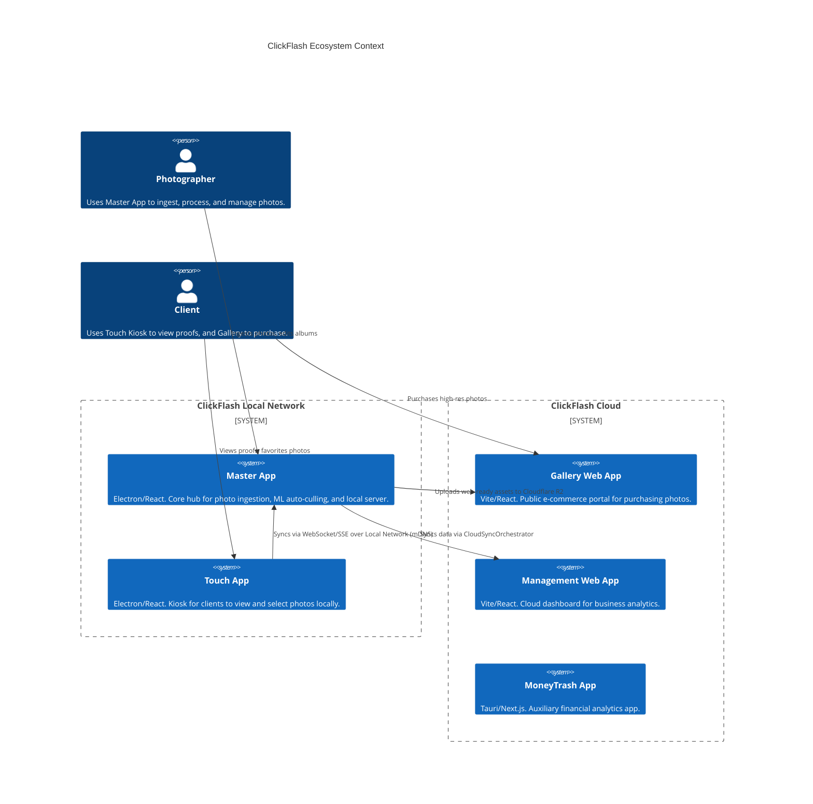

# Comprehensive Architecture Map

This document outlines the macro-architecture of the ClickFlash ecosystem, mapping data flows, IPC boundaries, and network interactions.

## C4 Container Context

## Data Flow & Network Interactions

1. **Master <-> Touch (Local Network)**
   - The Master App discovers the Touch App via `mDNS` (`mdnsDiscovery.ts`).
   - Real-time synchronization is handled via WebSockets (`websocket.ts`, `socketWorker.ts`).
   - The Touch App uses an `OfflineQueue.ts` to manage state if the local network drops.

2. **Master <-> Gallery (Cloud)**
   - The Master App processes RAW images using `photoProcessor.ts` and `WorkerPool.ts`.
   - It generates watermarked previews and uploads them to Cloudflare R2 via `TransferService.ts`.
   - The Gallery App fetches these assets and validates purchases via a D1 database (`server.ts`, `useCloudflareApi.ts`).

3. **Master <-> Management (Cloud Sync)**
   - The `CloudSyncOrchestrator.ts` in the Master App pushes business metrics and album metadata to the Management App.
   - The Management App provides a unified dashboard (`SystemHealthWidget.tsx`, `SyncLogViewer.tsx`).

## Inter-Process Communication (IPC)

The Electron apps (Master, Touch, Installer) rely heavily on IPC for secure communication between the renderer and main processes.
- `master/electron-main.ts` sets up the primary handlers for file system access, hardware tethering, and SQLite access.
- `touch/main.ts` handles kiosk-specific lockdown commands and local storage.

## Database Topography

- **Local:** The Master and Touch apps heavily utilize local `SQLite` (`better-sqlite3-multiple-ciphers`) for fast, offline-first data storage.
- **Cloud:** The Gallery and Management apps use Cloudflare `D1` (Serverless SQLite) for distributed data access.

> [!NOTE]
> The extensive use of SQLite both locally and in the cloud (via D1) creates a highly cohesive but potentially constrained ecosystem. See the Bottlenecks report for a deeper analysis.
