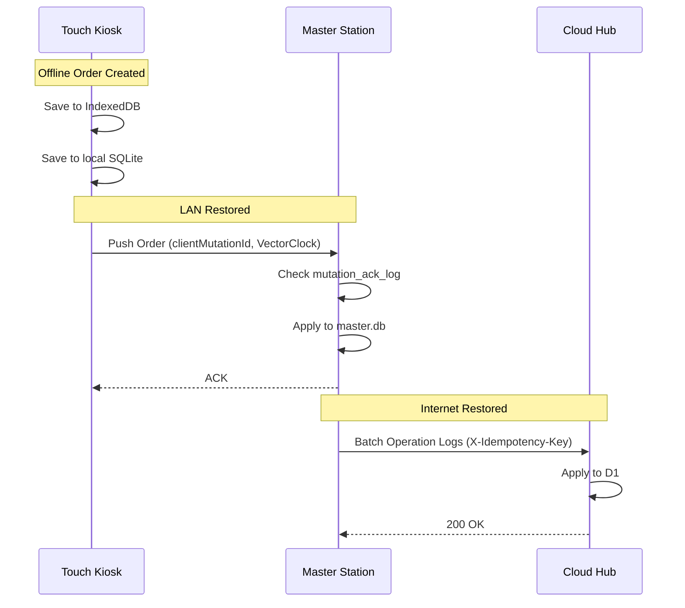

# ClickFlash Ecosystem Deep Dive

This document provides an in-depth technical analysis of the ClickFlash ecosystem, an offline-first photography business operating system designed to process 100GB+ of photos per deployment in low-connectivity environments.

## 1. Executive Summary & Philosophy

ClickFlash operates on a fundamental principle: **Local SQLite is the source of truth; the cloud is a replica. The user never waits for the network.**
The system is built for resorts and event venues where internet connectivity is unreliable or non-existent during peak operations. It achieves high availability through robust local networking and background syncing mechanisms.

---

## 2. Application Inventory & Monorepo Structure

The ecosystem is structured as a Turborepo monorepo with shared packages for validation, configuration, and testing.

| Application | Type | Tech Stack | Role |
|-------------|------|------------|------|
| **Master Station** | Local App | Electron, React 19, Express | Core processor (culling, AI face recognition), cloud gateway. |
| **Touch Kiosk** | Local App | Electron, React 19, Express | Customer-facing terminal for browsing and ordering. Strict LAN-only. |
| **Money Trash** | Local App | Tauri, React 16 | High-throughput photo upload gateway. |
| **Management Hub** | Cloud | Cloudflare Worker + D1 | Global multi-tenant fleet management and analytics. |
| **Customer Gallery**| Cloud | Cloudflare Worker + R2 | Public photo delivery and Stripe checkout portal. |
| **Website** | Cloud | Next.js 15 (Pages) | Marketing and SEO presence. |
| **Master-cpp** | Service | Drogon (C++) | High-performance opt-in headless backend replacing Node.js Express. |

---

## 3. Offline-First Synchronization Architecture

The synchronization architecture is the core engineering feat of ClickFlash, dealing with eventual consistency across frequently disconnected nodes.

### Local Sync (Master ↔ Touch)
*   **Transport:** WebSockets are the primary transport with an HTTP fallback.
*   **Conflict Resolution:** Relies on **Vector Clocks** tracked per entity (`vectorClock: { [clientId]: number }`) and Last-Write-Wins (LWW) timestamp tiebreakers.
*   **Idempotency:** Mutations are tracked in a `mutation_ack_log` table keyed by `(client_id, mutation_id)`. Duplicate mutations are silently acknowledged.
*   **Data Flow:** Orders created on a Touch kiosk are saved to IndexedDB first (never blocking the UI), pushed to PocketBase/SQLite, and then synced to the Master.

### Global Sync (Master ↔ Cloud)
*   **Cycle:** Executes every 60 seconds.
*   **Pipeline Strategy:** Syncing is divided into 15+ specialized pipelines (e.g., `syncLedgerEntries`, `uploadHighRes`).
*   **Reliability:** Implements an exponential backoff circuit breaker. If a pipeline fails 5 consecutive times, operations are moved to a Dead Letter Queue (DLQ).
*   **Power-Loss Protection:** Uses a `pending_writes` SQLite table in WAL mode to queue operations. Upon boot, the `DbWriteQueue` hydrates these rows before accepting any new writes.

---

## 4. Multi-Layered Security Model

Security is applied using a defense-in-depth strategy, isolating failures so a compromised kiosk does not yield cloud access.

### Electron Hardening
*   **Strict Isolation:** `nodeIntegration` is disabled, `contextIsolation` and `sandbox` are enabled.
*   **IPC Bridge:** The preload script strictly whitelists channels (e.g., `kiosk:unlock`). Unauthorized channel access throws synchronous errors.
*   **Content Security Policy:** Rejects all iframes, objects, and remote scripts. Assets are served via a custom, encrypted `clickflash://` protocol.

### LAN Communication Security
*   **HMAC-SHA256 Request Signing:** Touch kiosks sign every HTTP request using a 32-byte `signingSecret` generated during the QR-based pairing process.
*   **Replay Prevention:** A strict 5-minute timestamp window prevents packet capture replay attacks.
*   **Network Isolation:** The Touch App explicitly drops all requests to non-private IPs (e.g., blocks outbound traffic outside of `192.168.x.x`).

### Data at Rest & Encryption
*   **Database (SQLCipher):** Local SQLite databases can be encrypted using AES-256 via SQLCipher, with keys stored safely in the OS keychain (DPAPI/Keychain).
*   **Cloud Storage (R2):** Buckets are private by default. Assets are shared via 15-minute time-limited presigned URLs.
*   **Backups:** Local backups are encrypted with AES-256-GCM before offsite transfer.

---

## 5. Database & Multi-Tenancy Strategy

While the local applications use `better-sqlite3`, the cloud utilizes Cloudflare D1. Since D1 lacks native Row-Level Security (RLS), ClickFlash enforces multi-tenancy at the application layer.

*   **Tenant Context:** Every cloud request is scoped to a `TenantContext` containing a `desk_id`.
*   **Query Interception:** A custom query builder parses SQL queries and forcefully injects `WHERE desk_id = '...'` to prevent cross-tenant data leakage.

## 6. Strategic Pivot: Master-Cpp

Initially built as a Qt6 desktop application, the C++ backend (`master-cpp`) is undergoing a strategic pivot to **Drogon**, a high-performance C++ web framework.
*   **Reasoning:** The Qt6 UI was incompatible with the Electron React frontend. Moving to Drogon allows the C++ engine to run headlessly, offering a massive performance boost for image processing and handling thousands of concurrent requests while maintaining API parity with the Node.js Express backend.
*   **Switching:** The React frontend automatically detects if the C++ backend is running on port 8090 and routes API traffic accordingly.

## 7. GDPR & Compliance

The `GdprService` runs inside the Master Station to manage strict European privacy compliance:
*   **Consent:** Explicit consent logs are attached to individual `photo_id`s.
*   **Right to Erasure:** A single API call triggers hard deletion across `photos`, `orders`, and `customers`, recorded in an immutable `data_deletion_logs` table.
*   **Auto-Purge:** A daily background job wipes unsold photos and aged customer data according to `gdpr_retention_years` configurations.
