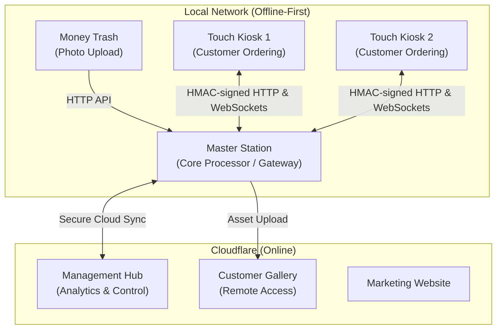

# ClickFlash Ecosystem Explanation

This document provides a breakdown of the entire ClickFlash ecosystem, analyzing its architecture, data flow, and key components.

## High-Level Summary and Flow

**ClickFlash** is an offline-first photography management platform designed for resorts and event venues where internet connectivity may be unreliable. It is capable of processing, managing, and delivering massive volumes of high-resolution photographs (exceeding 100GB per deployment).

The system operates across two distinct domains that synchronize when a connection is available:
1.  **Local Network (Offline-First):** The heavy lifting—photo processing, face recognition, and on-site customer selection—happens here. It consists of a central **Master Station**, multiple **Touch Kiosks** for customers, and a **Money Trash** upload gateway.
2.  **Cloud Infrastructure (Online):** Powered by Cloudflare, this domain handles centralized management, remote customer galleries, and public marketing. The Master Station acts as the single gateway connecting the local network to the cloud.

## Step-by-Step Walkthrough of Key Components

### 1. The Local Environment (The Edge)
*   **Master Station (Port 8090):** This is the brain of the local deployment. Built with Electron, React, Express, and SQLite, it handles the intense workloads: photo culling, facial recognition, and acting as the exclusive sync gateway to the cloud.
*   **Touch Kiosk (Port 8091):** These are customer-facing terminals. Also built with Electron, React, and Express, they allow guests to browse their photos and create orders. To ensure reliability, they are completely offline-capable, caching data locally and synchronizing with the Master Station when connected.
*   **Money Trash (Port 3000):** A lightweight Tauri + React application dedicated strictly to acting as a photo upload gateway, funneling raw assets into the Master Station.

### 2. The Cloud Environment (Cloudflare)
*   **Management Hub (Worker + D1):** A centralized hub for business analytics and multi-venue management, utilizing Cloudflare Workers for compute and D1 (SQLite) for the database.
*   **Customer Gallery (Worker + R2):** The online portal where customers can view, download, and purchase their photos after leaving the venue. It uses Cloudflare R2 for cost-effective asset storage.
*   **Website (Pages):** A Next.js statically exported site hosted on Cloudflare Pages for marketing.

## Architecture Diagram

## Security & Synchronization Mechanisms

*   **LAN Security:** Communication between the Touch Kiosks and the Master Station is secured using HMAC-SHA256 request signing with a 5-minute timestamp window to prevent replay attacks.
*   **Vector Clock Sync:** Because Kiosks can go offline, synchronization uses vector clocks and an idempotency log (`mutation_ack_log`) to ensure data consistency and prevent duplicate orders when reconnecting.
*   **Cloud Gateway Isolation:** The Touch Kiosks are strictly locked to the local network via `setupNetworkIsolation`. Only the Master Station is permitted to communicate with the external internet (Cloudflare).

## Pitfalls & Edge Cases

*   **Simultaneous Offline Edits:** If a customer edits an order on a Touch Kiosk while disconnected, and staff edits the same order on the Master Station, the system will set a `conflict_flag = 1` when they sync. **Next Step:** Staff must manually review and resolve these flagged orders.
*   **Power Failures During Writes:** Sudden power loss is common at event venues. **Next Step:** The Master Station uses a persistent `pending_writes` queue that survives power cycles. Upon reboot, it hydrates pending rows and flushes them to the database before accepting new writes.
*   **Network Interruptions During Large Syncs:** Pushing gigabytes of photos to the cloud can fail mid-way. **Next Step:** The system groups operation logs into batches with an `X-Idempotency-Key` and uses a circuit breaker with exponential backoff to handle intermittent connectivity gracefully.
