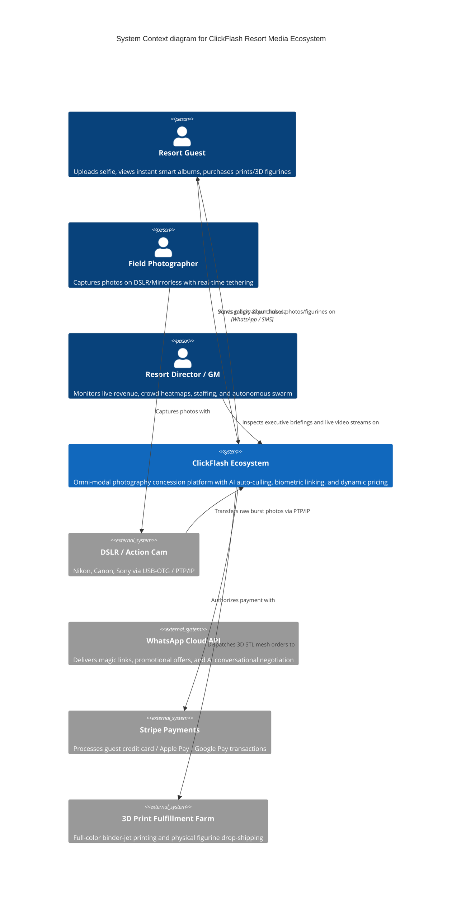

# C4 Architecture Specification — ClickFlash Ecosystem V7.0

## 1. Level 1: System Context Diagram

The ClickFlash ecosystem enables resort guests, photographers, and resort executives to capture, curate, distribute, and monetize memories autonomously.



---

## 2. Level 2: Container Diagram (Edge-to-Cloud Topology)

```mermaid
C4Container
    title Container diagram for ClickFlash Ecosystem

    Person(guest, "Resort Guest")
    Person(photographer, "Field Photographer")
    Person(executive, "Resort Director")

    Container_Boundary(edge, "On-Premise Resort LAN Edge Node")
        Container(master, "Headless Master OS", "Electron 39 / Fastify / Node.js", "LAN Gateway (Port 8090), Ingestion Queue, SQLite WAL Database, C++ VP-Tree Index")
        Container(touch, "Touch Kiosk", "Electron 39 / React 19", "Attract screensaver, local selfie search (WASM HNSW), instant dye-sub printing")
        Container(moneytrash, "AI Batch Culling Node", "Electron 39 / Rust WASM", "High-throughput sharpness and blur classification")
    Boundary_End()

    Container_Boundary(mobile, "Mobile Edge Devices")
        Container(mobile_pro, "Mobile Pro App", "Expo React Native + Rust Core", "Field tethering, local offline queue, WebRTC broadcaster")
        Container(mobile_consumer, "Guest Photo Pass", "Expo React Native", "BLE proximity beaconing, on-device selfie vector embedding")
    Boundary_End()

    Container_Boundary(cloud, "Cloudflare & Cloud Edge")
        Container(cloud_backend, "Cloud Backend API", "Cloudflare Workers", "REST API, D1 Relational DB, R2 Object Storage, Vectorize Index, Stripe Webhooks")
        Container(gallery, "Guest Web Gallery", "Vite / React 19 / Three.js", "Instant album view, 3D holographic figurine viewer, cart checkout")
        Container(mgmt, "Management Hub", "Vite / React 19 / Radix UI", "Executive Command Center, 8-Agent Swarm Intelligence, WebRTC POV Receiver")
        Container(ai_worker, "AI Worker Engine", "FastAPI / Python / PyTorch", "Computer Vision inference, ArcFace embeddings, SAM-3 segmentation")
    Boundary_End()

    Rel(photographer, mobile_pro, "Shoots via tethered DSLR")
    Rel(mobile_pro, master, "Streams photos over LAN WiFi", "HTTP/WS")
    Rel(master, touch, "Synchronizes album catalog & vectors", "Direct IPC / LAN Socket.IO")
    Rel(master, cloud_backend, "Replicates optimized media & metadata", "HTTPS / R2 S3 API")
    Rel(guest, touch, "Searches selfie on-premise")
    Rel(guest, gallery, "Accesses gallery via magic link")
    Rel(guest, mobile_consumer, "Uses BLE Photo Pass in park")
    Rel(mobile_consumer, mobile_pro, "Transmits proximity beacon", "BLE GATT")
    Rel(gallery, cloud_backend, "Fetches album photos & creates orders", "HTTPS")
    Rel(executive, mgmt, "Monitors park operations & swarm alerts")
    Rel(mgmt, cloud_backend, "Fetches executive metrics & issues directives")
    Rel(cloud_backend, ai_worker, "Dispatches heavy 3D mesh & segmentation jobs")
```

---

## 3. Level 3: Component Diagram (Master OS Edge Node & Swarm AI)

```mermaid
C4Component
    title Component diagram for Master OS & Autonomous Swarm Engine

    Container_Boundary(master_os, "apps/desktop/master (Edge Node)")
        Component(lan_gateway, "LAN Fastify Gateway", "Fastify / TypeScript", "Handles incoming uploads from Mobile Pro and Kiosks on Port 8090")
        Component(ipc_bridge, "Direct IPC DAO Bridge", "Electron IPC / TypeScript", "Typed data service proxying renderer queries directly to SQLite")
        Component(sqlite_db, "Local SQLite Database", "better-sqlite3 / WAL Mode", "Stores albums, photos, orders, shift logs, and hardware licenses")
        Component(vptree_index, "VP-Tree Vector Index", "C++ Addon / WASM", "In-memory vantage point tree for sub-5ms cosine face matching")
        Component(culling_service, "AI Culling & Quality Service", "Sharp / ONNX", "Evaluates blur, exposure, eye blink, and framing metrics")
        Component(sales_orchestrator, "AI Sales Orchestrator", "Gemini 2.0 / TypeScript", "Analyst & Closer swarm agents driving WhatsApp magic links")
        Component(whatsapp_svc, "WhatsApp Service", "WhatsApp Cloud API", "Transmits interactive buttons, image templates, and reply webhooks")
    Boundary_End()

    Container_Boundary(management_hub, "apps/management (Command Center)")
        Component(ceo_agent, "CEO Agent", "TypeScript / Gemini 2.0", "Synthesizes multi-agent telemetry into executive briefings")
        Component(negotiator_agent, "Negotiator Agent", "TypeScript / Gemini 2.0", "Handles guest WhatsApp counter-offers and objection handling")
        Component(pricing_agent, "Dynamic Pricing Agent", "TypeScript / Gemini 2.0", "Calculates real-time surge yield curves")
        Component(hotspot_agent, "Hotspot Agent", "TypeScript / Gemini 2.0", "Detects crowd bottlenecks and dispatches photographers")
        Component(staffing_agent, "Staffing Agent", "TypeScript / Gemini 2.0", "Balances staff shifts and zone coverage")
        Component(spy_agent, "Spy Agent", "TypeScript / Gemini 2.0", "Audits competitor pricing and concession fraud")
    Boundary_End()

    Rel(lan_gateway, sqlite_db, "Writes photo metadata")
    Rel(lan_gateway, vptree_index, "Inserts 512D ArcFace embeddings")
    Rel(lan_gateway, culling_service, "Triggers sharpness & blur grading")
    Rel(culling_service, sqlite_db, "Updates ai_score & grade")
    Rel(sales_orchestrator, vptree_index, "Searches selfie vector matches")
    Rel(sales_orchestrator, whatsapp_svc, "Dispatches magic links & closing copy")
    Rel(ceo_agent, hotspot_agent, "Pulls crowd heatmap telemetry")
    Rel(ceo_agent, staffing_agent, "Pulls shift workload metrics")
    Rel(ceo_agent, spy_agent, "Pulls fraud & compliance audit")
```

---

## 4. Level 4: Code & Data Architecture Contracts

- **Core Data Contracts**: Universal domain contracts defined in `@clickflash/types` (`Album`, `Photo`, `AIScore`, `SwarmLeadEngagement`, `GalleryTheme`, `AIToolPricingConfig`).
- **Prompt Contracts**: Strongly-typed prompt definitions and Zod schemas in `@clickflash/ai` (`prompts.ts`, `schemas.ts`, `PromptCatalog`, `formatPrompt`).
- **Local Persistence Invariant**: All local desktop data operations use the Direct IPC DAO bridge without localhost HTTP roundtrips.
- **Biometric Invariant**: Raw biometric face images never leave edge devices; only anonymous 512D float vectors are synced upstream.
