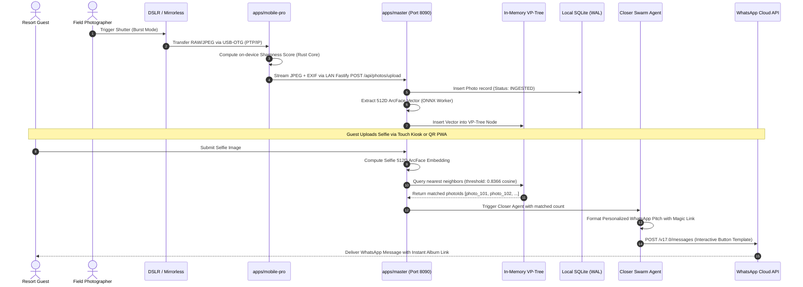
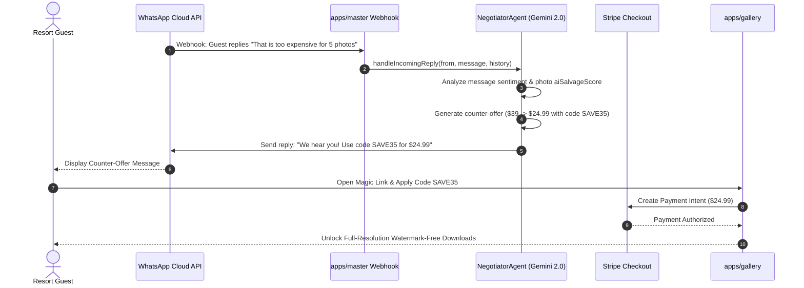
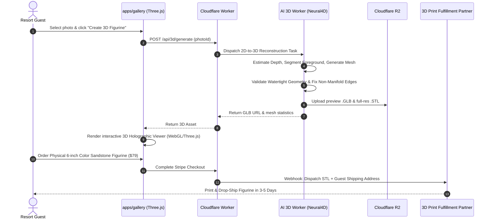

# Data Flows & Boundary Protocols — ClickFlash V7.0

## 1. Zero-Friction Edge Ingestion & Biometric Pairing Flow

---

## 2. Dynamic Negotiation & WhatsApp Counter-Offer Flow

---

## 3. Generative 3D Figurine & Print Farm Fulfillment Flow

