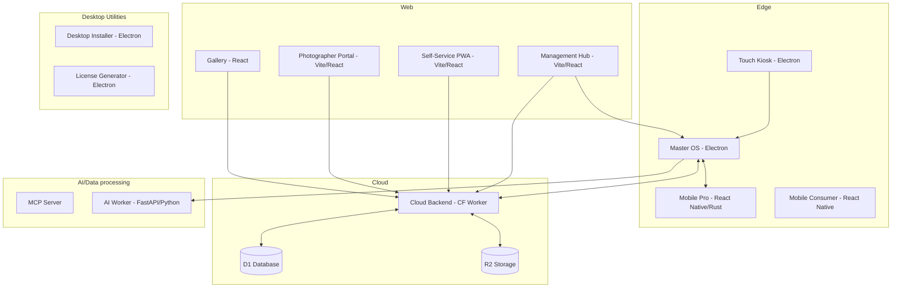

# System Overview

## ClickFlash V6.0 Architecture

This document describes the high-level system architecture of the ClickFlash ecosystem.

### Architecture Diagram

### Edge → Cloud → Guest Data Pipeline
1. **Edge Capture**: Photos are ingested via `MobilePro` or uploaded to `Master OS`. Edge node performs initial AI processing (culling, biometric linking) locally using `AIWorker`.
2. **Cloud Sync**: The `Master OS` syncs optimized media and metadata to the `Cloud Backend` (R2 for media, D1 for relational data).
3. **Guest Access**: Guests interact via the `SelfService PWA` or `Gallery`, pulling high-fidelity media directly from the Cloudflare CDN/R2 layer for zero-latency retrieval.

### Technology Stack Summary

| Domain | Tech Stack |
|--------|------------|
| Edge Master / Kiosk | Electron, Fastify, React, SQLite |
| Web Applications | Vite, React 19, Tailwind, Radix UI |
| Cloud Backend | Cloudflare Workers, D1, R2, KV |
| Mobile Apps | Expo React Native, Rust (JNI/Swift) |
| AI / ML Services | FastAPI, Python, C++, ONNX |

### Key Architectural Decisions
- **ADR-001**: Use SQLite as the local Edge database, with Event-Driven Sync mechanisms instead of full Redis.
- **ADR-002**: Mobile apps follow an Offline-First approach with Rust-based core processing to prevent connectivity bottlenecks.
- **ADR-003**: Cloud architecture strictly relies on Cloudflare Edge (Workers, D1, R2) for global scalability and minimized latency.
