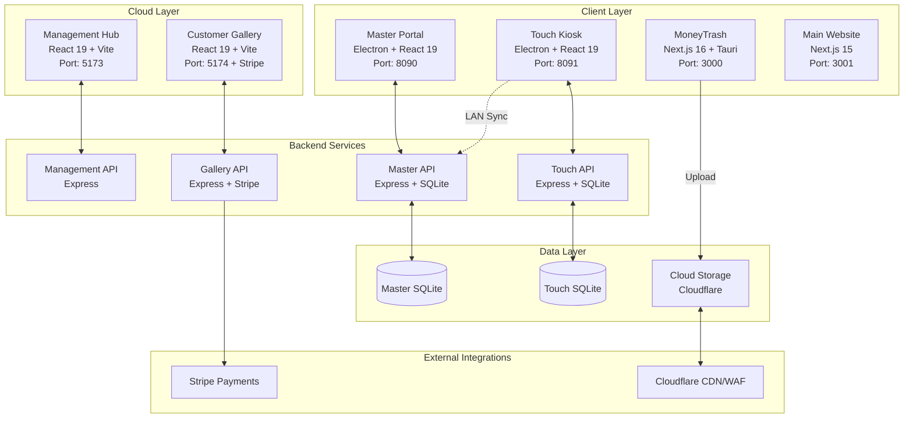
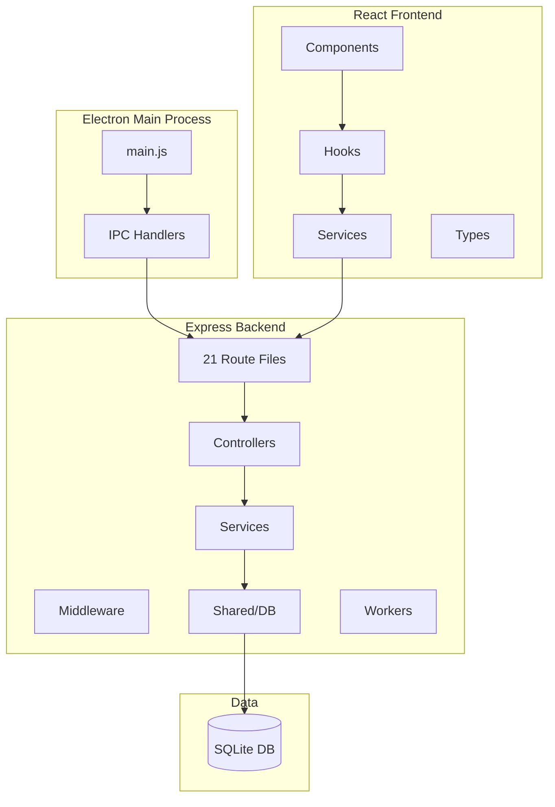
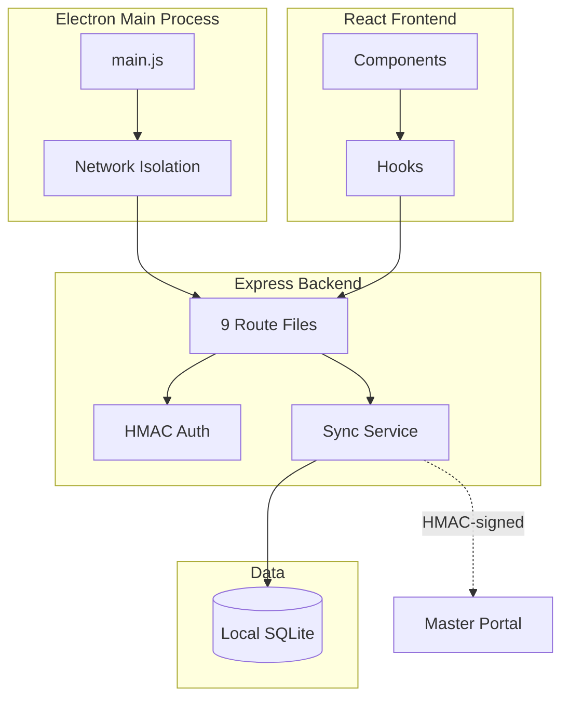
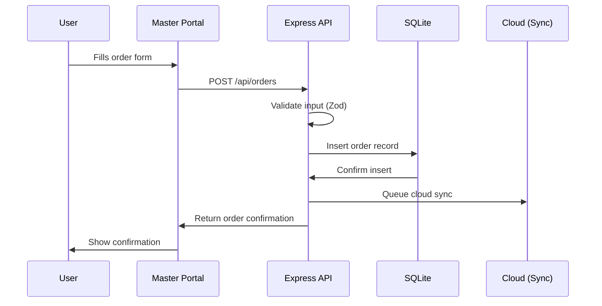
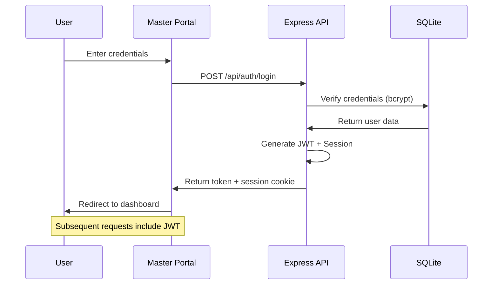
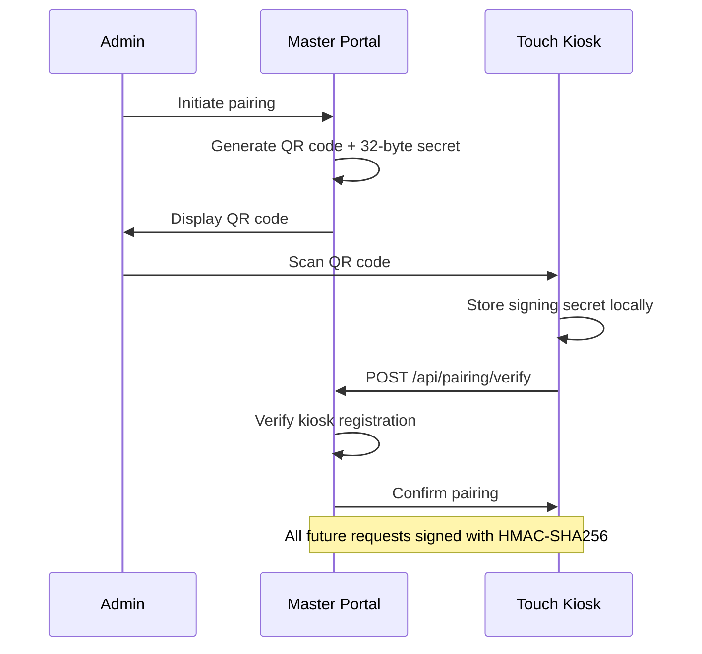
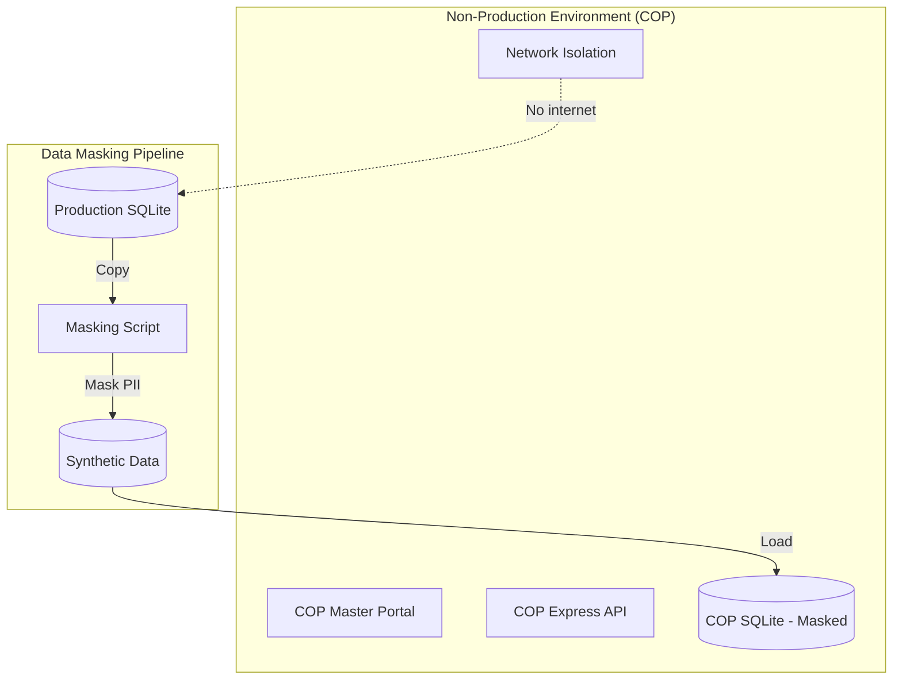

# ClickFlash Ecosystem Architecture Diagram

## Logical Architecture

## Master Portal Architecture

## Touch Kiosk Architecture

## Data Flow: Order Creation

## Authentication Flow

## Touch-Master Pairing Flow

## COP Master Clone Architecture

---

*Generated: April 8, 2026*
