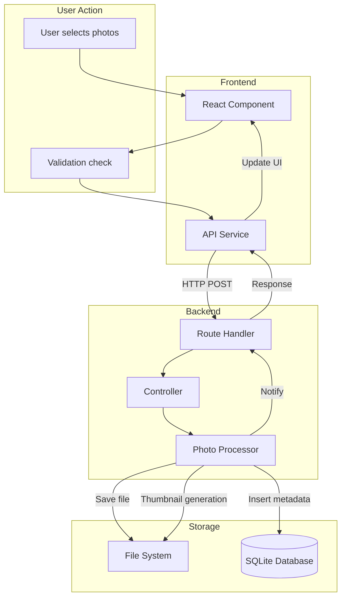
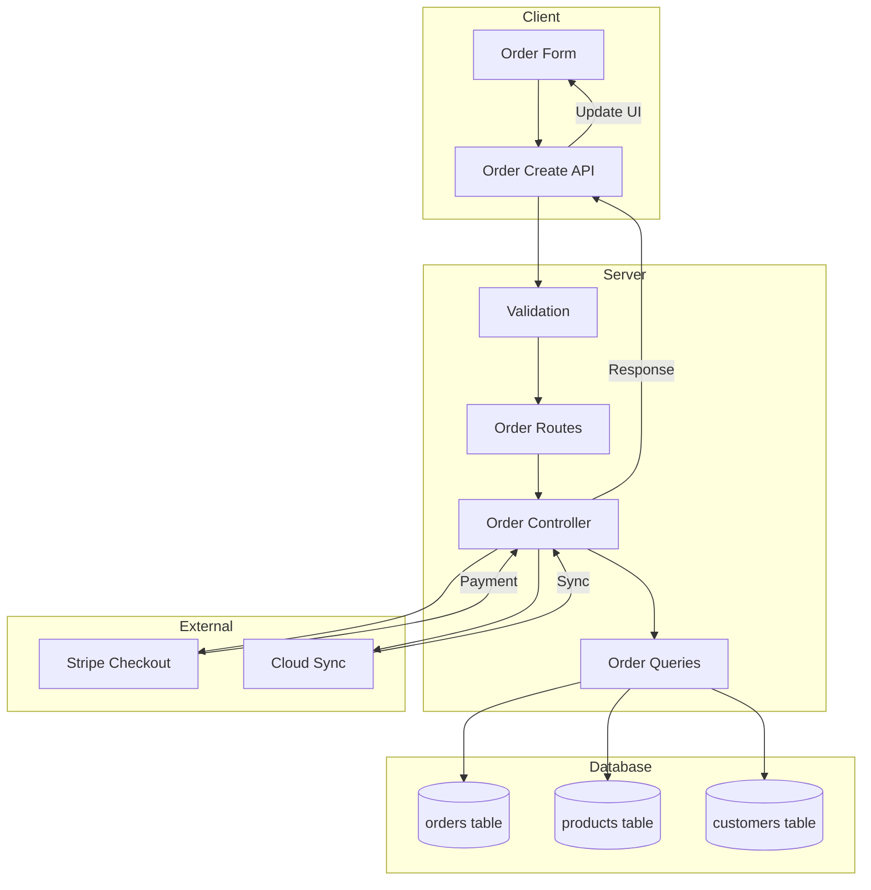
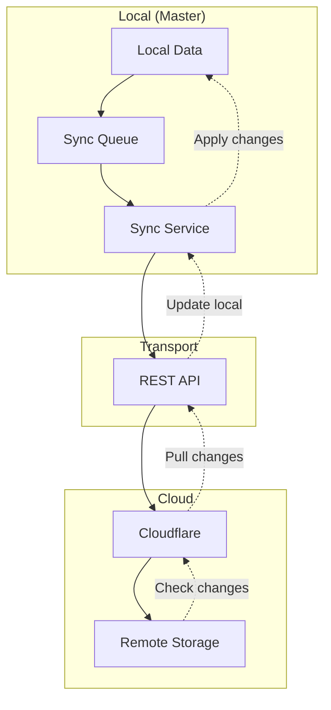
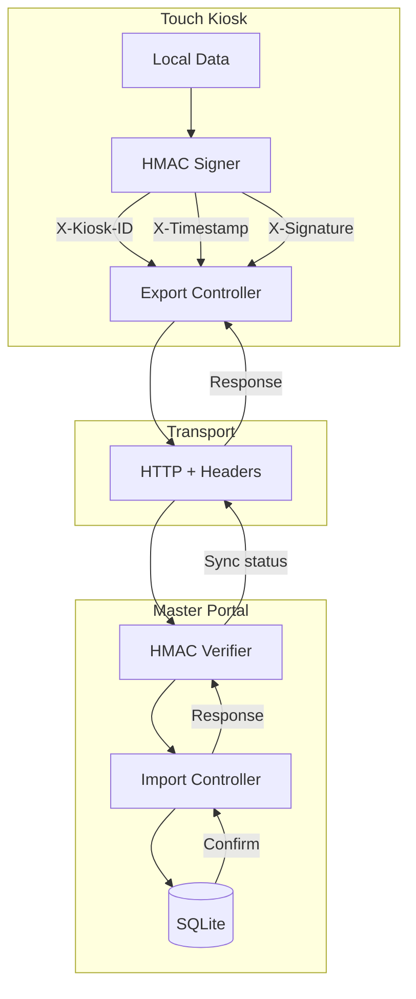
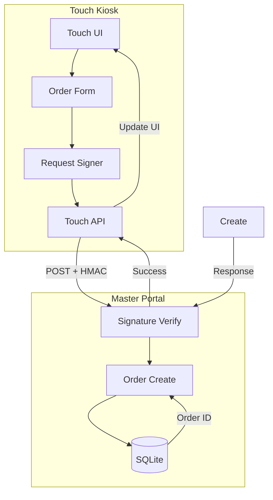
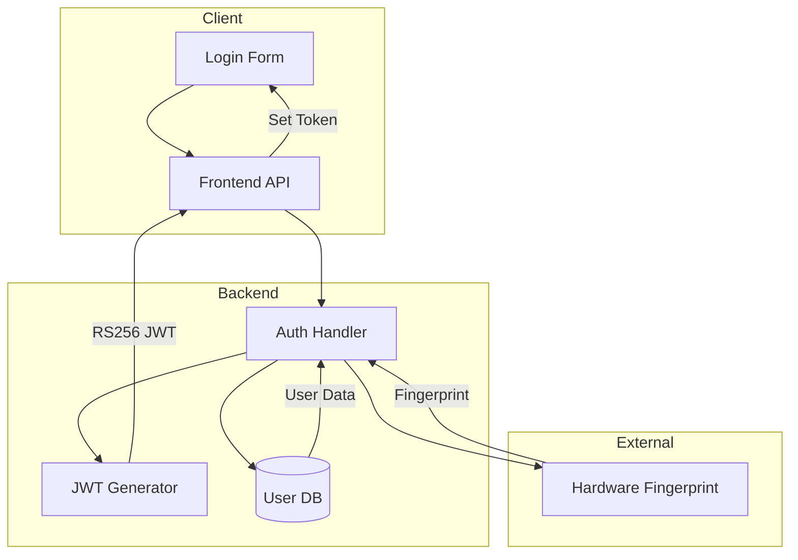
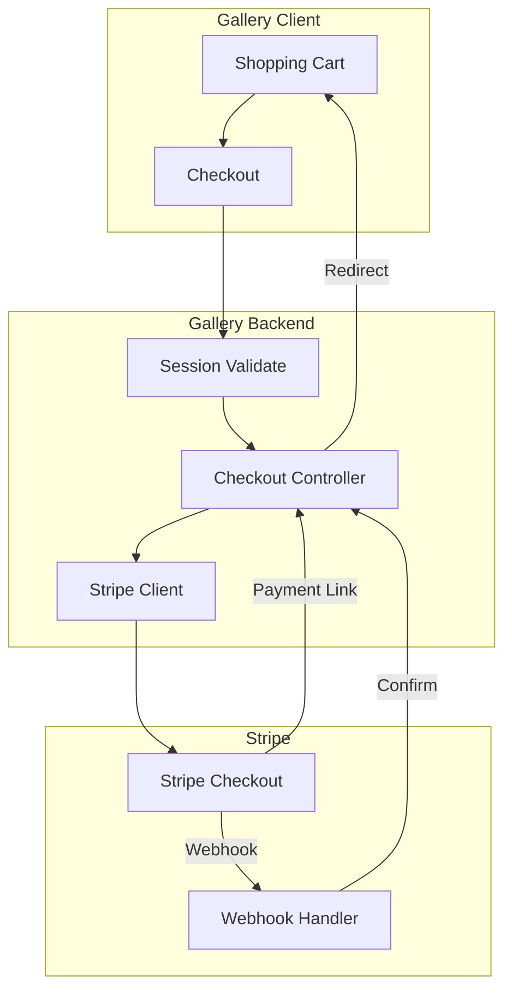

# ClickFlash Data Flow Diagrams

## Master Portal Data Flows

### Photo Upload Flow

### Order Management Flow

### Cloud Sync Flow

## Touch Kiosk Data Flows

### Touch-Master Sync Flow

### Order Creation on Touch

## Management Hub Data Flows

### Authentication Flow

## Customer Gallery Data Flows

### Payment Flow

---

*Generated: April 8, 2026*
