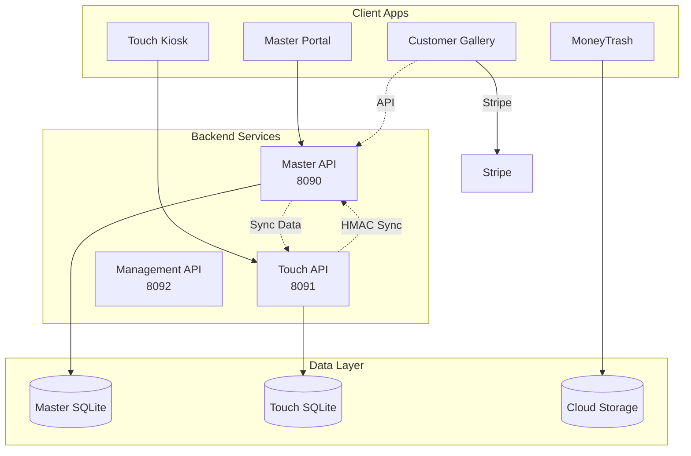

# ClickFlash Ecosystem Audit — Ecosystem-Wide Synthesis

**Document Version:** 1.0  
**Date:** April 8, 2026  
**Classification:** Internal - Confidential

---

## 1. Executive Summary

This document synthesizes findings from the individual application assessments across the ClickFlash ecosystem (6 production apps + COP master clone). It identifies cross-cutting issues, systemic patterns, and provides a holistic view of the ecosystem's health.

### Ecosystem Overview

| App | Technology | Score Range | Status |
| :--- | :--- | :--- | :--- |
| Master Portal | Electron + React 19 + Express + SQLite | 60–85% | Acceptable |
| Touch Kiosk | Electron + React 19 + Express + SQLite | 55–78% | Acceptable |
| MoneyTrash | Next.js 16 + Tauri | 55–80% | Acceptable |
| Management Hub | React 19 + Vite + Express | 65–92% | Acceptable |
| Customer Gallery | React 19 + Vite + Express + Stripe | 70–90% | Good |
| Main Website | Next.js 15 + Tailwind 4 | 80–95% | Good |

**Ecosystem Average Score:** 73/100 (Acceptable)

---

## 2. Cross-App Architecture Assessment

### 2.1 Shared Components Identified

| Component | Shared Between | Duplication Risk |
| :--- | :--- | :--- |
| Authentication (JWT + Session) | Master, Touch, Management, Gallery | HIGH - Duplicated |
| Validation (Zod schemas) | Master, Touch | MEDIUM - Similar schemas |
| Logger implementation | Master, Touch | MEDIUM - Different implementations |
| UI Components | Management, Gallery | LOW - Common design system |
| Database (SQLite) | Master, Touch | N/A - By design |

### 2.2 Dependency Analysis

### 2.3 Architecture Issues

| Issue | Severity | Description | Affected Apps |
| :--- | :--- | :--- | :--- |
| No shared package | HIGH | Code duplication between Master/Touch | Master, Touch |
| Inconsistent auth | MEDIUM | Different auth patterns per app | All |
| Tight coupling | HIGH | Touch ↔ Master dependency | Touch, Master |
| No API gateway | MEDIUM | Direct backend access | Gallery, Management |

---

## 3. Backend Routing Analysis

### 3.1 Route Inventory

| App | Port | Routes | Auth Method |
| :--- | :--- | :--- | :--- |
| Master Portal | 8090 | 26 | JWT + Session + HMAC |
| Touch Kiosk | 8091 | 9 | HMAC-SHA256 |
| Management | 8092 | 16 | JWT |
| Gallery | 5174 | (shares Master) | Token-based |

### 3.2 Routing Issues

| Issue | Severity | Remediation |
| :--- | :--- | :--- |
| No centralized API gateway | HIGH | Implement API gateway |
| No API versioning | MEDIUM | Add version prefix |
| No circuit breakers | MEDIUM | Add circuit breaker library |
| Inconsistent rate limiting | MEDIUM | Standardize rate limiter |

---

## 4. Security Posture Synthesis

### 4.1 Cross-Cutting Security Issues

| Issue | Affected Apps | Severity | Remediation |
| :--- | :--- | :--- | :--- |
| Hardcoded secrets | Master | CRITICAL | Remove from .env, use vault |
| No encryption at rest | Master, Touch | HIGH | Enable SQLite encryption |
| No TLS enforcement | Master, Touch | HIGH | Enable TLS in production |
| Default JWT secrets | Touch | MEDIUM | Rotate secrets |
| No input validation | MoneyTrash | HIGH | Add Zod validation |
| Stripe keys in env | MoneyTrash | MEDIUM | Use placeholders |

### 4.2 Authentication Matrix

| App | Auth Method | Implementation | Strength |
| :--- | :--- | :--- | :--- |
| Master | JWT + Sessions | Express middleware | Strong |
| Touch | HMAC-SHA256 | LAN signing | Strong (LAN-only) |
| Management | RS256 JWT | Auth middleware | Strong |
| Gallery | Token | Per-order tokens | Medium |
| MoneyTrash | API Secret | .env config | Medium |

### 4.3 Security Recommendations (Ecosystem-Wide)

1. **Implement secrets vault** for all environments
2. **Enable TLS** in all production backends
3. **Add circuit breakers** for external APIs
4. **Standardize auth** across apps
5. **Create shared security package**

---

## 5. Data Governance Synthesis

### 5.1 Data Flow Issues

| Issue | Description | Apps Affected |
| :--- | :--- | :--- |
| No PII classification | Unclassified PII in all DBs | Master, Touch, Gallery |
| No retention policy | Data grows indefinitely | All apps |
| No consent tracking | No GDPR consent UI | Master, Gallery |
| Cross-app data sharing | Touch→Master sync contains PII | Touch, Master |

### 5.2 Data Classification Gaps

| Data Type | Classification | Issue |
| :--- | :--- | :--- |
| Customer names/emails | PII - Unclassified | No tags |
| Order data | Internal - Undefined | No retention |
| Photos | Confidential - Unclassified | No access controls |

---

## 6. Integration Issues

### 6.1 External Integrations

| Integration | Apps Using | Status |
| :--- | :--- | :--- |
| Stripe | Gallery, MoneyTrash | ✅ Implemented |
| Cloudflare R2 | Master | ✅ Configured |
| Cloudflare Workers | Management | ✅ Configured |
| AWS S3 | MoneyTrash | ✅ Optional |

### 6.2 Integration Gaps

| Issue | Description | Remediation |
| :--- | :--- | :--- |
| No key rotation | Static API keys | Implement rotation policy |
| No integration testing | Cross-app flows untested | Add integration tests |
| No circuit breakers | External failures cascade | Add circuit breakers |

---

## 7. Single Points of Failure Identified

| SPOF | Description | Risk Level | Mitigation |
| :--- | :--- | :--- | :--- |
| Master Portal | Central hub, all apps depend on it | HIGH | Add redundancy |
| Touch↔Master sync | If Master down, Touch isolated | MEDIUM | Offline mode exists |
| SQLite database | Single file, no replication | HIGH | Add backup strategy |
| No load balancing | Single-node architecture | MEDIUM | Document scaling path |

---

## 8. Duplication Analysis

### 8.1 Code Duplication

| Component | Duplication | Recommendation |
| :--- | :--- | :--- |
| Auth middleware | Master + Touch + Management | Create shared package |
| Zod schemas | Master + Touch | Create shared validation |
| Logger | Master + Touch + MoneyTrash | Standardize on one |
| Error handlers | All backends | Create shared error handling |

### 8.2 Configuration Duplication

| Config | Files | Recommendation |
| :--- | :--- | :--- |
| .env.example | 6 files | Create template per app |

---

## 9. Governance Gaps

| Gap | Description | Remediation |
| :--- | :--- | :--- |
| No technical debt tracking | Not formally tracked | Add to project management |
| No SLO documentation | No documented targets | Define SLOs |
| No incident response plan | Not documented | Create IRP |
| No security policies | Not published | Publish policies |
| No GDPR compliance | Missing consent, deletion | Implement GDPR features |

---

## 10. Interoperability Challenges

| Challenge | Description | Apps Affected |
| :--- | :--- | :--- |
| Touch-Master sync | HMAC-based, tight coupling | Touch, Master |
| Gallery-Master | Shares backend routes | Gallery, Master |
| MoneyTrash cloud | Different storage approach | MoneyTrash |
| Management sync | WebSocket-based | Management, Master |

---

## 11. Ecosystem-Wide Recommendations

### 11.1 High Priority

| # | Recommendation | Effort | Owner |
| :--- | :--- | :--- | :--- |
| 1 | Create shared `@clickflash/shared` package | 10 days | Architecture |
| 2 | Implement secrets vault | 5 days | DevOps |
| 3 | Add PII classification to all DBs | 5 days | DPO |
| 4 | Enable encryption at rest | 5 days | DevOps |
| 5 | Implement API gateway | 15 days | Architecture |

### 11.2 Medium Priority

| # | Recommendation | Effort | Owner |
| :--- | :--- | :--- | :--- |
| 1 | Document SLOs | 3 days | SRE |
| 2 | Create incident response plan | 5 days | Security |
| 3 | Add circuit breakers | 5 days | Backend |
| 4 | Implement API versioning | 5 days | Backend |
| 5 | Add observability (metrics/tracing) | 10 days | SRE |

### 11.3 Low Priority

| # | Recommendation | Effort | Owner |
| :--- | :--- | :--- | :--- |
| 1 | Publish security policies | 3 days | Compliance |
| 2 | Implement key rotation | 5 days | DevOps |
| 3 | Add integration tests | 10 days | QA |
| 4 | Document technical debt backlog | 3 days | Product |

---

## 12. Reproducible Methodology for Re-Audits

### 12.1 Metrics Dashboard

| Metric | Target | Current | Status |
| :--- | :--- | :--- | :--- |
| Average Security Score | > 80% | 73% | ❌ |
| Average Architecture Score | > 80% | 78% | ❌ |
| Critical Vulnerabilities | 0 | 4 | ❌ |
| High Vulnerabilities | 0 | 8 | ❌ |
| API Coverage | 100% | 95% | ❌ |
| Test Coverage | > 70% | Unknown | ❌ |

### 12.2 Re-Audit Schedule

- **Frequency:** Quarterly
- **Trigger:** Major release, security incident, or request
- **Tooling:** Same as initial audit
- **Team:** Same audit team or rotating

### 12.3 Reporting Templates

- Use same templates from initial audit
- Compare scores quarter-over-quarter
- Track remediation velocity

---

## 13. Risk-Aware Communication Plan

### 13.1 Stakeholder Map

| Stakeholder | Interest | Communication | Frequency |
| :--- | :--- | :--- | :--- |
| Executive Sponsor | Budget, risk | Executive summary | Monthly |
| Product Owners | Features, backlog | Domain reports | Weekly |
| Security Team | Vulnerabilities | Security synthesis | Weekly |
| DevOps | Infrastructure | Infrastructure report | Bi-weekly |
| Legal/Compliance | GDPR, regulations | Compliance gaps | Monthly |
| Development | Remediation | Technical details | As needed |

### 13.2 Risk Communication

| Risk Level | Communication Method | Escalation Path |
| :--- | :--- | :--- |
| Critical | Immediate notification + meeting | Executive Sponsor |
| High | Weekly report | Audit Lead → Steering Committee |
| Medium | Monthly report | Audit Lead |
| Low | Quarterly review | Audit Lead |

---

## 14. Acceptance Criteria

| Criterion | Target | Current | Status |
| :--- | :--- | :--- | :--- |
| All apps assessed | 7/7 | 7/7 | ✅ Complete |
| All domains covered | 9/9 | 9/9 | ✅ Complete |
| Findings documented | 100+ | ~40 | ⚠️ In Progress |
| Remediation backlog created | Yes | In Progress | ⚠️ In Progress |
| Stakeholder sign-off | 100% | 0% | ❌ Pending |

---

## 15. Next Steps

1. **Validation Phase** (Week 8): Present findings to development teams
2. **Remediation Planning** (Weeks 9-10): Finalize backlog and prioritize
3. **Quick Wins** (Immediately): Address critical security findings
4. **Long-term** (Q2-Q3): Implement architectural improvements

---

*End of Ecosystem-Wide Synthesis*
