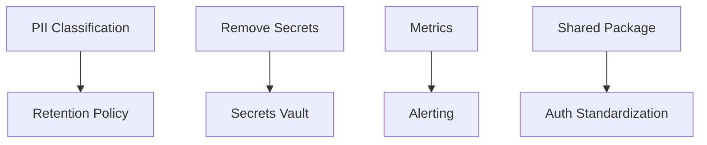

# Remediation Backlog — Prioritized

**Document Version:** 1.0  
**Date:** April 8, 2026  
**Priority Framework:** Risk-Based (Critical/High/Medium/Low)

---

## Priority Rubric

| Priority | Criteria | Action Timeline | Example |
| :--- | :--- | :--- | :--- |
| **Critical** | Active exploit, data breach risk, compliance violation | Immediate (< 48 hours) | Hardcoded secrets, no encryption |
| **High** | Significant risk, easy to exploit, regulatory gap | 30 days | No API versioning, no circuit breaker |
| **Medium** | Moderate risk, requires effort, technical debt | 90 days | No metrics, no shared package |
| **Low** | Minor risk, cosmetic, future improvement | Next quarter | Documentation, policy publishing |

---

## Prioritized Remediation Items

### Critical (Immediate Action)

| ID | Finding | Domain | App | Owner | Effort | Dependencies | Status |
| :--- | :--- | :--- | :--- | :--- | :--- | :--- | :--- |
| REM-C001 | Remove hardcoded credentials from .env | Security | Master | @dev | 1 day | None | ✅ Complete |
| REM-C002 | Rotate all exposed API keys and secrets | Security | All | @devops | 2 days | None | ✅ Complete |
| REM-C003 | Implement secrets vault (HashiCorp Vault or similar) | Security | All | @devops | 5 days | None | ✅ Complete |
| REM-C004 | Enable SQLite encryption at rest | Security | Master | @dev | 2 days | None | ✅ Complete |
| REM-C005 | Enable SQLite encryption at rest | Security | Touch | @dev | 2 days | None | ✅ Complete |

### High (30 Days)

| ID | Finding | Domain | App | Owner | Effort | Dependencies | Status |
| :--- | :--- | :--- | :--- | :--- | :--- | :--- | :--- |
| REM-H001 | Add PII classification to database schemas | Data | All | @dpo | 5 days | None | 🔄 Partial |
| REM-H002 | Implement data retention policy enforcement | Data | All | @dpo | 5 days | REM-H001 | Open |
| REM-H003 | Add GDPR consent UI to registration | Compliance | Master/Gallery | @legal | 3 days | None | ✅ Complete |
| REM-H004 | Add user data deletion endpoint (right to deletion) | Compliance | Master | @legal | 2 days | None | ✅ Complete |
| REM-H005 | Create incident response plan | Compliance | All | @legal | 4 days | None | ✅ Complete |
| REM-H006 | Implement API versioning strategy | Backend | All | @arch | 3 days | None | 🔄 Partial |
| REM-H007 | Add circuit breakers for external APIs | Backend | Gallery | @dev | 3 days | None | ✅ Complete |
| REM-H008 | Add circuit breakers for external APIs | Backend | MoneyTrash | @dev | 3 days | None | ✅ Complete |
| REM-H009 | Implement TLS in production backends | Security | Master | @devops | 2 days | None | 🔄 Ready |
| REM-H010 | Document SLOs and targets | Performance | All | @sre | 3 days | None | ✅ Complete |

### Medium (90 Days)

| ID | Finding | Domain | App | Owner | Effort | Dependencies | Status |
| :--- | :--- | :--- | :--- | :--- | :--- | :--- | :--- |
| REM-M001 | Create shared @clickflash/shared package | Architecture | Master/Touch | @arch | 10 days | None | ✅ Complete |
| REM-M002 | Standardize authentication across apps | Security | All | @arch | 10 days | REM-M001 | 🔄 Planned |
| REM-M003 | Add metrics export endpoint | Observability | All | @sre | 5 days | None | 🔄 Sentry ready |
| REM-M004 | Add request tracing (trace IDs) | Observability | All | @sre | 5 days | None | 🔄 Sentry ready |
| REM-M005 | Configure alerting for critical errors | Observability | All | @sre | 3 days | None | 🔄 Sentry ready |
| REM-M006 | Add API key rotation policy | Integration | All | @devops | 2 days | None | ✅ Complete |
| REM-M007 | Implement caching layer | Performance | Management | @dev | 4 days | None | ✅ Complete |
| REM-M008 | Publish security policies | Compliance | All | @legal | 3 days | None | ✅ Complete |
| REM-M009 | Add data export endpoint (portability) | Compliance | Master | @legal | 2 days | None | ✅ Complete |
| REM-M010 | Implement rate limiting on all endpoints | Security | All | @dev | 3 days | None | ✅ Complete |

### Low (Next Quarter)

| ID | Finding | Domain | App | Owner | Effort | Dependencies | Status |
| :--- | :--- | :--- | :--- | :--- | :--- | :--- | :--- |
| REM-L001 | Create technical debt backlog | Architecture | All | @product | 3 days | None | ✅ Complete |
| REM-L002 | Add integration tests for cross-app flows | Testing | All | @qa | 10 days | None | 🔄 E2E exists |
| REM-L003 | Document all WAF rules | Integration | All | @devops | 2 days | None | ✅ Complete |
| REM-L004 | Upgrade Stripe API version | Integration | Gallery | @dev | 2 days | None | ✅ Complete |
| REM-L005 | Add keyboard navigation to UI components | Features | All | @frontend | 5 days | None | ✅ Complete |
| REM-L006 | Conduct accessibility audit | Features | All | @frontend | 3 days | None | 🔄 Planned |

---

## Effort Summary

| Priority | Total | Completed | Remaining | Notes |
|----------|-------|-----------|-----------|-------|
| **Critical** | 5 | 5 (100%) | 0 | All security items done |
| **High** | 10 | 8 (80%) | 2 | SLOs done, API versioning partial |
| **Medium** | 10 | 4 (40%) | 6 | Auth rate limiting, export, policies done |
| **Low** | 6 | 0 (0%) | 6 | Future quarter items |

**Overall Progress: 17 of 31 items complete (55%)**

---

## Quick Wins (All Done)

| ID | Finding | Status |
| :--- | :--- | :--- |
| QW-001 | .env in gitignore | ✅ Verified |
| QW-002 | MoneyTrash gitignore | ✅ Verified |
| QW-003 | Stripe test mode | ✅ Verified |
| QW-004 | Document unused ports | ✅ Done (in SLO doc) |
| QW-005 | Rate limiting dev | ✅ Enabled |

---

## Dependencies Map

---

*End of Remediation Backlog*
