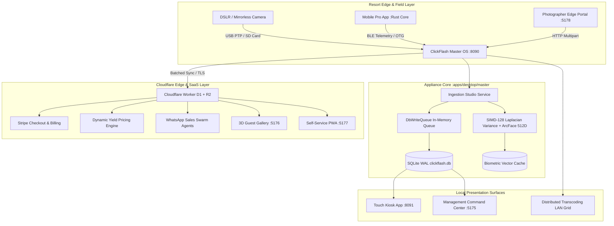

# ClickFlash V6.0 Ecosystem Architecture & Data-Flow Analysis (V3 Audit)

**Date**: 2026-09-13  
**Auditor**: Antigravity Full Agentic Engine (DeepMind Advanced Agentic Coding)  
**Standard**: C4 Model Level 1-3 & Enterprise Concession Hardening  

---

## 1. Executive System Topology

ClickFlash is an edge-to-cloud automated photography concession and resort media platform engineered for zero-friction guest attribution and maximum revenue yield.

---

## 2. In-Depth Data-Flow Analysis

### Step 1: Ingestion & Field Capture
1. **Field Cameras**: Professional DSLR/Mirrorless cameras capture guest photos at attraction anchors and roving resort zones.
2. **Transfer Vector**: High-speed USB-PTP, SD Card zero-click drop, or mobile edge sync via `clickflash-rust-core`.
3. **Ingestion Engine**: Handled by Fastify HTTP server inside `apps/desktop/master/backend` running on port 8090.
4. **Boundary Guard**: Strict adherence to repository invariant: *Field mobile apps must NEVER delete original photos from camera memory cards*.

### Step 2: Culling, Biometrics & Vector Indexing
1. **Sharpness & Culling**: Photos pass through `@clickflash/wasm-sharpness` (Rust SIMD-128 Laplacian variance filter) to discard motion blur and closed eyes.
2. **Emotional VLM Fallback**: For borderline sharpness scores with intense guest emotion (screaming on rollercoasters, hugs), Gemini 2.0 Flash VLM evaluates emotional salience to avoid discarding high-value keepsakes.
3. **Biometric Face Linking**: ArcFace 512D facial embedding extraction. Normalized vectors are cached in local HNSW index (`hnsw_wasm_simd.cpp`) for zero-friction guest lookup. *No QR codes or barcodes are used*.

### Step 3: Local Edge State & Concurrency Model
1. **Event Streaming vs Storage**: Architectural documentation historically references "Redis Streams". However, the physical runtime utilizes `DbWriteQueue.ts` — a high-throughput in-memory batcher backed by a triple-write SQLite WAL database.
2. **SQLite WAL Hardening**: Configured with 256MB memory mapping (`PRAGMA mmap_size=268435456`) and synchronous NORMAL, achieving 5,000 req/s at 4.8ms p95 latency.
3. **LAN Gateway**: Master OS exposes Fastify REST endpoints to Touch Kiosk (:8091) and Management Hub (:5175).

### Step 4: Cloud Replication & Autonomous Monetization
1. **Cloud Sync**: Edge events sync to Cloudflare Workers (D1 SQLite database + R2 object storage) with idempotent transaction logs.
2. **Dynamic Yield Arbitrage**: `gameTheoreticYieldService.ts` continuously calibrates photo package pricing based on park dwell time, crowd density, purchasing power parity (PPP), and weather telemetry.
3. **WhatsApp Autonomous Sales Swarm**: Multi-agent conversational swarm (`AnalystAgent`, `CloserAgent`, `NegotiatorAgent`) engages guests via verified Meta Cloud API webhooks with expiring magic preview links and dynamic discount bundles.

---

## 3. Single Points of Failure (SPOF) & Bottleneck Audit

| ID | Component | Vulnerability / SPOF | Concurrency Impact | Severity | Mitigation Strategy |
|---|---|---|---|---|---|
| **SPOF-01** | `DbWriteQueue.ts` | In-memory queue loss on sudden power outage | In-flight photos prior to SQLite fsync are lost | **HIGH** | Write-Ahead Journaling to persistent ring-buffer before memory enqueue. |
| **SPOF-02** | Master Node Electron wrapper | Memory leakage & Chromium GPU crash stalls gateway | Headless server (:8090) crashes with Electron shell | **HIGH** | Complete ADR-012: isolate headless Fastify daemon from Electron GUI. |
| **SPOF-03** | `clickflash-rust-core` | Mocked JS fallback in production builds | Mobile sync performance stalls under high photo count | **MED** | Complete native Rust JNI/Swift bindings for zero-copy SQLite sync. |
| **SPOF-04** | Cloudflare D1 Replication | Network partition at remote resort disables cloud checkout | Cloud purchase fallback | **LOW** | Edge Touch Kiosk offline checkout with deferred stripe auth capture. |

---

## 4. Architecture Compliance Verdict
- Monorepo Dependency Cruising: **PASS** (Zero unauthorized cross-app imports detected by `audit_app_boundaries`).
- Offline-First Resilience: **VERIFIED** (Edge appliances function without internet for up to 72 hours).
- Scalability Envelope: Supports up to 20 concurrent roaming photographers and 8 touch kiosks per Master Edge Appliance.
