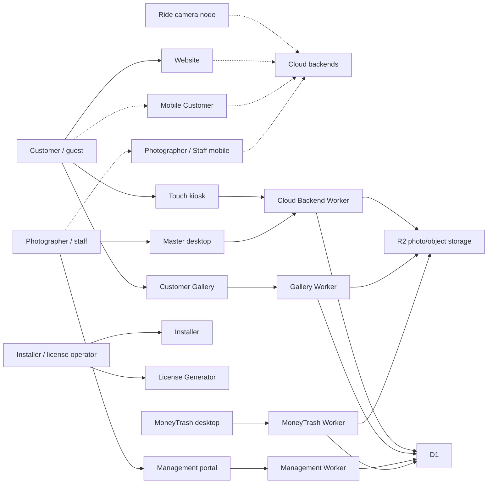
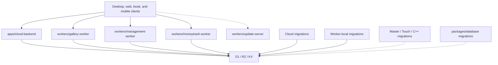
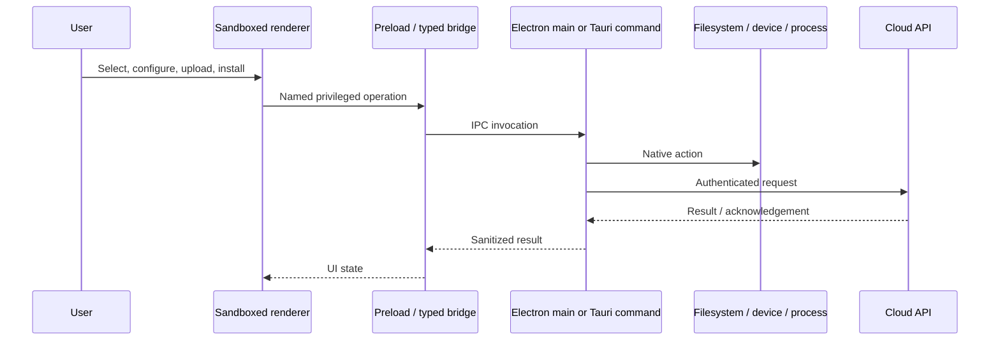
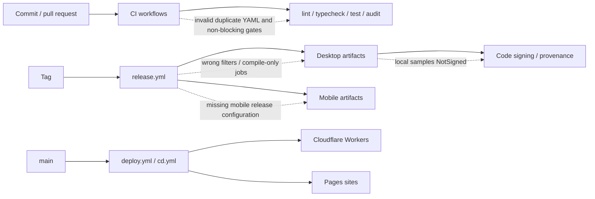

# Current Architecture

This is a source-derived architecture, not an assertion that every depicted deployment is live. Solid arrows have repository evidence; dashed arrows are intended or plausible relationships whose deployed configuration/runtime behavior was not proven.

## Ecosystem context

## Backend authority problem

There is no single discoverable contract, authorization policy, schema owner, or migration authority spanning these services. That amplifies both the route-level authorization defects and schema drift risk.

## Desktop trust boundary

The repository generally configures Electron renderers with `nodeIntegration: false`, `contextIsolation: true`, and sandboxing, which is a meaningful positive control. Assurance remains incomplete until every privileged IPC handler validates sender, input, authorization, cancellation, and error redaction. MoneyTrash currently violates the intended flow at the UI/service seam; Ride Node violates the acknowledgement-before-delete property.

## Build and deployment topology

## Architectural characteristics

- **Strengths:** clear product separation; typed React/TypeScript majority; hardened Electron renderer defaults; dedicated Workers; multiple focused packages; broad Master test inventory.
- **Critical weaknesses:** authorization is not centralized or consistently applied; schema and migration ownership are fragmented; release truth differs from workflow labels; several experimental surfaces appear production-adjacent.
- **Coupling:** UI clients bind directly to several API authorities, while duplicated UI components and local service abstractions reduce reuse consistency.
- **Operability:** deployment workflows exist, but invalid CI, non-blocking gates, unsigned artifacts, no proven rollback, and incomplete mobile/update paths prevent production assurance.

See `05-interface-data-inventory.md`, `13-master-finding-register.md`, and EVID-0009 through EVID-0017.
