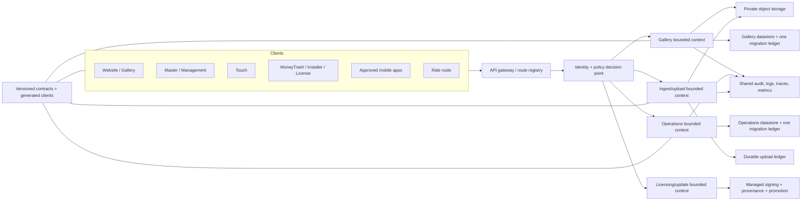

# Target Architecture Roadmap

The target is a controlled evolution, not a rewrite. Product-specific bounded contexts may remain separate, but identity, authorization, contracts, schema ownership, telemetry and release trust must stop drifting.

## Target logical architecture

## Non-negotiable properties

1. Deny by default; one explicit public-route registry.
2. Principal scope is derived from verified credentials, never request body/query alone.
3. Object queries include tenant/event/user scope; policy is tested centrally and per route.
4. Objects are private by default; downloads are short-lived, scoped, logged and revocable.
5. One datastore owner and immutable migration ledger per bounded context.
6. Native clients expose minimal typed capabilities through validated bridges.
7. Upload queues are durable, idempotent and checksum-verified; no delete before durable acknowledgement.
8. Every deployable has a manifest, owner, CI job, artifact/provenance, observability and rollback.
9. Mobile/experimental code is physically and operationally separated from production release scope.
10. Privacy retention/deletion and accessibility complete processes are designed into contracts and release gates.

## Evolution sequence

### Stage A — Control plane (0-30 days)

- Generate canonical surface/route/deployment inventory.
- Introduce central Cloud Backend auth/policy middleware and emergency route allowlist.
- Make CI fail closed and pause orphan/unverified deployment paths.
- Establish data, incident and release ownership.

### Stage B — Contracts and data authority (31-60 days)

- Define bounded contexts and versioned OpenAPI/event contracts.
- Wrap existing Worker handlers behind shared identity/policy and error/telemetry libraries.
- Assign one migration ledger per datastore; make other copies archival or generated.
- Introduce durable upload ledger and private object-access service.

### Stage C — Client convergence (61-120 days)

- Generate typed clients; remove direct ad hoc endpoint construction.
- Consolidate accessible UI primitives without broad visual rewrite.
- Normalize desktop IPC schema/sender validation and streaming upload contract.
- Decide which mobile apps are products; archive starters or complete them.

### Stage D — Release trust and simplification (90-180 days)

- Managed signing, SBOM/provenance and artifact promotion.
- One update authority with signed metadata and rollback.
- Deprecate orphan packages/Update Server or assign supported contracts.
- Decompose high-risk large modules along measured bounded-context seams.

## Decision records required

| ADR | Decision |
|---|---|
| ADR-T01 | Canonical identity provider, token/session format, rotation and revocation |
| ADR-T02 | Public route registry and role/tenant/event authorization model |
| ADR-T03 | Bounded contexts and which Worker owns each mutation/data object |
| ADR-T04 | Datastore and migration ownership, compatibility and restore |
| ADR-T05 | Private photo/RAW object-access and retention model |
| ADR-T06 | Desktop IPC capability and streaming upload contract |
| ADR-T07 | Canonical desktop update/signing/provenance channel |
| ADR-T08 | Mobile product scope and release pipeline |
| ADR-T09 | Observability, audit logging, PII redaction and retention |
| ADR-T10 | Accessibility target and complete-process evidence policy |

## Migration safeguards

- Strangler-style routing behind explicit versioned contracts; no flag-day backend rewrite.
- Shadow/read comparison with synthetic or approved data before authority transfer.
- Dual write only with reconciliation ledger, idempotency and explicit time-bounded exit.
- Expand/contract schemas compatible with N-1 clients.
- Canary by tenant/event/device cohort with automatic health rollback.
- No destructive schema, object, history, key or production action without approved runbook and backup/restore evidence.

The current-to-target dependency sequence is represented in `17-prioritized-backlog.md`.
