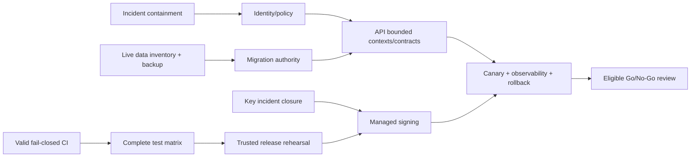

# Prioritized Backlog

Effort: S (days), M (1-2 weeks), L (multi-week/cross-team). Priority is risk-first; no production action is authorized by this list.

| Backlog ID | Priority | Finding(s) | Deliverable | Owner role | Effort | Depends on | Acceptance summary |
|---|---|---|---|---|---:|---|---|
| BL-001 | P0 | SEC-001 | Edge containment and deployed route/revision inventory | Cloud + Security | S | Incident authority | Affected routes blocked; logs preserved |
| BL-002 | P0 | SEC-001 | Central auth/role/tenant/event/object policy and route migration | Cloud + Security | L | BL-001 | 100% non-public route matrix and negative tests |
| BL-003 | P0 | SEC-001 | Remove fallback JWT secret and rotate/invalidate | Security | S | Incident authority | No fallback; old tokens rejected; metadata evidence |
| BL-004 | P0 | SEC-002, PRIV-001 | Restricted PEM/WAL incident classification and containment | Incident/Privacy | M | Legal/change authority | Classification and action record without content disclosure |
| BL-005 | P0 | OPS-001 | Repair workflow YAML, block required checks, pin actions | Platform | M | None | Unique parse; intentional failure blocks |
| BL-006 | P0 | OPS-002 | Pause/quarantine untrusted release/update artifacts | Release | S | None | No unsigned/unverified publication |
| BL-007 | P0 | FUNC-002 | Disable Ride deletion and production use | Ride owner | S | None | Sole copy retained on all current paths |
| BL-008 | P0 | DATA-001 | Map live databases, ledgers, owners; verify backup | Data | M | Production read access | One inventory; restore smoke |
| BL-009 | P1 | TEST-001 | Cloud Backend authorization/contract/integration suite | Cloud + QE | L | BL-002 | Route-generated positive/negative matrix |
| BL-010 | P1 | FUNC-001 | Unify MoneyTrash picker/drop with native streaming | MoneyTrash | M | IPC contract | Packaged file/folder/drop pass |
| BL-011 | P1 | FUNC-001 | Upload cancel/resume/durable acknowledgement | MoneyTrash | M | BL-010 | Fault suite and bounded memory pass |
| BL-012 | P1 | OPS-002 | Correct release package/filter/platform matrices | Release | M | BL-005 | Clean dry-run emits declared artifacts |
| BL-013 | P1 | OPS-002 | Managed signing, SBOM, provenance, promotion | Release/Security | L | BL-012, key incident | OS-verifiable artifacts and immutable hashes |
| BL-014 | P1 | OPS-003 | Remove or fully charter Update Server | Release/Architecture | M | ADR-T07 | Exactly one update authority |
| BL-015 | P1 | DATA-001 | Consolidate migration authority per datastore | Data + service owners | L | BL-008, ADR-T04 | Clean/N-1/restore tests converge |
| BL-016 | P1 | ARCH-001 | Bounded-context/API ownership and contracts | Architecture | L | Route/data inventory | No overlapping unowned mutations |
| BL-017 | P1 | SEC-003 | Central CORS/session/browser policy | Security platform | M | BL-002 | Origin/session matrix passes |
| BL-018 | P1 | SEC-003 | Privileged IPC sender/schema/capability inventory | Desktop owners | L | ADR-T06 | Every handler tested and allowlisted |
| BL-019 | P1 | TEST-001 | Manifest-driven CI coverage for every deployable | Platform + QE | M | BL-005 | Inventory and CI matrix are bijective |
| BL-020 | P1 | DOC-001 | Replace readiness claims with evidence-backed lifecycle | Eng leadership/docs | M | Inventory | No unsupported “100%/production-ready” claims |
| BL-021 | P2 | UX-001 | Shared accessible primitive contract and pilot | Design Systems | L | WCAG protocol | Component and pilot journey evidence |
| BL-022 | P2 | UX-001 | Complete-process accessibility matrix | Accessibility + QE | L | BL-021 | Release-scope A/AA evidence |
| BL-023 | P2 | PERF-001 | Representative photo workload and budgets | Performance | M | Product SLOs | Repeatable p50/p95/p99 baseline |
| BL-024 | P2 | PERF-001 | Profile/tune ingest, grid, upload and Worker queries | Surface owners | L | BL-023 | Budgets pass on minimum hardware |
| BL-025 | P2 | ARCH-002 | Package consumer/owner review and archival | Monorepo owner | M | External consumer check | Supported catalog; orphans archived |
| BL-026 | P2 | ARCH-002 | Move generated coverage/Storybook outputs to CI artifacts | Monorepo owner | S | Retention decision | Clean tree policy enforced |
| BL-027 | P2 | TEST-001 | Mobile product decision, tests and release config | Product/Mobile | L | ADR-T08 | Each app archived or has complete gate |
| BL-028 | P2 | FUNC-002 | Implement Ride durable spool/idempotent uploader | Ride owner | L | Upload API contract | Failure never deletes sole copy |
| BL-029 | P2 | ARCH-001 | Shared telemetry/error/redaction contract | Observability/Security | L | Bounded contexts | Cross-service traces and alerts |
| BL-030 | P2 | DATA-001 | Backup/restore and migration-failure game day | Data/SRE | M | BL-015 | RPO/RTO and integrity accepted |
| BL-031 | P3 | ARCH-002, UX-001 | Consolidate duplicate UI components by behavior | Design Systems | L | BL-021 | No regression; local duplicates reduced |
| BL-032 | P3 | PERF-001 | Decompose measured high-change modules | Surface owners | L | BL-023/024 | Complexity reduced without perf regression |

## Dependency chain

Backlog closure requires the full acceptance criteria in `13-master-finding-register.md`, not merely completion of the deliverable column.
