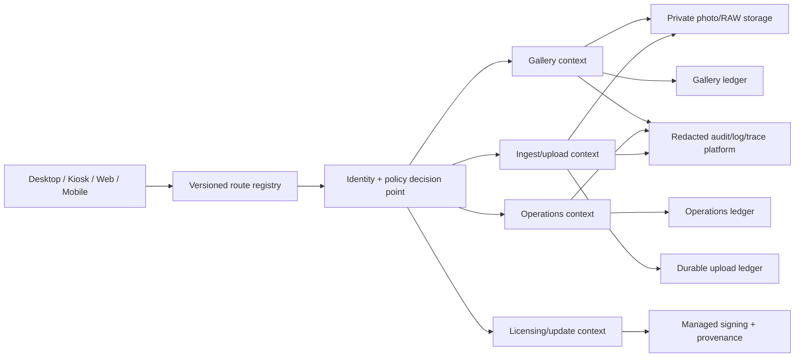

# Dependency-Ordered Execution Roadmap

The target is controlled evolution, not a rewrite. Security containment and release trust precede
large architecture or design-system work.

## 0–72 hours: contain credible harm

| Order | Action | Owner | Exit evidence |
|---:|---|---|---|
| 1 | Pause Cloud Backend, desktop release, updater, Ride, and migration automation for affected scope | Incident + Release | Written No-Go, protected environments, preserved logs |
| 2 | Edge-block unguarded Cloud routes; make RAW/photo objects private | Cloud + Security | Deployed route inventory and deny probes |
| 3 | Remove fallback JWT behavior, rotate secret, invalidate affected tokens | Cloud + Security | Metadata-only rotation record; old-token rejection |
| 4 | Classify tracked PEM and WAL under restricted incident handling | Security + Privacy | Validity/sensitivity decision, rotation/notification/history plan |
| 5 | Disable all Ride deletion after simulated/unverified upload | Ride owner | Source path cannot remove sole copy; fault test |
| 6 | Freeze remote/destructive migrations; inventory live database IDs and ledgers | Data owner | One signed owner/ledger table plus verified backup |
| 7 | Repair CI YAML enough to establish fail-closed required checks | Platform | All workflows parse; deliberate failure blocks |

## Week 1–2: restore a trustworthy engineering gate

1. Fix type failures in Master, Management, Mobile Photographer, and Cloud Backend.
2. Add first-class type/test scripts for Cloud Backend and Update Server or remove them from
   production scope.
3. Generate the CI matrix from deployable manifests and explicit non-Node services.
4. Remove `continue-on-error` from required security, lint, type, and test gates.
5. Pin external GitHub Actions to reviewed immutable SHAs.
6. Make Worker tests hermetic; use temporary audit-log sinks and enforce a clean worktree.
7. Correct release package names, OS matrices, artifact locations, and existence checks.
8. Add No-Go/superseded banners to unsupported completion claims.

## Days 15–30: close product-breaking seams

### Cloud identity and object policy

- Create one explicit public-route allowlist.
- Require authentication for every other route.
- Derive role, tenant, event, and object scope from verified credentials.
- Bind photo queries to both photo ID and authorized event/tenant.
- Remove public RAW URLs; issue short-lived scoped downloads.
- Add generated positive/negative tests for every route.

### MoneyTrash durability

- Replace whole-file `read_file` with one typed native file descriptor.
- Route file selection, folder selection, and drag/drop through the same bounded-streaming path.
- Expose cancel, retry, resume, restart recovery, checksums, and durable acknowledgement.
- Retain originals until remote object and ledger verification both succeed.

### Release and data truth

- Name one update authority and remove the placeholder Worker if it is not selected.
- Map every datastore to one schema/migration owner.
- Rehearse clean install, N-1 upgrade, failed migration, backup, and restore on isolated data.
- Decide which mobile apps and native services are products; archive or operationally isolate the rest.

## Days 31–60: unify contracts and prove journeys

| Workstream | Deliverable | Gate |
|---|---|---|
| Identity/policy | Shared decision point plus route registry | 100% non-public routes have role/scope negative tests |
| Contracts | Versioned API/IPC/event schemas and generated clients | Consumer contract matrix passes |
| Data | One immutable ledger per datastore | Clean install/N-1/restore converge |
| Desktop | Narrow typed IPC capabilities and sender validation | Packaged adversarial IPC suite passes |
| Journeys | Master→Touch order, upload→gallery, checkout→download, install→update | Success and injected-failure E2E pass |
| Privacy | Retention, deletion, export, photo/biometric consent | Owner-approved policy and automated controls |
| Accessibility | WCAG 2.2 complete-process protocol | Keyboard/AT/zoom/touch evidence for customer paths |
| Observability | Correlation IDs, redaction, route/queue/sync metrics | Synthetic failures trigger actionable alerts |

## Days 61–90: establish release eligibility

- Produce clean reproducible desktop builds with SBOM, provenance, managed signing, and immutable
  artifact promotion.
- Test fresh install, upgrade, interruption, tamper, downgrade prevention, rollback, and uninstall.
- Run backup/restore and migration-failure game days against isolated representative datasets.
- Measure p50/p95/p99 latency, startup, memory, photo-grid, RAW batch, Worker cost, and queue lag.
- Complete manual plus automated WCAG evidence for all release-scope journeys.
- Canary by tenant/event/device cohort with health-based automatic rollback.

## Months 3–6: simplify architecture after controls work

- Keep product bounded contexts where they provide failure isolation.
- Consolidate identity, policy, validation, error, telemetry, and contract behavior.
- Consolidate duplicate UI only by accessibility/behavior contract, not by visual rewrite.
- Archive orphan packages, generated outputs, starters, and superseded services after consumer proof.
- Decompose large modules only after measurement identifies a stability or performance seam.

## Final production gate

Production review is eligible only when:

- No P0 finding remains open.
- All release-scope type, lint, test, security, packaging, and provenance gates pass from a clean checkout.
- Every deployable has an owner, rollback, telemetry, runbook, and supported lifecycle.
- Object/tenant/role isolation has independent negative testing.
- Backup/restore and failed migration are rehearsed.
- Desktop artifacts are signed and update metadata is tamper-resistant.
- Critical journeys pass normal, offline, retry, interruption, and recovery variants.
- Accessibility and performance claims have representative runtime evidence.

