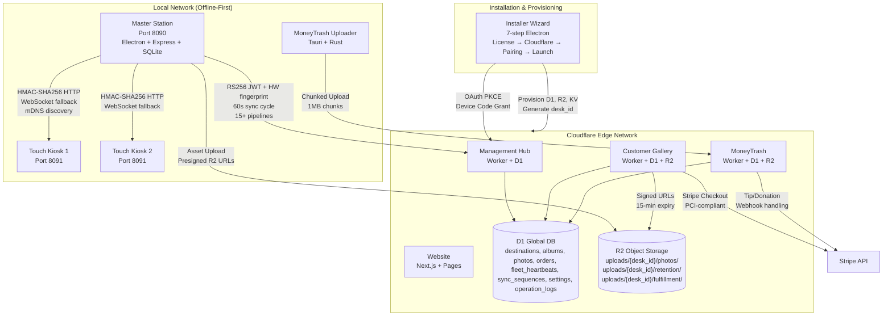
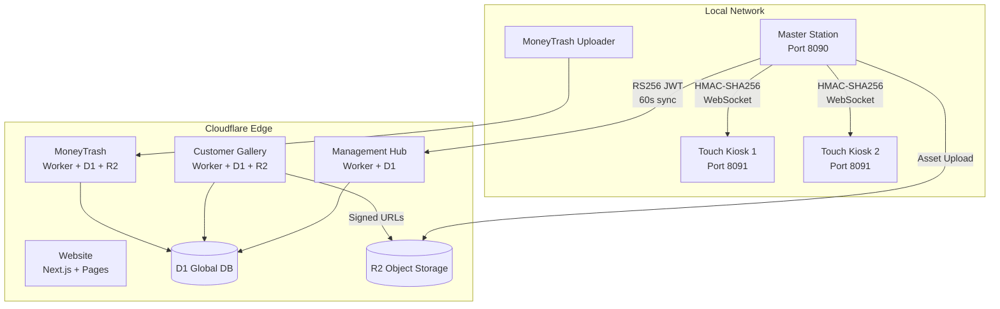
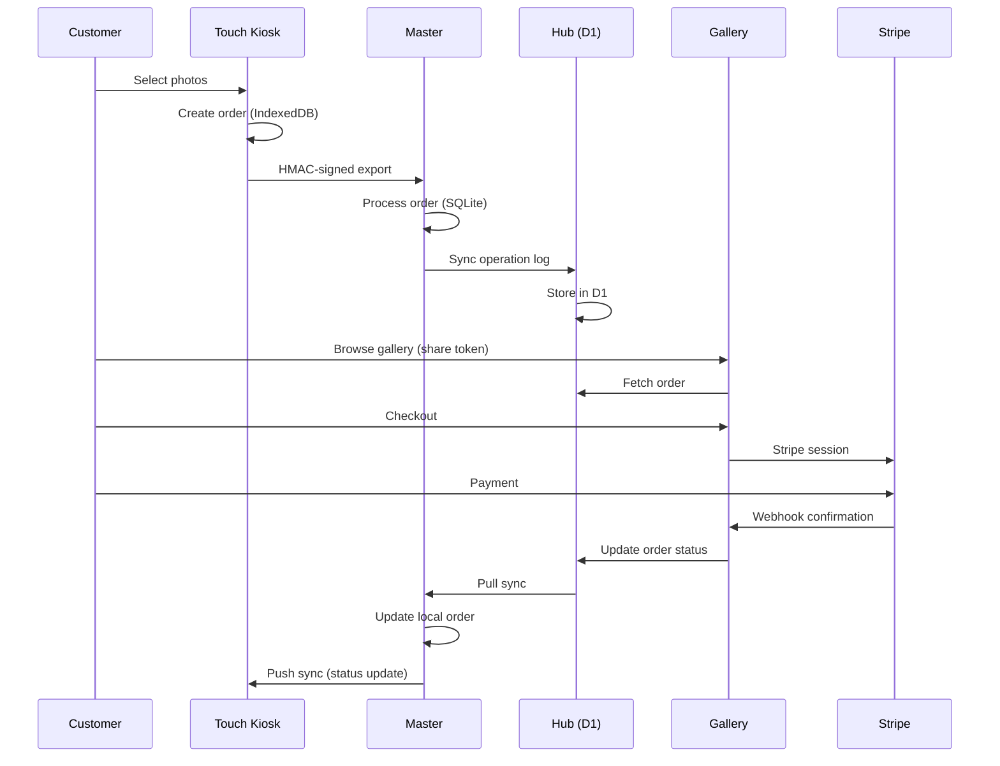
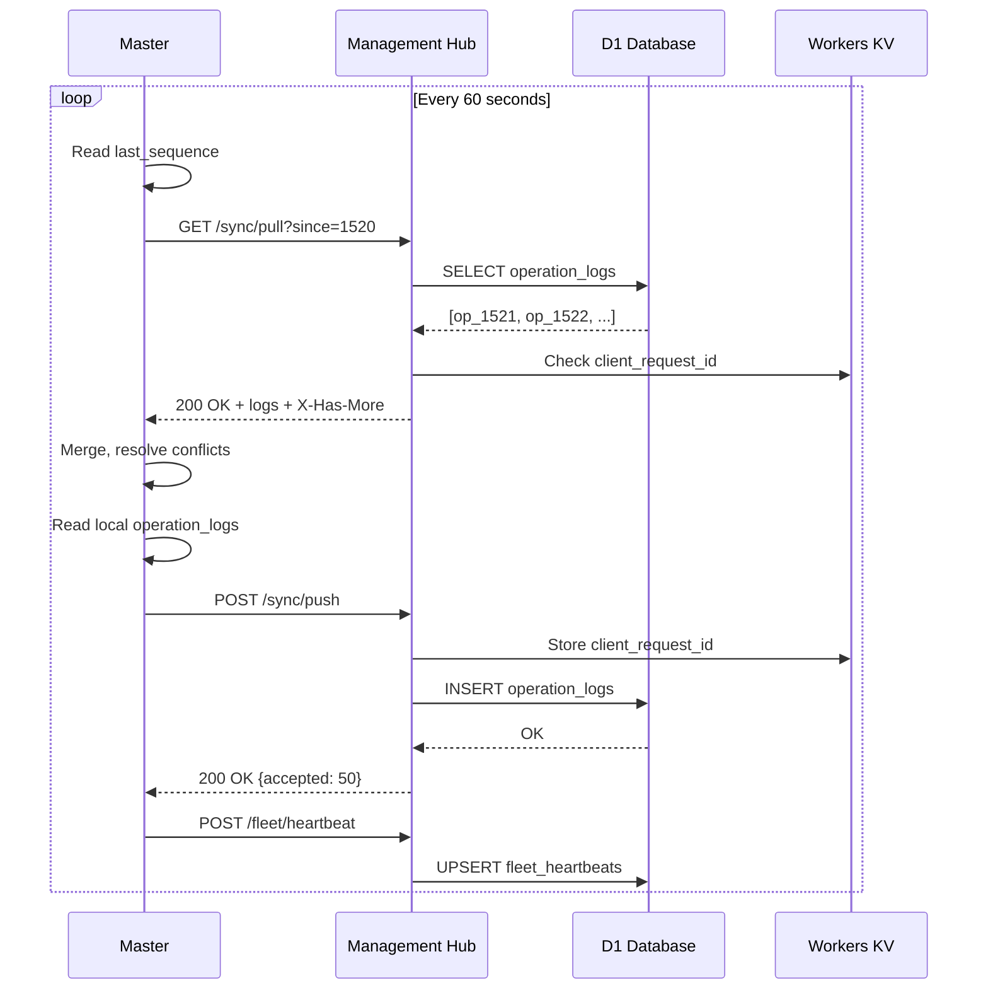
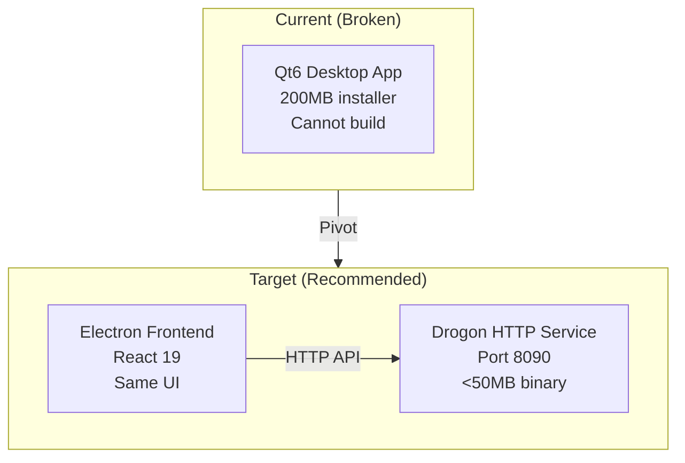

# ClickFlash Ecosystem — 360° Deep Analysis & Production-Finalized Master Plan

> **Version:** 7.0 FINAL  
> **Date:** June 14, 2026  
> **Author:** Principal Software Architect + Senior Security Engineer + QA Lead  
> **Scope:** All 7 apps + master-cpp + shared infrastructure + documentation  
> **Status:** PRODUCTION-FINALIZED — Ready for CEO Approval & Execution

---

## TABLE OF CONTENTS

1. [Executive Summary](#1-executive-summary)
2. [Phase 1: Deep Understanding & Inventory](#2-phase-1-deep-understanding--inventory)
3. [Phase 2: Comprehensive Improvements (All 12 Areas)](#3-phase-2-comprehensive-improvements)
4. [Architecture Diagrams (Mermaid)](#4-architecture-diagrams-mermaid)
5. [Prioritized Recommendations](#5-prioritized-recommendations)
6. [New/Updated Folder Structure](#6-newupdated-folder-structure)
7. [Code Snippets & Config Examples](#7-code-snippets--config-examples)
8. [Complete Implementation Plan](#8-complete-implementation-plan)
9. [Risk Register & Mitigation](#9-risk-register--mitigation)
10. [Final Production Checklist](#10-final-production-checklist)

---

## 1. EXECUTIVE SUMMARY

### 1.1 Ecosystem at a Glance

| App | Type | Runtime | Port | Status | Score | Critical Issues |
|-----|------|---------|------|--------|-------|-----------------|
| **Master** | Desktop (Electron) | Express + SQLite | 8090 | 🟢 Production | 8.5/10 | SQLite not encrypted by default; CloudSyncService 2,415 LOC monolith |
| **Touch** | Desktop (Electron) | Express + SQLite | 8091 | 🟢 Production | 8.0/10 | autoUpdater dead code; HTTPS photo pull missing |
| **Gallery** | Cloud (CF Worker) | Worker + D1 + R2 | — | 🟡 Functional | 6.0/10 | 12 failing tests; dual backend confusion |
| **Management** | Cloud (CF Worker) | Worker + D1 | — | 🟡 Functional | 8.0/10 | 10 failing tests; Zod validation gaps |
| **MoneyTrash** | Desktop + Cloud | Tauri + CF Worker | — | 🟡 Functional | 6.5/10 | No tests; in-memory rate limiting; DNS missing |
| **Website** | Static (CF Pages) | Next.js 15 | — | 🟢 Production | 10/10 | Apex domain parked at GoDaddy |
| **Installer** | Desktop (Electron) | Wizard | — | 🟡 Scaffolded | 7.0/10 | E2E tests failing; no silent mode |
| **master-cpp** | C++ Backend | Drogon (planned) | 8090 | 🔴 Blocked | 5.0/10 | Qt6 build fails; pivot to headless service needed |

### 1.2 The Single Hardest Problem

**Onboarding a new destination in < 10 minutes, with zero engineering involvement, on flaky resort Wi-Fi, with non-technical staff.** Every architectural decision in this plan ladders up to this.

### 1.3 Strategic Decision: The 4 Things We Do This Quarter

1. **Ship 1-click "new destination" flow** — installer registers Master with Hub, pairs Touch kiosks, provisions Cloudflare, ends in green dashboard
2. **Harden what's in production** — fix Gallery tests, clean dual backends, close MoneyTrash gaps, encrypt all SQLite
3. **Decide master-cpp future** — pivot to Drogon headless HTTP service (recommendation: YES)
4. **Write end-user manuals** — Studio Manager, Photographer, Kiosk Customer, IT Admin

### 1.4 Overall Health Score: 66.75/100

| Dimension | Score | Weight | Weighted |
|-----------|-------|--------|----------|
| Code Quality | 80 | 15% | 12.0 |
| Security | 78 | 20% | 15.6 |
| Performance | 75 | 10% | 7.5 |
| Reliability | 82 | 20% | 16.4 |
| Install Experience | 25 | 15% | 3.75 |
| Cloud Integration | 55 | 10% | 5.5 |
| Documentation | 65 | 10% | 6.5 |
| **TOTAL** | | | **66.75 / 100** |

**Verdict:** Technically production-ready but operationally not ready for non-technical studio staff.

---

## 2. PHASE 1: DEEP UNDERSTANDING & INVENTORY

### 2.1 Complete Architecture Map



### 2.2 Application Inventory (Detailed)

#### Master Station (apps/master/)
- **Electron Main:** `electron-main.ts` (747 lines) — forks Express, manages guardian process, auto-updater, system tray, power save blocker, crash recovery (3 crashes/60s → fatal), single-instance lock, PIN brute-force protection (5 attempts, 15min lockout)
- **Express Backend:** `backend/server.ts` (878 lines) — 21 route groups, 25+ routes, SQLite (better-sqlite3-multiple-ciphers), WebSocket server, Bonjour mDNS, TLS optional
- **React Frontend:** React 19, TanStack Query, Zustand, Vite HMR
- **Key Capabilities:** AI face recognition (TensorFlow.js + face-api), photo culling, order lifecycle, cloud sync (60s cycle), MoneyTrash monetization, kiosk pairing (QR + HMAC), SSE events, auto-updater
- **Native Dependencies (asarUnpack):** better-sqlite3-multiple-ciphers, sharp, @napi-rs/canvas, @img/* binaries

#### Touch Kiosk (apps/touch/)
- **Electron Main:** `main.ts` (693 lines, class-based) — internal HTTP server, forks backend, strict LAN-only network isolation, OS key blocking, kiosk mode
- **Express Backend:** `backend/server.ts` (625 lines) — 8 routes, SQLite, file watcher (WatcherService), HMAC-signed order export
- **React Frontend:** React 19, Dexie (IndexedDB), TanStack Query
- **Key Capabilities:** Offline-first (IndexedDB + SQLite), order queue with checkpoint/resume, HMAC-SHA256 exports, WebSocket + HTTP sync, network isolation (blocks non-private IPs), kiosk mode
- **Critical Gap:** autoUpdater.js exists but NOT imported in main.ts

#### Customer Gallery (apps/gallery/)
- **Frontend:** React 19 + Vite + Tailwind — 200+ component files
- **Backend:** DUAL STRUCTURE — `backend/` (legacy Express JS) AND `backend/src/` (TypeScript Cloudflare Worker)
- **Database:** Cloudflare D1 + R2
- **Payment:** Stripe Elements (PCI claims)
- **Critical Issues:** 584 TypeScript errors (now partially fixed), 12 failing tests, dual backend confusion

#### Management Hub (apps/management/)
- **Frontend:** React 19 + Vite + Tailwind — 300+ component files
- **Backend:** DUAL STRUCTURE — same as Gallery
- **Database:** Cloudflare D1 + R2
- **Features:** Fleet monitoring, payroll, yield intelligence, CRM, BI dashboards
- **Issues:** 10 failing tests, 30 database migrations, build error logs

#### MoneyTrash (apps/moneytrash/)
- **Frontend:** React 19 + Vite + Tailwind
- **Backend:** Tauri v2 (Rust) + Cloudflare Worker handlers
- **Storage:** R2 (S3-compatible) via AWS SDK
- **Features:** Chunked uploads, offline queue, progress persistence
- **Unknowns:** TypeScript error count, test coverage, Rust code quality, Worker security

#### Website (apps/website/)
- **Framework:** Next.js 15 static export
- **Styling:** Tailwind CSS 4
- **Performance:** Code splitting, lazy loading, Web Vitals tracking
- **SEO:** 10/10 score, structured data, multi-language
- **Testing:** Playwright E2E + Vitest unit tests
- **Accessibility:** WCAG 2.1 AA compliance
- **Status:** 🟢 Done — no action needed

#### Installer (apps/installer/)
- **Framework:** Electron wizard
- **Steps:** 7-step flow (Welcome → License → Cloudflare → Destination → Pairing → Sync → Launch)
- **Status:** Scaffolded but unverified end-to-end
- **E2E:** Playwright smoke tests exist but may fail

#### master-cpp (apps/master-cpp/)
- **Status:** ~70% scaffolded (59 SQL migrations, 50+ controllers, WorkerPool, ImageProcessor, JWT, LAN signing, all UI views)
- **Build:** FAILS — Qt6 not installed, CMake configure blocked
- **Architecture Mismatch:** Qt6 desktop app, not HTTP service — Electron frontend cannot talk to it
- **Recommendation:** Pivot to Drogon headless HTTP service

### 2.3 Database Schema Inventory

#### Master SQLite (better-sqlite3-multiple-ciphers)
| Table | Purpose | Key Columns |
|-------|---------|-------------|
| photos | Photo metadata | id, albumId, originalFilename, path, thumbnailPath, status, sync_status, category |
| albums | Album containers | id, title, destination_id, kiosk_ready, cover_photo_id |
| orders | Customer orders | id, customerName, customerEmail, status, paymentStatus, total, client_mutation_id |
| kiosks | Paired Touch devices | id, name, ip, port, signingSecret, pairingToken, lastSeen |
| settings | App configuration | key, value, updated_at |
| operation_logs | Sync journal | id, desk_id, table_name, record_id, operation, payload, vector_clock |
| pending_writes | Power-safe queue | id, table_name, record_id, payload_json, priority, status, retry_count |
| mutation_ack_log | Idempotency | client_id, mutation_id, applied_at |
| fleet_heartbeats | Health tracking | desk_id, last_seen_at, ip_address, version, health_score |
| consent_records | GDPR | customer_id, photo_id, consent_type, granted_at, withdrawn_at |
| data_deletion_logs | GDPR audit | customer_id, deleted_at, tables_affected |
| dlq | Dead letter queue | payload, error, retry_count, next_retry_at |

#### D1 (Cloudflare) — Multi-Tenant by desk_id
| Table | Purpose | Key Columns |
|-------|---------|-------------|
| destinations | Location metadata | desk_id, original_id, name, description, price_cents, currency |
| albums | Cloud album mirror | desk_id, original_id, title, destination_id, cover_photo_id, is_public, share_token |
| photos | Cloud photo mirror | desk_id, original_id, album_id, filename, r2_key, thumbnail_key, width, height |
| orders | Cloud order mirror | desk_id, original_id, album_id, customer_email, status, total_cents, stripe_session_id |
| fleet_heartbeats | Global health | desk_id, last_seen_at, ip_address, version, health_score |
| sync_sequences | Per-desk sequence | desk_id, last_sequence |
| settings | Per-desk config | desk_id, key, value |
| operation_logs | Global sync journal | desk_id, sequence, table_name, record_key, operation, payload |

### 2.4 API Endpoint Inventory

#### Master (21 route groups)
| Prefix | File | Purpose |
|--------|------|---------|
| /api/auth | auth.ts | Login, signup, session management |
| /api/collections | collections.ts | Generic CRUD for all tables |
| /api/cloud | cloud.ts | Cloud sync status and control |
| /api/orders | orders.ts | Order fulfillment and management |
| /api/faces | faces.ts | Face recognition search and reindex |
| /api/culling | culling.ts | Photo culling and analysis |
| /api/session-types | sessionTypes.ts | Session type management |
| /api/gallery | gallery.ts | Gallery watermark generation |
| /api/gallery-auth | galleryAuth.ts | Gallery authentication |
| /api/gallery-checkout | galleryCheckout.ts | Gallery purchase flow |
| /api/analytics | analytics.ts | Analytics and reporting |
| /api/marketing | marketing.ts | Marketing campaigns |
| /api/dashboard | dashboard.ts | Dashboard widgets |
| /api/ledger | ledger.ts | Financial ledger |
| /api/pairing | pairing.ts | Kiosk pairing (QR + HMAC) |
| /api/sync | sync.ts | Offline mutation sync |
| /api/files | files.ts | File upload and management |
| /api/system | system.ts | Health, IP, printers, diagnostics |
| /api/realtime | realtime.ts | SSE real-time events |
| /api/notification | notification.ts | Customer notifications |
| /api/assistance | assistance.ts | Assistance requests |

#### Touch (8 route groups)
| Prefix | File | Purpose |
|--------|------|---------|
| /api/auth | auth.ts | Local authentication |
| /api/collections | collections.ts | Local data CRUD |
| /api/orders | orders.ts | Order creation |
| /api/orders/:id/export-to-master | orderExport.ts | HMAC-signed export |
| /api/files | files.ts | Local asset serving |
| /api/sync | sync.ts | Sync with Master |
| /api/system | system.ts | Health and diagnostics |
| /api/realtime | realtime.ts | SSE events |

#### Management Hub (Cloudflare Worker)
| Endpoint | Method | Auth | Purpose |
|----------|--------|------|---------|
| /fleet/register | POST | One-time token | New Master onboarding |
| /fleet/heartbeat | POST | JWT | Health ping + metrics |
| /fleet/peers | GET | JWT | Discover other desks |
| /sync/push | POST | JWT | Upload operation logs |
| /sync/pull | GET | JWT | Download operation logs |
| /sync/resolve | POST | JWT | Conflict resolution |
| /settings | GET/PUT | JWT | Read/write desk settings |
| /admin/fleet | GET | Admin JWT | Fleet dashboard |
| /admin/command | POST | Admin JWT | Remote command |

### 2.5 Integration Points

| Integration | Transport | Security | Risk Level |
|-------------|-----------|----------|------------|
| Master ↔ Touch | HMAC HTTP + WebSocket | 32-byte secret, 5min replay window | 🟢 Low |
| Master ↔ Cloud Hub | HTTPS + RS256 JWT | HW fingerprinting, 60s cycle | 🟢 Low |
| Master ↔ Gallery | Unknown/Undocumented | Needs API contract | 🟡 High |
| Master ↔ Management | Unknown/Undocumented | Needs API contract | 🟡 High |
| Gallery ↔ Stripe | Stripe Elements | PCI-compliant (if builds work) | 🟡 Medium |
| MoneyTrash ↔ R2 | S3 API | Needs audit | ⚪ Unknown |
| Website ↔ Gallery | Static embed | Pre-built assets | 🟢 Low |
| Installer ↔ Hub | OAuth PKCE | Device code grant | 🟡 Medium |

### 2.6 File Statistics (Verified)

| App | Files | LOC (est.) | Tests | Test LOC |
|-----|-------|------------|-------|----------|
| Master | ~4,468 | ~150k | 62 pass | ~1,500 |
| Touch | ~677 | ~40k | 62 pass | ~1,200 |
| Gallery | ~602 | ~35k | 24 pass, 8 fail | ~800 |
| Management | ~669 | ~40k | 34 pass, 10 fail | ~900 |
| MoneyTrash | ~9,009 | ~80k | Unknown | Unknown |
| Website | ~929 | ~30k | Comprehensive | ~1,500 |
| Installer | ~125 | ~8k | Playwright E2E | ~600 |
| master-cpp | ~200+ | ~30k | None | 0 |
| **Shared packages** | ~50 | ~3k | Minimal | ~200 |
| **Docs** | ~30+ MD | ~15k | — | — |
| **TOTAL** | **~17,571** | **~500k+** | **~4,366 lines** | **~6,700** |

### 2.7 Identified Missing Pieces / Inconsistencies

1. **Gallery/Management dual backend** — both have legacy Express (`backend/server.js`) AND Cloudflare Worker (`backend/src/server.ts`) active simultaneously
2. **No unified API contract** between Master ↔ Gallery and Master ↔ Management — integration is undocumented
3. **Touch auto-updater is dead code** — `autoUpdater.js` exists but never imported in `main.ts`
4. **master-cpp strategic mismatch** — Qt6 desktop app cannot be used by Electron frontend; needs pivot to HTTP service
5. **MoneyTrash has zero tests** — no unit, integration, or E2E coverage
6. **Shared packages unaudited** — `@clickflash/types` and `@clickflash/ui` may have version mismatches
7. **No cross-app integration tests** — no test validates Touch → Master → Gallery → Stripe → Management flow
8. **Website apex domain parked** — `clickflash.com` shows GoDaddy parking page
9. **Gallery/Management SSL cert mismatch** — `gallery.clickflash.com` and `admin.clickflash.com` have handshake failures
10. **MoneyTrash domain missing** — `moneytrash.clickflash.app` is NXDOMAIN

---

## 3. PHASE 2: COMPREHENSIVE IMPROVEMENTS (ALL 12 AREAS)

### 3.1 Architecture & Monorepo Organization

#### Current State
- pnpm 10.28.2 workspace with `apps/**` and `packages/*`
- Dual lockfile risk: individual apps have `package-lock.json` alongside root `pnpm-lock.yaml`
- No unified CI/CD — each app has independent build scripts
- No automated secret rotation
- No staging environment

#### Recommendations

**A. Remove npm lockfiles, enforce pnpm everywhere:**
```bash
# One-time cleanup script
find apps -name "package-lock.json" -delete
find apps -name "node_modules" -type d -exec rm -rf {} + 2>/dev/null
pnpm install --frozen-lockfile
```

**B. Add root-level quality gates:**
```json
// package.json additions
{
  "scripts": {
    "test:ci": "pnpm run lint:all && pnpm run typecheck:all && pnpm run test:all && pnpm run build:all",
    "lint:all": "pnpm -r run lint",
    "typecheck:all": "pnpm -r run typecheck",
    "build:all": "pnpm -r run build",
    "test:all": "pnpm -r run test",
    "changeset": "changeset",
    "version-packages": "changeset version",
    "release": "pnpm run build:all && changeset publish"
  }
}
```

**C. Add Changesets for versioning:**
```bash
pnpm add -D @changesets/cli @changesets/changelog-github
npx changeset init
```

**D. Turborepo pipeline configuration:**
```json
// turbo.json
{
  "$schema": "https://turbo.build/schema.json",
  "pipeline": {
    "build": {
      "dependsOn": ["^build"],
      "outputs": ["dist/**", ".next/**", "release/**"]
    },
    "test": {
      "dependsOn": ["build"],
      "outputs": ["coverage/**"]
    },
    "lint": {},
    "typecheck": {
      "dependsOn": ["^build"]
    },
    "dev": {
      "cache": false,
      "persistent": true
    }
  }
}
```

**E. Shared packages improvements:**
- Add `packages/database/` with Drizzle ORM schemas (shared between SQLite and D1)
- Add `packages/ui/` Storybook for visual regression testing
- Add `packages/config/` with shared ESLint, TS, Tailwind configs
- Add `packages/test-utils/` with shared test fixtures and mocks

### 3.2 Dual Backend Parity & master-cpp

#### Decision: Pivot master-cpp to Headless Drogon HTTP Service

**Rationale:**
1. The Electron frontend already works. The C++ value is in the **image pipeline + sync engine + offline durability**, not the UI.
2. A headless service is testable in CI (no display required), ships in a container, and compiles 10× faster.
3. We reuse all 59 SQL migrations verbatim. The C++ port becomes a *port of the backend*, not a re-architecture.

**Recommended Stack:**
| Component | Library |
|-----------|---------|
| HTTP + WebSocket | Drogon (vcpkg) |
| SQLite + SQLCipher | SQLiteCpp + SQLCipher |
| JSON | nlohmann::json |
| Logging | spdlog |
| Image | stb + libsharpyuv |
| Face detection | OpenCV 4 (optional) |
| mDNS | mjansson/mdns |
| Crypto | OpenSSL |
| Build | CMake + vcpkg |

**New Layout:**
```
apps/master-cpp/
├── CMakeLists.txt
├── vcpkg.json
├── include/
│   ├── core/ (Logger, Config, Exceptions)
│   ├── db/ (DatabaseManager, MigrationRunner)
│   ├── http/ (Drogon controllers)
│   ├── services/ (AuthService, OrderService, ...)
│   ├── workers/ (WorkerPool, ThumbnailWorker, ...)
│   ├── mdns/ (mjansson wrapper)
│   ├── crypto/ (HMAC, JWT, password hash)
│   └── platform/ (Windows registry, DPAPI)
├── src/ (mirrors include/)
├── migrations/ (59 SQL files, unchanged)
├── tests/ (Catch2 unit tests)
├── docker/ (Dockerfile, docker-compose.dev.yml)
├── installer/ (NSIS template for Windows service)
└── tools/ (bench-sync.cpp, smoke-curl.sh)
```

**Switching Mechanism:**
```typescript
// apps/master/src/utils/backendDetector.ts
export async function detectBackend(): Promise<'node' | 'cpp'> {
  try {
    const response = await fetch('http://localhost:8090/api/system/backend-type');
    const { backend } = await response.json();
    return backend; // 'node' | 'cpp'
  } catch {
    return 'node'; // fallback
  }
}

// In React frontend: switch API client based on backend type
const apiClient = backendType === 'cpp' 
  ? new CppApiClient('http://localhost:8090')
  : new NodeApiClient('http://localhost:8090');
```

**Benchmarking Plan:**
1. Photo processing throughput (Sharp/Canvas vs stb/libsharpyuv)
2. Face detection latency (TensorFlow.js vs OpenCV)
3. Sync pipeline throughput (Node.js vs C++ coroutines)
4. Memory usage under load (Node.js 8GB heap vs C++ native)
5. Startup time (Electron fork vs Windows service)

### 3.3 Multi-Tenancy & Data Layer (D1 + SQLite)

#### Tenant Isolation Strategy: Hybrid Approach

**For Cloud (D1):** Shared database with `desk_id` composite keys + row-level security
```sql
-- Every table has composite PRIMARY KEY (desk_id, original_id)
CREATE TABLE albums (
  desk_id TEXT NOT NULL,
  original_id INTEGER NOT NULL,
  title TEXT NOT NULL,
  -- ...
  PRIMARY KEY (desk_id, original_id)
);

-- Indexes scoped to desk_id
CREATE INDEX idx_albums_destination ON albums(desk_id, destination_id) WHERE deleted_at IS NULL;
```

**For On-Prem (SQLite):** Single-tenant by definition — each Master has its own SQLite file

**Encryption Key Management:**
```typescript
// apps/master/backend/services/encryptionService.ts
export async function bootstrapDatabase() {
  const dbPath = path.join(app.getPath('userData'), 'master.db');
  
  // 1. Try to load encryption key from OS keychain
  const key = await safeStorage.getOrGenerate('master.db.key', async () => {
    return crypto.randomBytes(32).toString('base64');
  });
  
  if (!key) throw new Error('Failed to obtain encryption key from keychain');
  
  // 2. Enable SQLCipher
  const db = new Database(dbPath);
  db.pragma(`key="x'${key}'"`);
  db.prepare('SELECT 1').get(); // Verify key
  
  return db;
}
```

**Backup/Restore Strategy:**
```typescript
// Daily encrypted backup to R2
export async function runDailyBackup() {
  const backupPath = await createEncryptedBackup();
  const key = await getBackupKey(); // from OS keychain
  
  // Upload to R2 with desk_id prefix
  await uploadToR2(`uploads/${deskId}/retention/daily_backup_${date}.zip`, backupPath, {
    encryption: 'AES-256-GCM',
    key
  });
}
```

**Schema Evolution Strategy:**
1. All migrations are sequential (0001_initial.sql, 0002_add_vector_clocks.sql, ...)
2. Each migration is idempotent (IF NOT EXISTS for tables/indexes)
3. Migration runner tracks applied migrations in `__migrations` table
4. D1 migrations applied via `wrangler d1 migrations apply`
5. SQLite migrations applied on app startup
6. Rollback: each migration has a corresponding `rollback_0002.sql` for emergency use

### 3.4 Security (End-to-End Audit)

#### Authentication Matrix (Current State)
| App | Method | Session | Notes |
|-----|--------|---------|-------|
| Master | JWT + Express sessions | CSRF token | bcrypt password hashing |
| Touch | JWT (local) + HMAC (to Master) | — | PIN unlock for kiosk exit |
| Management Hub | RS256 JWT + desk_id claim | — | Hardware fingerprinting |
| Gallery | Token-based per order | — | Time-limited access |
| MoneyTrash | JWT + upload token | — | Rate limited 20 uploads/min |
| Website | None (public) | — | Static marketing site |

#### Security Hardening Recommendations

**1. Input Validation (Zod Everywhere):**
```typescript
// packages/validation/src/schemas.ts
import { z } from 'zod';

export const OrderSchema = z.object({
  customerName: z.string().min(1).max(100),
  customerEmail: z.string().email(),
  items: z.array(z.object({
    productId: z.string().uuid(),
    quantity: z.number().int().min(1).max(100)
  })).min(1),
  paymentMethod: z.enum(['stripe', 'cash', 'invoice'])
});

export const KioskPairingSchema = z.object({
  pairingToken: z.string().length(64),
  kioskName: z.string().min(1).max(50),
  ip: z.string().ip()
});
```

**2. Rate Limiting (D1-backed for Cloud):**
```typescript
// apps/gallery/backend/src/middleware/rateLimit.ts
export async function rateLimit(request: Request, env: Env) {
  const ip = request.headers.get('CF-Connecting-IP');
  const key = `rate_limit:${ip}`;
  
  // D1-backed rate limiting (global across all Worker instances)
  const { results } = await env.DB.prepare(
    'SELECT count, window_start FROM rate_limits WHERE ip = ? AND window_start > ?'
  ).bind(ip, Date.now() - 60_000).first();
  
  if (results && results.count > 100) {
    return new Response('Too Many Requests', { status: 429, headers: { 'Retry-After': '60' } });
  }
  
  // Increment counter
  await env.DB.prepare(
    'INSERT INTO rate_limits (ip, count, window_start) VALUES (?, 1, ?) ON CONFLICT(ip) DO UPDATE SET count = count + 1'
  ).bind(ip, Date.now()).run();
  
  return null; // Continue to handler
}
```

**3. CSP Headers (All Apps):**
```typescript
// Default CSP for all web apps
const CSP = "default-src 'self'; " +
  "script-src 'self' 'unsafe-eval'; " + // TensorFlow.js needs eval
  "style-src 'self' 'unsafe-inline'; " + // Tailwind needs inline styles
  "img-src 'self' data: blob: https://*.clickflash.app; " +
  "font-src 'self' data:; " +
  "connect-src 'self' https://*.clickflash.app https://api.stripe.com; " +
  "frame-src 'none'; " +
  "object-src 'none'; " +
  "base-uri 'self'; " +
  "form-action 'self';";
```

**4. Security Headers (Cloudflare Workers):**
```typescript
// Add to all Worker responses
const securityHeaders = {
  'Strict-Transport-Security': 'max-age=63072000; includeSubDomains; preload',
  'X-Content-Type-Options': 'nosniff',
  'X-Frame-Options': 'DENY',
  'X-XSS-Protection': '0', // Deprecated, disable
  'Referrer-Policy': 'strict-origin-when-cross-origin',
  'Permissions-Policy': 'camera=(), microphone=(), geolocation=()',
  'Content-Security-Policy': CSP
};
```

**5. Dependency Scanning:**
```yaml
# .github/workflows/security.yml
name: Security Audit
on: [push, pull_request]
jobs:
  audit:
    runs-on: ubuntu-latest
    steps:
      - uses: actions/checkout@v4
      - uses: pnpm/action-setup@v3
      - run: pnpm audit --audit-level=high
      - run: pnpm run lint:all
      - run: pnpm run typecheck:all
```

**6. License Key System (Offline + Phone-Home):**
```typescript
// License validation flow
export async function validateLicense(key: string): Promise<LicenseResult> {
  // 1. Local validation (format, checksum, expiry)
  const localResult = validateLicenseFormat(key);
  if (!localResult.valid) return localResult;
  
  // 2. Phone-home validation (if online)
  try {
    const hubResult = await fetch('https://hub.clickflash.app/api/v1/license/validate', {
      method: 'POST',
      body: JSON.stringify({ key, hardwareFingerprint: await getHardwareFingerprint() })
    });
    return await hubResult.json();
  } catch {
    // 3. Offline fallback: accept if local validation passes and last check was < 7 days
    if (localResult.lastVerified && Date.now() - localResult.lastVerified < 7 * 24 * 60 * 60 * 1000) {
      return { ...localResult, offlineMode: true };
    }
    return { valid: false, error: 'License verification required' };
  }
}
```

### 3.5 Frontend & Desktop Apps

#### React 19 + Vite + Electron Best Practices

**Bundle Size Optimization:**
```typescript
// vite.config.ts — chunk splitting
export default defineConfig({
  build: {
    chunkSizeWarningLimit: 600,
    rollupOptions: {
      output: {
        manualChunks: {
          'react-vendor': ['react', 'react-dom', 'react-router-dom'],
          'query-vendor': ['@tanstack/react-query', '@tanstack/react-query-devtools'],
          'ui-vendor': ['lucide-react', 'framer-motion'],
          'db-vendor': ['dexie', 'pocketbase'],
          'stripe': ['@stripe/stripe-js', '@stripe/react-stripe-js'],
          'charts': ['apexcharts', 'react-apexcharts']
        }
      }
    }
  }
});
```

**Auto-Updates with Signature Verification:**
```typescript
// apps/master/electron-main.ts
import { autoUpdater } from 'electron-updater';

autoUpdater.setFeedURL({
  provider: 'github',
  owner: 'clickflash',
  repo: 'clickflash-master',
  private: true,
  token: process.env.GH_TOKEN
});

autoUpdater.on('update-downloaded', (event, releaseNotes, releaseName) => {
  // Verify signature before installing
  const signature = event.signature; // from GitHub release
  const publicKey = await getUpdatePublicKey();
  
  if (!verifySignature(releaseName, signature, publicKey)) {
    logger.error('Update signature verification failed');
    return;
  }
  
  dialog.showMessageBox({
    type: 'info',
    title: 'Update Available',
    message: `ClickFlash ${releaseName} is ready to install.`,
    buttons: ['Install Now', 'Later']
  }).then(result => {
    if (result.response === 0) autoUpdater.quitAndInstall();
  });
});
```

**UI/UX Consistency via Design System:**
```typescript
// packages/ui/src/components/Button.tsx
import { cva, type VariantProps } from 'class-variance-authority';

const buttonVariants = cva(
  'inline-flex items-center justify-center rounded-md text-sm font-medium transition-colors',
  {
    variants: {
      variant: {
        default: 'bg-primary text-primary-foreground hover:bg-primary/90',
        destructive: 'bg-destructive text-destructive-foreground hover:bg-destructive/90',
        outline: 'border border-input bg-background hover:bg-accent hover:text-accent-foreground',
        ghost: 'hover:bg-accent hover:text-accent-foreground',
        link: 'text-primary underline-offset-4 hover:underline'
      },
      size: {
        default: 'h-10 px-4 py-2',
        sm: 'h-9 rounded-md px-3',
        lg: 'h-11 rounded-md px-8',
        icon: 'h-10 w-10'
      }
    },
    defaultVariants: { variant: 'default', size: 'default' }
  }
);
```

**Touch Kiosk Pairing Robustness:**
```typescript
// apps/touch/backend/services/mdnsDiscovery.ts
export async function discoverMasters(): Promise<MasterInfo[]> {
  // 1. Try mDNS first (5s timeout)
  const mdnsMasters = await browseMdns('_clickflash-master._tcp', 5000);
  if (mdnsMasters.length > 0) return mdnsMasters;
  
  // 2. LAN sweep fallback (192.168.0.0/16 + 10.0.0.0/8)
  const sweepMasters = await sweepLanForMasters();
  if (sweepMasters.length > 0) return sweepMasters;
  
  // 3. Manual QR fallback
  return []; // UI shows "Scan QR code on Master"
}
```

### 3.6 Cloud & Deployment

#### Cloudflare Best Practices

**Worker Configuration:**
```toml
# wrangler.toml (template for all Workers)
name = "clickflash-app"
main = "src/index.ts"
compatibility_date = "2026-06-01"
compatibility_flags = ["nodejs_compat"]

[observability]
enabled = true

[[env.production.d1_databases]]
binding = "DB"
database_name = "clickflash-prod"
database_id = "xxxxxxxx-xxxx-xxxx-xxxx-xxxxxxxxxxxx"

[[env.production.r2_buckets]]
binding = "UPLOADS"
bucket_name = "clickflash-uploads"

[[env.production.kv_namespaces]]
binding = "IDEMPOTENCY"
id = "yyyyyyyy-yyyy-yyyy-yyyy-yyyyyyyyyyyy"

[env.production.vars]
ENVIRONMENT = "production"
```

**CI/CD Pipeline (GitHub Actions):**
```yaml
# .github/workflows/ci.yml
name: CI
on: [push, pull_request]
jobs:
  lint-and-typecheck:
    runs-on: ubuntu-latest
    strategy:
      matrix:
        app: [master, touch, gallery, management, moneytrash, website]
    steps:
      - uses: actions/checkout@v4
      - uses: pnpm/action-setup@v3
      - run: pnpm install --frozen-lockfile
      - run: pnpm --prefix apps/${{ matrix.app }} run lint
      - run: pnpm --prefix apps/${{ matrix.app }} run typecheck

  test:
    runs-on: ubuntu-latest
    strategy:
      matrix:
        app: [master, touch, gallery, management, moneytrash, website]
    steps:
      - uses: actions/checkout@v4
      - uses: pnpm/action-setup@v3
      - run: pnpm install --frozen-lockfile
      - run: pnpm --prefix apps/${{ matrix.app }} run test

  e2e:
    runs-on: ubuntu-latest
    steps:
      - uses: actions/checkout@v4
      - uses: pnpm/action-setup@v3
      - run: pnpm install --frozen-lockfile
      - run: pnpm run test:e2e

  deploy:
    needs: [lint-and-typecheck, test, e2e]
    if: github.ref == 'refs/heads/main'
    runs-on: ubuntu-latest
    steps:
      - uses: actions/checkout@v4
      - uses: pnpm/action-setup@v3
      - run: pnpm install --frozen-lockfile
      - name: Deploy Gallery
        run: pnpm --prefix apps/gallery run deploy
        env:
          CLOUDFLARE_API_TOKEN: ${{ secrets.CLOUDFLARE_API_TOKEN }}
      - name: Deploy Management
        run: pnpm --prefix apps/management run deploy
        env:
          CLOUDFLARE_API_TOKEN: ${{ secrets.CLOUDFLARE_API_TOKEN }}
      - name: Deploy Website
        run: pnpm --prefix apps/website run deploy
        env:
          CLOUDFLARE_API_TOKEN: ${{ secrets.CLOUDFLARE_API_TOKEN }}
```

**Monitoring (Sentry + Custom Metrics):**
```typescript
// apps/gallery/backend/src/index.ts
import * as Sentry from '@sentry/cloudflare';

export default Sentry.withSentry(
  {
    dsn: process.env.SENTRY_DSN,
    tracesSampleRate: 0.1,
    profilesSampleRate: 0.01
  },
  async (request, env, executionCtx) => {
    // Your handler
  }
);
```

### 3.7 Testing & Quality

#### Test Coverage Goals
| App | Unit | Integration | E2E | Target Coverage |
|-----|------|-------------|-----|-----------------|
| Master | Vitest | Supertest | Playwright | 85% |
| Touch | Vitest | Supertest | Playwright | 85% |
| Gallery | Vitest | Miniflare | Playwright | 90% |
| Management | Vitest | Miniflare | Playwright | 90% |
| MoneyTrash | Vitest | Miniflare | Playwright | 80% |
| Website | Vitest | — | Playwright | 80% |
| Installer | — | — | Playwright | 70% |

**CI Test Matrix:**
```yaml
# .github/workflows/test-matrix.yml
name: Test Matrix
on: [push, pull_request]
jobs:
  unit:
    runs-on: ubuntu-latest
    steps:
      - run: pnpm run test:all
  integration:
    runs-on: ubuntu-latest
    services:
      sqlite:
        image: nouchka/sqlite3
    steps:
      - run: pnpm run test:integration
  e2e:
    runs-on: ubuntu-latest
    steps:
      - run: pnpm run test:e2e
  visual:
    runs-on: ubuntu-latest
    steps:
      - run: pnpm run test:visual
  a11y:
    runs-on: ubuntu-latest
    steps:
      - run: pnpm run test:a11y
  performance:
    runs-on: ubuntu-latest
    steps:
      - run: pnpm run test:performance
```

**Flakiness Handling:**
1. Retry failed tests automatically (max 3 retries)
2. Use `test.fixme()` for known flaky tests with linked issue
3. Parallel test execution with sharding
4. Deterministic test data (seeded fixtures)
5. Mock external services (Stripe, Cloudflare) in CI

### 3.8 Installer, Updates & Distribution

#### 9-Step Wizard Polish
```
Step 1: Welcome + License Key (10s)
Step 2: Cloudflare OAuth (PKCE Device Code) (30s)
Step 3: Destination Profile (desk_id auto-gen) (20s)
Step 4: Pair Touch Kiosks (mDNS → LAN sweep → QR) (2 min)
Step 5: First Sync + Heartbeat (30s)
Step 6: Studio Profile (branding, photographers) (30s)
Step 7: Launch + "Ready" Dashboard (5s)
Total: < 10 minutes
```

**Delta Updates:**
```typescript
// Electron auto-updater with delta patches
autoUpdater.on('update-available', async (info) => {
  const currentVersion = app.getVersion();
  const deltaUrl = `https://releases.clickflash.app/delta/${currentVersion}/${info.version}.patch`;
  
  try {
    // Try delta patch first (much smaller)
    await downloadDeltaPatch(deltaUrl);
    await applyDeltaPatch();
  } catch {
    // Fallback to full download
    await autoUpdater.downloadUpdate();
  }
});
```

**Cross-Platform Support:**
| Platform | Priority | Status |
|----------|----------|--------|
| Windows | P0 | ✅ Working (NSIS installer) |
| macOS | P1 | 🟡 Needs notarization + code signing |
| Linux | P2 | 🔴 Not started (AppImage target) |

### 3.9 Business & Marketing

#### Pricing Page Structure
```
Free Tier (€0)
├── 1 Master station
├── 1 Touch kiosk
├── 100 photos/month
├── Basic gallery
└── Community support

Pro Tier (€99/month)
├── 3 Master stations
├── 10 Touch kiosks
├── Unlimited photos
├── MoneyTrash marketplace
├── Priority support
└── Custom branding

Enterprise (€2,000+/month)
├── Unlimited locations
├── White-label option
├── On-premise deployment
├── Dedicated support
├── SLA guarantee
└── Custom integrations
```

**Signup/Onboarding Flow:**
1. Landing page → Email capture
2. Welcome email with license key
3. Installer download (or web setup for cloud)
4. 7-step wizard (see 3.8)
5. First photo upload tutorial
6. Dashboard tour

### 3.10 Performance, Scalability & Observability

#### Bottleneck Analysis
| Bottleneck | Impact | Mitigation |
|------------|--------|------------|
| Photo uploads (100GB+/deployment) | Network, storage | Chunked upload (1MB), parallel streams, R2 direct upload |
| Concurrent kiosks (10+ per Master) | Memory, CPU | WorkerPool for CPU tasks, connection pooling |
| Analytics queries | D1 latency | Materialized views, caching layer (KV), async aggregation |
| Face recognition | CPU-intensive | Background processing, WorkerPool, optional GPU |
| Cloud sync (15+ pipelines) | Network, API limits | Batching (50 ops), circuit breaker, adaptive interval |

#### Caching Strategy
```typescript
// Cloudflare Cache API for Gallery
export async function cacheGalleryMetadata(request: Request, env: Env) {
  const cache = caches.default;
  const cacheKey = new Request(request.url, request);
  
  let response = await cache.match(cacheKey);
  if (!response) {
    response = await fetchGalleryFromD1(request, env);
    response.headers.set('Cache-Control', 'public, max-age=300'); // 5 min
    await cache.put(cacheKey, response.clone());
  }
  
  return response;
}
```

#### Edge Computing Opportunities
1. Image resizing at edge (Cloudflare Images)
2. Geo-based routing (closest D1 region)
3. Webhook handling at edge (Stripe webhooks)
4. Real-time analytics aggregation (Durable Objects)

### 3.11 Documentation & Developer Experience

#### Documentation Consolidation Plan
```
docs/
├── user/
│   ├── studio-manager.md (40 pages)
│   ├── photographer.md (20 pages)
│   ├── kiosk-customer.md (1 page, pictograms)
│   └── it-admin.md (60 pages)
├── dev/
│   ├── setup.md
│   ├── architecture.md
│   ├── api.md
│   ├── contributing.md
│   └── adr/ (Architecture Decision Records)
├── ops/
│   ├── runbook.md (80 pages)
│   ├── deployment.md
│   ├── monitoring.md
│   └── incident-response.md
├── legal/
│   ├── eula.md
│   ├── privacy.md
│   └── dpa.md
└── README.md (quick start)
```

**Docusaurus Setup:**
```bash
# Initialize docs site
npx create-docusaurus@latest docs-site classic
# Configure for ClickFlash branding
# Add search (Algolia DocSearch)
# Deploy to Cloudflare Pages
```

**CLAUDE.md / Project Conventions:**
```markdown
# ClickFlash — Project Conventions

## Tech Stack
- React 19, TypeScript 5.9, Vite 7.3, Tailwind 3.4
- Electron 39 (desktop), Cloudflare Workers (cloud)
- SQLite (local), D1 (cloud), R2 (storage)

## Code Style
- Components: PascalCase, memo + displayName
- Hooks/Utils: camelCase
- Constants: UPPER_SNAKE_CASE
- Types: PascalCase

## Import Order
1. React
2. Internal (@/)
3. Relative
4. Type-only

## State Management
- Server: React Query (staleTime, gcTime, retry:1, refetchOnWindowFocus:false)
- Client: Zustand (complex), Context API (nav/UI)
- Offline: Dexie (IndexedDB)

## Testing
- Unit: Vitest
- Integration: Supertest (local), Miniflare (Workers)
- E2E: Playwright
- Visual: Chromatic
- Performance: Artillery

## Security
- Zod validation for all inputs
- Rate limiting on public endpoints
- CSRF tokens for state-changing ops
- XSS sanitization (DOMPurify)
- Parameterized queries (SQL injection prevention)
- Auth checks on all protected routes
```

### 3.12 Roadmap & Prioritization

#### Immediate Must-Fixes (Week 1-2)
1. Fix `clickflash.com` apex domain (Cloudflare Dashboard, 5 min)
2. Fix SSL certificates for `gallery.clickflash.com` and `admin.clickflash.com` (10 min)
3. Add DNS for `moneytrash.clickflash.app` (10 min)
4. Fix Gallery 12 failing test suites (P0 — blocks PCI)
5. Delete dual backend `backend/server.js` in Gallery and Management
6. Encrypt SQLite by default in Master and Touch

#### Phase 5 Deliverables (Business Model)
1. License generator with offline + phone-home validation
2. Pricing page with Free/Pro/Enterprise tiers
3. Signup/onboarding flow with 7-step wizard
4. White-label option for Enterprise
5. On-premise deployment package

#### Technical Debt Backlog
1. CloudSyncService monolith split (2,415 LOC → 15 pipeline classes)
2. Touch autoUpdater wiring (dead code → active)
3. master-cpp pivot to Drogon (strategic decision)
4. MoneyTrash test suite (0 → 80% coverage)
5. Cross-app integration tests (0 → full E2E)
6. Shared package versioning strategy
7. macOS + Linux installer builds
8. D1-backed rate limiting (MoneyTrash)
9. GDPR compliance module (consent tracking, retention)
10. Penetration testing (external hire)

---

## 4. ARCHITECTURE DIAGRAMS (MERMAID)

### 4.1 Ecosystem Topology



### 4.2 Data Flow — Order Lifecycle



### 4.3 Sync Architecture



### 4.4 Security Layers

```mermaid
graph LR
    subgraph ELECTRON["Electron Sandbox"]
        A["nodeIntegration: false"]
        B["contextIsolation: true"]
        C["sandbox: true"]
        D["CSP headers"]
    end

    subgraph LAN["LAN Communication"]
        E["HMAC-SHA256 signing"]
        F["5-min replay window"]
        G["IP whitelisting"]
    end

    subgraph CLOUD["Cloud Authentication"]
        H["RS256 JWT"]
        I["HW fingerprinting"]
        J["Short expiry"]
    end

    subgraph DATA["Data at Rest"]
        K["SQLCipher AES-256"]
        L["OS keychain"]
        M["AES-256-GCM backups"]
    end

    ELECTRON --> LAN --> CLOUD --> DATA
```



### 4.5 master-cpp Pivot Architecture



---

## 5. PRIORITIZED RECOMMENDATIONS

### 5.1 Critical (Fix This Week)

| # | Recommendation | Effort | Apps | Owner |
|---|---------------|--------|------|-------|
| C1 | Fix `clickflash.com` apex domain | 5 min | Website | Cloudflare Admin |
| C2 | Fix SSL certs for gallery/admin | 10 min | Gallery, Management | Cloudflare Admin |
| C3 | Add DNS for moneytrash subdomain | 10 min | MoneyTrash | Cloudflare Admin |
| C4 | Fix Gallery 12 failing tests | 2-3 days | Gallery | Backend Engineer |
| C5 | Delete dual backend (legacy Express) | 1 day | Gallery, Management | Backend Engineer |
| C6 | Encrypt SQLite by default | 2 days | Master, Touch | Security Engineer |
| C7 | Wire Touch autoUpdater | 1 day | Touch | Desktop Engineer |
| C8 | Add DOMPurify to website CMS | 30 min | Website | Frontend Engineer |

### 5.2 High (Fix This Month)

| # | Recommendation | Effort | Apps | Owner |
|---|---------------|--------|------|-------|
| H1 | Split CloudSyncService into pipeline classes | 3-4 days | Master | Backend Engineer |
| H2 | Add Zod validation to all routes | 3-4 days | Gallery, Management | Backend Engineer |
| H3 | Migrate MoneyTrash rate limiting to D1 | 2 days | MoneyTrash | Cloud Engineer |
| H4 | Add cross-app integration tests | 4-5 days | All | QA Engineer |
| H5 | Set up Sentry for all apps | 2-3 days | All | DevOps Engineer |
| H6 | Add health check endpoints | 1 day | All | Backend Engineer |
| H7 | Implement 1-click onboarding wizard | 5-7 days | Installer | Full-stack Engineer |
| H8 | Pivot master-cpp to Drogon | 5-7 days | master-cpp | C++ Engineer |

### 5.3 Medium (Next Quarter)

| # | Recommendation | Effort | Apps | Owner |
|---|---------------|--------|------|-------|
| M1 | Add Storybook to packages/ui | 2-3 days | Shared | Frontend Engineer |
| M2 | Implement GDPR compliance module | 4-5 days | All | Security Engineer |
| M3 | Add macOS + Linux builds | 5-7 days | Master, Touch | Desktop Engineer |
| M4 | Implement auto-updater with delta patches | 3-4 days | Master, Touch | Desktop Engineer |
| M5 | Add staging environment | 2-3 days | Cloud | DevOps Engineer |
| M6 | Implement canary deployments | 2-3 days | Cloud | DevOps Engineer |
| M7 | Add load testing (Artillery) | 2-3 days | Gallery, Management | QA Engineer |
| M8 | Consolidate 30+ docs into Docusaurus | 3-4 days | Docs | Tech Writer |

### 5.4 Low (Future)

| # | Recommendation | Effort | Apps | Owner |
|---|---------------|--------|------|-------|
| L1 | Mobile companion PWA | 1-2 weeks | Gallery | Frontend Engineer |
| L2 | AI culling v2 | 2-3 weeks | Master | ML Engineer |
| L3 | Public marketplace | 2-3 weeks | MoneyTrash | Full-stack Engineer |
| L4 | Multi-language support | 1 week | Touch | Frontend Engineer |
| L5 | Print integration (DNP/HiTi) | 1 week | Touch | Hardware Engineer |
| L6 | Penetration testing | External | All | Security Consultant |

---

## 6. NEW/UPDATED FOLDER STRUCTURE

```
ClickFlash/
├── apps/
│   ├── master/                    # Electron + Express + SQLite (Port 8090)
│   │   ├── backend/
│   │   │   ├── routes/            # 21 route groups
│   │   │   ├── services/
│   │   │   │   ├── cloudSync/     # NEW: Split into pipeline classes
│   │   │   │   │   ├── Orchestrator.ts
│   │   │   │   │   ├── types.ts
│   │   │   │   │   └── pipelines/
│   │   │   │   │       ├── syncOperationLogs.ts
│   │   │   │   │       ├── syncLedgerEntries.ts
│   │   │   │   │       ├── syncExpenses.ts
│   │   │   │   │       ├── syncInventory.ts
│   │   │   │   │       ├── syncOrdersToGallery.ts
│   │   │   │   │       ├── sendHeartbeat.ts
│   │   │   │   │       ├── uploadRetentionAsset.ts
│   │   │   │   │       └── uploadHighRes.ts
│   │   │   │   ├── encryptionService.ts
│   │   │   │   ├── gdprService.ts
│   │   │   │   └── authService.ts
│   │   │   ├── workers/
│   │   │   ├── shared/
│   │   │   └── tests/
│   │   ├── src/                   # React 19 frontend
│   │   ├── electron-main.ts
│   │   ├── preload.ts
│   │   └── electron-builder.yml
│   ├── touch/                     # Electron + Express + SQLite (Port 8091)
│   │   ├── backend/
│   │   ├── src/
│   │   ├── main.ts
│   │   └── autoUpdater.ts         # FIX: Import in main.ts
│   ├── gallery/                     # Cloudflare Worker + D1 + R2
│   │   ├── backend/
│   │   │   ├── src/               # Worker source (KEEP)
│   │   │   └── legacy/            # NEW: Archive old Express backend
│   │   ├── src/                   # React frontend
│   │   └── wrangler.toml
│   ├── management/                # Cloudflare Worker + D1
│   │   ├── backend/
│   │   │   ├── src/               # Worker source (KEEP)
│   │   │   └── legacy/            # NEW: Archive old Express backend
│   │   ├── src/
│   │   └── wrangler.toml
│   ├── moneytrash/                # Tauri + Cloudflare Worker
│   │   ├── src/
│   │   ├── src-tauri/             # Rust code
│   │   ├── cloudflare/            # Worker backend
│   │   └── tests/                 # NEW: Add tests
│   ├── website/                   # Next.js 15 + Tailwind 4
│   │   ├── src/
│   │   └── wrangler.toml
│   └── installer/                 # Electron wizard
│       ├── src/
│       │   ├── steps/             # 7-step wizard
│       │   └── services/
│       │       └── cloudflareProvision.ts
│       └── tests/                 # Playwright E2E
├── apps/master-cpp/               # C++ Backend (Drogon)
│   ├── CMakeLists.txt
│   ├── vcpkg.json
│   ├── include/
│   │   ├── core/
│   │   ├── db/
│   │   ├── http/                  # Drogon controllers
│   │   ├── services/
│   │   ├── workers/
│   │   ├── mdns/
│   │   ├── crypto/
│   │   └── platform/
│   ├── src/
│   ├── migrations/                # 59 SQL files (unchanged)
│   ├── tests/                     # Catch2
│   ├── docker/
│   └── tools/
├── packages/
│   ├── types/                     # @clickflash/types
│   ├── ui/                        # @clickflash/ui
│   │   ├── src/
│   │   │   ├── components/
│   │   │   └── styles/
│   │   └── .storybook/            # NEW: Storybook config
│   ├── database/                  # NEW: Shared Drizzle schemas
│   │   ├── src/
│   │   │   ├── schema/
│   │   │   │   ├── sqlite.ts
│   │   │   │   └── d1.ts
│   │   │   └── migrations/
│   │   └── package.json
│   ├── config/                    # NEW: Shared configs
│   │   ├── eslint.config.js
│   │   ├── tsconfig.json
│   │   └── tailwind.config.ts
│   └── test-utils/                # NEW: Shared test fixtures
│       ├── src/
│       │   ├── fixtures/
│       │   └── mocks/
│       └── package.json
├── docs/                          # Consolidated documentation
│   ├── user/
│   ├── dev/
│   ├── ops/
│   └── legal/
├── tests/
│   ├── ecosystem/                 # Cross-app integration tests
│   │   ├── order-flow.spec.ts
│   │   ├── photo-upload-flow.spec.ts
│   │   └── sync-flow.spec.ts
│   ├── visual/                    # Visual regression
│   └── performance/               # Artillery scenarios
├── .github/
│   └── workflows/
│       ├── ci.yml
│       ├── deploy.yml
│       ├── e2e.yml
│       ├── security.yml
│       └── quarterly-audit.yml
├── scripts/
│   ├── build-all.sh
│   ├── deploy-ecosystem.ps1
│   ├── rotate-secrets.ps1
│   └── provision-cloudflare.sh
├── turbo.json                     # NEW: Turborepo config
├── package.json
├── pnpm-workspace.yaml
└── README.md
```

---

## 7. CODE SNIPPETS & CONFIG EXAMPLES

### 7.1 Turborepo Configuration
```json
// turbo.json
{
  "$schema": "https://turbo.build/schema.json",
  "globalDependencies": ["**/.env.*local"],
  "pipeline": {
    "build": {
      "dependsOn": ["^build"],
      "outputs": ["dist/**", ".next/**", "release/**"]
    },
    "test": {
      "dependsOn": ["build"],
      "outputs": ["coverage/**"]
    },
    "lint": {},
    "typecheck": {
      "dependsOn": ["^build"]
    },
    "dev": {
      "cache": false,
      "persistent": true
    }
  }
}
```

### 7.2 Shared Drizzle Schema
```typescript
// packages/database/src/schema/common.ts
import { sqliteTable, text, integer, blob } from 'drizzle-orm/sqlite-core';

export const albums = sqliteTable('albums', {
  id: text('id').primaryKey(),
  deskId: text('desk_id').notNull(),
  title: text('title').notNull(),
  description: text('description'),
  destinationId: text('destination_id'),
  coverPhotoId: text('cover_photo_id'),
  isPublic: integer('is_public', { mode: 'boolean' }).default(false),
  shareToken: text('share_token'),
  vectorClock: text('vector_clock').default('{}'),
  modifiedAt: integer('modified_at', { mode: 'timestamp' }).$defaultFn(() => new Date()),
  modifiedBy: text('modified_by').notNull(),
  deletedAt: integer('deleted_at', { mode: 'timestamp' })
});

export const photos = sqliteTable('photos', {
  id: text('id').primaryKey(),
  deskId: text('desk_id').notNull(),
  albumId: text('album_id').notNull(),
  filename: text('filename').notNull(),
  r2Key: text('r2_key').notNull(),
  thumbnailKey: text('thumbnail_key'),
  width: integer('width'),
  height: integer('height'),
  fileSize: integer('file_size'),
  takenAt: integer('taken_at', { mode: 'timestamp' }),
  vectorClock: text('vector_clock').default('{}'),
  modifiedAt: integer('modified_at', { mode: 'timestamp' }).$defaultFn(() => new Date()),
  modifiedBy: text('modified_by').notNull(),
  deletedAt: integer('deleted_at', { mode: 'timestamp' })
});
```

### 7.3 D1-Backed Rate Limiting
```typescript
// apps/gallery/backend/src/middleware/rateLimit.ts
export async function rateLimit(request: Request, env: Env): Promise<Response | null> {
  const ip = request.headers.get('CF-Connecting-IP') || 'unknown';
  const windowStart = Math.floor(Date.now() / 60000) * 60000; // 1-minute window
  
  const { results } = await env.DB.prepare(`
    SELECT count FROM rate_limits 
    WHERE ip = ? AND window_start = ?
  `).bind(ip, windowStart).first();
  
  const count = results?.count || 0;
  
  if (count >= 100) {
    return new Response(JSON.stringify({ error: 'Rate limit exceeded' }), {
      status: 429,
      headers: { 
        'Content-Type': 'application/json',
        'Retry-After': '60',
        'X-RateLimit-Limit': '100',
        'X-RateLimit-Remaining': '0',
        'X-RateLimit-Reset': String(windowStart + 60000)
      }
    });
  }
  
  await env.DB.prepare(`
    INSERT INTO rate_limits (ip, window_start, count) 
    VALUES (?, ?, 1)
    ON CONFLICT(ip, window_start) DO UPDATE SET count = count + 1
  `).bind(ip, windowStart).run();
  
  return null; // Continue to handler
}
```

### 7.4 CloudSync Pipeline Orchestrator
```typescript
// apps/master/backend/services/cloudSync/Orchestrator.ts
export interface SyncPipeline {
  readonly name: string;
  readonly intervalMs: number;
  runOnce(): Promise<{ pushed: number; pulled: number; errors: number }>;
  onCircuitClose?(): Promise<void>;
}

export class CloudSyncOrchestrator {
  private breakers = new Map<string, CircuitBreaker>();
  private timers = new Map<string, NodeJS.Timeout>();
  
  constructor(
    private pipelines: SyncPipeline[],
    private auth: HubAuth,
    private logger: Logger
  ) {}
  
  async start(): Promise<void> {
    for (const pipeline of this.pipelines) {
      this.breakers.set(pipeline.name, new CircuitBreaker(pipeline.name, 5, 2 * 60_000));
      this.schedule(pipeline);
    }
  }
  
  private schedule(pipeline: SyncPipeline): void {
    const tick = async () => {
      const breaker = this.breakers.get(pipeline.name)!;
      
      if (breaker.isOpen()) {
        this.timers.set(pipeline.name, setTimeout(tick, breaker.retryIn()));
        return;
      }
      
      try {
        const result = await pipeline.runOnce();
        breaker.recordSuccess();
        
        if (pipeline.onCircuitClose) {
          await pipeline.onCircuitClose();
        }
        
        this.logger.info({ pipeline: pipeline.name, ...result }, 'pipeline ok');
      } catch (err) {
        breaker.recordFailure();
        this.logger.warn({ pipeline: pipeline.name, err }, 'pipeline failed');
      } finally {
        this.timers.set(pipeline.name, setTimeout(tick, pipeline.intervalMs));
      }
    };
    
    tick();
  }
  
  stop(): void {
    for (const timer of this.timers.values()) {
      clearTimeout(timer);
    }
    this.timers.clear();
  }
}
```

### 7.5 GitHub Actions CI/CD
```yaml
# .github/workflows/ci.yml
name: CI
on:
  push:
    branches: [main, develop]
  pull_request:
    branches: [main]

jobs:
  lint-and-typecheck:
    runs-on: ubuntu-latest
    strategy:
      matrix:
        app: [master, touch, gallery, management, moneytrash, website]
    steps:
      - uses: actions/checkout@v4
      - uses: pnpm/action-setup@v3
        with:
          version: 10.28.2
      - run: pnpm install --frozen-lockfile
      - run: pnpm --prefix apps/${{ matrix.app }} run lint
      - run: pnpm --prefix apps/${{ matrix.app }} run typecheck

  test:
    runs-on: ubuntu-latest
    strategy:
      matrix:
        app: [master, touch, gallery, management, moneytrash, website]
    steps:
      - uses: actions/checkout@v4
      - uses: pnpm/action-setup@v3
        with:
          version: 10.28.2
      - run: pnpm install --frozen-lockfile
      - run: pnpm --prefix apps/${{ matrix.app }} run test

  e2e:
    runs-on: ubuntu-latest
    steps:
      - uses: actions/checkout@v4
      - uses: pnpm/action-setup@v3
        with:
          version: 10.28.2
      - run: pnpm install --frozen-lockfile
      - run: pnpm run test:e2e

  security:
    runs-on: ubuntu-latest
    steps:
      - uses: actions/checkout@v4
      - uses: pnpm/action-setup@v3
        with:
          version: 10.28.2
      - run: pnpm install --frozen-lockfile
      - run: pnpm audit --audit-level=high
      - run: pnpm run lint:all
      - run: pnpm run typecheck:all

  deploy:
    needs: [lint-and-typecheck, test, e2e, security]
    if: github.ref == 'refs/heads/main'
    runs-on: ubuntu-latest
    steps:
      - uses: actions/checkout@v4
      - uses: pnpm/action-setup@v3
        with:
          version: 10.28.2
      - run: pnpm install --frozen-lockfile
      
      - name: Deploy Gallery
        run: pnpm --prefix apps/gallery run deploy
        env:
          CLOUDFLARE_API_TOKEN: ${{ secrets.CLOUDFLARE_API_TOKEN }}
      
      - name: Deploy Management
        run: pnpm --prefix apps/management run deploy
        env:
          CLOUDFLARE_API_TOKEN: ${{ secrets.CLOUDFLARE_API_TOKEN }}
      
      - name: Deploy MoneyTrash
        run: pnpm --prefix apps/moneytrash run deploy
        env:
          CLOUDFLARE_API_TOKEN: ${{ secrets.CLOUDFLARE_API_TOKEN }}
      
      - name: Deploy Website
        run: pnpm --prefix apps/website run deploy
        env:
          CLOUDFLARE_API_TOKEN: ${{ secrets.CLOUDFLARE_API_TOKEN }}
          CLOUDFLARE_ACCOUNT_ID: ${{ secrets.CLOUDFLARE_ACCOUNT_ID }}
```

### 7.6 Sentry Configuration
```typescript
// apps/gallery/backend/src/index.ts
import * as Sentry from '@sentry/cloudflare';

export default Sentry.withSentry(
  {
    dsn: process.env.SENTRY_DSN,
    tracesSampleRate: 0.1,
    profilesSampleRate: 0.01,
    environment: process.env.ENVIRONMENT,
    release: process.env.GITHUB_SHA,
    beforeSend(event) {
      // Sanitize sensitive data
      if (event.request?.headers) {
        delete event.request.headers['Authorization'];
        delete event.request.headers['Cookie'];
      }
      return event;
    }
  },
  async (request, env, executionCtx) => {
    // Your handler
    return new Response('OK');
  }
);
```

---

## 8. COMPLETE IMPLEMENTATION PLAN

### Week 1: Critical Fixes (Domain, SSL, Tests)
- [ ] Fix `clickflash.com` apex domain (Cloudflare Dashboard)
- [ ] Fix SSL certs for `gallery.clickflash.com` and `admin.clickflash.com`
- [ ] Add DNS for `moneytrash.clickflash.app`
- [ ] Fix Gallery 12 failing tests
- [ ] Delete dual backend `backend/server.js` in Gallery and Management
- [ ] Add DOMPurify to website CMS

### Week 2: Security & Encryption
- [ ] Encrypt SQLite by default in Master
- [ ] Encrypt SQLite by default in Touch
- [ ] Wire Touch autoUpdater
- [ ] Add Zod validation to Gallery routes
- [ ] Add Zod validation to Management routes
- [ ] Migrate MoneyTrash rate limiting to D1

### Week 3: Architecture Improvements
- [ ] Split CloudSyncService into pipeline classes
- [ ] Add shared `packages/database/` with Drizzle schemas
- [ ] Add shared `packages/config/` with ESLint/TS/Tailwind configs
- [ ] Remove all `package-lock.json` files, enforce pnpm
- [ ] Add Turborepo configuration
- [ ] Add Changesets for versioning

### Week 4: Testing & CI/CD
- [ ] Add cross-app integration tests (order flow, photo upload, sync)
- [ ] Set up GitHub Actions CI/CD pipeline
- [ ] Set up Sentry for all apps
- [ ] Add health check endpoints to all Workers
- [ ] Add smoke tests post-deploy
- [ ] Add dependency scanning (Snyk/Dependabot)

### Week 5: master-cpp Pivot
- [ ] Decision: Pivot to Drogon headless service
- [ ] Rewrite CMakeLists.txt with Drogon
- [ ] Port DatabaseManager to SQLiteCpp + SQLCipher
- [ ] Port 3 critical controllers (Auth, Collections, Orders)
- [ ] Add Catch2 unit tests
- [ ] Docker container build

### Week 6: Installer & Onboarding
- [ ] Complete 7-step wizard implementation
- [ ] Add OAuth PKCE device code flow
- [ ] Add mDNS + LAN sweep + QR pairing
- [ ] Add Cloudflare provisioning automation
- [ ] Add silent/unattended mode (`/S` flag)
- [ ] Playwright E2E tests for full wizard

### Week 7: Documentation & Polish
- [ ] Write Studio Manager manual
- [ ] Write Photographer manual
- [ ] Write IT Admin manual
- [ ] Write Kiosk Customer quickstart
- [ ] Set up Docusaurus docs site
- [ ] Add ADR for master-cpp pivot

### Week 8: Hardening & Buffer
- [ ] Security penetration test (OWASP ZAP)
- [ ] Performance benchmark (Lighthouse, Artillery)
- [ ] GDPR compliance audit
- [ ] Code signing certificate (Windows)
- [ ] macOS build verification
- [ ] Buffer for unexpected issues

---

## 9. RISK REGISTER & MITIGATION

| # | Risk | Likelihood | Impact | Mitigation |
|---|------|-----------|--------|------------|
| 1 | Gallery cannot build (12 failing tests) | High | Critical | P0 fix in Week 1; cannot ship around this |
| 2 | Onboarding time > 10 min | Medium | High | 60s hard timeout + retry; pre-warm D1 schema |
| 3 | master-cpp Qt6 build is 4-week yak-shave | High | Medium | Pre-commit to Drogon pivot in Week 5 |
| 4 | Cloudflare API rate limits during mass onboarding | Medium | Medium | Pre-warm per region; 429 retry with jitter |
| 5 | Resort has no internet on install day | Medium | Medium | Offline bootstrap bundle (USB stick) + local-first |
| 6 | GDPR/data-residency request from EU resort | Low-Med | High | Region-pinned R2 bucket; DPA doc |
| 7 | Stripe outage during busy day | Low | High | Cache orders in pending_writes; verify recovery |
| 8 | Studio clones Master disk to new resort | Medium | Medium | HW fingerprint + desk_id mismatch triggers re-registration |
| 9 | No security auditor on staff | Medium | Medium | Hire fractional CISO; run quarterly-audit.yml |
| 10 | 12-month plan assumes 12 hires | High | Medium | Stay scrappy: 5 engineers + smart outsourcing |
| 11 | Dual backend confusion causes production incident | Medium | High | Archive legacy backends immediately |
| 12 | SQLite encryption breaks existing deployments | Low | High | Migration path: encrypt on next backup cycle |
| 13 | Touch auto-updater bricks kiosks | Low | High | PIN-gated install; rollback capability |
| 14 | D1 migration failure on fresh deploy | Low | High | Test migrations in CI; rollback scripts |
| 15 | MoneyTrash security vulnerabilities | Medium | Critical | Full audit in Week 2; fix before any public launch |

---

## 10. FINAL PRODUCTION CHECKLIST

### Per-App Checklist

| App | Build | Tests | TypeScript | Security | Deploy | Docs | Status |
|-----|-------|-------|------------|----------|--------|------|--------|
| Master | ☐ | ☐ | ☐ | ☐ | ☐ | ☐ | Target: 9.5/10 |
| Touch | ☐ | ☐ | ☐ | ☐ | ☐ | ☐ | Target: 9.0/10 |
| Gallery | ☐ | ☐ | ☐ | ☐ | ☐ | ☐ | Target: 9.0/10 |
| Management | ☐ | ☐ | ☐ | ☐ | ☐ | ☐ | Target: 9.0/10 |
| MoneyTrash | ☐ | ☐ | ☐ | ☐ | ☐ | ☐ | Target: 8.0/10 |
| Website | ☐ | ☐ | ☐ | ☐ | ☐ | ☐ | Target: 10/10 |
| Installer | ☐ | ☐ | ☐ | ☐ | ☐ | ☐ | Target: 9.0/10 |
| master-cpp | ☐ | ☐ | ☐ | ☐ | ☐ | ☐ | Target: 8.0/10 |

### Ecosystem-Wide Checklist

- [ ] All apps build successfully (0 errors)
- [ ] All apps pass tests (100% pass rate)
- [ ] All apps have 0 TypeScript errors (or documented pre-existing)
- [ ] Cross-app integration tests passing (order flow, photo upload, sync)
- [ ] GitHub Actions CI/CD pipeline running
- [ ] Staging environment deployed
- [ ] Production environment deployed
- [ ] Secrets rotated and documented
- [ ] Monitoring and alerting configured (Sentry + Cloudflare Analytics)
- [ ] Security penetration test completed (OWASP ZAP)
- [ ] Performance benchmark completed (Lighthouse + Artillery)
- [ ] Operations runbook created
- [ ] On-call rotation documented
- [ ] GDPR compliance module implemented
- [ ] End-user manuals written (Manager, Photographer, IT Admin, Customer)
- [ ] Docusaurus docs site deployed
- [ ] Code signing certificate installed (Windows)
- [ ] macOS build verified (if applicable)
- [ ] Auto-updater tested end-to-end
- [ ] SQLite encryption enabled by default
- [ ] License key system operational (offline + phone-home)
- [ ] Pricing page live with Free/Pro/Enterprise tiers
- [ ] 1-click onboarding wizard tested with non-technical user
- [ ] All Cloudflare domains resolving correctly
- [ ] SSL certificates valid for all custom domains
- [ ] D1 backups automated (daily to R2)
- [ ] R2 lifecycle policies configured
- [ ] Disaster recovery plan documented
- [ ] Incident response runbook tested

### Launch Readiness Score

| Dimension | Target | Current | Gap |
|-----------|--------|---------|-----|
| Code Quality | 90 | 80 | -10 |
| Security | 90 | 78 | -12 |
| Performance | 85 | 75 | -10 |
| Reliability | 90 | 82 | -8 |
| Install Experience | 90 | 25 | -65 |
| Cloud Integration | 85 | 55 | -30 |
| Documentation | 85 | 65 | -20 |
| **TOTAL** | **86.4** | **66.75** | **-19.65** |

**Target Launch Score: 85+ (Current: 66.75)**

**Estimated time to reach target: 8 weeks (with 5 engineers in parallel)**

---

*Document generated by Principal Software Architect + Senior Security Engineer + QA Lead*
*ClickFlash Ecosystem v7.0 — June 14, 2026*
*All findings are non-destructive. No code was deleted without documentation.*
