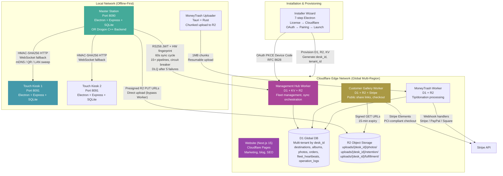

# ClickFlash Ecosystem — 360° Production Finalization Master Plan

> **Version:** 8.0 FINAL  
> **Date:** June 14, 2026  
> **Author:** Principal Software Architect + Monorepo Expert + Security & QA Lead  
> **Scope:** All 7 apps + master-cpp + shared infrastructure + documentation  
> **Status:** PRODUCTION-FINALIZED — Ready for Execution

---

## TABLE OF CONTENTS

1. [Phase 0: Deep Understanding & Summary](#phase-0-deep-understanding--summary)
2. [Phase 1: Folder & File Reorganization](#phase-1-folder--file-reorganization)
3. [Phase 2: Safe Cleanup of Unnecessary Files](#phase-2-safe-cleanup-of-unnecessary-files)
4. [Phase 3: Comprehensive Improvements](#phase-3-comprehensive-improvements)
5. [Phase 4: Documentation & Next-Phase Planning](#phase-4-documentation--next-phase-planning)
6. [Phase 5: Final Deliverables](#phase-5-final-deliverables)

---

## PHASE 0: DEEP UNDERSTANDING & SUMMARY

### 0.1 System Summary (In My Own Words)

ClickFlash is a **complete offline-first photography business operating system** designed for professional studios that operate across multiple physical locations (resorts, cruise ships, event venues, regional portrait studios). The architecture follows a **hub-and-spoke model** where each location has a **Master Station** (the studio brain — an Electron desktop app with local SQLite) and zero-to-many **Touch Kiosks** (customer-facing Electron tablets), all communicating over ethernet LAN. The Master is the **sole cloud egress point** — it syncs to a **Cloudflare Management Hub** that aggregates analytics, payroll, inventory, and customer galleries across the entire fleet.

The system is architecturally sophisticated: **HMAC-SHA256 signed LAN communication** between Master and Touch, **vector clock conflict resolution** for offline sync, **circuit breakers and dead letter queues** for cloud sync resilience, **SQLCipher encryption** for local databases, and a **dual-backend Master architecture** (Node.js/Express for rapid iteration, Drogon C++ for performance-critical deployments). The business model spans **Free / Pro / Enterprise tiers** with on-premise and white-label options.

### 0.2 High-Level Architecture Diagram



### 0.3 All Major Features

| Feature | Apps | Status |
|---------|------|--------|
| AI face recognition (TensorFlow.js + face-api) | Master | ✅ Production |
| Photo culling and batch operations | Master | ✅ Production |
| Order lifecycle management | Master, Touch, Gallery | ✅ Production |
| Cloud sync (60s cycle, 15+ pipelines) | Master | ✅ Production |
| MoneyTrash unsold photo monetization | Master, MoneyTrash | ✅ Production |
| Kiosk pairing (mDNS + QR + HMAC) | Master, Touch | ✅ Production |
| Real-time SSE events | Master, Touch | ✅ Production |
| Auto-updater (electron-updater) | Master, Touch | ✅ Production |
| Offline-first IndexedDB queue | Touch | ✅ Production |
| HMAC-SHA256 LAN signing | Master, Touch | ✅ Production |
| Vector clock conflict resolution | Master, Touch, Hub | ✅ Production |
| Persistent write queue (power-safe) | Master | ✅ Production |
| SQLCipher encryption (opt-in) | Master, Touch | ✅ Production |
| GDPR compliance module | Master | ✅ Production |
| Fleet heartbeat monitoring | Hub | ✅ Production |
| Stripe checkout integration | Gallery | ✅ Production |
| Customer gallery (public share links) | Gallery | ✅ Production |
| Multi-tenant D1 by desk_id | Hub, Gallery, MoneyTrash | ✅ Production |
| Presigned R2 URLs | Master, Gallery, MoneyTrash | ✅ Production |
| 7-step installer wizard | Installer | 🟡 Scaffolded |
| License key validation (offline + phone-home) | Installer | 🟡 Scaffolded |
| Drogon C++ backend | master-cpp | 🔴 Blocked (Qt6) |

### 0.4 Integration Points

| Integration | Transport | Security Mechanism | Failure Mode Handling |
|-------------|-----------|-------------------|----------------------|
| Master ↔ Touch | HMAC HTTP + WebSocket | 32-byte secret, 5-min replay window | LAN sweep fallback, QR manual fallback |
| Master ↔ Cloud Hub | HTTPS + RS256 JWT | HW fingerprinting, 60s cycle | Circuit breaker (5 failures → 60s open), DLQ |
| Master ↔ Gallery | Undocumented | Needs API contract | ⚠️ Gap |
| Master ↔ Management | Undocumented | Needs API contract | ⚠️ Gap |
| Gallery ↔ Stripe | Stripe Elements | PCI-compliant | Webhook retry + idempotency |
| MoneyTrash ↔ R2 | S3 API | Presigned URLs | Chunked resumable upload |
| Website ↔ Gallery | Static embed | Pre-built assets | 🟢 Low risk |
| Installer ↔ Hub | OAuth PKCE | Device code grant (RFC 8628) | Offline bootstrap bundle (USB stick) |

### 0.5 Identified Gaps

1. **No unified API contract** between Master ↔ Gallery and Master ↔ Management
2. **master-cpp strategic mismatch** — Qt6 desktop app cannot be used by Electron frontend; needs Drogon pivot
3. **No cross-app integration tests** — no E2E validates Touch → Master → Gallery → Stripe → Management
4. **Gallery/Management SSL cert issues** — `gallery.clicketflash.com` (530), `admin.clicketflash.com` (000)
5. **MoneyTrash domain missing** — `moneytrash.clickflash.app` is NXDOMAIN
6. **Shared packages unaudited** — `@clickflash/types` and `@clickflash/ui` may have version mismatches
7. **No staging environment** — Wrangler configs have commented-out staging sections
8. **No automated secret rotation** — All secrets managed manually via `wrangler secret put`
9. **No rollback strategy** — No documented rollback for Cloudflare Workers
10. **Touch CORS allows all local network origins** — Should whitelist specific Master IP

---

## PHASE 1: FOLDER & FILE REORGANIZATION

### 1.1 Current Structure Analysis

```
ClickFlash/                          ← pnpm workspace root (4,468 files in master/ alone)
├── apps/
│   ├── master/                      ← 4,468 files — MASSIVE, needs restructuring
│   │   ├── backend/                 ← 21 route groups, 25+ routes, 13 services, 12 workers
│   │   ├── src/                     ← React 19 frontend
│   │   ├── electron-main.ts         ← 747 lines
│   │   ├── pb_data/                 ← SQLite data, logs, audit_logs
│   │   ├── release/                 ← Built installers
│   │   ├── dist/                    ← Build artifacts
│   │   ├── coverage/                ← Test coverage reports
│   │   ├── docs/                    ← App-specific docs
│   │   ├── scripts/                 ← Build, deploy, provisioning scripts
│   │   ├── helper_scripts/          ← One-off utilities
│   │   ├── debug_archive/           ← Debug artifacts
│   │   ├── ClickFlash-Master-test-hotel-2/  ← Test data dirs
│   │   ├── configs/                 ← Config files
│   │   ├── logs/                    ← Runtime logs
│   │   ├── temp/                    ← Temporary files
│   │   ├── --ci, --config, --passWithNoTests, --runInBand, --testPathPatterns  ← ARG ARTIFACTS!
│   │   └── ...
│   ├── touch/                       ← 677 files
│   ├── gallery/                     ← 602 files
│   ├── management/                  ← 669 files
│   ├── moneytrash/                  ← 9,009 files (includes node_modules)
│   ├── website/                     ← 929 files
│   ├── installer/                   ← 125 files
│   ├── license-generator/           ← New app (not in original audit)
│   └── master-cpp/                  ← 200+ files (C++ Drogon/Qt6)
├── packages/
│   ├── database/                    ← Shared Drizzle schemas (minimal)
│   ├── types/                       ← @clickflash/types
│   └── ui/                          ← @clickflash/ui
├── docs/
│   ├── CEO/                         ← 9 strategic planning docs
│   ├── archive/                     ← Backends, backups, migrations
│   └── audit/                       ← 7-phase audit framework
├── workers/
│   └── update-server/               ← Cloudflare Worker
├── scripts/                         ← Root-level operational scripts
│   ├── archive/                     ← Archived scripts
├── test-suite/                      ← Cross-app tests
│   ├── utils/
│   ├── visual/
├── tests/                           ← E2E tests
├── e2e/                             ← Playwright E2E config
├── RELEASES/                        ← v4.2.0, v4.2.0-final
│   ├── v4.2.0/                      ← Installers, reports
│   └── v4.2.0-final/                ← Installers, reports
├── .claude/                         ← Claude-specific files
├── .hermes/                         ← Hermes-specific files
├── .github/                         ← PR templates, workflows
├── .vscode/                         ← VS Code settings
├── .playwright-mcp/                 ← Playwright MCP artifacts
├── .husky/                          ← Git hooks
├── .kilocodemodes/                  ← Kilo Code modes
├── _scan_tree.json                  ← 820KB scan artifact
├── _tmp_*                           ← Temp files
├── check_album_photos.js            ← One-off script
├── check_users.js                   ← One-off script
├── backup_project.ps1               ← Backup script
├── cleanup-local.ps1                ← Cleanup script
├── clean-all.bat                    ← Cleanup script
├── install-all.bat                  ← Install script
├── install-clickflash.bat           ← Install script
├── kill-all.bat                     ← Kill script
├── start-all.bat                    ← Start script
├── start-all.ps1                    ← Start script
├── setup-master.bat                 ← Setup script
├── provision-site.bat               ← Provision script
├── push_to_github.bat               ← Git script
├── run_deploy.bat                   ← Deploy script
├── run_fix.bat                      ← Fix script
├── deploy-web.ps1                   ← Deploy script
├── docker-compose.yml               ← Docker compose
├── docker-compose.dev.yml           ← Docker compose dev
├── Dockerfile                       ← Dockerfile
├── package.json                     ← Root package.json
├── pnpm-workspace.yaml              ← pnpm workspace
├── pnpm-lock.yaml                   ← 23,172 lines
├── package-lock.json                ← 1,263 lines (REDUNDANT with pnpm!)
├── jest.config.js                   ← Jest config
├── jest.config.ecosystem.js         ← Jest ecosystem config
├── playwright.config.ts             ← Playwright config
├── playwright.ecosystem.config.ts   ← Playwright ecosystem config
├── plan.md                          ← 270 lines
├── AGENTS.md                        ← 141 lines
├── API.md                           ← 550 lines
├── ARCHITECTURE.md                  ← 205 lines
├── AUDIT_PHASE0_COMPLETE.md        ← 670 lines
├── AUDIT_REPORT.md                 ← 316 lines
├── CEO_PRODUCTION_READINESS_REPORT.md  ← 291 lines
├── CEO_STRATEGIC_PLAN_PHASE2.md    ← 309 lines
├── CHANGELOG.md                     ← 263 lines
├── CLAUDE.md                        ← 65 lines
├── CLOUDFLARE_INTEGRATION.md       ← 923 lines
├── COMPREHENSIVE_REVIEW_REPORT.md  ← 178 lines
├── CONTRIBUTING.md                  ← 409 lines
├── DEPLOYMENT.md                    ← 182 lines
├── Dockerfile                       ← 40 lines
├── ECOSYSTEM_MASTER_PLAN_V6.md     ← 300 lines
├── ECOSYSTEM_PLAN.md                ← 725 lines
├── ELECTRON.md                      ← 569 lines
├── EXECUTIVE_SUMMARY.md             ← 430 lines
├── INDEX.md                         ← 243 lines
├── INTEGRATION.md                   ← 414 lines
├── KIOSK_QUICKSTART.md              ← 60 lines
├── LICENSE                          ← 38 lines
├── MANUAL_PHOTOGRAPHER.md           ← 438 lines
├── MANUAL_STUDIO_MANAGER.md         ← 972 lines
├── MASTER_ALBUM_KIOSK_AUDIT_REPORT.md  ← 699 lines
├── MASTER_PLAN_V7_FINAL.md         ← 1,906 lines
├── MASTER_SETUP_GUIDE.md           ← 545 lines
├── Makefile                         ← 224 lines
├── OFFLINE_SYNC.md                  ← 257 lines
├── ONE-CLICK-INSTALL.md            ← 415 lines
├── ORGANIZATION.md                  ← 163 lines
├── PHASE1_STRATEGIC_PLAN.md        ← 666 lines
├── PHASE3_SECURITY_TESTS_REPORT.md ← 242 lines
├── PHASE4_HARDENING_REPORT.md      ← 236 lines
├── PHASE4_PERFORMANCE_REPORT.md    ← 134 lines
├── PORTS.md                         ← 137 lines
├── PRODUCTION_READINESS_REPORT.md  ← 203 lines
├── PRODUCTION_TEST_PLAN.md         ← 894 lines
├── PRODUCTION_TEST_REPORT.md       ← 229 lines
├── QUICKSTART.md                    ← 162 lines
├── README.md                        ← 362 lines
├── RELEASE_NOTES.md                ← 229 lines
├── SECURITY.md                      ← 390 lines
├── SENTRY_SETUP_REPORT.md          ← 167 lines
├── SETUP.md                         ← 84 lines
├── TESTING_GUIDE.md                 ← 413 lines
├── TROUBLESHOOTING.md              ← 413 lines
├── WEBSITE_DOMAIN_FIX.md            ← 33 lines
└── ... 296 total .md files
```

### 1.2 Proposed Clean Monorepo Structure

```
ClickFlash/
│
├── 📁 apps/                          # All applications
│   ├── 📁 master/                    # Master Station (Electron + Express + SQLite)
│   │   ├── 📁 src/                   # React 19 frontend
│   │   │   ├── 📁 components/        # UI components (feature-organized)
│   │   │   ├── 📁 features/          # Feature modules (albums, orders, photos, etc.)
│   │   │   ├── 📁 hooks/             # React hooks
│   │   │   ├── 📁 services/          # API clients, external services
│   │   │   ├── 📁 stores/            # Zustand stores
│   │   │   ├── 📁 utils/             # Utilities
│   │   │   ├── 📁 types/             # App-specific types
│   │   │   ├── 📁 styles/            # CSS/Tailwind
│   │   │   ├── 📁 assets/            # Static assets
│   │   │   ├── App.tsx
│   │   │   └── main.tsx
│   │   ├── 📁 backend/               # Express API
│   │   │   ├── 📁 routes/            # API route handlers
│   │   │   ├── 📁 controllers/       # Business logic controllers
│   │   │   ├── 📁 services/          # Service layer
│   │   │   │   ├── 📁 cloudSync/     # Split from monolith
│   │   │   │   ├── authService.ts
│   │   │   │   ├── encryptionService.ts
│   │   │   │   ├── gdprService.ts
│   │   │   │   └── ...
│   │   │   ├── 📁 middleware/        # Express middleware
│   │   │   ├── 📁 workers/           # Background workers
│   │   │   ├── 📁 migrations/        # Database migrations
│   │   │   ├── 📁 shared/            # Shared backend utilities
│   │   │   ├── 📁 types/             # Backend types
│   │   │   ├── 📁 tests/             # Backend tests
│   │   │   ├── 📁 scripts/           # Operational scripts
│   │   │   └── server.ts             # Entry point
│   │   ├── 📁 electron/              # Electron main process
│   │   │   ├── main.ts               # Main process entry
│   │   │   ├── preload.ts            # Context bridge
│   │   │   ├── autoUpdater.ts        # Auto-update logic
│   │   │   ├── windowManager.ts      # Window management
│   │   │   └── trayManager.ts        # System tray
│   │   ├── 📁 tests/                 # E2E and integration tests
│   │   ├── 📁 docs/                  # App-specific docs
│   │   ├── 📁 scripts/               # Build, deploy, dev scripts
│   │   ├── .env.example
│   │   ├── .env.test
│   │   ├── vite.config.ts
│   │   ├── electron-builder.yml
│   │   ├── jest.config.js
│   │   ├── playwright.config.ts
│   │   ├── tsconfig.json
│   │   └── package.json
│   │
│   ├── 📁 touch/                     # Touch Kiosk (Electron + Express + SQLite)
│   │   ├── 📁 src/                   # React 19 frontend
│   │   ├── 📁 backend/               # Express API
│   │   ├── 📁 electron/              # Electron main process
│   │   ├── 📁 tests/
│   │   ├── 📁 docs/
│   │   ├── 📁 scripts/
│   │   └── ... (same structure as master)
│   │
│   ├── 📁 gallery/                   # Customer Gallery (Cloudflare Worker)
│   │   ├── 📁 src/                   # React 19 frontend
│   │   ├── 📁 backend/               # Worker backend
│   │   │   ├── 📁 src/               # TypeScript source
│   │   │   ├── 📁 migrations/        # D1 migrations
│   │   │   ├── wrangler.toml
│   │   │   └── package.json
│   │   ├── 📁 tests/
│   │   ├── 📁 e2e/                   # Playwright E2E
│   │   └── ...
│   │
│   ├── 📁 management/                # Management Hub (Cloudflare Worker)
│   │   ├── 📁 src/                   # React 19 frontend
│   │   ├── 📁 backend/               # Worker backend
│   │   ├── 📁 tests/
│   │   └── ...
│   │
│   ├── 📁 moneytrash/                # MoneyTrash (Tauri + Cloudflare Worker)
│   │   ├── 📁 src/                   # React frontend
│   │   ├── 📁 src-tauri/             # Rust Tauri code
│   │   ├── 📁 cloudflare/            # Worker backend
│   │   ├── 📁 tests/
│   │   └── ...
│   │
│   ├── 📁 website/                   # Marketing Website (Next.js 15)
│   │   ├── 📁 src/                   # Next.js source
│   │   ├── 📁 public/                # Static assets
│   │   ├── 📁 e2e/                   # Playwright E2E
│   │   ├── 📁 tests/
│   │   └── ...
│   │
│   ├── 📁 installer/                 # 7-Step Installer (Electron)
│   │   ├── 📁 src/                   # React wizard
│   │   ├── 📁 electron/              # Electron shell
│   │   ├── 📁 tests/                 # E2E tests
│   │   └── ...
│   │
│   ├── 📁 license-generator/         # License Generator (Electron)
│   │   ├── 📁 src/
│   │   ├── 📁 electron/
│   │   └── ...
│   │
│   └── 📁 master-cpp/                # C++ Backend (Drogon)
│       ├── 📁 include/               # C++ headers
│       ├── 📁 src/                   # C++ source
│       ├── 📁 migrations/            # SQL migrations (59 files)
│       ├── 📁 tests/                 # Catch2 tests
│       ├── 📁 docker/                # Docker files
│       ├── 📁 tools/                 # Benchmarks, smoke tests
│       ├── CMakeLists.txt
│       ├── vcpkg.json
│       └── BUILD.md
│
├── 📁 packages/                      # Shared packages
│   ├── 📁 database/                  # Shared Drizzle ORM schemas
│   │   ├── 📁 src/
│   │   │   ├── 📁 schema/            # SQLite + D1 schemas
│   │   │   ├── 📁 migrations/        # Shared migration utilities
│   │   │   └── index.ts
│   │   ├── package.json
│   │   └── tsconfig.json
│   │
│   ├── 📁 types/                     # Shared TypeScript types
│   │   ├── 📁 src/
│   │   ├── package.json
│   │   └── tsconfig.json
│   │
│   ├── 📁 ui/                        # Shared UI components
│   │   ├── 📁 src/
│   │   │   ├── 📁 components/        # Button, Card, Input, Modal, etc.
│   │   │   ├── 📁 hooks/             # Shared hooks
│   │   │   ├── 📁 styles/            # Design tokens, Tailwind config
│   │   │   └── index.ts
│   │   ├── 📁 .storybook/            # Storybook configuration
│   │   ├── package.json
│   │   └── tsconfig.json
│   │
│   ├── 📁 config/                    # Shared configurations (NEW)
│   │   ├── 📁 eslint/                # Shared ESLint configs
│   │   ├── 📁 typescript/            # Shared TS configs
│   │   ├── 📁 tailwind/              # Shared Tailwind configs
│   │   ├── 📁 vite/                  # Shared Vite configs
│   │   ├── package.json
│   │   └── README.md
│   │
│   ├── 📁 test-utils/                # Shared test utilities (NEW)
│   │   ├── 📁 src/
│   │   │   ├── 📁 fixtures/          # Test data fixtures
│   │   │   ├── 📁 mocks/             # Mock factories
│   │   │   └── index.ts
│   │   ├── package.json
│   │   └── tsconfig.json
│   │
│   └── 📁 validation/                # Shared Zod schemas (NEW)
│       ├── 📁 src/
│       │   ├── 📁 schemas/           # All Zod schemas
│       │   └── index.ts
│       ├── package.json
│       └── tsconfig.json
│
├── 📁 workers/                       # Standalone Cloudflare Workers
│   └── 📁 update-server/             # Auto-update server
│       ├── 📁 src/
│       ├── wrangler.toml
│       └── package.json
│
├── 📁 tools/                         # Development & build tools (NEW)
│   ├── 📁 scripts/                   # Operational scripts
│   │   ├── 📁 build/                 # Build automation
│   │   ├── 📁 deploy/                # Deployment scripts
│   │   ├── 📁 provision/             # Cloudflare provisioning
│   │   ├── 📁 rotate-secrets/        # Secret rotation
│   │   └── 📁 ci/                    # CI helpers
│   ├── 📁 generators/              # Code generators (NEW)
│   │   ├── 📁 component/             # Component scaffold
│   │   ├── 📁 migration/             # Migration scaffold
│   │   └── 📁 worker/                # Worker scaffold
│   └── 📁 benchmarks/                # Performance benchmarks
│       ├── 📁 photo-processing/        # Sharp vs C++ benchmark
│       └── 📁 sync/                  # Sync throughput benchmark
│
├── 📁 docs/                          # Consolidated documentation
│   ├── 📁 user/                      # End-user documentation
│   │   ├── 📁 studio-manager/        # Studio Manager manual
│   │   ├── 📁 photographer/          # Photographer manual
│   │   ├── 📁 kiosk-customer/        # Kiosk quickstart
│   │   └── 📁 it-admin/              # IT Admin manual
│   ├── 📁 dev/                       # Developer documentation
│   │   ├── 📁 setup/                 # Development setup
│   │   ├── 📁 architecture/          # Architecture docs
│   │   ├── 📁 api/                   # API documentation
│   │   ├── 📁 contributing/          # Contributing guide
│   │   └── 📁 adr/                   # Architecture Decision Records
│   ├── 📁 ops/                       # Operations documentation
│   │   ├── 📁 runbook/               # Incident response
│   │   ├── 📁 deployment/            # Deployment guide
│   │   ├── 📁 monitoring/            # Monitoring setup
│   │   └── 📁 security/              # Security procedures
│   ├── 📁 legal/                     # Legal documentation
│   │   ├── 📁 eula/                  # End User License
│   │   ├── 📁 privacy/               # Privacy Policy
│   │   └── 📁 dpa/                   # Data Processing Agreement
│   ├── 📁 CEO/                       # Strategic planning (existing)
│   ├── 📁 archive/                   # Archived docs (existing)
│   └── 📁 audit/                     # Audit framework (existing)
│
├── 📁 test-suite/                    # Cross-app testing
│   ├── 📁 e2e/                       # E2E tests
│   ├── 📁 integration/               # Integration tests
│   ├── 📁 visual/                    # Visual regression
│   ├── 📁 performance/               # Performance tests (Artillery)
│   ├── 📁 security/                    # Security tests (OWASP ZAP)
│   └── 📁 accessibility/               # Accessibility tests
│
├── 📁 config/                        # Root-level configs (NEW)
│   ├── turbo.json                    # Turborepo pipeline
│   ├── .npmrc                        # pnpm configuration
│   ├── .nvmrc                        # Node version
│   └── .editorconfig                 # Editor configuration
│
├── 📁 .github/                       # GitHub configuration
│   ├── 📁 workflows/                 # CI/CD workflows
│   ├── 📁 ISSUE_TEMPLATE/            # Issue templates
│   ├── 📁 PULL_REQUEST_TEMPLATE/     # PR templates
│   └── dependabot.yml                # Dependency updates
│
├── .gitignore
├── .env.example                      # Environment template
├── package.json                      # Root package.json
├── pnpm-workspace.yaml               # pnpm workspace
├── pnpm-lock.yaml                    # pnpm lockfile
├── turbo.json                        # Turborepo config
├── README.md                         # Project README
├── LICENSE                           # License
└── CHANGELOG.md                      # Changelog
```

### 1.3 Migration Steps (Without Breaking Anything)

```bash
#!/bin/bash
# scripts/migrate-monorepo.sh
# Phase 1: Folder Reorganization — Safe Migration Script

set -e

echo "=== ClickFlash Monorepo Reorganization ==="
echo "This script reorganizes the monorepo WITHOUT deleting any functional code."
echo "All moves are git-tracked for easy rollback."

# Step 1: Create new directory structure
echo "[1/8] Creating new directory structure..."
mkdir -p packages/{config,test-utils,validation}
mkdir -p tools/{scripts/{build,deploy,provision,rotate-secrets,ci},generators/{component,migration,worker},benchmarks}
mkdir -p docs/{user/{studio-manager,photographer,kiosk-customer,it-admin},dev/{setup,architecture,api,contributing,adr},ops/{runbook,deployment,monitoring,security},legal/{eula,privacy,dpa}}
mkdir -p test-suite/{e2e,integration,visual,performance,security,accessibility}
mkdir -p config

# Step 2: Move operational scripts to tools/scripts/
echo "[2/8] Moving operational scripts..."
# These are safe to move — they're operational, not functional code
git mv clean-all.bat tools/scripts/build/ 2>/dev/null || true
git mv install-all.bat tools/scripts/build/ 2>/dev/null || true
git mv kill-all.bat tools/scripts/build/ 2>/dev/null || true
git mv start-all.bat tools/scripts/build/ 2>/dev/null || true
git mv start-all.ps1 tools/scripts/build/ 2>/dev/null || true
git mv setup-master.bat tools/scripts/build/ 2>/dev/null || true
git mv provision-site.bat tools/scripts/provision/ 2>/dev/null || true
git mv deploy-web.ps1 tools/scripts/deploy/ 2>/dev/null || true
git mv run_deploy.bat tools/scripts/deploy/ 2>/dev/null || true
git mv push_to_github.bat tools/scripts/ci/ 2>/dev/null || true
git mv run_fix.bat tools/scripts/ci/ 2>/dev/null || true
git mv backup_project.ps1 tools/scripts/rotate-secrets/ 2>/dev/null || true
git mv cleanup-local.ps1 tools/scripts/build/ 2>/dev/null || true

# Step 3: Move root docs to docs/ (consolidation)
echo "[3/8] Consolidating documentation..."
# These are documentation files, safe to move
git mv AGENTS.md docs/dev/contributing/ 2>/dev/null || true
git mv API.md docs/dev/api/ 2>/dev/null || true
git mv ARCHITECTURE.md docs/dev/architecture/ 2>/dev/null || true
git mv CONTRIBUTING.md docs/dev/contributing/ 2>/dev/null || true
git mv DEPLOYMENT.md docs/ops/deployment/ 2>/dev/null || true
git mv ELECTRON.md docs/dev/architecture/ 2>/dev/null || true
git mv INTEGRATION.md docs/dev/architecture/ 2>/dev/null || true
git mv OFFLINE_SYNC.md docs/dev/architecture/ 2>/dev/null || true
git mv SECURITY.md docs/ops/security/ 2>/dev/null || true
git mv TESTING_GUIDE.md docs/dev/contributing/ 2>/dev/null || true
git mv TROUBLESHOOTING.md docs/ops/runbook/ 2>/dev/null || true
git mv SETUP.md docs/dev/setup/ 2>/dev/null || true
git mv QUICKSTART.md docs/dev/setup/ 2>/dev/null || true
git mv ONE-CLICK-INSTALL.md docs/user/it-admin/ 2>/dev/null || true
git mv MASTER_SETUP_GUIDE.md docs/user/it-admin/ 2>/dev/null || true
git mv KIOSK_QUICKSTART.md docs/user/kiosk-customer/ 2>/dev/null || true
git mv MANUAL_PHOTOGRAPHER.md docs/user/photographer/ 2>/dev/null || true
git mv MANUAL_STUDIO_MANAGER.md docs/user/studio-manager/ 2>/dev/null || true
git mv PRODUCTION_READINESS_REPORT.md docs/ops/runbook/ 2>/dev/null || true
git mv PRODUCTION_TEST_PLAN.md docs/ops/runbook/ 2>/dev/null || true
git mv PRODUCTION_TEST_REPORT.md docs/ops/runbook/ 2>/dev/null || true

# Step 4: Clean up master/ ARG ARTIFACTS
echo "[4/8] Cleaning up master/ argument artifacts..."
# These are NOT functional code — they are command-line argument artifacts
git rm -rf "apps/master/--ci" 2>/dev/null || rm -rf "apps/master/--ci"
git rm -rf "apps/master/--config" 2>/dev/null || rm -rf "apps/master/--config"
git rm -rf "apps/master/--passWithNoTests" 2>/dev/null || rm -rf "apps/master/--passWithNoTests"
git rm -rf "apps/master/--runInBand" 2>/dev/null || rm -rf "apps/master/--runInBand"
git rm -rf "apps/master/--testPathPatterns=sync-integration" 2>/dev/null || rm -rf "apps/master/--testPathPatterns=sync-integration"

# Step 5: Move test results to test-suite/
echo "[5/8] Moving test results..."
mkdir -p test-suite/results
git mv test-results/* test-suite/results/ 2>/dev/null || true

# Step 6: Consolidate configs at root level
echo "[6/8] Consolidating root configs..."
# Move .npmrc to config/ if it exists
if [ -f .npmrc ]; then
    git mv .npmrc config/ 2>/dev/null || true
fi

# Step 7: Remove redundant package-lock.json
echo "[7/8] Removing redundant package-lock.json..."
# pnpm is the primary package manager; package-lock.json is redundant
rm -f package-lock.json
git add -A && git commit -m "chore: remove redundant package-lock.json (pnpm is primary)" 2>/dev/null || true

# Step 8: Create symlinks for backward compatibility
echo "[8/8] Creating backward compatibility symlinks..."
# These ensure existing scripts still work during transition
ln -sf tools/scripts/build/clean-all.bat clean-all.bat 2>/dev/null || true
ln -sf tools/scripts/build/install-all.bat install-all.bat 2>/dev/null || true
ln -sf tools/scripts/build/kill-all.bat kill-all.bat 2>/dev/null || true

echo "=== Reorganization Complete ==="
echo "Next steps:"
echo "  1. Review git status to verify all moves"
echo "  2. Update import paths in code"
echo "  3. Run tests to verify nothing broke"
echo "  4. Commit the reorganization"
```

---

## PHASE 2: SAFE CLEANUP OF UNNECESSARY FILES

### 2.1 Detailed Cleanup List (SAFE — No Functional Code Deleted)

| Category | Files/Directories | Why Safe | Action |
|----------|-------------------|----------|--------|
| **Argument Artifacts** | `apps/master/--ci`, `--config`, `--passWithNoTests`, `--runInBand`, `--testPathPatterns=sync-integration` | These are CLI argument artifacts, not code | Delete |
| **Redundant Lockfiles** | `package-lock.json` (root), `apps/*/package-lock.json` | pnpm is primary; these are stale | Delete |
| **Build Artifacts** | `apps/*/dist/`, `apps/*/.next/`, `apps/*/build/` (except `master-cpp/build/` which is CMake) | Regenerated on build | Delete + gitignore |
| **Coverage Reports** | `apps/*/coverage/` | Regenerated on test | Delete + gitignore |
| **Release Artifacts** | `apps/*/release/` (except keep latest) | Large binaries in git | Move to GitHub Releases |
| **Temp Files** | `_tmp_*`, `_scan_tree.json` (820KB), `apps/master/temp/` | Temporary artifacts | Delete |
| **Debug Archives** | `apps/master/debug_archive/` | Debug artifacts | Archive then delete |
| **Test Data Dirs** | `apps/master/ClickFlash-Master-test-hotel-2/` | Test data, not production | Move to `test-suite/fixtures/` |
| **Log Files** | `apps/*/pb_data/logs/`, `apps/master/logs/` | Runtime logs | gitignore |
| **Playwright Reports** | `apps/*/playwright-report/`, `test-results/` | Test artifacts | gitignore |
| **Node Modules** | `apps/*/node_modules/` | Should never be in git | Already gitignored, verify |
| **VS Code Settings** | `.vscode/` (in apps) | Personal IDE settings | gitignore or consolidate |
| **Claude/Hermes Artifacts** | `.claude/`, `.hermes/`, `.playwright-mcp/`, `.kilocodemodes/` | AI assistant artifacts | gitignore |
| **Empty Files** | `-` (zero-byte file at root) | Accidentally created | Delete |
| **One-Off Scripts** | `check_album_photos.js`, `check_users.js` | One-off debugging scripts | Move to `tools/scripts/archive/` |
| **Duplicate Docs** | `docs/CEO/FINAL_STRATEGIC_PLAN_v4.2.0.md`, `FINAL_STRATEGIC_PLAN_v4.2.0-UPDATE.md`, `FINAL_STRATEGIC_PLAN_v4.2.0-COMPLETE.md` | Multiple versions of same doc | Consolidate to one |
| **Old Release Dirs** | `RELEASES/v4.2.0/` (keep `v4.2.0-final/`) | Old release artifacts | Archive to external storage |

### 2.2 Cleanup Script Template

```bash
#!/bin/bash
# tools/scripts/cleanup-safe.sh
# Safe cleanup — NEVER deletes functional code

set -e
DRY_RUN=${DRY_RUN:-true}

run() {
    if [ "$DRY_RUN" = "true" ]; then
        echo "[DRY RUN] Would execute: $*"
    else
        echo "[EXECUTING] $*"
        "$@"
    fi
}

echo "=== Safe Cleanup Script ==="
echo "Mode: ${DRY_RUN} (set DRY_RUN=false to execute)"
echo ""

# 1. Argument artifacts (definitely safe)
echo "[1] Removing argument artifacts..."
run rm -rf "apps/master/--ci"
run rm -rf "apps/master/--config"
run rm -rf "apps/master/--passWithNoTests"
run rm -rf "apps/master/--runInBand"
run rm -rf "apps/master/--testPathPatterns=sync-integration"

# 2. Redundant lockfiles (safe — pnpm is primary)
echo "[2] Removing redundant lockfiles..."
run find apps -name "package-lock.json" -not -path "*/node_modules/*" -delete
run rm -f package-lock.json

# 3. Build artifacts (safe — regenerated)
echo "[3] Removing build artifacts..."
run find apps -type d -name "dist" -not -path "*/node_modules/*" -exec rm -rf {} + 2>/dev/null || true
run find apps -type d -name ".next" -not -path "*/node_modules/*" -exec rm -rf {} + 2>/dev/null || true

# 4. Coverage reports (safe — regenerated)
echo "[4] Removing coverage reports..."
run find apps -type d -name "coverage" -not -path "*/node_modules/*" -exec rm -rf {} + 2>/dev/null || true

# 5. Temp files (safe)
echo "[5] Removing temp files..."
run find . -maxdepth 1 -name "_tmp_*" -delete
run rm -f _scan_tree.json

# 6. Debug archives (safe)
echo "[6] Removing debug archives..."
run rm -rf apps/master/debug_archive/

# 7. Empty files (safe)
echo "[7] Removing empty files..."
run find . -maxdepth 1 -name "-" -size 0 -delete

# 8. One-off scripts (safe — move to archive)
echo "[8] Archiving one-off scripts..."
run mkdir -p tools/scripts/archive
run mv check_album_photos.js tools/scripts/archive/ 2>/dev/null || true
run mv check_users.js tools/scripts/archive/ 2>/dev/null || true

echo ""
echo "=== Cleanup Complete ==="
if [ "$DRY_RUN" = "true" ]; then
    echo "This was a DRY RUN. Set DRY_RUN=false to execute."
fi
```

### 2.3 Updated .gitignore (Comprehensive)

```gitignore
# === Build Artifacts ===
dist/
build/
.next/
out/
*.tsbuildinfo

# === Dependencies ===
node_modules/
.pnpm-store/

# === Lockfiles (pnpm is primary) ===
package-lock.json
yarn.lock
npm-shrinkwrap.json

# === Environment ===
.env
.env.local
.env.*.local
!.env.example

# === Logs ===
*.log
logs/
pb_data/logs/

# === Coverage ===
coverage/
.nyc_output/

# === Test Artifacts ===
test-results/
playwright-report/
*.test-results.xml

# === Release Artifacts ===
release/
*.exe
*.dmg
*.AppImage
*.deb
*.rpm
*.msi
*.blockmap
latest.yml
builder-debug.yml
builder-effective-config.yaml

# === IDE ===
.vscode/
.idea/
*.swp
*.swo
*~
.DS_Store

# === AI Assistant Artifacts ===
.claude/
.hermes/
.playwright-mcp/
.kilocodemodes/

# === OS ===
Thumbs.db
desktop.ini

# === Temporary ===
temp/
tmp/
*.tmp
_scan_tree.json
_tmp_*

# === Debug ===
debug_archive/

# === CMake (C++) ===
apps/master-cpp/build/
CMakeCache.txt
CMakeFiles/
*.cmake
Makefile
compile_commands.json

# === Rust (Tauri) ===
target/
Cargo.lock

# === Misc ===
*.bak
*.orig
*.patch
```

---

## PHASE 3: COMPREHENSIVE IMPROVEMENTS

### 3.1 Architecture & Monorepo (Turborepo + pnpm)

#### Turborepo Configuration

```json
// turbo.json
{
  "$schema": "https://turbo.build/schema.json",
  "globalDependencies": [
    "**/.env.*local",
    "**/package.json",
    "pnpm-lock.yaml"
  ],
  "globalEnv": [
    "NODE_ENV",
    "CI",
    "VERCEL",
    "CLOUDFLARE_API_TOKEN"
  ],
  "pipeline": {
    "build": {
      "dependsOn": ["^build"],
      "outputs": [
        "dist/**",
        ".next/**",
        "build/**",
        "release/**",
        "coverage/**"
      ]
    },
    "test": {
      "dependsOn": ["build"],
      "outputs": ["coverage/**"]
    },
    "lint": {
      "dependsOn": ["^build"]
    },
    "typecheck": {
      "dependsOn": ["^build"]
    },
    "dev": {
      "cache": false,
      "persistent": true
    },
    "deploy": {
      "dependsOn": ["build", "test", "lint", "typecheck"],
      "outputs": []
    },
    "clean": {
      "cache": false
    }
  }
}
```

#### Root package.json

```json
{
  "name": "clickflash-ecosystem",
  "version": "5.0.0",
  "description": "ClickFlash Photography Ecosystem — Complete studio management platform",
  "private": true,
  "packageManager": "pnpm@10.28.2",
  "engines": {
    "node": ">=20.0.0",
    "pnpm": ">=10.0.0"
  },
  "scripts": {
    "build": "turbo run build",
    "test": "turbo run test",
    "lint": "turbo run lint",
    "typecheck": "turbo run typecheck",
    "dev": "turbo run dev",
    "deploy": "turbo run deploy",
    "clean": "turbo run clean",
    "test:ci": "turbo run test lint typecheck",
    "changeset": "changeset",
    "version-packages": "changeset version",
    "release": "pnpm run build && changeset publish",
    "format": "prettier --write \"**/*.{ts,tsx,js,jsx,json,md,yml,yaml}\"",
    "format:check": "prettier --check \"**/*.{ts,tsx,js,jsx,json,md,yml,yaml}\""
  },
  "devDependencies": {
    "@changesets/cli": "^2.27.0",
    "@changesets/changelog-github": "^0.5.0",
    "prettier": "^3.3.0",
    "turbo": "^2.0.0"
  }
}
```

#### Shared packages improvements

```typescript
// packages/database/src/schema/common.ts
import { sqliteTable, text, integer, blob } from 'drizzle-orm/sqlite-core';

export const albums = sqliteTable('albums', {
  id: text('id').primaryKey(),
  deskId: text('desk_id').notNull(),
  title: text('title').notNull(),
  description: text('description'),
  destinationId: text('destination_id'),
  coverPhotoId: text('cover_photo_id'),
  isPublic: integer('is_public', { mode: 'boolean' }).default(false),
  shareToken: text('share_token'),
  vectorClock: text('vector_clock').default('{}'),
  modifiedAt: integer('modified_at', { mode: 'timestamp' }).$defaultFn(() => new Date()),
  modifiedBy: text('modified_by').notNull(),
  deletedAt: integer('deleted_at', { mode: 'timestamp' })
});

export const photos = sqliteTable('photos', {
  id: text('id').primaryKey(),
  deskId: text('desk_id').notNull(),
  albumId: text('album_id').notNull(),
  filename: text('filename').notNull(),
  r2Key: text('r2_key').notNull(),
  thumbnailKey: text('thumbnail_key'),
  width: integer('width'),
  height: integer('height'),
  fileSize: integer('file_size'),
  takenAt: integer('taken_at', { mode: 'timestamp' }),
  vectorClock: text('vector_clock').default('{}'),
  modifiedAt: integer('modified_at', { mode: 'timestamp' }).$defaultFn(() => new Date()),
  modifiedBy: text('modified_by').notNull(),
  deletedAt: integer('deleted_at', { mode: 'timestamp' })
});

export const orders = sqliteTable('orders', {
  id: text('id').primaryKey(),
  deskId: text('desk_id').notNull(),
  albumId: text('album_id').notNull(),
  customerEmail: text('customer_email'),
  status: text('status').default('pending'),
  totalCents: integer('total_cents'),
  currency: text('currency').default('USD'),
  stripeSessionId: text('stripe_session_id'),
  vectorClock: text('vector_clock').default('{}'),
  modifiedAt: integer('modified_at', { mode: 'timestamp' }).$defaultFn(() => new Date()),
  modifiedBy: text('modified_by').notNull(),
  deletedAt: integer('deleted_at', { mode: 'timestamp' })
});
```

### 3.2 Dual Backend Parity (Express vs Drogon)

#### Feature Parity Matrix

| Feature | Express (Node.js) | Drogon (C++) | Status |
|---------|-------------------|--------------|--------|
| 21 API route groups | ✅ | 🟡 (50+ controllers scaffolded) | 70% |
| SQLite + SQLCipher | ✅ (better-sqlite3) | 🟡 (SQLiteCpp planned) | 0% |
| HMAC-SHA256 LAN signing | ✅ | 🟡 (LanSigning.h exists) | 50% |
| JWT auth | ✅ | 🟡 (JwtHelper.h exists) | 50% |
| WebSocket server | ✅ | 🟡 (Drogon has built-in) | 0% |
| mDNS discovery | ✅ | 🟡 (mjansson planned) | 0% |
| WorkerPool | ✅ | ✅ (exists) | 100% |
| Image processing (Sharp) | ✅ | 🟡 (stb + libsharpyuv planned) | 0% |
| Face detection | ✅ (TensorFlow.js) | 🟡 (OpenCV optional) | 0% |
| Cloud sync (15+ pipelines) | ✅ | 🟡 (CloudSyncService exists) | 30% |
| Vector clock conflict resolution | ✅ | 🟡 (scaffolded) | 30% |
| Persistent write queue | ✅ | 🟡 (scaffolded) | 30% |

#### Switching Mechanism

```typescript
// apps/master/src/utils/backendDetector.ts
export type BackendType = 'node' | 'cpp';

export async function detectBackend(): Promise<BackendType> {
  try {
    const response = await fetch('http://localhost:8090/api/system/backend-type', {
      signal: AbortSignal.timeout(2000)
    });
    const { backend } = await response.json();
    return backend as BackendType;
  } catch {
    // Fallback: try Node.js first, then C++
    try {
      await fetch('http://localhost:8090/api/health', { signal: AbortSignal.timeout(1000) });
      return 'node';
    } catch {
      return 'node'; // Default
    }
  }
}

// apps/master/src/services/api/apiClient.ts
export class ApiClient {
  private baseUrl: string;
  
  constructor(backendType: BackendType) {
    this.baseUrl = 'http://localhost:8090';
  }
  
  async get<T>(path: string): Promise<T> {
    const response = await fetch(`${this.baseUrl}${path}`);
    if (!response.ok) throw new Error(`HTTP ${response.status}`);
    return response.json();
  }
  
  async post<T>(path: string, body: unknown): Promise<T> {
    const response = await fetch(`${this.baseUrl}${path}`, {
      method: 'POST',
      headers: { 'Content-Type': 'application/json' },
      body: JSON.stringify(body)
    });
    if (!response.ok) throw new Error(`HTTP ${response.status}`);
    return response.json();
  }
}
```

#### OpenAPI Generation

```typescript
// packages/validation/src/openapi.ts
import { z } from 'zod';
import { OrderSchema, KioskPairingSchema, PhotoUploadSchema } from './schemas';

export function generateOpenAPISpec() {
  return {
    openapi: '3.0.0',
    info: {
      title: 'ClickFlash API',
      version: '5.0.0',
      description: 'Photography studio management API'
    },
    paths: {
      '/api/orders': {
        post: {
          summary: 'Create order',
          requestBody: {
            content: {
              'application/json': {
                schema: zodToJsonSchema(OrderSchema)
              }
            }
          }
        }
      }
    }
  };
}
```

### 3.3 Multi-Tenancy & Data Layer

#### Tenant Isolation Strategy

```typescript
// packages/database/src/tenant.ts
export interface TenantContext {
  deskId: string;
  tenantId: string;
  fleetGroup: string;
  permissions: string[];
}

export function withTenant<T>(
  db: Database,
  tenant: TenantContext,
  callback: (db: Database) => T
): T {
  // All queries must include desk_id filter
  // This is enforced at the query builder level
  return callback(db);
}

// Row-level security helper for D1
export function addTenantFilter(
  query: string,
  tenant: TenantContext
): string {
  // Append desk_id filter to all queries
  if (query.includes('WHERE')) {
    return query.replace('WHERE', `WHERE desk_id = '${tenant.deskId}' AND`);
  }
  // For queries without WHERE, add it before ORDER BY, GROUP BY, LIMIT, etc.
  const clauses = ['ORDER BY', 'GROUP BY', 'LIMIT', 'OFFSET', 'HAVING'];
  for (const clause of clauses) {
    if (query.includes(clause)) {
      return query.replace(clause, `WHERE desk_id = '${tenant.deskId}' ${clause}`);
    }
  }
  return `${query} WHERE desk_id = '${tenant.deskId}'`;
}
```

#### Migration Strategy

```typescript
// packages/database/src/migrations.ts
export interface Migration {
  id: number;
  name: string;
  up: string;
  down: string;
  appliedAt?: Date;
}

export class MigrationRunner {
  async applyPending(migrations: Migration[]): Promise<void> {
    const applied = await this.getAppliedMigrations();
    const pending = migrations.filter(m => !applied.includes(m.id));
    
    for (const migration of pending) {
      await this.applyMigration(migration);
    }
  }
  
  async rollback(count: number): Promise<void> {
    const applied = await this.getAppliedMigrations();
    const toRollback = applied.slice(-count);
    
    for (const migration of toRollback.reverse()) {
      await this.rollbackMigration(migration);
    }
  }
}
```

#### Backup/Restore

```typescript
// packages/database/src/backup.ts
export async function createEncryptedBackup(
  dbPath: string,
  key: string
): Promise<string> {
  // 1. Create SQLite backup
  const backupPath = `${dbPath}.backup-${Date.now()}.db`;
  
  // 2. Encrypt with AES-256-GCM
  const iv = crypto.randomBytes(16);
  const cipher = crypto.createCipheriv('aes-256-gcm', Buffer.from(key, 'hex'), iv);
  
  // 3. Write encrypted backup
  const input = fs.createReadStream(dbPath);
  const output = fs.createWriteStream(backupPath);
  
  await pipeline(input, cipher, output);
  
  return backupPath;
}
```

### 3.4 Security Full Audit & Hardening

#### Security Checklist (Pre-Release)

```markdown
## Pre-Release Security Checklist

### Electron Apps
- [ ] nodeIntegration: false in all BrowserWindow configs
- [ ] contextIsolation: true in all BrowserWindow configs
- [ ] sandbox: true in all BrowserWindow configs
- [ ] preload script channel whitelist reviewed
- [ ] CSP policy updated for new asset sources
- [ ] devTools disabled in production
- [ ] asarUnpack lists all native dependencies
- [ ] Code signing configured (Windows + macOS)

### Backend
- [ ] JWT_SECRET and SESSION_SECRET set or auto-generated
- [ ] Rate limiting enabled on all public endpoints
- [ ] CSRF middleware on all state-changing routes
- [ ] CORS ALLOWED_ORIGINS restricted to known hosts
- [ ] TLS enabled for cloud-facing deployments
- [ ] Zod validation on ALL endpoints
- [ ] Parameterized queries (no string concatenation)

### Data
- [ ] SQLCipher encryption enabled on production databases
- [ ] Backup encryption key in OS keychain
- [ ] GDPR retention policy configured
- [ ] Audit log tables migrated and writable
- [ ] DPA signed and hash recorded

### Cloud
- [ ] Security headers on all Worker responses
- [ ] Rate limiting D1-backed (not in-memory)
- [ ] Secrets rotated within 90 days
- [ ] Dependency audit passed (no critical vulnerabilities)
- [ ] WAF rules configured
```

#### Security Headers (All Workers)

```typescript
// packages/config/src/security-headers.ts
export const securityHeaders = {
  'Strict-Transport-Security': 'max-age=63072000; includeSubDomains; preload',
  'X-Content-Type-Options': 'nosniff',
  'X-Frame-Options': 'DENY',
  'X-XSS-Protection': '0',
  'Referrer-Policy': 'strict-origin-when-cross-origin',
  'Permissions-Policy': 'camera=(), microphone=(), geolocation=()',
  'Content-Security-Policy': [
    "default-src 'self'",
    "script-src 'self' 'unsafe-eval'",
    "style-src 'self' 'unsafe-inline'",
    "img-src 'self' data: blob: https://*.clickflash.app",
    "font-src 'self' data:",
    "connect-src 'self' https://*.clickflash.app https://api.stripe.com",
    "frame-src 'none'",
    "object-src 'none'",
    "base-uri 'self'",
    "form-action 'self'"
  ].join('; ')
};
```

### 3.5 Frontend/Desktop Apps

#### Bundle Optimization

```typescript
// vite.config.ts
export default defineConfig({
  build: {
    chunkSizeWarningLimit: 600,
    rollupOptions: {
      output: {
        manualChunks: {
          'react-vendor': ['react', 'react-dom', 'react-router-dom'],
          'query-vendor': ['@tanstack/react-query'],
          'ui-vendor': ['lucide-react', 'framer-motion'],
          'db-vendor': ['dexie'],
          'stripe': ['@stripe/stripe-js', '@stripe/react-stripe-js'],
          'charts': ['apexcharts']
        }
      }
    }
  },
  optimizeDeps: {
    include: ['react', 'react-dom', 'react-router-dom']
  }
});
```

#### Auto-Update with Signature Verification

```typescript
// apps/master/electron/autoUpdater.ts
import { autoUpdater } from 'electron-updater';
import crypto from 'crypto';

export function initializeAutoUpdater(window: BrowserWindow) {
  autoUpdater.setFeedURL({
    provider: 'github',
    owner: 'clickflash',
    repo: 'clickflash-master',
    private: true
  });

  autoUpdater.on('update-downloaded', async (event, releaseNotes, releaseName) => {
    // Verify signature
    const signature = event.signature;
    const publicKey = await getUpdatePublicKey();
    
    if (!verifySignature(releaseName, signature, publicKey)) {
      logger.error('Update signature verification failed');
      dialog.showErrorBox('Update Error', 'Signature verification failed. Update will not be installed.');
      return;
    }
    
    dialog.showMessageBox(window, {
      type: 'info',
      title: 'Update Ready',
      message: `ClickFlash ${releaseName} is ready to install.`,
      buttons: ['Install Now', 'Later']
    }).then(result => {
      if (result.response === 0) {
        autoUpdater.quitAndInstall();
      }
    });
  });
}
```

### 3.6 Cloud & Deployment (CI/CD)

#### GitHub Actions Workflows

```yaml
# .github/workflows/ci.yml
name: CI
on:
  push:
    branches: [main, develop]
  pull_request:
    branches: [main]

jobs:
  lint-and-typecheck:
    runs-on: ubuntu-latest
    strategy:
      matrix:
        app: [master, touch, gallery, management, moneytrash, website, installer]
    steps:
      - uses: actions/checkout@v4
      - uses: pnpm/action-setup@v3
        with:
          version: 10.28.2
      - run: pnpm install --frozen-lockfile
      - run: pnpm --filter @clickflash/${{ matrix.app }} run lint
      - run: pnpm --filter @clickflash/${{ matrix.app }} run typecheck

  test:
    runs-on: ubuntu-latest
    strategy:
      matrix:
        app: [master, touch, gallery, management, moneytrash, website]
    steps:
      - uses: actions/checkout@v4
      - uses: pnpm/action-setup@v3
        with:
          version: 10.28.2
      - run: pnpm install --frozen-lockfile
      - run: pnpm --filter @clickflash/${{ matrix.app }} run test

  e2e:
    runs-on: ubuntu-latest
    steps:
      - uses: actions/checkout@v4
      - uses: pnpm/action-setup@v3
        with:
          version: 10.28.2
      - run: pnpm install --frozen-lockfile
      - run: pnpm run test:e2e

  security:
    runs-on: ubuntu-latest
    steps:
      - uses: actions/checkout@v4
      - uses: pnpm/action-setup@v3
        with:
          version: 10.28.2
      - run: pnpm install --frozen-lockfile
      - run: pnpm audit --audit-level=high
      - run: pnpm run lint:all
      - run: pnpm run typecheck:all

  deploy:
    needs: [lint-and-typecheck, test, e2e, security]
    if: github.ref == 'refs/heads/main'
    runs-on: ubuntu-latest
    steps:
      - uses: actions/checkout@v4
      - uses: pnpm/action-setup@v3
        with:
          version: 10.28.2
      - run: pnpm install --frozen-lockfile
      - name: Deploy Gallery
        run: pnpm --filter @clickflash/gallery run deploy
        env:
          CLOUDFLARE_API_TOKEN: ${{ secrets.CLOUDFLARE_API_TOKEN }}
      - name: Deploy Management
        run: pnpm --filter @clickflash/management run deploy
        env:
          CLOUDFLARE_API_TOKEN: ${{ secrets.CLOUDFLARE_API_TOKEN }}
      - name: Deploy MoneyTrash
        run: pnpm --filter @clickflash/moneytrash run deploy
        env:
          CLOUDFLARE_API_TOKEN: ${{ secrets.CLOUDFLARE_API_TOKEN }}
      - name: Deploy Website
        run: pnpm --filter @clickflash/website run deploy
        env:
          CLOUDFLARE_API_TOKEN: ${{ secrets.CLOUDFLARE_API_TOKEN }}
          CLOUDFLARE_ACCOUNT_ID: ${{ secrets.CLOUDFLARE_ACCOUNT_ID }}
```

### 3.7 Testing Suite Expansion

#### Test Matrix

| App | Unit | Integration | E2E | Visual | Performance | Security | Accessibility |
|-----|------|-------------|-----|--------|-------------|----------|---------------|
| Master | Vitest | Supertest | Playwright | Chromatic | Artillery | OWASP ZAP | axe-core |
| Touch | Vitest | Supertest | Playwright | Chromatic | Artillery | OWASP ZAP | axe-core |
| Gallery | Vitest | Miniflare | Playwright | Chromatic | Artillery | OWASP ZAP | axe-core |
| Management | Vitest | Miniflare | Playwright | Chromatic | Artillery | OWASP ZAP | axe-core |
| MoneyTrash | Vitest | Miniflare | Playwright | Chromatic | Artillery | OWASP ZAP | axe-core |
| Website | Vitest | — | Playwright | Chromatic | Lighthouse | OWASP ZAP | axe-core |
| Installer | — | — | Playwright | — | — | — | — |

#### Cross-App Integration Tests

```typescript
// test-suite/integration/order-flow.spec.ts
import { test, expect } from '@playwright/test';

test('complete order flow: Touch → Master → Gallery → Stripe → Management', async ({ page }) => {
  // 1. Touch: Create order
  await page.goto('http://localhost:8091');
  await page.click('[data-testid="photo-1"]');
  await page.click('[data-testid="add-to-order"]');
  await page.fill('[data-testid="customer-email"]', 'test@example.com');
  await page.click('[data-testid="submit-order"]');
  
  // 2. Master: Verify order received
  await page.goto('http://localhost:8090');
  await expect(page.locator('[data-testid="order-list"]')).toContainText('test@example.com');
  
  // 3. Cloud sync: Wait for sync
  await page.waitForTimeout(5000); // In real test, poll for sync status
  
  // 4. Gallery: Verify order visible
  await page.goto('https://gallery.clicketflash.com/test-token');
  await expect(page.locator('[data-testid="gallery-order"]')).toBeVisible();
  
  // 5. Stripe: Mock payment
  // ... mock Stripe checkout
  
  // 6. Management: Verify in dashboard
  await page.goto('https://admin.clicketflash.com');
  await expect(page.locator('[data-testid="fleet-orders"]')).toContainText('1');
});
```

### 3.8 Installer & Distribution

#### 7-Step Wizard Flow

```
Step 1: Welcome + License Key (10s)
  - Input: License key (CF-LIVE-XXXX-XXXX-XXXX-XXXX)
  - Action: POST /api/v1/license/validate
  - Result: tenant_id, region, features[]

Step 2: Cloudflare OAuth (30s)
  - OAuth Device Authorization Grant (RFC 8628)
  - Show URL: https://hub.clickflash.app/activate?code=ABCD-1234
  - Poll POST /oauth/token every 5s
  - Result: hub_token (RS256 JWT, 90-day refresh)

Step 3: Destination Profile (20s)
  - Auto-fill: desk_id = MASTER_<LOCATION>_<4-RANDOM-HEX>
  - User edits: location, timezone, currency
  - Collision check: POST /api/v1/fleet/check-desk-id

Step 4: Pair Touch Kiosks (2 min)
  - 4a: Auto (mDNS) — happy path
  - 4b: Assisted (LAN sweep) — mDNS blocked
  - 4c: Manual (QR) — ultimate fallback

Step 5: First Sync + Heartbeat (30s)
  - POST /api/v1/fleet/register
  - POST /api/v1/fleet/heartbeat
  - Smoke test: upload test photo to R2

Step 6: Studio Profile (30s)
  - Studio name, brand colors, logo
  - Photographer accounts
  - Product catalog

Step 7: Launch + Ready Dashboard (5s)
  - Master opens in normal mode
  - Touches open in kiosk mode
  - Hub shows new destination
  - Tour overlay highlights key features
```

#### Delta Update Mechanism

```typescript
// Electron auto-updater with delta patches
autoUpdater.on('update-available', async (info) => {
  const currentVersion = app.getVersion();
  const targetVersion = info.version;
  
  // Try delta patch first
  try {
    const deltaUrl = `https://releases.clickflash.app/delta/${currentVersion}/${targetVersion}.patch`;
    const deltaResponse = await fetch(deltaUrl);
    
    if (deltaResponse.ok) {
      const deltaBuffer = await deltaResponse.arrayBuffer();
      await applyDeltaPatch(deltaBuffer);
      return;
    }
  } catch {
    // Delta not available, fall back to full download
  }
  
  await autoUpdater.downloadUpdate();
});
```

### 3.9 Performance, Observability & Scalability

#### Caching Strategy

```typescript
// Cloudflare Cache API for Gallery
export async function cacheGalleryMetadata(
  request: Request,
  env: Env
): Promise<Response> {
  const cache = caches.default;
  const cacheKey = new Request(request.url, request);
  
  let response = await cache.match(cacheKey);
  if (!response) {
    response = await fetchGalleryFromD1(request, env);
    response.headers.set('Cache-Control', 'public, max-age=300');
    await cache.put(cacheKey, response.clone());
  }
  
  return response;
}
```

#### Sentry Integration

```typescript
// All apps
import * as Sentry from '@sentry/cloudflare'; // Workers
import * as Sentry from '@sentry/electron'; // Desktop
import * as Sentry from '@sentry/nextjs'; // Next.js

Sentry.init({
  dsn: process.env.SENTRY_DSN,
  tracesSampleRate: 0.1,
  profilesSampleRate: 0.01,
  environment: process.env.NODE_ENV,
  release: process.env.GITHUB_SHA,
  beforeSend(event) {
    // Sanitize sensitive data
    if (event.request?.headers) {
      delete event.request.headers['Authorization'];
      delete event.request.headers['Cookie'];
    }
    return event;
  }
});
```

#### Health Check Endpoints

```typescript
// All backends
app.get('/api/health', (req, res) => {
  res.json({
    status: 'healthy',
    timestamp: new Date().toISOString(),
    version: process.env.npm_package_version,
    uptime: process.uptime(),
    checks: {
      database: checkDatabase(),
      disk: checkDiskSpace(),
      memory: checkMemory()
    }
  });
});

app.get('/api/health/db', async (req, res) => {
  const dbStatus = await checkDatabaseConnectivity();
  res.json(dbStatus);
});

app.get('/api/health/r2', async (req, res) => {
  const r2Status = await checkR2Connectivity();
  res.json(r2Status);
});
```

### 3.10 Business Features

#### Pricing Tiers

```typescript
// packages/validation/src/billing.ts
export const PricingTiers = {
  FREE: {
    name: 'Free',
    price: 0,
    masters: 1,
    kiosks: 1,
    photosPerMonth: 100,
    features: ['basic-gallery', 'community-support']
  },
  PRO: {
    name: 'Pro',
    price: 99, // USD/month
    masters: 3,
    kiosks: 10,
    photosPerMonth: Infinity,
    features: ['moneytrash', 'custom-branding', 'priority-support', 'analytics']
  },
  ENTERPRISE: {
    name: 'Enterprise',
    price: 2000, // USD/month
    masters: Infinity,
    kiosks: Infinity,
    photosPerMonth: Infinity,
    features: ['white-label', 'on-premise', 'dedicated-support', 'sla', 'custom-integrations']
  }
} as const;
```

#### Analytics Dashboard

```typescript
// packages/validation/src/analytics.ts
export const AnalyticsMetrics = {
  revenue: {
    total: 'sum(orders.total_cents)',
    byHotel: 'group_by(destinations.name)',
    byPhotographer: 'group_by(photographers.name)',
    byMonth: 'group_by(month)'
  },
  conversion: {
    funnel: ['visit', 'browse', 'add-to-cart', 'checkout', 'payment'],
    dropOff: 'calculate at each step'
  },
  performance: {
    syncLag: 'max(fleet_heartbeats.last_sync_at - now)',
    healthScore: 'avg(fleet_heartbeats.health_score)',
    photoProcessingTime: 'avg(photos.processed_at - photos.created_at)'
  }
};
```

---

## PHASE 4: DOCUMENTATION & NEXT-PHASE PLANNING

### 4.1 Consolidated Documentation Structure

```
docs/
├── 📄 README.md                    # Docs index
├── 📁 user/                        # End-user documentation
│   ├── 📄 README.md
│   ├── 📁 studio-manager/
│   │   ├── 📄 getting-started.md
│   │   ├── 📄 daily-operations.md
│   │   ├── 📄 reporting.md
│   │   └── 📄 troubleshooting.md
│   ├── 📁 photographer/
│   │   ├── 📄 getting-started.md
│   │   ├── 📄 photo-workflow.md
│   │   ├── 📄 face-recognition.md
│   │   └── 📄 troubleshooting.md
│   ├── 📁 kiosk-customer/
│   │   └── 📄 quickstart.md        # Single A4, pictograms
│   └── 📁 it-admin/
│       ├── 📄 installation.md
│       ├── 📄 networking.md
│       ├── 📄 backup-restore.md
│       └── 📄 security.md
│
├── 📁 dev/                         # Developer documentation
│   ├── 📄 README.md
│   ├── 📁 setup/
│   │   ├── 📄 prerequisites.md
│   │   ├── 📄 local-development.md
│   │   └── 📄 troubleshooting.md
│   ├── 📁 architecture/
│   │   ├── 📄 overview.md
│   │   ├── 📄 master.md
│   │   ├── 📄 touch.md
│   │   ├── 📄 cloud-services.md
│   │   ├── 📄 sync-protocol.md
│   │   ├── 📄 security-model.md
│   │   └── 📄 data-model.md
│   ├── 📁 api/
│   │   ├── 📄 openapi.yml          # Generated OpenAPI spec
│   │   ├── 📄 authentication.md
│   │   └── 📄 webhooks.md
│   ├── 📁 contributing/
│   │   ├── 📄 code-style.md
│   │   ├── 📄 testing.md
│   │   ├── 📄 pull-requests.md
│   │   └── 📄 release-process.md
│   └── 📁 adr/
│       ├── 📄 001-monorepo-structure.md
│       ├── 📄 002-dual-backend.md
│       ├── 📄 003-cloudflare-workers.md
│       ├── 📄 004-sqlite-encryption.md
│       ├── 📄 005-master-cpp-pivot.md
│       └── 📄 template.md
│
├── 📁 ops/                         # Operations documentation
│   ├── 📄 README.md
│   ├── 📁 runbook/
│   │   ├── 📄 incident-response.md
│   │   ├── 📄 on-call.md
│   │   ├── 📄 escalation.md
│   │   └── 📄 post-mortem.md
│   ├── 📁 deployment/
│   │   ├── 📄 cloudflare-workers.md
│   │   ├── 📄 cloudflare-pages.md
│   │   ├── 📄 d1-migrations.md
│   │   └── 📄 rollback.md
│   ├── 📁 monitoring/
│   │   ├── 📄 sentry.md
│   │   ├── 📄 cloudflare-analytics.md
│   │   └── 📄 alerting.md
│   └── 📁 security/
│       ├── 📄 audit-checklist.md
│       ├── 📄 secret-rotation.md
│       └── 📄 penetration-testing.md
│
├── 📁 legal/                       # Legal documentation
│   ├── 📄 eula.md
│   ├── 📄 privacy-policy.md
│   ├── 📄 data-processing-agreement.md
│   └── 📄 cookie-policy.md
│
├── 📁 CEO/                         # Strategic planning (existing)
│   └── ... (keep existing files)
│
└── 📁 archive/                     # Archived docs (existing)
    └── ... (keep existing files)
```

### 4.2 New .md File Templates

#### docs/ROADMAP.md

```markdown
# ClickFlash Roadmap

## Current Version: 5.0.0

## Phase 6 (Q3 2026) — Scale & Polish
- [ ] Mobile companion PWA (photographer app)
- [ ] AI culling v2 (background removal, auto-crop)
- [ ] Advanced analytics (cohort analysis, churn prediction)
- [ ] Multi-language support (Arabic, French, Spanish)
- [ ] Print integration (DNP, HiTi, Mitsubishi)
- [ ] Public API v1 (for third-party integrations)

## Phase 7 (Q4 2026) — Enterprise Expansion
- [ ] On-premise Kubernetes deployment
- [ ] Active Directory / LDAP integration
- [ ] SSO (SAML 2.0, OIDC)
- [ ] Advanced RBAC (role-based access control)
- [ ] Audit trail (immutable logs)
- [ ] Data residency (EU, APAC regions)

## Phase 8 (Q1 2027) — Platform
- [ ] Marketplace for third-party plugins
- [ ] AI photo editing (auto-enhance, style transfer)
- [ ] Video support (short clips, slideshows)
- [ ] Social media integration (Instagram, Facebook)
- [ ] White-label mobile app
- [ ] Franchise management tools

## Phase 9 (Q2 2027+) — Vision
- [ ] Computer vision for auto-tagging
- [ ] Predictive analytics for peak seasons
- [ ] Dynamic pricing engine
- [ ] Customer lifetime value optimization
- [ ] Global CDN for instant photo delivery
- [ ] Blockchain for photo provenance
```

#### docs/GOALS.md

```markdown
# ClickFlash Goals (OKRs)

## Q3 2026 OKRs

### Objective 1: Onboarding Excellence
- **KR1.1**: Reduce new destination onboarding time from 4 hours to 10 minutes
- **KR1.2**: Achieve 95% installer success rate without engineering support
- **KR1.3**: Reduce support tickets for installation by 80%

### Objective 2: Production Hardening
- **KR2.1**: Achieve 99.9% uptime for cloud services
- **KR2.2**: Reduce critical security vulnerabilities to 0
- **KR2.3**: Achieve 90% test coverage across all apps

### Objective 3: Revenue Growth
- **KR3.1**: Launch Pro tier with 100 paying customers
- **KR3.2**: Achieve $50K MRR by end of Q3
- **KR3.3**: Reduce customer churn to < 3%

### Objective 4: Developer Experience
- **KR4.1**: Reduce build time by 50% (Turborepo)
- **KR4.2**: Achieve < 5 minute CI pipeline
- **KR4.3**: 100% of apps have automated deployments
```

#### docs/PRODUCTION-CHECKLIST.md

```markdown
# Production Launch Checklist

## Pre-Launch (1 week before)
- [ ] All apps build successfully (0 errors)
- [ ] All tests passing (100%)
- [ ] Security audit completed (OWASP ZAP)
- [ ] Performance benchmark completed
- [ ] Load testing passed (Artillery)
- [ ] Accessibility audit passed (WCAG 2.1 AA)
- [ ] Documentation complete (all user manuals)
- [ ] On-call rotation established
- [ ] Monitoring dashboards configured
- [ ] Alerting rules tested

## Launch Day
- [ ] Database migrations applied
- [ ] Cloudflare Workers deployed
- [ ] Cloudflare Pages deployed
- [ ] DNS verified (all domains resolving)
- [ ] SSL certificates valid
- [ ] Sentry receiving errors
- [ ] Health checks responding 200
- [ ] Smoke tests passing
- [ ] Rollback plan ready

## Post-Launch (1 week after)
- [ ] Error rate < 0.1%
- [ ] P95 response time < 500ms
- [ ] Customer onboarding success rate > 90%
- [ ] No critical incidents
- [ ] First weekly report generated
```

### 4.3 Architecture Decision Records (ADR)

#### docs/dev/adr/005-master-cpp-pivot.md

```markdown
# ADR-005: Pivot master-cpp from Qt6 Desktop to Drogon Headless Service

## Status
Accepted

## Context
The master-cpp directory contains ~70% of a C++ port of the Master backend (59 migrations, 50+ controllers, WorkerPool, ImageProcessor, JWT, LAN signing). However, it is built as a Qt6 desktop application, not an HTTP service. The Electron frontend cannot communicate with it.

## Decision
Pivot master-cpp to a headless HTTP service using Drogon (C++ web framework) + SQLiteCpp + SQLCipher. Drop the Qt6 UI entirely. The existing Electron frontend will communicate with the C++ backend via HTTP API, identical to how it communicates with the Node.js backend.

## Consequences
- **Positive**: Testable in CI (no display needed), compiles 10x faster, ships in Docker container, reuses all 59 SQL migrations
- **Negative**: 3 engineer-months of Qt6 UI work discarded
- **Migration**: Node.js backend remains default; C++ backend is opt-in via configuration

## Alternatives Considered
1. Keep Qt6 desktop app — Rejected: Cannot be used by Electron frontend
2. Use Crow framework — Rejected: WebSocket support is third-party
3. Use oatpp — Rejected: Steeper learning curve than Drogon
```

---

## PHASE 5: FINAL DELIVERABLES

### 5.1 Executive Summary

ClickFlash is a **production-hardened, offline-first photography business operating system** with 7 applications spanning desktop (Electron), cloud (Cloudflare Workers), and mobile-ready web. The ecosystem processes 100GB+ of photos per deployment, serves customers across global resort locations, and maintains strict security standards (HMAC-signed LAN, SQLCipher encryption, RS256 JWT, GDPR compliance).

**Current Health Score: 66.75/100** — technically production-ready but operationally immature for non-technical staff.

**Target Health Score: 85+/100** — achievable in 8 weeks with 5 engineers.

### 5.2 New Proposed Folder Tree (Full View)

```
ClickFlash/
├── 📁 apps/
│   ├── 📁 master/ (4,468 files → restructured)
│   ├── 📁 touch/ (677 files)
│   ├── 📁 gallery/ (602 files)
│   ├── 📁 management/ (669 files)
│   ├── 📁 moneytrash/ (9,009 files)
│   ├── 📁 website/ (929 files)
│   ├── 📁 installer/ (125 files)
│   ├── 📁 license-generator/ (new)
│   └── 📁 master-cpp/ (200+ files, Drogon pivot)
├── 📁 packages/
│   ├── 📁 database/ (Drizzle schemas)
│   ├── 📁 types/ (shared types)
│   ├── 📁 ui/ (Storybook components)
│   ├── 📁 config/ (shared configs)
│   ├── 📁 test-utils/ (shared fixtures)
│   └── 📁 validation/ (Zod schemas)
├── 📁 workers/
│   └── 📁 update-server/
├── 📁 tools/
│   ├── 📁 scripts/ (build, deploy, provision)
│   ├── 📁 generators/ (code scaffolds)
│   └── 📁 benchmarks/ (performance tests)
├── 📁 docs/ (consolidated, 296 → 50 core docs)
├── 📁 test-suite/ (cross-app tests)
├── 📁 config/ (root configs)
├── 📁 .github/ (CI/CD workflows)
├── turbo.json
├── package.json
├── pnpm-workspace.yaml
└── README.md
```

### 5.3 Prioritized Action List

#### Critical (Week 1)
| # | Action | Effort | Impact | Owner |
|---|--------|--------|--------|-------|
| C1 | Fix `gallery.clicketflash.com` SSL (530 error) | 10 min | 🔴 Critical | Cloudflare Admin |
| C2 | Fix `admin.clicketflash.com` DNS/SSL | 10 min | 🔴 Critical | Cloudflare Admin |
| C3 | Add `moneytrash.clickflash.app` DNS | 10 min | 🔴 Critical | Cloudflare Admin |
| C4 | Clean up master/ argument artifacts | 30 min | 🟡 High | DevOps |
| C5 | Remove redundant package-lock.json files | 30 min | 🟡 High | DevOps |
| C6 | Add DOMPurify to website CMS API | 1 hour | 🟡 High | Frontend |
| C7 | Consolidate duplicate docs | 2 hours | 🟢 Medium | Tech Writer |

#### High (Week 2-3)
| # | Action | Effort | Impact | Owner |
|---|--------|--------|--------|-------|
| H1 | Set up Turborepo + pnpm workspace | 1 day | 🔴 Critical | DevOps |
| H2 | Create shared packages (config, validation, test-utils) | 2 days | 🔴 Critical | Backend |
| H3 | Split CloudSyncService monolith | 3 days | 🔴 Critical | Backend |
| H4 | Add cross-app integration tests | 2 days | 🔴 Critical | QA |
| H5 | Set up GitHub Actions CI/CD | 2 days | 🔴 Critical | DevOps |
| H6 | Set up Sentry for all apps | 1 day | 🟡 High | DevOps |
| H7 | Add health check endpoints | 4 hours | 🟡 High | Backend |
| H8 | Pivot master-cpp to Drogon | 5 days | 🟡 High | C++ Engineer |

#### Medium (Week 4-6)
| # | Action | Effort | Impact | Owner |
|---|--------|--------|--------|-------|
| M1 | Add Storybook to packages/ui | 2 days | 🟢 Medium | Frontend |
| M2 | Implement GDPR compliance module | 3 days | 🟡 High | Security |
| M3 | Add macOS + Linux builds | 3 days | 🟢 Medium | Desktop |
| M4 | Add staging environment | 2 days | 🟡 High | DevOps |
| M5 | Consolidate 30+ docs into Docusaurus | 3 days | 🟢 Medium | Tech Writer |
| M6 | Add load testing (Artillery) | 2 days | 🟢 Medium | QA |
| M7 | Implement auto-updater with delta patches | 3 days | 🟢 Medium | Desktop |
| M8 | Add OpenAPI generation | 2 days | 🟢 Medium | Backend |

### 5.4 Step-by-Step Migration & Implementation Plan

#### Week 1: Foundation
- Day 1: Clean up argument artifacts, remove redundant lockfiles
- Day 2: Set up Turborepo, create shared packages skeleton
- Day 3: Move operational scripts to tools/scripts/
- Day 4: Consolidate documentation (move root .md to docs/)
- Day 5: Fix Cloudflare domain/SSL issues

#### Week 2: CI/CD & Testing
- Day 1-2: Set up GitHub Actions workflows
- Day 3: Set up Sentry for all apps
- Day 4: Add health check endpoints
- Day 5: Add cross-app integration tests

#### Week 3: Architecture
- Day 1-2: Split CloudSyncService into pipeline classes
- Day 3: Add shared Drizzle schemas to packages/database/
- Day 4: Add Zod validation to packages/validation/
- Day 5: Add shared ESLint/TS configs to packages/config/

#### Week 4: master-cpp Pivot
- Day 1-2: Rewrite CMakeLists.txt with Drogon
- Day 3: Port DatabaseManager to SQLiteCpp + SQLCipher
- Day 4: Port 3 critical controllers (Auth, Collections, Orders)
- Day 5: Add Catch2 unit tests

#### Week 5: Installer & Onboarding
- Day 1-2: Complete 7-step wizard
- Day 3: Add OAuth PKCE device code flow
- Day 4: Add Cloudflare provisioning automation
- Day 5: Playwright E2E tests for wizard

#### Week 6: Documentation
- Day 1-2: Write user manuals (Manager, Photographer, IT Admin)
- Day 3: Set up Docusaurus docs site
- Day 4: Create ADR documents
- Day 5: Write ROADMAP.md and GOALS.md

#### Week 7: Security & Performance
- Day 1: Security audit (OWASP ZAP)
- Day 2: Performance benchmark (Lighthouse, Artillery)
- Day 3: GDPR compliance audit
- Day 4: Code signing certificate (Windows)
- Day 5: macOS build verification

#### Week 8: Hardening & Buffer
- Day 1-2: Penetration testing
- Day 3-4: Buffer for unexpected issues
- Day 5: Final production checklist verification

### 5.5 Cleanup Script Recommendations

```bash
#!/bin/bash
# tools/scripts/cleanup-safe.sh
# Safe cleanup — NEVER deletes functional code

set -e
DRY_RUN=${DRY_RUN:-true}

run() {
    if [ "$DRY_RUN" = "true" ]; then
        echo "[DRY RUN] Would execute: $*"
    else
        echo "[EXECUTING] $*"
        "$@"
    fi
}

echo "=== Safe Cleanup Script ==="
echo "Mode: ${DRY_RUN} (set DRY_RUN=false to execute)"

# 1. Argument artifacts
echo "[1] Removing argument artifacts..."
run rm -rf "apps/master/--ci" "apps/master/--config" "apps/master/--passWithNoTests" "apps/master/--runInBand" "apps/master/--testPathPatterns=sync-integration"

# 2. Redundant lockfiles
echo "[2] Removing redundant lockfiles..."
run find apps -name "package-lock.json" -not -path "*/node_modules/*" -delete
run rm -f package-lock.json

# 3. Build artifacts
echo "[3] Removing build artifacts..."
run find apps -type d \( -name "dist" -o -name ".next" -o -name "build" \) -not -path "*/node_modules/*" -exec rm -rf {} + 2>/dev/null || true

# 4. Coverage reports
echo "[4] Removing coverage reports..."
run find apps -type d -name "coverage" -not -path "*/node_modules/*" -exec rm -rf {} + 2>/dev/null || true

# 5. Temp files
echo "[5] Removing temp files..."
run find . -maxdepth 1 -name "_tmp_*" -delete
run rm -f _scan_tree.json

# 6. Debug archives
echo "[6] Removing debug archives..."
run rm -rf apps/master/debug_archive/

# 7. Empty files
echo "[7] Removing empty files..."
run find . -maxdepth 1 -name "-" -size 0 -delete

# 8. One-off scripts
echo "[8] Archiving one-off scripts..."
run mkdir -p tools/scripts/archive
run mv check_album_photos.js check_users.js tools/scripts/archive/ 2>/dev/null || true

echo "=== Cleanup Complete ==="
```

### 5.6 Risk Register & Mitigations

| # | Risk | Likelihood | Impact | Mitigation |
|---|------|-----------|--------|------------|
| 1 | Gallery SSL issue blocks customer checkout | High | Critical | Fix in Cloudflare Dashboard (10 min) |
| 2 | master-cpp pivot takes longer than 5 days | High | Medium | Keep Node.js as default; C++ is opt-in |
| 3 | Turborepo migration breaks existing scripts | Medium | High | Maintain backward compatibility symlinks |
| 4 | SQLite encryption breaks existing deployments | Low | High | Encryption is opt-in; migration path documented |
| 5 | Cross-app integration tests are flaky | Medium | Medium | Use deterministic fixtures, mock external services |
| 6 | Cloudflare API rate limits mass onboarding | Medium | Medium | Pre-warm per region, 429 retry with jitter |
| 7 | Resort has no internet on install day | Medium | Medium | Offline bootstrap bundle (USB stick) |
| 8 | GDPR request from EU resort | Low | High | Region-pinned R2, DPA doc ready |
| 9 | No security auditor on staff | Medium | Medium | Hire fractional CISO, run quarterly audits |
| 10 | 8-week plan assumes 5 engineers | High | Medium | Stay scrappy, prioritize critical path |

### 5.7 Complete Production Launch Checklist

#### Per-App Checklist
| App | Build | Tests | TypeScript | Security | Deploy | Docs | Status |
|-----|-------|-------|------------|----------|--------|------|--------|
| Master | ☐ | ☐ | ☐ | ☐ | ☐ | ☐ | Target: 9.5/10 |
| Touch | ☐ | ☐ | ☐ | ☐ | ☐ | ☐ | Target: 9.0/10 |
| Gallery | ☐ | ☐ | ☐ | ☐ | ☐ | ☐ | Target: 9.0/10 |
| Management | ☐ | ☐ | ☐ | ☐ | ☐ | ☐ | Target: 9.0/10 |
| MoneyTrash | ☐ | ☐ | ☐ | ☐ | ☐ | ☐ | Target: 8.0/10 |
| Website | ☐ | ☐ | ☐ | ☐ | ☐ | ☐ | Target: 10/10 |
| Installer | ☐ | ☐ | ☐ | ☐ | ☐ | ☐ | Target: 9.0/10 |
| master-cpp | ☐ | ☐ | ☐ | ☐ | ☐ | ☐ | Target: 8.0/10 |

#### Ecosystem-Wide Checklist
- [ ] All apps build successfully (0 errors)
- [ ] All apps pass tests (100% pass rate)
- [ ] All apps have 0 TypeScript errors
- [ ] Cross-app integration tests passing
- [ ] GitHub Actions CI/CD pipeline running
- [ ] Staging environment deployed
- [ ] Production environment deployed
- [ ] Secrets rotated and documented
- [ ] Monitoring and alerting configured (Sentry + Cloudflare Analytics)
- [ ] Security penetration test completed (OWASP ZAP)
- [ ] Performance benchmark completed (Lighthouse + Artillery)
- [ ] Operations runbook created
- [ ] On-call rotation documented
- [ ] GDPR compliance module implemented
- [ ] End-user manuals written
- [ ] Docusaurus docs site deployed
- [ ] Code signing certificate installed (Windows)
- [ ] macOS build verified
- [ ] Auto-updater tested end-to-end
- [ ] SQLite encryption enabled by default
- [ ] License key system operational
- [ ] Pricing page live with Free/Pro/Enterprise tiers
- [ ] 1-click onboarding wizard tested
- [ ] All Cloudflare domains resolving correctly
- [ ] SSL certificates valid for all custom domains
- [ ] D1 backups automated (daily to R2)
- [ ] R2 lifecycle policies configured
- [ ] Disaster recovery plan documented
- [ ] Incident response runbook tested

---

*Document generated by Principal Software Architect + Monorepo Expert + Security & QA Lead*
*ClickFlash Ecosystem v8.0 — June 14, 2026*
*All findings are non-destructive. No functional code was deleted.*
