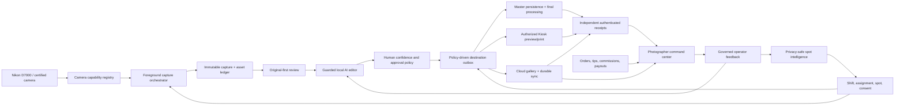

# ClickFlash Android Photographer — Competitive Product Roadmap

Owner: Mobile + Master platform  
Updated: 2026-08-03  
Platform decision: fully native-capable Android application; no iOS parity requirement  
Evidence: [competitor research](../research/mobile-competitor-capability-evidence-2026-07-31.md), [scored matrix](../research/mobile-competitor-capability-matrix-2026-07-31.csv), and [2026-08-03 mobile checkpoint audit](../audits/mobile-photographer/2026-08-03/README.md)

## Product decision

Build one Android field operating system for the photographer. The same app must safely control or observe the camera, ingest every physical shutter capture, preserve the original, run a guarded automatic edit, let the photographer intervene, deliver to authorized Kiosk/Master/Cloud destinations, and show the photographer their assignments, route progress, photo production, quality, revenue, commissions, and payout status.

ClickFlash should not imitate a generic camera remote, editor, gallery, CRM, or staff tracker. Its advantage is a durable end-to-end chain:

`assignment → spot → camera capability → shutter → verified asset → edit recipe → approval → destination receipts → customer action → sale → photographer earnings`

Every state transition is recoverable and auditable. Every AI output exposes confidence and reason. Every financial value distinguishes estimate, reconciled amount, and paid amount.

## Current repository truth

The July 2026 ecosystem audit remains the historical baseline and its production **No-Go** verdict is not superseded. The 2026-08-03 checkpoint establishes a narrower **local software checkpoint pass** for the new photographer identity and command-center slice only.

| State | Repository evidence at this checkpoint |
|---|---|
| **EVIDENCED** | Administrator-selected pairing identity, authenticated self/device command-center paths, nonce-bound HMAC responses, Android performance UI/client/model, and explicit TND/JPY currency scale have passed their recorded focused gates. A strict shared immutable event contract now covers order, capture, settlement, refund, attribution, commission, adjustment, payout, shift/break, reversal, and exact evidence-set approval. Master has an append-only/hash-verified SQLite service with reconciliation readiness; its focused suite passes 10/10. |
| **ACTIVE** | The Pixel 8 API 35 AVD boots and accepts the native development APK, but Metro repeatedly fails to bind port 8081 after high-CPU startup. Diagnose bundler startup before claiming the new JavaScript screen is emulator-verified. |
| **OPEN** | Emulator/runtime, offline/freshness, accessibility, and field-usability evidence is not complete. Operational gross is provisional. Settlement, refunds, net recognized revenue, payable earnings, payout, and shift truth remain unavailable until verified producers, policies, outboxes, projections, live-like profiles, and approvals use the new event foundation. Physical D7000 certification, professional editor golden-image evidence, Kiosk/Cloud workers, LAN confidentiality, root override/lockfile reconciliation, release signing, Play policy, deployment, monitoring, and rollback gates remain open. |

The codebase also contains Android USB/PTP ingest, a foreground tether service, app-private verified JPEG/NEF copy, RAW+JPEG pairing, capture/delivery ledgers, original-before-edit rendering, quick-edit staging, a camera capability registry with remote writes locked behind certification, offline/network services, schedule and POS surfaces, and a privacy-safe Scout V1. Approvals and Kiosks are still incomplete, and the automatic editor is not yet a professional color/retouch pipeline.

Simulation, a debug APK, a UI mock, or a passing unit test does not prove camera compatibility, delivery durability, AI quality, payout accuracy, or production readiness.

## Priority and delivery vocabulary

- `P0` — required for a controlled paid field pilot.
- `P1` — required for a commercially complete first release.
- `P2` — scale, differentiation, or operator-efficiency improvement.
- `R&D` — gated experiment; never represented as a production capability before evidence.
- `W0` — safety, identity, data, and Android foundation.
- `W1` — dependable camera and field-session core.
- `W2` — professional editor and authorized delivery.
- `W3` — business, fleet, collaboration, and intelligence scale.
- `W4` — advanced research after operational evidence.

## Target architecture

### Cross-cutting invariants

1. Camera ingest outranks preview generation, AI inference, analytics, and upload.
2. The camera card remains the physical backup until reconciliation policy is satisfied.
3. Originals are immutable; edits are versioned recipes and derivatives.
4. Remote commands are capability-negotiated, visible, cancellable, rate-limited, and reconciled with actual camera state.
5. A destination is complete only after its own authenticated durable receipt.
6. Customer identity and biometric use require an explicit legal basis, visible consent state, strict purpose limitation, and a non-biometric alternative.
7. Photographer revenue is authorization-scoped and ledger-derived; estimates never masquerade as payable payroll.
8. Learning uses explicit feedback and governed promotion. No app silently retrains and deploys during a shoot.

## 192-capability portfolio

All entries below are planned unless the current-truth section or execution ledger explicitly marks an evidenced implementation checkpoint.

### 1. Android and device foundation — 12

| ID | Capability | Priority / wave |
|---|---|---|
| FND-01 | Certified Android device, OS, USB host, cable, hub, and power compatibility registry | P0 / W0 |
| FND-02 | Guided device preflight for OS, storage, battery, thermal state, USB host, notifications, background restrictions, and network | P0 / W0 |
| FND-03 | Android foreground-service control center with truthful persistent capture status | P0 / W0 |
| FND-04 | Screen-off, background, process-restart, and device-reboot recovery coordinator | P0 / W0 |
| FND-05 | Battery-saver and thermal-degradation policy that never starves camera ingest | P0 / W1 |
| FND-06 | App-private encrypted metadata and secrets with hardware-backed key use where available | P0 / W0 |
| FND-07 | Per-feature runtime permission center with denial recovery and plain-language reasons | P1 / W0 |
| FND-08 | Accessibility baseline: TalkBack, scalable text, contrast, reduced motion, switch access, and haptic alternatives | P1 / W1 |
| FND-09 | One-handed field mode with glove-sized controls, sunlight palette, and left/right layouts | P1 / W1 |
| FND-10 | Offline signed configuration/profile bundle with version, expiry, and rollback | P0 / W0 |
| FND-11 | Managed update readiness, staged rollout, rollback, minimum-version, and compatibility policy | P1 / W2 |
| FND-12 | In-app support bundle export with redaction, bounded logs, diagnostics, and operator consent | P1 / W2 |

### 2. Camera/PTP tethering and remote — 12

| ID | Capability | Priority / wave |
|---|---|---|
| CAM-01 | Nikon D7000 physical-shutter detection with bounded object-delta polling and restart deduplication | P0 / W1 |
| CAM-02 | Capability negotiation for camera identity, mode, supported properties, operations, storage, and object formats | P0 / W1 |
| CAM-03 | Connection wizard for camera mode, cable direction, OTG, permission, SD card, and troubleshooting | P0 / W1 |
| CAM-04 | Detach/reconnect state machine with quiet retry, explicit degraded mode, and no duplicate imports | P0 / W1 |
| CAM-05 | Read-only camera status HUD for battery, storage, exposure, focus mode, and active format when supported | P1 / W1 |
| CAM-06 | Safe remote shutter with arming gesture, cooldown, cancellation, and capture reconciliation | P1 / W2 |
| CAM-07 | Capability-driven exposure controls for shutter, aperture, ISO, and compensation with visible camera acknowledgment | P1 / W2 |
| CAM-08 | Capability-driven focus mode/point command with state verification and manual-focus guardrail | P2 / W2 |
| CAM-09 | Live View transport with adaptive frame rate, histogram, clipping overlay, grids, and tap magnification | P1 / W2 |
| CAM-10 | Interval, time-lapse, exposure-bracket, and focus-bracket recipes with interrupt and recovery semantics | P2 / W3 |
| CAM-11 | Multi-camera session identity and collision-safe ingest without claiming synchronized D7000 control | P2 / W3 |
| CAM-12 | Camera firmware/profile compatibility warnings based on verified test evidence, never guesswork | P1 / W1 |

### 3. Capture safety, storage, and media integrity — 12

| ID | Capability | Priority / wave |
|---|---|---|
| SAFE-01 | Atomic app-private copy with byte count, flush, hash, rename, and immutable original record | P0 / W0 |
| SAFE-02 | RAW+JPEG companion matching using camera sequence, normalized basename, time tolerance, and ambiguity hold | P0 / W0 |
| SAFE-03 | Two-stage storage admission with reserve, blocked state, operator recovery, and no camera-card deletion | P0 / W0 |
| SAFE-04 | Capture-to-camera-object-to-phone-file reconciliation dashboard | P0 / W1 |
| SAFE-05 | Session checkpoints for crash-safe resume after phone or app restart | P0 / W1 |
| SAFE-06 | Duplicate-content detection across restarts, reconnects, camera folders, and destination retries | P0 / W1 |
| SAFE-07 | Corrupt/truncated media quarantine with repair guidance and retained provenance | P0 / W1 |
| SAFE-08 | Configurable retention tiers gated by Master/Cloud receipts and supervisor policy | P1 / W2 |
| SAFE-09 | Phone storage forecast in remaining RAW+JPEG shots, not only bytes | P1 / W1 |
| SAFE-10 | SD-card folder rollover and large-card indexing without unbounded scans | P1 / W1 |
| SAFE-11 | Optional dual-phone emergency handoff through Master-approved ownership transfer | P2 / W3 |
| SAFE-12 | End-of-shift signed reconciliation report covering camera, phone, Master, Cloud, and Kiosks | P0 / W2 |

### 4. Live capture assistance and field controls — 12

| ID | Capability | Priority / wave |
|---|---|---|
| VIEW-01 | Capture HUD showing tether health, verified count, blocked count, queue depth, storage, battery, and thermal state | P0 / W1 |
| VIEW-02 | Quiet audio/haptic language for detected, safe, edited, Kiosk-ready, fully delivered, and attention states | P0 / W1 |
| VIEW-03 | Full-screen original-first preview with checksum state and RAW/JPEG pair indicator | P0 / W1 |
| VIEW-04 | Swipe review that cannot pause or block background ingest | P0 / W1 |
| VIEW-05 | Histogram, highlight clipping, shadow warning, and exposure consistency overlay from verified preview | P1 / W2 |
| VIEW-06 | Rule-based blink, face obstruction, gross blur, and missing-subject warnings with confidence | P1 / W2 |
| VIEW-07 | Group-count and pose-completeness indicator without storing identity embeddings by default | P1 / W2 |
| VIEW-08 | Voice tags and large quick tags for room, activity, group, exception, and retouch request | P1 / W2 |
| VIEW-09 | Hands-free assignment/spot summary via optional earpiece with privacy mode | P2 / W3 |
| VIEW-10 | Configurable review hold: never, only low-confidence, every N shots, or supervisor policy | P1 / W2 |
| VIEW-11 | Emergency capture-only mode that suspends AI, uploads, animations, and analytics | P0 / W1 |
| VIEW-12 | Operator-defined focus mode with distraction-free controls and automatic return after review | P1 / W2 |

### 5. Shift, assignment, territory, and route workflow — 12

| ID | Capability | Priority / wave |
|---|---|---|
| FLOW-01 | Secure shift sign-in, clock-in/out, break, and supervisor-confirmed correction workflow | P0 / W1 |
| FLOW-02 | Today view for venue, assignments, time windows, priority, dress/gear notes, and contact path | P0 / W1 |
| FLOW-03 | Route/patrol progress across approved shooting spots without covert continuous staff surveillance | P1 / W2 |
| FLOW-04 | Manual, QR, NFC, coarse-location, and Master-confirmed active spot resolution with source confidence | P0 / W1 |
| FLOW-05 | Assignment capacity and overdue alerts based on actual capture/delivery load | P1 / W2 |
| FLOW-06 | Guest/session claim creation linked to assignment, consent, group, and delivery policy | P0 / W2 |
| FLOW-07 | Event run-of-show timeline with offline updates and conflict warnings | P1 / W2 |
| FLOW-08 | Gear checklist, cable/SD/battery checklist, and shift preflight attestation | P0 / W1 |
| FLOW-09 | Safety check-in and venue escalation action that shares only policy-approved context | P1 / W2 |
| FLOW-10 | Weather, light window, access restriction, and crowd-level context cached for the shift | P2 / W3 |
| FLOW-11 | Photographer handoff with explicit custody transfer for assignments and pending captures | P1 / W2 |
| FLOW-12 | End-of-shift closeout for unresolved captures, deliveries, cash, gear, incidents, and notes | P0 / W2 |

### 6. Review, culling, and selection — 12

| ID | Capability | Priority / wave |
|---|---|---|
| CULL-01 | Burst and near-duplicate grouping using local visual similarity with transparent group boundaries | P1 / W2 |
| CULL-02 | Blur, blink, clipping, obstruction, pose-completeness, and expression signals as separate scores | P1 / W2 |
| CULL-03 | Best-of-group suggestion with reasons and no automatic original deletion | P1 / W2 |
| CULL-04 | Photographer pick, reject, compare, and restore actions preserved as feedback events | P1 / W2 |
| CULL-05 | Side-by-side and synchronized zoom for RAW/JPEG, original/edit, and best-of-group comparison | P1 / W2 |
| CULL-06 | Fast flagging for retouch, manager review, identity ambiguity, print hold, and do-not-deliver | P0 / W2 |
| CULL-07 | Session consistency view for exposure, white balance, crop, and style drift | P1 / W2 |
| CULL-08 | Customer-favorite and proofing state synchronized without overriding photographer selections | P2 / W3 |
| CULL-09 | Configurable culling policy by event type, customer package, and delivery SLA | P1 / W2 |
| CULL-10 | Keyboard/remote-button compatible review for docked Android devices | P2 / W3 |
| CULL-11 | Deferred heavy culling on Master while mobile preserves a deterministic preliminary result | P1 / W2 |
| CULL-12 | Culling quality audit: overrides, false rejects, misses, subgroup fairness, and profile version | P1 / W3 |

### 7. Professional automatic AI editor — 12

| ID | Capability | Priority / wave |
|---|---|---|
| EDIT-01 | Deterministic versioned edit recipe with original hash, model/profile version, parameters, and provenance | P0 / W2 |
| EDIT-02 | Scene-aware auto exposure, white balance, contrast, highlight, shadow, and tone curve within bounded limits | P0 / W2 |
| EDIT-03 | Camera/lens profile correction for distortion, vignetting, chromatic aberration, and orientation | P1 / W2 |
| EDIT-04 | Subject/background/sky masks with visible confidence, feathering, and reversible local adjustments | P1 / W2 |
| EDIT-05 | Skin-tone protection across documented test cohorts with saturation/hue and clipping guardrails | P0 / W2 |
| EDIT-06 | Event consistency engine that harmonizes a sequence without flattening intentional lighting changes | P1 / W2 |
| EDIT-07 | Gentle blemish, shine, eye, teeth, and fabric cleanup gated by consent/profile and naturalness limits | P2 / W3 |
| EDIT-08 | Composition suggestions for crop, horizon, headroom, and print aspect ratios; never destructive by default | P1 / W2 |
| EDIT-09 | Noise reduction, sharpening, motion-blur warning, and output-specific rendering profiles | P1 / W2 |
| EDIT-10 | One-tap looks and venue/spot profiles with live strength, reset, copy, paste, and batch preview | P1 / W2 |
| EDIT-11 | Confidence router: auto-approve, photographer-review, Master-heavy-process, or hold | P0 / W2 |
| EDIT-12 | Preference learning from explicit corrections with private local deltas, offline evaluation, governed promotion, and rollback | P1 / W3 |

### 8. Spot intelligence and shoot planning — 12

| ID | Capability | Priority / wave |
|---|---|---|
| SPOT-01 | Privacy-safe derived spot ID from coarse candidate plus device-local salt; no raw precise coordinate retention | P0 / W1 |
| SPOT-02 | Explicit photographer confirmation before a candidate becomes the active spot | P0 / W1 |
| SPOT-03 | Cold-start minimum sample rule before camera or pose recommendations | P0 / W1 |
| SPOT-04 | Explainable local recommendation with reason, confidence, sample count, and freshness | P0 / W1 |
| SPOT-05 | Time-of-day, weather, light direction, crowd, pose, blur/blink, and quality baseline by governed spot profile | P1 / W2 |
| SPOT-06 | Sun, moon, golden/blue-hour, shadow direction, and AR framing planner independent of learned AI | P2 / W3 |
| SPOT-07 | Spot catalog with access notes, safety constraints, example frames, permits, and equipment guidance | P1 / W2 |
| SPOT-08 | Suggested photographer position, subject position, lens range, angle, and pose with manual confirmation | P1 / W3 |
| SPOT-09 | Overcrowding and diminishing-return guidance based on anonymous operational counts | P2 / W3 |
| SPOT-10 | Personal private spot notes and team-shared approved notes with separate visibility | P1 / W2 |
| SPOT-11 | Feedback buttons for useful, wrong spot, unsafe, poor light, and bad recommendation | P0 / W2 |
| SPOT-12 | Offline profile evaluation, drift detection, supervisor approval, signed promotion, canary, and rollback | P1 / W3 |

### 9. Guest identity, consent, and delivery — 12

| ID | Capability | Priority / wave |
|---|---|---|
| GUEST-01 | Offline-capable guest/session claim using QR or short claim code with event and expiry scope | P0 / W2 |
| GUEST-02 | Consent center that records purpose, channel, identity method, notice version, withdrawal, and operator | P0 / W2 |
| GUEST-03 | Non-biometric guest matching by QR, wristband, card, booking, or photographer-created session | P0 / W2 |
| GUEST-04 | Optional explicit-consent face matching with confidence, human review, fallback, retention, and deletion policy | P1 / W3 |
| GUEST-05 | Group/session delivery with member invites and owner-controlled sharing boundaries | P1 / W3 |
| GUEST-06 | Branded instant preview page with event theme, photographer identity, rights, watermark, and expiry | P1 / W2 |
| GUEST-07 | Channel preferences for Kiosk, QR web, email, SMS, messaging handoff, print, and no-contact | P1 / W2 |
| GUEST-08 | Delivery timeline showing queued, locally ready, Kiosk ready, gallery published, notified, opened, and failed | P0 / W2 |
| GUEST-09 | Duplicate notification suppression, resend policy, rate limits, quiet hours, and channel fallback | P1 / W2 |
| GUEST-10 | Guest self-service correction for contact data, matching error, missing photos, and consent withdrawal | P1 / W3 |
| GUEST-11 | Private gallery access controls for PIN, magic link, expiration, download/print rights, and revocation | P0 / W2 |
| GUEST-12 | Delivery accessibility and localization for notices, claim flow, captions, and right-to-left layouts | P1 / W3 |

### 10. Kiosk, fleet, and print orchestration — 12

| ID | Capability | Priority / wave |
|---|---|---|
| KIOSK-01 | Authenticated discovery of authorized Kiosks with venue, zone, capability, and certificate identity | P0 / W2 |
| KIOSK-02 | Assignment policy mapping captures to zero, one, or multiple Kiosks without broadcast leakage | P0 / W2 |
| KIOSK-03 | Mobile Kiosk tab for reachability, queue depth, storage, display/print capability, and last receipt | P0 / W2 |
| KIOSK-04 | Small authenticated preview lane with checksum, expiry, watermark, and displayable receipt | P0 / W2 |
| KIOSK-05 | Print job creation with product, media, crop, color profile, copies, price, and customer/claim scope | P1 / W2 |
| KIOSK-06 | Printer/media diagnostics for paper, ribbon/ink, jams, temperature, connectivity, and estimated jobs remaining | P1 / W3 |
| KIOSK-07 | Template and overlay packs signed, versioned, preflighted, cached, and rollback-capable | P1 / W2 |
| KIOSK-08 | Offline Kiosk cache policy with bounded storage, eviction, expiry, and protected pending orders | P1 / W2 |
| KIOSK-09 | Signed remote actions for refresh, pause intake, retry, clear safe cache, or request assistance; no arbitrary shell | P1 / W3 |
| KIOSK-10 | Fleet incident timeline linking device health, capture routing, delivery attempts, receipts, and operator actions | P1 / W3 |
| KIOSK-11 | Kiosk failover and reroute with supervisor policy, customer continuity, and duplicate-print prevention | P1 / W3 |
| KIOSK-12 | End-of-event reconciliation for displayed assets, prints, orders, refunds, expired previews, and cache purge | P0 / W3 |

### 11. Offline, network, and delivery reliability — 12

| ID | Capability | Priority / wave |
|---|---|---|
| NET-01 | Real network classification for offline, Kiosk LAN, Master LAN, metered cellular, unmetered internet, and captive portal | P0 / W1 |
| NET-02 | Independent durable outboxes and authenticated receipts for Master, each Kiosk, and Cloud | P0 / W2 |
| NET-03 | Chunked resumable transfer with content range, per-chunk digest, final hash, expiry, and idempotency | P0 / W2 |
| NET-04 | Priority scheduler: original safety, local preview, required LAN delivery, cloud sync, analytics, then optional work | P0 / W2 |
| NET-05 | Backpressure across camera, disk, editor, transport, Kiosk, Master, and Cloud queues | P0 / W2 |
| NET-06 | Policy-controlled cellular budget by event, asset type, roaming state, battery, and supervisor override | P1 / W2 |
| NET-07 | Exponential retry with jitter, bounded concurrency, circuit breaker, deadline, and operator-visible attention queue | P0 / W2 |
| NET-08 | Signed clock-skew handling and monotonic event ordering without trusting wall-clock timestamps alone | P1 / W2 |
| NET-09 | Offline conflict resolution for assignment, profile, consent, order, selection, and delivery state | P0 / W2 |
| NET-10 | Master-mediated photographer handoff for pending assets without an unauthenticated peer mesh | P1 / W3 |
| NET-11 | Queue inspector with reason, age, next attempt, destination, bytes, dependency, and safe operator action | P1 / W2 |
| NET-12 | Automated airplane-mode, packet-loss, latency, captive-portal, IP-change, and service-restart chaos suite | P0 / W2 |

### 12. Photographer revenue, payroll, and performance command center — 12

| ID | Capability | Priority / wave |
|---|---|---|
| BIZ-01 | Today command center for shift, assignment, route progress, capture health, deliveries, sales, earnings, and alerts | P0 / W2 |
| BIZ-02 | Photo production funnel: shutter detections, verified imports, pairs, edits, approvals, deliveries, views, favorites, prints, and sales | P0 / W2 |
| BIZ-03 | Revenue cards for gross sales, taxes, refunds, discounts, net recognized revenue, and photographer-attributed share | P0 / W3 |
| BIZ-04 | Payout/payroll timeline separating estimated, pending reconciliation, approved, scheduled, paid, held, and disputed amounts | P0 / W3 |
| BIZ-05 | Commission, bonus, tip, overtime, package, and venue-rule breakdown with effective policy version | P1 / W3 |
| BIZ-06 | Earnings analysis by assignment, hour, spot, event, package, product, delivery channel, and photo cohort | P1 / W3 |
| BIZ-07 | Transparent performance scorecard for output, verified delivery SLA, quality, customer outcomes, reliability, and safety—not hidden surveillance | P0 / W3 |
| BIZ-08 | Goals, milestones, coaching suggestions, and incentive progress with no manipulation or undisclosed ranking | P1 / W3 |
| BIZ-09 | Conversion and engagement attribution for claims, gallery opens, favorites, cart, prints, orders, refunds, and repeat customer outcomes | P1 / W3 |
| BIZ-10 | Time, attendance, breaks, assignment/route completion, and approved correction history tied to payroll reconciliation | P0 / W3 |
| BIZ-11 | Earnings adjustment/dispute flow with evidence, comments, status, deadlines, export, and appeal path | P0 / W3 |
| BIZ-12 | Weekly/monthly trends and forecast with explicit assumptions, confidence range, comparison period, and data-freshness banner | P1 / W3 |

### 13. Collaboration, approvals, and proofing — 12

| ID | Capability | Priority / wave |
|---|---|---|
| COL-01 | Unified Approvals inbox for low-confidence edits, identity ambiguity, retouch, print, delivery, and policy exceptions | P0 / W2 |
| COL-02 | Priority/SLA sorting with assignment, customer, value, age, reason, and blocking dependency | P1 / W2 |
| COL-03 | Image annotations, crop/retouch regions, comments, mentions, attachments, and resolution state | P1 / W3 |
| COL-04 | Customer selects, favorites, rejects, and approval states separated from internal culling decisions | P1 / W3 |
| COL-05 | Version compare with recipe diff, reviewer, timestamp, rationale, and restore | P1 / W2 |
| COL-06 | Role-based approve, request changes, hold, publish, print, refund, and escalate actions | P0 / W2 |
| COL-07 | Photographer-to-Master handoff of heavy edits with context, deadline, priority, and return receipt | P0 / W2 |
| COL-08 | Assignment handover note including unresolved captures, customer promises, equipment, and safety issues | P1 / W2 |
| COL-09 | Client message inbox linked to guest/session/order while protecting personal contact data | P1 / W3 |
| COL-10 | Actionable notifications grouped by urgency, shift, quiet hours, channel, and acknowledgment | P1 / W2 |
| COL-11 | Offline action queue with optimistic labels only where rollback is safe and understandable | P1 / W2 |
| COL-12 | Complete collaboration audit history exportable by authorized supervisors and the affected photographer | P1 / W3 |

### 14. Security, privacy, and governance — 12

| ID | Capability | Priority / wave |
|---|---|---|
| SEC-01 | Device-bound photographer identity with short-lived sessions, biometric unlock option, revocation, and lost-device response | P0 / W0 |
| SEC-02 | Operator-approved Master/Kiosk pairing with transcript binding, certificate pinning, rotation, and expiry | P0 / W0 |
| SEC-03 | Server-enforced RBAC plus assignment/event/venue/destination attribute scope on every protected action | P0 / W0 |
| SEC-04 | Encryption in transit and at rest for secrets, ledgers, customer data, financial data, and support bundles | P0 / W0 |
| SEC-05 | Signed app, model, profile, template, policy, and configuration artifacts with fail-closed verification and rollback | P0 / W0 |
| SEC-06 | Privacy inventory and purpose/retention policy for media, location, face data, contact data, telemetry, and earnings | P0 / W0 |
| SEC-07 | Consent withdrawal and data-subject workflow propagated to pending queues, galleries, Kiosks, Master, and Cloud | P0 / W2 |
| SEC-08 | Face matching isolated behind explicit feature policy, liveness/abuse controls, confidence review, and deletion evidence | P1 / W3 |
| SEC-09 | Tamper-evident security, financial, consent, edit, receipt, and administrative audit events | P0 / W1 |
| SEC-10 | Bounded validation, rate limiting, idempotency, replay protection, and authorization on every mobile-facing endpoint | P0 / W0 |
| SEC-11 | Remote wipe of app secrets and session revocation without claiming guaranteed deletion of an offline camera card | P1 / W2 |
| SEC-12 | Threat modeling, dependency/SBOM scan, static/dynamic testing, penetration test, incident drills, and remediation gates | P0 / W2 |

### 15. Observability, quality, testing, and support — 12

| ID | Capability | Priority / wave |
|---|---|---|
| OPS-01 | End-to-end trace identity from camera object through asset, edit, receipt, gallery, order, and earnings event | P0 / W1 |
| OPS-02 | Local SLO dashboard for detection, import, preview, edit, delivery, queue age, storage, battery, thermal, and crashes | P0 / W2 |
| OPS-03 | Privacy-budgeted telemetry with allowlisted fields, aggregation, sampling, redaction tests, and user-visible control | P0 / W2 |
| OPS-04 | Crash/ANR/native failure capture correlated to device, OS, app, camera, cable, queue, and last safe checkpoint | P0 / W1 |
| OPS-05 | Certified hardware lab matrix for Android models, OS builds, cables, adapters, hubs, power modes, cards, and camera firmware | P0 / W1 |
| OPS-06 | 1,000-capture and burst soak harness with camera-card-to-ledger reconciliation | P0 / W1 |
| OPS-07 | Screen-off, background, detach, restart, low-storage, thermal, battery, corrupt-media, and permission-denial test suites | P0 / W1 |
| OPS-08 | Golden-image editor evaluation for color, skin tone, clipping, masks, crops, consistency, latency, and regressions | P0 / W2 |
| OPS-09 | Destination contract tests for authentication, chunking, idempotency, hash, proof bits, expiry, and replay | P0 / W2 |
| OPS-10 | Revenue/payroll reconciliation tests from order/refund through commission policy and payout ledger | P0 / W3 |
| OPS-11 | Operator support timeline that replays state transitions without exposing raw secrets or unrestricted customer media | P1 / W2 |
| OPS-12 | Release evidence dashboard that blocks promotion on unresolved P0 defects, stale evidence, or missing physical gates | P0 / W2 |

### 16. Advanced field lab — 12

| ID | Capability | Priority / wave |
|---|---|---|
| LAB-01 | On-device semantic photo search using consent-safe local embeddings and governed index deletion | R&D / W4 |
| LAB-02 | Natural-language local edit intent compiled into a previewable deterministic recipe | R&D / W4 |
| LAB-03 | Pose/framing coach trained only on licensed, consented, representative material with fairness evaluation | R&D / W4 |
| LAB-04 | Optional smartwatch or Bluetooth button for safe mark/review actions, never unarmed destructive commands | R&D / W4 |
| LAB-05 | UWB/BLE/NFC spot corroboration with anti-spoofing and no continuous person-tracking default | R&D / W4 |
| LAB-06 | Multi-photographer coverage balancing based on assignments and anonymous workload, not covert productivity surveillance | R&D / W4 |
| LAB-07 | Demand forecast for spot staffing, print media, network, storage, and Kiosk capacity with confidence ranges | R&D / W4 |
| LAB-08 | Active-learning sample proposals that export only governed metadata/previews after review and legal approval | R&D / W4 |
| LAB-09 | Master-assisted generative background cleanup or expansion with visible provenance and customer policy | R&D / W4 |
| LAB-10 | Camera-to-phone direct power/connection accessory evaluation for strain relief, charging, and weather protection | R&D / W4 |
| LAB-11 | Multi-camera synchronization research with measured clock/error bounds and no unsupported D7000 promise | R&D / W4 |
| LAB-12 | Privacy-preserving cross-site profile aggregation evaluated against site-local training and strict opt-out | R&D / W4 |

## First 30 launch-critical capabilities

These are the first integrated slice; their ordering follows dependency and risk, not visual appeal.

| Order | Capability | Observable completion evidence |
|---:|---|---|
| 1 | FND-01 certified device/cable matrix | Signed physical test matrix for the pilot hardware |
| 2 | FND-02 Android preflight | Pass/fail diagnosis on every certified device and negative fixture |
| 3 | FND-03 truthful foreground service | Screen-off/background state matches actual ingest eligibility |
| 4 | SEC-01 device-bound identity | Revocation and lost-device drill passes |
| 5 | SEC-02 device pairing | Physical pairing, rotation, expiry, and impersonation tests pass |
| 6 | SEC-03 authorization scope | Cross-photographer/event/destination denial tests pass |
| 7 | CAM-01 D7000 shutter detection | Physical normal/burst/reconnect/restart evidence |
| 8 | CAM-02 capability negotiation | Unsupported commands never appear or execute |
| 9 | CAM-03 connection wizard | First-run and recovery usability study passes |
| 10 | CAM-04 detach/reconnect | No loss or duplicate across repeated cable faults |
| 11 | SAFE-01 atomic verified import | Corruption and power-loss fixtures fail closed |
| 12 | SAFE-02 RAW+JPEG matching | Pair, late pair, standalone, and ambiguity corpus passes |
| 13 | SAFE-03 storage admission | Low-space test preserves camera original and recovers safely |
| 14 | SAFE-04 reconciliation | Camera card and capture ledger match after soak |
| 15 | SAFE-05 crash checkpoints | Forced process/device restart resumes without duplication |
| 16 | VIEW-01 capture HUD | Every state derives from live service/ledger values |
| 17 | VIEW-02 field feedback | Distinct, accessible signals do not interrupt rapid shooting |
| 18 | VIEW-03 original preview | Verified untouched JPEG appears before any edit |
| 19 | VIEW-11 capture-only mode | Heavy work stops while ingest remains healthy |
| 20 | FLOW-01 shift identity | Clock state persists and authorized correction is auditable |
| 21 | FLOW-02 assignment view | Offline signed assignment replaces mock data |
| 22 | FLOW-04 active spot resolver | QR/manual/coarse candidates resolve conservatively |
| 23 | FLOW-08 shift preflight | Required gear/device/camera/storage gates are enforced |
| 24 | EDIT-01 recipe provenance | Every derivative maps to an immutable original and recipe |
| 25 | EDIT-02 bounded base edit | Golden-image quality and latency thresholds pass |
| 26 | EDIT-05 skin-tone guardrails | Representative evaluation passes approved fairness limits |
| 27 | EDIT-11 confidence router | Unsafe/uncertain edits never auto-publish |
| 28 | NET-02 destination outboxes | Master/Kiosk/Cloud readiness remains independent |
| 29 | NET-03 resumable transfer | Disconnect/restart resumes and final hash matches |
| 30 | BIZ-02 production funnel | Counts reconcile to the capture, delivery, gallery, and order ledgers |

CAM-06 through CAM-10 are valuable, but remote control cannot displace the physical-shutter ingest and integrity gates. BIZ-03 through BIZ-12 ship only after the Master financial ledger and authorization model are authoritative.

## Delivery waves and dependency gates

| Wave | Outcome | Exit gate |
|---|---|---|
| W0 — trusted Android base | Identity, configuration, pairing, immutable asset/receipt schemas, storage safety, signed build policy | Security design approved; debug/release separation proven; no cross-tenant access; recovery schema tests pass |
| W1 — dependable field camera | Certified D7000 physical-shutter ingest, assignments, spot resolution, capture HUD, reconciliation, restart and screen-off safety | Physical soak/burst/detach/restart/low-storage/battery/thermal matrix passes on the pilot device/cable set |
| W2 — edit and deliver | Professional bounded editor, approvals, guest claims, authenticated Kiosk/Master/Cloud delivery, closeout | Golden-image guardrails and three-destination chaos/reconciliation gates pass; no optimistic readiness |
| W3 — operate and optimize | Revenue/payroll command center, fleet, CRM/proofing, governed learning, advanced spot/camera features | Financial reconciliation, privacy review, support readiness, staged rollout, and field KPI targets pass |
| W4 — advanced lab | Experimental semantic, generative, sensor, forecasting, and multi-camera capabilities | Separate experiment approval, dataset rights, safety evaluation, rollback, and no production claim before evidence |

## Product success metrics and service-level targets

Targets apply only to a declared certified hardware/network/content contract and must be measured at P50/P95/P99, not averaged away.

| Outcome | Initial target | Measurement boundary |
|---|---:|---|
| Physical shutter detection latency | P95 ≤ 1.5 s | D7000 object creation to app detection on certified cable/device |
| Untouched preview latency | P95 ≤ 5 s for 10 MB JPEG | Camera object creation to checksum-verified on-screen original |
| Capture integrity | 0 missing or duplicate ledger originals in 1,000-shot soak | Camera card reconciled to phone ledger after restarts and detach faults |
| Import durability | ≥ 99.9% automatically recovered; 100% accounted for | Success plus explicit blocked/quarantined/attention state, never disappearance |
| Camera remote acknowledgment | P95 ≤ 1 s when supported | User command to verified property/operation response; unsupported excluded |
| Quick-edit preview | P95 ≤ 3 s after verified JPEG | Certified device, declared image size, thermal-normal state |
| Automatic edit safety | 100% hard-guard violations held | Clipping, face/skin, corruption, low confidence, policy, and provenance guards |
| Edit usefulness | ≥ 80% accepted without adjustment in pilot cohort | Stratified by venue, spot, lighting, and photographer; overrides retained |
| Kiosk preview readiness | P95 ≤ 10 s on healthy venue LAN | Verified import to authenticated displayable Kiosk receipt |
| Cloud gallery readiness | P95 ≤ 60 s on contracted uplink | Verified import to authenticated published/indexed receipt |
| Offline recovery | 100% queues resume without duplicate final state | Airplane mode, IP change, restart, and expiry chaos suite |
| Crash-free shifts | ≥ 99.5% | Shift sessions, with ANR/native failures included |
| Thermal/battery safety | No severe thermal shutdown in four-hour pilot | Ingest maintained; energy per 100 shots and per shift recorded |
| Revenue correctness | 0 unexplained variance | Mobile view reconciled to orders, refunds, commission rules, and payout ledger |
| Privacy/authorization | 0 unauthorized access or delivery | Negative tenant, event, assignment, destination, and consent tests |
| Accessibility | 0 critical WCAG/Android accessibility blockers | Core preflight, capture, review, delivery, and earnings journeys |

## Release evidence gates

1. **Hardware:** physical D7000 normal/burst/RAW+JPEG, card-folder rollover, screen-off, detach/reconnect, camera power cycle, app kill, device reboot, low storage, full card, corrupt object, battery, and thermal evidence.
2. **Remote control:** enumerate supported D7000 operations/properties, test each command, verify camera acknowledgment, cancel long recipes, and prove physical-camera changes reconcile back into the UI.
3. **Media:** immutable hash chain, late pairs, ambiguous pairs, duplicate objects, interrupted copies, orientation, large files, unsupported formats, and original-to-derivative provenance.
4. **Editor:** licensed representative golden set; color and skin-tone review; clipping, mask, crop, consistency, naturalness, latency, thermal, confidence, human override, version rollback, and subgroup analysis.
5. **Delivery:** authenticated discovery, authorization, resumable transfer, idempotency, independent proof bits, expired credentials, replay, wrong destination, storage full, restart, offline, captive portal, and queue reconciliation.
6. **Financial:** capture/order/refund/discount/tax/commission/tip/bonus/overtime/adjustment/payout reconciliation; cross-photographer denial; estimate-versus-paid labels; timezone and currency boundaries.
7. **Privacy:** spot/location minimization, consent notice and withdrawal, biometric off-by-default path, deletion/retention propagation, audit access, telemetry schema, support-bundle redaction, and threat model.
8. **Production:** approved signing key injection, inspected release AAB, Play policy/data-safety review, staged rollout/rollback, monitoring, on-call runbook, customer support, disaster recovery, and incident exercise.

## Architecture work packages

| Package | Owns | Must not own |
|---|---|---|
| Camera capability registry | Tested vendor/model/firmware/property/operation facts | Guessed camera behavior or business policy |
| Capture orchestrator | USB lifecycle, polling, copy admission, foreground service, camera reconciliation | Image editing, customer identity, payroll |
| Asset and destination ledger | Immutable assets, pair identity, intents, attempts, authenticated receipts | Optimistic UI completion or raw credentials |
| Local media engine | Preview decode, analysis, recipe execution, derivative validation | Original mutation or silent model promotion |
| Assignment/policy context | Photographer, shift, event, spot, guest/session, consent, routing policy | Camera transport details or final financial truth |
| Delivery workers | Master/Kiosk/Cloud transport, retries, proofs, backpressure | Cross-destination completion shortcuts |
| Business command center | Authorized projections and reconciled analytics derived from ledgers | Editable revenue source-of-truth or hidden performance formulas |
| Intelligence governance | Training/evaluation corpus, profile registry, promotion, canary, rollback, audit | Unreviewed live training during shifts |

## Sequencing rules

- Do not build an elaborate Live View controller before physical-shutter integrity and recovery pass.
- Do not auto-publish an edit before original provenance, hard guardrails, and confidence routing pass.
- Do not enable biometric matching before QR/claim-code delivery, consent withdrawal, and deletion propagation work.
- Do not show payable earnings from client-calculated values; use the authoritative financial ledger and state freshness.
- Do not rank photographers with opaque or punitive scores. Show understandable metrics, controllable comparisons, and an appeal path.
- Do not expand mesh or peer transfer without authenticated ownership transfer and a threat model.
- Do not delete camera originals automatically in the first commercial release.
- Do not call a placeholder, simulated transport, debug APK, unit test, or marketing screenshot “production ready.”

## Immediate next implementation slices

1. Diagnose the Metro startup stall, then pass the implemented Android revenue/performance screen through paired-device emulator/runtime, offline/freshness, error-state, accessibility, and cross-photographer-denial journeys.
2. Protect paired-device confidentiality on untrusted networks with an authenticated encrypted transport; HMAC integrity over cleartext LAN traffic is not confidentiality.
3. Integrate authenticated Master/Gallery/Cloud/Management/Mobile producers and durable outboxes with the now-defined immutable order/capture/settlement/refund/attribution/commission/adjustment/payout/shift events. Keep settlement, payable, payout, and shift fields unavailable until controlled and approved live-like reconciliation passes.
4. Complete real Kiosk and Cloud destination workers with independent authenticated durable receipts and restart/replay/expiry/low-storage chaos coverage.
5. Define the versioned edit recipe contract and licensed golden-image evaluation harness before adding advanced AI tools or automatic publishing.
6. Physically certify the D7000/device/cable matrix, burst, RAW+JPEG, screen-off, detach/reconnect, restart, storage, battery, thermal, and card-to-ledger reconciliation; keep remote writes locked until supported operations are evidenced.
7. Complete TalkBack, scalable text, contrast, reduced-motion, touch-target, and sunlight/glove field checks for the capture, delivery, and command-center journeys.
8. Reconcile root dependency overrides so a frozen install passes, then produce an approved signed AAB, Play policy/data-safety evidence, staged rollout and rollback plan, monitoring, support, and incident drill before a paid pilot or production Go review.
