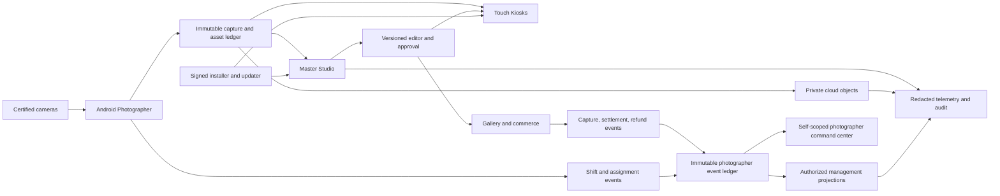

# ClickFlash 360° Mega Execution Roadmap

As of: 2026-08-03  
Decision: **local development checkpoints exist; ecosystem production remains NO-GO**  
Execution ledger: [mega task register](clickflash-mega-task-register.md) and repository [task.md](../../task.md)

## 1. Mission and completion rule

Build ClickFlash as one evidence-backed photography operating system spanning camera capture, automatic editing, field operations, Kiosks, customer delivery, commerce, photographer revenue, management, installation, licensing, updates, and support.

“100% complete” is allowed only when every release-scope surface has:

1. an accountable owner and supported lifecycle;
2. an inventory of routes, pages, dialogs, buttons, jobs, IPC, APIs, events, stores, and deployments;
3. normal, empty, loading, error, offline, retry, interruption, recovery, and permission-denied behavior;
4. server-derived identity/scope, strict validation, least privilege, auditability, privacy/retention rules, and abuse controls;
5. representative functional, integration, security, accessibility, performance, migration, backup/restore, and rollback evidence;
6. reproducible signed artifacts, SBOM/provenance, staged deployment, monitoring, support, and tested rollback; and
7. zero open P0 findings plus explicit owner acceptance of every residual risk.

Passing a unit test, debug build, emulator boot, dry-run, mock, screenshot, or local signature is never production proof.

## 2. Current evidence boundary

| State | Evidence-backed position |
|---|---|
| EVIDENCED | The July 27 remediation record reports restored type/build/security gates, Cloud authorization hardening, safer Ride/MoneyTrash durability, and fail-closed CI improvements. Later Android work evidences resumable authenticated Mobile→Master delivery, camera capability boundaries, administrator-bound pairing identity, a signed self command center, an emulator-rendered unpaired performance screen, and an immutable financial/workforce event foundation with 10/10 focused tests. |
| ACTIVE | Paired Android financial-state runtime coverage, encrypted transport, editor provenance/quality, Kiosk/Cloud destinations, financial producer integration, and ecosystem clean-checkout revalidation are the next engineering fronts. |
| BLOCKED | Approved production bindings/secrets, managed signing keys, real deployment targets, incident decisions, physical Nikon D7000/device/cable access, live-like data approval, and production change authority require accountable owners. |
| NO-GO | Production, paid pilot, signing, store submission, DNS/secrets mutation, data migration, and customer rollout are not authorized by this roadmap. |

Historical audit findings remain evidence at their capture date. Later remediation records supersede only the controls they explicitly revalidated; all drift-prone gates must be rerun from a clean review scope.

## 3. Product and deployment inventory

| Surface | Product responsibility | Target disposition |
|---|---|---|
| `apps/master` | Local studio control plane, ingest, editor, orders, print, LAN sync, event ledger | Primary supported Windows desktop |
| `apps/touch` | Customer Kiosk discovery, browsing, cart, checkout handoff, print/help | Primary supported kiosk desktop |
| `apps/mobile-photographer` | Android D7000 tether, field HUD, quick edit, delivery, route, revenue | Primary supported Android field app |
| `apps/gallery` + Gallery Worker | Online customer proofing, cart, payment, paid downloads | Primary customer web product |
| `apps/management` + Management Worker | Fleet, staff, finance, analytics, policy, reporting | Primary authorized operations web product |
| `apps/moneytrash` + MoneyTrash Worker | Removable-media ingest, resilient cloud upload, B2B galleries | Supported desktop/web ingest product after packaged proof |
| `apps/website` | Marketing, documentation entry, contact/conversion | Supported public web product |
| `apps/installer` | Transactional install, repair, upgrade, rollback, uninstall | Supported privileged Windows tool |
| `apps/license-generator` | Offline license issuance and audit | Restricted operator-only desktop tool |
| `apps/cloud-backend` | Shared cloud API, policy, jobs, data coordination | Supported only after bindings and route matrix pass |
| `apps/mobile-customer`, `mobile-staff`, `mobile-client` | Customer/staff experiments | Product decision required: qualify or archive |
| `apps/ride-node` | Edge capture/upload node | Quarantined until sole-copy durability is independently proven |
| `apps/mcp-server`, Update Server, Docs | Tooling/update/docs surfaces | Explicit charter, tests, ownership, or removal required |
| `packages/*` | Contracts, validation, UI, logging, data, telemetry, tests | Supported catalog with consumers and owners; archive orphans |

## 4. Target ecosystem architecture

### Architecture invariants

- Originals and immutable business facts are never edited; corrections are new versioned recipes, events, or reversals.
- Each destination is complete only after its own authenticated checksum-bound durable receipt.
- Identity, role, tenant/event/object scope, and photographer scope come from verified credentials, never caller-selected identifiers.
- Payment capture, settlement, refund, recognized revenue, commission, payable amount, and payout are different states.
- Shared packages own contracts and primitives; bounded products own business decisions and datastore mutations.
- Sync status, projections, retries, and caches live outside immutable fact tables.
- AI proposes; deterministic safety guards, confidence routing, human override, version promotion, audit, and rollback govern use.
- No customer media, face identity, protected trait, exact route history, or secret enters logs, analytics, training, or support bundles without explicit approved purpose.

## 5. Universal page, action, and mechanism audit

Every app must maintain one row for every route/page/tab/dialog/menu/button/form/job/IPC/API/event/webhook/queue/cron/deployment. Each row must record:

| Dimension | Required evidence |
|---|---|
| Existence and reachability | Source file, route, navigation entry, deep link, feature flag, dead/orphan status |
| Authorization | actor, role, tenant/event/object ownership, deny tests, step-up confirmation |
| UX state | default, loading, empty, partial, success, validation, failure, offline, stale, retry, cancel, recovery |
| Interaction | keyboard, touch, screen reader, focus, large text/zoom, reduced motion, destructive confirmation |
| Side effect | authoritative service, idempotency key, transaction/outbox, audit event, receipt, rollback/compensation |
| Data | source of truth, schema version, units/timezone, freshness, retention, encryption, migration owner |
| Quality | unit, contract, integration, E2E, abuse, accessibility, visual, performance, chaos/restart evidence |
| Operations | telemetry, redaction, alert, runbook, owner, SLO, deployment, rollback |

An unimplemented control must be removed, disabled with explanation, or tracked; decorative controls that appear actionable are defects.

## 6. Workstream portfolio

| ID | Workstream | Core deliverables | Exit gate |
|---|---|---|---|
| WS-01 | Governance and scope | Product catalog, owners, ADRs, supported matrix, evidence index, risk register | Every deployable/package has owner and disposition |
| WS-02 | Shared contracts and data | Versioned API/IPC/event schemas, migration authority, ledgers, outboxes, projections | Clean/N-1/restore and consumer contract matrices pass |
| WS-03 | Identity, security, privacy | Central policy, route registry, object scope, key/secrets lifecycle, retention/consent | Generated allow/deny matrix and threat-model gates pass |
| WS-04 | Master Studio | Stable shell/backend, ingest/editor/orders/print/LAN, event producers, recovery | Packaged representative studio journey passes with faults |
| WS-05 | Android Photographer | D7000 tether, remote, quick edit, route, delivery, command center | Physical device/camera and field-pilot matrices pass |
| WS-06 | Professional editor and AI | Color-managed recipes, RAW/JPEG, masks, quality guards, profile governance | Blind licensed golden-set and latency/thermal gates pass |
| WS-07 | Touch Kiosk | Pairing, discovery, browse/cart/help/print, lockdown, offline recovery | Packaged kiosk hardware and accessibility journey passes |
| WS-08 | Gallery and commerce | Auth, proofing, cart, Stripe lifecycle, refunds, secure delivery | Checkout→settlement/refund→download E2E passes |
| WS-09 | Management and finance | Fleet/staff/policy/KPIs/payroll approvals/appeals | No mock metrics; reconciled role-scoped projections pass |
| WS-10 | MoneyTrash and ingest | Bounded streaming, resume/cancel, ownership, expiry, paid delivery | Packaged large-media/restart/low-storage suite passes |
| WS-11 | Website and secondary mobile | Route/SEO/forms/a11y plus qualify/archive mobile products | Each surface has real lifecycle gate or is removed |
| WS-12 | Cloud and Workers | Bounded contexts, private objects, queues/cron/webhooks, regional data | Staging bindings, migrations, negative routes, rollback pass |
| WS-13 | Desktop/install/license/update | Secure IPC, native closure, signing, install/upgrade/repair/uninstall | Clean-machine signed lifecycle matrix passes |
| WS-14 | UI/UX/accessibility | Shared tokens/primitives, complete journeys, field/kiosk ergonomics | WCAG 2.2 A/AA and device-context evidence passes |
| WS-15 | Quality/performance/reliability | Hermetic CI, test pyramid, load/soak/chaos, budgets | Clean required matrix plus p50/p95/p99/SLO evidence passes |
| WS-16 | Observability and operations | Correlation, audit, metrics/traces, alerts, backup/DR, support | Synthetic incidents page owners and recovery hits RPO/RTO |
| WS-17 | Release and deployment | Environments, SBOM/provenance, canary, rollback, Go/No-Go | Signed immutable promotion and rollback rehearsal pass |
| WS-18 | Documentation and compliance | Current architecture, runbooks, privacy/legal/store records | No unsupported completion claim; owner-approved evidence pack |

## 7. Dependency-ordered delivery waves

### Wave 0 — Evidence and containment

- Reconcile July findings against current code without erasing historical evidence.
- Resolve tracked-sensitive-artifact incidents through restricted owner processes.
- Freeze unsupported release/update/migration/destructive paths.
- Make tests hermetic and preserve unrelated dirty-tree work.

Exit: no credible active data-loss/public-access path and a current P0 register.

### Wave 1 — Trustworthy engineering baseline

- Clean-checkout type, lint, unit, contract, secret, dependency, workflow, and build matrix for every supported deployable.
- Product/package/worker owner and disposition registry.
- Route/action/IPC/event/deployment inventories with generated negative-test skeletons.
- Root override/lockfile reconciliation and reproducible install.

Exit: deliberate failures block; every supported surface participates in CI.

### Wave 2 — Authoritative contracts and critical journeys

- Central identity/policy and versioned contracts.
- Immutable ledgers, outboxes, migration owners, backup/restore proof.
- Master→Touch, camera→Mobile→Master, upload→Gallery, checkout→settlement/refund→download, and install→launch journeys.
- Real financial/workforce event producers while withheld UI states remain unavailable.

Exit: critical journeys pass success, denial, duplicate, offline, restart, and recovery variants.

### Wave 3 — Product completeness and professional quality

- Professional editor/golden-image program, Kiosk/Cloud receipts, photographer field workflow, Management decisions, customer proofing, accessible shared primitives.
- Remove mock, duplicate, orphan, and decorative product paths.
- Representative performance budgets and minimum-hardware qualification.

Exit: release-scope feature and UX matrices have no unowned gaps.

### Wave 4 — Controlled internal and field pilots

- Physical D7000/Android, kiosk peripherals, printers, removable media, network failure, battery/thermal, and long-shift soaks.
- Approved non-customer or consented datasets; finance reconciliation and workforce correction drills.
- Staging integrations, alerts, support, backup/restore, incident and rollback game days.

Exit: accountable owners sign every pilot gate; no production/customer expansion.

### Wave 5 — Release candidate and staged production

- Reproducible signed desktop installers/AAB/web/Worker artifacts with SBOM, provenance, hashes, and immutable promotion.
- Fresh install, N-1 upgrade, interrupted upgrade, repair, rollback, uninstall, downgrade/tamper denial.
- Canary by tenant/event/device cohort with health-based automatic rollback and post-deploy reconciliation.

Exit: independent Go/No-Go approves a bounded release; otherwise remain No-Go.

### Wave 6 — Governed intelligence and scale

- Promote spot/editor profiles only through offline evaluation, bias/privacy review, canary, monitoring, and rollback.
- Capacity/cost planning, regional resilience, lifecycle/version policies, data deletion/export, and disaster recovery.
- Simplify duplicate services/packages only after consumer and failure-isolation proof.

## 8. Program metrics

| Domain | Required measures |
|---|---|
| Capture | camera objects vs verified originals, duplicates, corruptions, import latency, recovery success |
| Editing | blind acceptance, override rate, clipping/skin/color defects, consistency, p95 latency, thermal impact |
| Delivery | intent→receipt latency, retry/restart recovery, checksum mismatch, wrong-destination denial |
| Commerce | order→capture→settlement/refund variance, download authorization, webhook delay/duplicates |
| Photographer | attributed captures/sales, freshness, correction rate, payout variance; never opaque punitive ranking |
| Reliability | availability, queue age, crash-free sessions, RPO/RTO, restore integrity, alert actionability |
| Experience | task success, time, error recovery, WCAG journey pass, TalkBack/keyboard/zoom/touch evidence |
| Release | reproducibility, signed/provenanced coverage, rollout health, rollback time, escaped defects |

## 9. Master release gate

Production review is ineligible until all are true:

- no open P0, unclassified sensitive artifact, mock financial authority, public object leak, or sole-copy deletion path;
- all supported apps/workers/packages pass a clean hermetic validation matrix;
- identity/tenant/event/object/photographer denial is independently tested;
- every datastore has one migration owner, encrypted backup, tested restore, and failure rollback;
- financial/workforce totals reconcile with zero unexplained variance on approved representative evidence;
- editor/camera/kiosk/printer/mobile accessibility and performance pass real-hardware matrices;
- all artifacts are reproducible, signed, scanned, SBOM/provenance-attested, and downgrade/tamper resistant;
- staging/canary/rollback, monitoring, support, incident response, and disaster recovery are rehearsed; and
- product, engineering, security, privacy/legal, finance/operations, accessibility, SRE, and release owners sign the bounded Go decision.

## 10. Source plans

- [360 audit execution addendum](../audits/clickflash-360/2026-07-27/README.md)
- [Android competitive roadmap](android-mobile-photographer-competitive-roadmap.md)
- [Master editor and D7000 roadmap](master-auto-editor-nikon-d7000-mobile.md)
- [Roaming, spot AI, Kiosk, and Cloud plan](roaming-photographer-spot-ai-kiosk-cloud.md)
- [Mobile command-center and event audit](../audits/mobile-photographer/2026-08-03/README.md)
- [Desktop application audit](../DESKTOP_APPLICATION_AUDIT_2026-07-16.md)

The task register is the next-action breakdown; specialist plans retain lower-level technical acceptance criteria.
