# Master Automatic Editor and Nikon D7000 Mobile Tether Roadmap

## Product objective

Build a reference-quality automatic photo pipeline in which a roaming photographer keeps
an Android Mobile Photographer device connected to a Nikon D7000 over USB. The phone detects
every physical shutter press, imports it safely, resolves the current shooting spot, produces
an immediate automatic preview, sends it to the correct Kiosk, Master, and Cloud, and lets
Master create the final non-destructive edit without risking the original capture.

“Highest level” is a measurable quality target, not a release claim. The feature ships
only after it meets the durability, latency, image-quality, security, and hardware gates
defined below.

## Current repository baseline

| Area | Current evidence | Gap to target |
|---|---|---|
| Master automatic edit | `AutoEditEngine.ts` calculates global exposure, contrast, saturation, highlights, shadows, and a face-aware crop | Basic global heuristics; no calibrated RAW development, masks, scene model, confidence, or consistency control |
| Master render worker | `photoWorker.ts` creates derivatives and applies an edit recipe through Sharp | JPEG-oriented 8-bit path; fragmented edit contracts and no proven D7000 NEF pipeline |
| Master culling | `aiCullingService.ts` has ONNX hooks | Missing models fall back to near-mock scores; no production calibration |
| Master coaching | `aiTeacherAgent.ts` checks mean luminance | Blur is explicitly mocked and advice is not tied to camera metadata |
| Master editor UI | `PhotoEditModal.tsx` has manual controls, history, before/after, crop, effects, and AI affordances | One 900+ line component; automatic decisions are not explainable or confidence-gated |
| Master tether | `dslrTetherService.ts` starts gphoto2 on Unix or assumes digiCamControl on Windows | No camera capability contract, durable receipt, verified binary lifecycle, or D7000 hardware test |
| Mobile DSLR flow | `src/app/index.tsx` now starts the tether service, renders live state, and sends locally verified JPEGs to the editor while retaining NEF | Real D7000 cable, burst, detach/restart, background, and card-reconciliation evidence remains |
| Mobile USB configuration | `modules/camera-tether` is autolinked; the enabled plugin generates USB Host, attach intent, and Nikon/still-image filter; runtime permission and MTP polling are implemented | Foreground service, physical device matrix, PTP event-endpoint benchmark, and hardware soak remain |
| Mobile capture durability | SQLite capture sessions/objects track detection, attempts, local URI, byte count, SHA-256, errors, and `LOCAL_VERIFIED`; native baselines make restart re-emission idempotent | Storage reservation, RAW+JPEG pairing, destination outboxes/receipts, and real fault-injection proof remain |
| Mobile automatic edit | `useAutoEditor.ts` checks pose/blink, resizes, recompresses, and queues a JPEG | No exposure/color correction, RAW pairing, deterministic recipe, confidence, or quality fallback |
| Mobile-to-Master bridge | Upload route accepts large multipart files and calculates a hash | Default bridge-token fallback and whole-file hashing must be removed before camera rollout |

## Supported product boundary

- **Version 1 platform:** Android-only phone/tablet product with proven USB Host/OTG
  support, API 26 or newer, and package identity `com.clickflash.photographer`.
- **Reference camera:** Nikon D7000 in PTP mode, current Nikon firmware, shooting
  JPEG Fine or RAW+JPEG Fine.
- **Connection:** short data-rated camera cable plus a certified USB-OTG adapter or
  powered OTG hub. The qualification matrix records exact phone, OS, cable, hub, and
  camera firmware combinations.
- **Capture behavior:** the photographer presses the physical camera shutter. ClickFlash
  detects the new camera object, imports it, edits it, and sends it automatically.
- **Safety default:** keep every capture on the camera card. Mobile and Master never
  delete camera objects automatically.
- **iOS:** not a Version 1 build or distribution target. Any future iOS product requires
  a separate feasibility, architecture, hardware, and release program.
- **No paid AI/SaaS:** inference, recipes, metadata, and assets remain local or on
  ClickFlash-owned infrastructure.
- **Roaming operations:** independent Kiosk/Master/Cloud delivery receipts, shooting-spot
  context, offline behavior, and learning are defined in the
  [Roaming Photographer, Shooting-Spot AI, Kiosk, and Cloud Plan](roaming-photographer-spot-ai-kiosk-cloud.md).

## Target architecture

```mermaid
flowchart LR
  D7000["Nikon D7000<br/>SD card is first copy"] -->|"USB PTP/MTP"| Native["Android native camera module"]
  Native --> Ledger["Durable mobile ingest ledger"]
  Ledger --> Original["Immutable mobile original"]
  Original --> Quick["Edge quality check + quick JPEG edit"]
  Quick --> Preview["Immediate reviewed preview"]
  Original --> Transfer["Authenticated resumable fan-out"]
  Preview --> Transfer
  Transfer --> Kiosk["Authorized Kiosk preview + receipt"]
  Transfer --> Cloud["Cloud object/metadata + receipt"]
  Transfer --> MasterIngest["Master verified ingest receipt"]
  MasterIngest --> Develop["16-bit RAW/JPEG automatic develop"]
  Develop --> Quality["Quality guard + confidence gate"]
  Quality --> Recipe["Versioned non-destructive edit recipe"]
  Recipe --> Outputs["Preview / print / gallery outputs"]
  Outputs --> Review["Operator compare, tune, revert"]
  Review --> Learn["Opt-in local preference learning"]
```

### Camera adapter

Create a local Expo native module, `modules/camera-tether`, with a TypeScript contract and
Kotlin implementation:

- replace the unused USB plugin with a generated `<uses-feature>`, activity attach filter,
  separate `@xml/device_filter` metadata, and runtime `UsbManager.requestPermission` flow;
  do not model USB approval as a normal Android manifest permission;
- enumerate USB devices through `UsbManager`;
- request runtime permission through a private `PendingIntent`;
- identify the Nikon vendor/product/interface and expose capability data;
- open exactly one camera session and serialize all PTP operations;
- observe new object handles using the PTP event endpoint when reliable, with bounded
  storage/object-handle polling as the import-only fallback;
- stream camera objects into app-private temporary files, then atomically promote them;
- emit typed attach, permission, ready, object-added, progress, imported, error, detached,
  and backpressure events;
- close interfaces, descriptors, receivers, and wake locks on pause, detach, or crash;
- never expose arbitrary USB control transfers or arbitrary filesystem paths to JavaScript.

Use Android `MtpDevice` for the smallest import-only proof. Benchmark an NDK
libusb/libgphoto2 adapter only if native MTP cannot reliably detect and transfer D7000
shots. Advanced shutter control, live view, and camera-setting changes are later
capabilities and must not block the import MVP.

### Implementation checkpoint — 2026-07-28

The import-only software slice now exists:

- `modules/camera-tether` compiles against Expo SDK 57 and Kotlin 2.1.20;
- USB discovery prefers Nikon vendor `0x04B0` and accepts still-image interfaces;
- the app requests Android USB permission, baselines existing card objects, recursively
  polls for new JPEG/NEF objects, and recovers session captures after process restart;
- imports stream through `MtpDevice.importFile` into an app-private `.part` file, enforce
  metadata byte count, flush, atomically rename, and calculate SHA-256;
- a stable camera/object identity plus SQLite ledger prevents duplicate verified imports;
- the Studio screen no longer downloads a simulated image and automatically forwards
  verified JPEGs to the existing quick editor while retaining NEF for Master;
- `expo-camera` is aligned to SDK 57 and Android minimum API 26 satisfies the existing
  Stripe Terminal native dependency.

Evidence gates passed: `tsc --noEmit`, Expo lint with zero errors, Expo config
introspection, `:camera-tether:compileDebugKotlin`, `:app:compileDebugKotlin`, and full
`:app:assembleDebug`. The source-controlled Expo plugin relocates Reanimated, Worklets, and
Expo Modules Core CMake staging to shorter Android-project paths, while Expo build
properties select the duplicate Worklets JNI input. The resulting 300,697,681-byte APK has
SHA-256 `A23A3366E716AA69259DE9C5C7092C2914789C0841AC8F6F93A474664038B9D6`,
uses package identity `com.clickflash.photographer`, minimum API 26 and target API 36,
contains the Expo camera-tether DEX class and Nikon/still-image USB filter, carries
`arm64-v8a`, `armeabi-v7a`, `x86`, and `x86_64` native libraries, and verifies with APK
Signature Scheme v2. It remains a debug-signed engineering artifact; organization-controlled
release signing, Android App Bundle distribution, and physical hardware proof remain open.

### Capture durability state machine

Every camera object advances through an idempotent ledger:

`DETECTED → COPYING → LOCAL_VERIFIED → PAIRED → QUICK_EDITED → QUEUED → MASTER_ACKED → MASTER_VERIFIED`

- Identity starts with camera serial, storage ID, object handle, size, filename, and capture
  time; SHA-256 becomes the durable content identity after copy.
- An object is complete only when size is stable, the copy is flushed, and the checksum
  matches a second local read.
- RAW+JPEG pairs are associated using camera sequence, EXIF capture time, and basename.
- Retries resume from the last durable state and cannot create duplicate Master photos.
- The original is immutable. Mobile cache eviction is allowed only after Master returns a
  checksum-bound durable receipt and retention policy permits eviction.
- Storage pressure pauses import before space exhaustion and tells the photographer what
  to do; it never silently drops a shot.

### Two-level automatic editor

#### Level A — Mobile Quick Edit

Optimize for immediate feedback and reliable sending:

- correct EXIF orientation and honor embedded color profiles;
- analyze histogram, highlight clipping, shadows, white balance, color cast, sharpness,
  noise, faces, eyes, pose, and duplicate similarity on a bounded proxy;
- apply exposure, highlight recovery, shadow lift, white balance, contrast curve,
  vibrance, skin-tone protection, noise/sharpen balance, and conservative face-aware crop;
- generate a deterministic `EditRecipe`, not an irreversible-only output;
- render one display JPEG while retaining the untouched camera original;
- auto-apply only at high confidence; medium confidence shows a one-tap compare; low
  confidence sends the neutral camera rendering with review flags.

For RAW+JPEG capture, Mobile edits the JPEG immediately and transfers the NEF as a paired
original. It does not attempt full NEF development on the capture-critical path.

#### Level B — Master Pro Develop

Consolidate the current editor, batch service, worker heuristics, culling, and coaching
around one versioned edit graph:

1. Decode JPEG/TIFF or D7000 NEF into a color-managed high-bit-depth working image.
2. Apply camera profile, lens correction, demosaic, chromatic-aberration correction,
   highlight reconstruction, denoise, and capture sharpening.
3. Estimate scene, subject, faces/landmarks, skin, sky/background, depth cues, exposure,
   white balance, dynamic range, blur source, and noise.
4. Predict a global look plus protected subject/skin/local masks.
5. Apply tone curve, color, local exposure, skin-safe retouch, subject separation,
   composition crop/straighten, output sharpening, and destination-specific export.
6. Run a post-render guard for clipping, halos, over-smoothing, color shifts, crop damage,
   artifacts, and face regressions.
7. Store the model version, engine version, input hash, recipe, masks, confidence,
   warnings, timing, and output hashes.

The RAW engine is selected only after a benchmark and license/package review of maintained
local candidates. The gate compares D7000 NEF color, highlight recovery, throughput,
Windows packaging, deterministic output, security support, and license obligations.

### Consistency and personalization

- A session “look lock” keeps white balance, exposure, skin rendering, and tone consistent
  across the same lighting/camera block.
- Camera/lens/ISO profiles are calibrated with a color chart and representative D7000
  captures; generic settings remain a fallback.
- Manual adjustments are stored as deltas from the automatic recipe.
- Preference learning is opt-in, local, reversible, and scoped by organization,
  photographer, camera, venue, and lighting profile.
- No customer face embedding or image is used for training without explicit policy,
  consent, retention, and deletion controls.

## Shared contracts

Add versioned contracts in a dedicated shared photo-pipeline package:

- `CameraDevice`, `CameraCapability`, and `CameraSession`;
- `CaptureObject`, `CapturePair`, and `CaptureMetadata`;
- `IngestLedgerEntry`, `TransferChunk`, `TransferReceipt`, and `DeliveryReceipt`;
- `QualityAnalysis`, `QualityFlag`, and `ConfidenceDecision`;
- `EditRecipe`, `EditOperation`, `MaskReference`, `ModelManifest`, and `RenderResult`;
- `SessionLook`, `OperatorOverride`, and `PreferenceFeedback`.
- `DeliveryIntent`, `DeliveryAttempt`, and `DeliveryReceipt` for independent Master,
  Kiosk, and Cloud state.
- `ShootSpot`, `CaptureContext`, `SpotObservation`, and `SpotProfile` for versioned
  location-aware learning without customer identity or face embeddings.

All IPC, native events, REST payloads, database rows, and background jobs validate these
contracts. Recipe versions have forward migration and rollback tests.

## Mobile and Master experience

### Mobile Photographer

- Camera card: model, connection, permission, capture mode, card/storage status, queue,
  last shot, transfer speed, Master connectivity, and recovery action.
- One setup flow: choose event/album, photographer, JPEG or RAW+JPEG policy, auto-edit
  confidence, send destination, and retention.
- Shot feedback: detected, copying, editing, sent, verified, or needs review—without
  blocking the next shutter press.
- Filmstrip: original/edited compare, flags, retry, pause, keep, and explicit discard.
- Persistent notification during tethering and clear recovery after app restart or cable
  detach.

### Master

- Tether dashboard: devices, sessions, queue depth, throughput, errors, last receipt, and
  camera/mobile health.
- Automatic editor console: profile, look lock, confidence policy, model/engine version,
  quality warnings, and destination presets.
- Review inbox ordered by low confidence, severe quality flag, and customer importance.
- Non-destructive before/after, recipe inspector, batch consistency view, undo/revert, and
  re-render after engine upgrades.

## Security, privacy, and operational controls

- Remove the default bridge PSK. Pair Mobile and Master using an operator-approved QR
  exchange and device-bound key; use short-lived, event-scoped credentials.
- Authenticate every upload, chunk, receipt, status stream, and remote command.
- Stream hashing and transfer; never read an entire NEF/JPEG into JavaScript or server RAM.
- Validate magic bytes, declared size, EXIF bounds, filenames, camera identity, and image
  decoder limits before processing.
- Encrypt app-private originals and the ingest ledger at rest where platform support
  allows; redact paths, tokens, EXIF location, and customer identity from logs.
- Sign model manifests and engine assets; verify hashes before loading and retain a
  last-known-good rollback model.
- Camera setting changes and remote shutter control require explicit operator permission,
  an allowlist, and an audit record.

## Phased execution plan

| Phase | Indicative window | Deliverable | Exit gate |
|---|---:|---|---|
| 0. Hardware proof | Weeks 1–2 | D7000 + two Android devices + cable/hub compatibility harness | Detect, permission, import, detach, reconnect, JPEG and NEF evidence on real hardware |
| 1. Contracts and safety | Weeks 2–4 | Shared contracts, ingest ledger, atomic storage, secure pairing, streamed Master bridge | Fault injection proves no loss, duplicate, default credential, or whole-file buffering |
| 2. Mobile tether MVP | Weeks 4–7 | Native Expo module, auto-start session, shot detection, RAW+JPEG pairing, queue UI | 500 consecutive single shots and burst/reconnect tests with zero ledger mismatch |
| 3. Mobile Quick Edit | Weeks 6–9 | Bounded analysis, deterministic recipes, confidence policy, preview compare | Latency, memory, battery, clipping, face, and offline-queue gates pass |
| 4. Master Pro Develop | Weeks 7–12 | Unified high-bit-depth engine, NEF path, masks, look lock, review UI | D7000 reference corpus and deterministic render suite pass |
| 5. Quality intelligence | Weeks 10–14 | Calibrated quality models, post-render guard, local preference deltas | Blind review and protected-subject regression thresholds pass |
| 6. Production qualification | Weeks 14–16 | Signed Android/Desktop artifacts, hardware matrix, runbooks, telemetry, rollback | Full-day shoot, clean install/upgrade, security, accessibility, recovery, and support sign-off |

Phases may overlap only after the previous phase’s durability and security exit gate passes.

## Release acceptance gates

### Capture and durability

- Zero missing or duplicate ledger objects in a 1,000-shot full-day soak.
- Zero data loss across 50 cable disconnects, 20 app kills, network loss, low storage,
  Master restart, and phone reboot scenarios.
- Every Master photo has a checksum-bound Mobile receipt and original/derivative lineage.
- No automatic deletion from the D7000 card.

### Performance

- On the certified reference phone/cable, P95 shot detection is at most 1.5 seconds after
  the camera commits the object.
- P95 JPEG quick preview is available within 5 seconds of a completed camera object.
- The capture queue remains responsive during bursts; editing and network transfer apply
  backpressure without blocking camera import.
- Master’s target P95 final render is 15 seconds for one D7000 RAW+JPEG pair on the
  reference workstation. Hardware qualification publishes actual measurements.

### Image quality

- A versioned D7000 corpus covers daylight, tungsten, mixed light, flash, backlight,
  high ISO, dark skin, light skin, groups, motion, glasses, and difficult backgrounds.
- Controlled color-chart tests target mean CIEDE2000 at or below 3 after profile
  calibration.
- Blind expert review prefers or ties the automatic result against the camera JPEG
  baseline on at least 85% of the corpus.
- Severe regressions—clipped faces, broken crops, halos, plastic skin, incorrect white
  balance, or visible artifacts—remain below 1% and always enter review.
- Re-rendering the same input, recipe, engine, and model produces the same output hash.

### Product and operations

- Photographer can complete attach, permission, event selection, automatic capture,
  recovery, and pause using large touch targets and screen-reader labels.
- Operators can explain, compare, override, revert, and re-render every automatic edit.
- Model/engine rollback, support bundle, storage recovery, and camera conflict runbooks
  are tested.
- Android, Master, and model artifacts are signed and verified before production rollout.

## Key risks and mitigations

| Risk | Mitigation |
|---|---|
| Android device cannot supply stable USB power | Certify a powered OTG hub and reference devices; show power/connection health |
| D7000 event delivery varies by firmware/device | Capability probe; event endpoint plus bounded object-delta polling |
| Other software owns the camera session | Detect exclusive-open failure, identify conflict, never start competing controllers |
| RAW processing overwhelms Mobile | Keep NEF off the quick-edit path; process final RAW on Master |
| Bursts outrun USB/storage/network | Capture-first queue, bounded workers, disk reservation, explicit backpressure |
| Automatic edit damages a valuable image | Immutable original, confidence gate, post-render guard, compare/revert |
| Model drift or unlicensed model data | Model manifests, provenance/license review, frozen corpus, rollback, local opt-in learning |
| Face/biometric privacy exposure | Data minimization, consent policy, local processing, retention/deletion tests |

## Decision gates

1. Confirm Android-only D7000 cable scope for Version 1.
2. Select and purchase the reference phone/tablet, powered OTG hub, cable, spare D7000
   battery/power adapter, and high-quality SD card.
3. Decide JPEG Fine versus RAW+JPEG Fine as the default event policy.
4. Complete the Phase 0 hardware spike before selecting the final native PTP transport.
5. Complete the RAW engine benchmark/license review before introducing a decoder.
6. Approve the image-quality corpus and human review panel before tuning models.

## Primary technical references

- [Nikon D7000 download center and manual](https://downloadcenter.nikonimglib.com/en/products/26/D7000.html)
- [libgphoto2 supported cameras: Nikon D7000 PTP capture/live view/configuration](https://gphoto.github.io/proj/libgphoto2/support/)
- [Android USB Host API and attach/permission model](https://developer.android.com/develop/connectivity/usb/host)
- [Android `MtpDevice` API for connected MTP/PTP devices](https://developer.android.com/reference/android/mtp/MtpDevice.html)
- [Expo guidance for local native modules and development builds](https://docs.expo.dev/workflow/customizing/)
- [Current Nikon NX Tether supported-camera list](https://downloadcenter.nikonimglib.com/en/download/sw/276.html)
