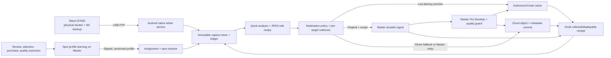

# Roaming Photographer, Shooting-Spot AI, Kiosk, and Cloud Plan

## Intent

The photographer moves around a resort, venue, attraction, or event with a Nikon D7000
connected by USB cable to an Android phone. Each physical shutter press must automatically:

1. appear as a new camera object;
2. copy safely to the phone without interrupting the next shot;
3. resolve the current event, assignment, and shooting spot;
4. analyze and edit a fast JPEG preview;
5. deliver that preview to the correct authorized Kiosk;
6. deliver the original, recipe, and derivatives to Master and Cloud;
7. retain independent proof for every destination; and
8. turn safe operator/customer outcomes into better recommendations for that shooting spot.

The mobile phone is the field capture hub. Master is the local authority and high-quality
processing coordinator. Cloud is the durable remote delivery and cross-site synchronization
layer. Kiosk is a constrained display/cache destination, not the owner of originals.

The larger product portfolio, including the single-app camera remote, professional automatic
editor, guest delivery, and photographer revenue/payroll/performance command center, is defined
in [Android Photographer — Competitive Product Roadmap](./android-mobile-photographer-competitive-roadmap.md).

## Repository reality

| Current component | Current behavior | Required change |
|---|---|---|
| `src/app/index.tsx` | Starts native tethering and displays the untouched verified JPEG before a side-by-side durable quick edit without a per-shot tap | Prove preview latency and behavior with a D7000 and certified Android/cable matrix |
| `useAutoEditor.ts` | Pose/blink plus resize/recompress; promotes cache output into app documents and rereads SHA-256 before registering the quick-edit asset | Bounded quick analysis, deterministic recipe, confidence gate, and color-aware processing |
| `discoveryService.ts` | Returns a mocked Master IP | Authenticated mDNS discovery with pinned instance identity |
| `MeshSyncService.ts` | Generates simulated photographers and acknowledgements | Remove from production path until a real transport and threat model pass |
| `NetworkRoutingService.ts` | Legacy generic traffic still chooses one Master or placeholder Cloud URL; camera captures no longer enter its unverified photo-upload path | Replace it for captures with authenticated per-destination workers driven by the new outbox |
| Capture persistence | SQLite now separates capture objects, RAW+JPEG pairing, immutable original/quick-edit assets, destination intents, attempt state, and authenticated receipt proofs; each verified original creates one required pending Master intent | Add authenticated Master transfer/receipt, then policy-authorized Kiosk and Cloud intents/workers, plus physical recovery proof |
| `schedule.tsx` | Uses a mock venue and bookings | Real shift/assignment/spot context with consent-aware location handling |
| `scout.tsx` | Privacy-safe local Scout V1: coarse derived spot identity, explicit confirmation, cold-start threshold, explainable quality recommendation, and operator feedback | Add signed assignment/spot catalog context, deterministic light planning, governed profile evaluation, and physical field evidence |
| `kiosks.tsx` | Placeholder “Fleet Health” screen | Authorized Kiosk routing, reachability, queue depth, and delivery receipts |
| Master bridge | Multipart upload with a fallback bridge token and whole-file hashing | Device-bound pairing, streamed hashing, idempotency, chunking, and scoped receipts |
| Touch Kiosk | Receives album updates from Master and caches albums | Add a small authenticated preview lane and explicit displayable receipt |
| Master cloud sync | Has retention/sync queues | Make object, database, and publish acknowledgements explicit and reconcilable |

Simulation is not accepted as hardware, network, delivery, or AI evidence.

### Implementation checkpoint — 2026-07-30

The first capture-only slice is implemented and compile-validated. Android now autolinks a
local Expo `camera-tether` module, launches for Nikon/still-image USB attachment, requests
runtime permission, serializes MTP access, baselines old card contents, detects new
JPEG/NEF objects by bounded recursive polling, and imports them through an app-private
temporary file with byte-count, flush, atomic-rename, and SHA-256 verification. A persistent
session/object ledger deduplicates restart recovery. The field screen auto-starts tethering,
shows real state, preserves RAW, and sends verified JPEGs to the existing quick editor.
After USB access, a non-exported Android `connectedDevice` foreground service posts an
ongoing notification and holds a partial wake lock only for the active tether lifetime, so
polling remains eligible after the app is backgrounded or the display turns off. Android
13+ notification permission denial is non-fatal, and the non-sticky service stops on
detach, connection failure, explicit stop, or module teardown rather than claiming a false
monitoring state after process death.
Every copy is now admitted twice—before the JavaScript retry loop and again at the native
MTP boundary—against a safety reserve of 512 MiB or 5% of phone capacity, capped at 2 GiB.
Low space moves the object to durable `BLOCKED_STORAGE`, stops blind camera retries, keeps
the original on the D7000 card, and exposes free-space, blocked-count, Android storage
management, and explicit retry controls on the field screen.
Verified files now enter an independent RAW+JPEG companion ledger. Matching prefers an
equal positive MTP camera sequence and otherwise requires the same normalized Nikon
basename plus capture times within two seconds. JPEG quick editing remains immediate;
unmatched files become standalone after 60 seconds but can still pair late, while
ambiguous candidates are retained for Master review rather than automatically joined.
The field UI now exposes the untouched checksum-verified JPEG before automatic editing.
The quick-edit render is copied out of cache through a staging file into app documents,
reread for SHA-256 and size, atomically promoted, and stored as an immutable asset.
Verified originals enter an independent delivery outbox with one required pending Master
intent. The schema supports Master, Kiosk, and Cloud destinations, retry/attention states,
and authenticated receipt proofs, but only Master intent creation is enabled until real
assignment policy and device-bound pairing exist. Receipt validation fails closed on
authentication, destination, idempotency, hash, or size mismatch and requires
destination-specific persistence/index/publish proof before `READY`.
The application is now Android-only with package identity `com.clickflash.photographer`.
A full debug APK assembles with reproducible short native staging paths and Worklets JNI
packaging; inspection confirms minimum API 26, target API 36, camera-tether and foreground
service DEX classes, the Nikon/still-image USB filter, required foreground/notification/
wake-lock permissions, the service type, and all four Android ABIs. The artifact remains
debug-signed. Regenerated release builds now fail closed instead of inheriting the debug
keystore: signing requires four process-environment inputs, partial configuration is
rejected, and `android:aab` is prepared for approved secret injection. No release artifact
was signed or distributed. Upload-key approval, signed AAB inspection/distribution, physical
D7000 screen-off/battery/thermal, physical RAW+JPEG and low-storage recovery evidence,
authenticated Master discovery/transfer/receipt, Kiosk/Cloud workers, and every Spot AI
phase beyond the local Scout V1 foundation remain open.

### Scout V1 checkpoint — 2026-07-31

Mobile now persists a single confirmed derived spot and privacy-filtered observations in local
SQLite. Coarse location is rounded before a device-salted identifier is derived; raw precise
coordinates, customer identity, room number, and face embeddings are not stored by this
feature. GPS-only candidates are confidence-capped and require explicit photographer
confirmation. Recommendations remain in cold start until the minimum sample threshold, expose
reason/confidence/sample count, and prioritize deterministic blur/blink/pose guardrails. The
verified quick-edit path records one idempotent observation per capture. TypeScript, 21 focused
mobile tests, and lint with zero errors pass; physical venue validation, signed spot catalogs,
profile promotion, and production learning remain open.

## End-to-end operating model

### Before the shift

- Photographer authenticates and downloads only their shift, assignments, spot catalog,
  Kiosk routing policy, edit profiles, and signed model/profile manifests.
- Mobile pairs with the site Master and receives an event-scoped device credential.
- Mobile verifies available app storage, D7000 connection capability, Master/Kiosk/Cloud
  reachability, and the configured cellular-data policy.
- Photographer chooses `JPEG Fine` or `RAW+JPEG Fine`, automatic-edit confidence, and whether
  cellular upload is allowed.
- The app starts an Android foreground tether service with a persistent status notification.

### While roaming

- The active spot is resolved continuously but conservatively.
- The photographer uses the D7000 shutter normally; no phone interaction is required per shot.
- Camera import has higher priority than analysis, editing, or network transfer.
- Mobile shows quiet haptic/audio confirmation for detected, locally safe, Kiosk ready, and
  fully delivered states. Errors use distinct feedback and remain visible.
- Moving into another spot changes the recommended look and Kiosk routing only after a
  confidence threshold or photographer confirmation.

### After the shift

- Mobile reconciles its capture ledger against camera objects, Master, Cloud, and each required
  Kiosk destination.
- Originals remain until the retention policy and durable-receipt policy are satisfied.
- Photographer reviews low-confidence edits and incorrect spot assignments.
- Master builds a proposed next-version spot profile; a controlled evaluation promotes or
  rejects it. Mobile never silently trains and deploys a new production model during a shoot.

## Capture and delivery architecture

### Rule: capture first

One scheduler enforces these priorities:

1. receive camera event and copy object;
2. flush and verify local file;
3. reserve capacity for the next camera object;
4. generate a bounded preview;
5. send Kiosk preview;
6. send Master/Cloud originals and recipes;
7. run non-urgent learning or analytics.

Editing, network congestion, Cloud failure, or Kiosk failure must never prevent the phone from
copying the next available camera object while storage remains above the safety reserve.

## State and data model

### Capture state

`DISCOVERED → COPYING → LOCAL_VERIFIED → CONTEXT_RESOLVED → QUICK_ANALYZED → QUICK_EDITED`

The state is monotonic. A retry creates a new attempt, not a false backward transition.

### Destination state

Each capture has separate destination rows:

`PENDING → QUEUED → TRANSFERRING → RECEIVED → VERIFIED → READY`

Terminal alternatives are `PAUSED`, `RETRYABLE`, `BLOCKED_POLICY`, and `FAILED_REVIEW`.

- **Master `READY`:** original is persisted, checksum verified, database row committed, and
  processing job durably queued.
- **Cloud `READY`:** multipart object is completed, checksum/size verified through the R2
  binding, metadata transaction committed, and authorized delivery record exists.
- **Kiosk `READY`:** preview is cached/indexed under the correct event/album policy and the
  Kiosk returns a signed displayable receipt. Kiosk never acknowledges possession of the
  original unless that becomes an explicitly supported product.

A shot is not “fully delivered” until its configured required destinations are `READY`.
Success at one target cannot remove or overwrite another target’s pending state.

### Core records

- `FieldSession`: photographer, device, camera, shift, event, retention, network policy.
- `CaptureObject`: camera serial, storage ID, object handle, filename, size, EXIF, local hash.
- `CapturePair`: NEF/JPEG pairing and canonical capture identity.
- `CaptureContext`: assignment, guest/session, spot, time bucket, route policy, confidence.
- `AssetVariant`: original, neutral JPEG, quick edit, Master final, Kiosk preview, thumbnail.
- `EditRecipe`: engine/model/profile version, ordered operations, masks, confidence, warnings.
- `DeliveryIntent`: destination, required flag, asset variants, priority, expiry, authorization.
- `DeliveryAttempt`: offset/part, retries, transport, error class, timing, network tier.
- `DeliveryReceipt`: destination identity, asset hash, persisted/indexed/published state, signature.
- `SpotObservation`: privacy-filtered context, EXIF, quality, recommendation, override, outcome.
- `SpotProfile`: versioned baseline, look, coaching rules, confidence, corpus and validation IDs.

All IDs are cryptographically random or content-derived. Every write uses an idempotency key.

## Routing policy

### Preferred path

When Master is reachable:

- Mobile sends the original and recipe to Master over authenticated LAN.
- Master immediately publishes the small Kiosk preview and broadcasts the album/photo update.
- Master processes the final RAW/JPEG version and uploads Cloud assets asynchronously.
- Mobile still tracks Master, Kiosk, and Cloud receipts independently.

This avoids three systems racing to become the source of truth.

### Master unavailable

- If Cloud is reachable and policy permits, Mobile uploads original/recipe directly and receives
  a Cloud receipt. Master reconciles that capture when it returns.
- If an authorized Kiosk is reachable and direct-preview mode is enabled, Mobile sends only a
  short-lived event-scoped preview. The Kiosk caches it as `provisional`; Master later reconciles
  it to the canonical photo.
- If neither is reachable, all intents remain in the local outbox. The photographer continues
  while storage capacity allows.

### Destination selection

Kiosks are selected by an explicit policy:

`organization → venue → event/assignment → spot group → allowed Kiosk pool`

Distance or signal strength may choose among already-authorized Kiosks but can never authorize a
Kiosk. This prevents a nearby Kiosk from receiving the wrong guest/event images.

### Assets by destination

| Destination | Immediate asset | Deferred asset | Purpose |
|---|---|---|---|
| Kiosk | 1600–2048 px quick JPEG/WebP, optional watermark | Master final preview | Low latency browsing/selection |
| Master | Original JPEG/NEF, embedded/sidecar metadata, quick recipe | Masks and final recipe | Local authority, editing, print, fan-out |
| Cloud | Original or policy-selected archive, recipe, display derivatives | Master final and gallery variants | Durable remote delivery and gallery |

## Shooting-spot identity

GPS alone is not reliable enough indoors or between nearby resort locations. The resolver
combines these signals in descending authority:

1. active assignment or photographer-confirmed spot;
2. QR/NFC marker fixed at the shooting spot;
3. site-owned BLE beacon or trusted local Kiosk/Master presence;
4. foreground GPS/geofence;
5. coarse Wi-Fi/BLE radio fingerprint stored as a site-local feature;
6. scene/lighting similarity to an approved spot reference;
7. last confirmed spot plus movement/time constraints.

The app displays the resolved spot and confidence. Low-confidence changes require one tap.
Background location is optional, purpose-limited, and not necessary for camera import.

## What the spot AI learns

### Inputs

- camera/lens, focal length, aperture, shutter, ISO, flash, metering, white balance, exposure
  compensation, capture time, and image orientation;
- spot ID, time bucket, light direction proxy, ambient color cast, brightness, dynamic range,
  background complexity, and crowd/subject-count class;
- blur, noise, clipping, face/eye/pose quality, crop safety, duplicate/burst cluster, and model
  confidence;
- generated recipe and every operator adjustment;
- explicit keep/reject/re-edit result;
- aggregate Kiosk selection, Gallery favorite, print/order, and delivery latency outcomes;
- photographer feedback such as “bad light,” “wrong spot,” “wrong crop,” or “good look.”

No protected demographic trait is a learning feature. Customer identity, face embedding, room
number, and precise location history are excluded from the learning table.

### Outputs

- suggested position/angle and background for the current assignment;
- exposure/white-balance/flash/shutter coaching with an explanation;
- spot-specific default edit look and safe adjustment ranges;
- subject-aware crop policy and preferred output orientation;
- warning patterns such as recurring backlight, motion blur, mixed lighting, or distracting
  background;
- best Kiosk route and estimated transfer delay;
- confidence and supporting sample count for every recommendation.

Version 1 recommends camera changes but does not silently change D7000 exposure or fire the
shutter. Optional remote control is a later audited capability.

## Learning architecture

### Stage 1 — Deterministic spot statistics

- Exponentially weighted exposure, white-balance, blur, clipping, and edit-delta baselines.
- Quality/outcome rates by spot, time bucket, camera/lens, and assignment type.
- Minimum sample thresholds and decay prevent one unusual shoot from rewriting a profile.
- This stage is explainable and provides the cold-start baseline.

### Stage 2 — Retrieval and contextual recommendations

- Retrieve the most similar approved spot/time/light profile.
- Rank a small allowlisted set of coaching actions using context and historical reward.
- Use a contextual bandit only for recommendation ranking; explore conservatively and never
  experiment on camera control or irreversible edits.
- Keep a control group so product improvement can be measured rather than assumed.

### Stage 3 — Edit-delta model

- Train a compact Master-side model to predict the delta between the base automatic recipe and
  accepted operator corrections.
- Split data by session/date to prevent leakage and validate separately per skin-tone coverage,
  lighting, camera/lens, spot, and photographer.
- Export a signed ONNX/TFLite-compatible profile only after offline evaluation and approval.
- Mobile performs inference only. Training, promotion, rollback, and corpus governance happen
  on Master or controlled ClickFlash infrastructure.

### Profile lifecycle

`DRAFT → EVALUATED → CANARY → ACTIVE → SUPERSEDED/ROLLED_BACK`

Every profile has provenance, training window, features, sample counts, metrics, bias review,
engine compatibility, hash, signature, owner, expiry, and rollback target.

## Photographer experience

### Persistent field HUD

- D7000 connection and camera-card state.
- Active assignment and shooting spot with confidence.
- Capture/local-safe/Kiosk/Cloud counters.
- Master, selected Kiosk, Cloud, cellular, battery, storage, and queue health.
- Last-shot thumbnail, quick-edit confidence, warnings, and destination progress.

### Per-shot feedback

- One short haptic when the shot is detected.
- A second distinct confirmation when it is locally verified.
- Kiosk-ready and fully delivered states update silently unless requested.
- Red haptic/audio only for cable loss, storage danger, or repeated import failure.

### Spot Coach

- “What works here” card: preferred position, orientation, time/light condition, and sample size.
- One actionable suggestion at a time, for example a shutter-speed or backlight warning.
- Explanation and confidence are always visible.
- Photographer can accept, dismiss, mute, or mark the spot/profile wrong.
- No alert may cover the last-shot preview or interfere with the next capture.

### Recovery

- Detach/reconnect resumes from the camera object ledger.
- App restart restores field session, spot, and all destination queues.
- A reconciliation screen distinguishes locally safe, Kiosk ready, Cloud ready, and fully ready.
- End Shift is blocked or explicitly overridden while required receipts remain pending.

## Kiosk experience

- Kiosk subscribes only to authorized event/album channels.
- New previews appear incrementally without reloading an entire album.
- Provisional mobile previews show a subtle processing state and are atomically replaced by the
  Master final using the same canonical photo ID.
- Expired/revoked event access removes cached previews according to retention policy.
- Kiosk returns signed `received`, `indexed`, `displayable`, and optional `viewed` events.
- Customer selections remain durable and reconcile if the final replaces a provisional preview.

## Cloud design

- Mobile/Master receives a scoped upload session rather than raw R2 credentials.
- Large originals use uniform resumable multipart parts with part checksums and idempotency keys.
- Object completion is followed by `HEAD`/binding verification before the metadata row becomes
  ready.
- Cloud Queue messages are treated as at-least-once; capture ID and operation ID de-duplicate
  every consumer.
- D1 records capture lineage, assets, recipes, destination receipts, and publish state.
- R2 remains private; Kiosk/Gallery variants use short-lived scoped URLs.
- Cloud processing never marks a shot ready solely because a queue message was accepted.

## Security and privacy

- Device-bound Mobile identity, operator-approved Master pairing, certificate/key pinning, and
  event/spot/role-scoped short-lived tokens.
- Independent authorization for capture upload, Kiosk preview, Cloud archive, receipt write,
  profile download, and learning feedback.
- TLS for Cloud and authenticated encrypted LAN transport for Master/Kiosk.
- Exact file size, streaming checksum, magic-byte/decoder validation, bounded EXIF, and path
  isolation.
- Remove placeholder Cloud host, default bridge token, simulated acknowledgements, and
  unauthenticated discovery before field testing.
- Location uses least precision and shortest retention. Store `spotId` in capture metadata;
  discard raw traces unless an approved operational need exists.
- Spot learning is opt-in per organization and includes export, reset, retention, and deletion.
- No face identity, biometric vector, protected trait, or customer purchase identity becomes a
  model feature.

## Phased execution

| Phase | Deliverable | Exit evidence |
|---|---|---|
| 0. Field discovery | Observe a real photographer route; map D7000, phone, cable, power, Wi-Fi/cellular dead zones, spots, Kiosks, Master, and Cloud | Signed scenario map and hardware/network matrix |
| 1. Capture safety | Real Android PTP import, immutable files, capture ledger, app/cable restart recovery | 500-shot camera-to-phone soak with zero ledger mismatch |
| 2. Identity and context | Real assignments, spot catalog, QR/geofence/manual resolver, secure Mobile/Master pairing | Correct spot/event resolution and negative authorization tests |
| 3. Independent delivery | Master, Kiosk, and Cloud outboxes, resumable transfer, signed receipts, reconciliation | Fault matrix proves one destination cannot hide another’s failure |
| 4. Quick edit and Kiosk lane | JPEG analysis/edit recipe, confidence guard, incremental Kiosk preview/replacement | P95 preview and image-quality gates pass on the reference device |
| 5. Master final and Cloud | NEF/JPEG Pro Develop, final replacement, private R2 archive, gallery/print variants | End-to-end lineage and checksum proof |
| 6. Spot Intelligence V1 | Explainable statistics, spot dashboard, coaching, profile versioning | Offline replay shows useful recommendations without regression |
| 7. Learned profiles | Contextual ranking and edit-delta model with approval/canary/rollback | Blind quality, bias, calibration, and canary gates pass |
| 8. Production field pilot | One controlled venue, trained photographers, support/rollback, signed apps/models | Full-shift success and owner sign-off before wider rollout |

## Acceptance gates

### Capture

- 1,000 consecutive captures reconcile between the D7000 card and Mobile ledger with zero
  missing or duplicate canonical capture IDs.
- 50 cable removals, 20 forced app terminations, phone reboot, camera sleep, low battery, and low
  storage produce no silent loss.
- The photographer can keep shooting while Kiosk, Master, or Cloud is unavailable.

### Delivery

- Every required destination has a checksum-bound receipt or a visible pending/error state.
- Kiosk receives the correct event/album preview with no cross-event leakage.
- A direct provisional preview is replaced without breaking customer selections.
- Master and Cloud independently de-duplicate retries and reconnects.
- Cloud outage, Kiosk outage, Master outage, and split-brain recovery are exercised separately.

### Latency targets

- P95 camera-object detection: no more than 1.5 seconds after camera commit.
- P95 local-safe state: measured and published separately for JPEG and RAW+JPEG.
- P95 Kiosk preview: no more than 5 seconds after JPEG copy on the certified LAN.
- Kiosk delivery cannot slow camera import below the capture soak target.
- Cloud targets are segmented by Wi-Fi, 4G/5G, file type, and signal quality rather than one
  misleading global number.

### Spot AI

- Spot resolution meets at least 95% accuracy on the pilot route; every low-confidence case is
  visible and correctable.
- Recommendations show sample count, reason, confidence, and expected improvement.
- Compared with the frozen baseline, the pilot improves accepted-shot rate or reduces manual
  edit magnitude without increasing severe image regressions.
- No protected-group slice exceeds the approved quality-regression threshold.
- Model/profile rollback completes without losing captures or edit history.

### Operations

- Full-shift battery, storage, heat, USB power, network, and queue measurements pass on certified
  hardware.
- Signed app/model artifacts, clean install/upgrade, support bundle, observability, runbooks,
  and rollback are verified.
- Production rollout begins with one venue and canary photographers; no fleet-wide enablement
  occurs from roadmap completion alone.

## First build sequence

1. `[software complete / hardware open]` Replace the simulated DSLR button with a native
   D7000 object-list path; prove it on one certified Android device.
2. `[software complete / hardware open]` Persist a minimal `CaptureObject` ledger; prove
   detach/restart reconciliation with card-versus-ledger evidence.
3. `[software complete / device proof open]` Copy JPEG first and display an untouched local
   preview before the current automatic editor result; retain NEF for Master.
4. Add a real Master pairing/discovery path and checksum-bound ingest receipt.
5. Add one authorized Kiosk preview route with a displayable receipt.
6. Add Cloud resumable upload and verification as an independent destination.
7. Add spot selection/resolution and capture context.
8. Only then add Quick Edit, Spot Coach, and learned profiles.

## Technical references

- [Android USB Host discovery, permissions, and device communication](https://developer.android.com/develop/connectivity/usb/host)
- [Android MTP/PTP device access](https://developer.android.com/reference/android/mtp/MtpDevice.html)
- [Expo Location background/geofencing constraints](https://docs.expo.dev/versions/latest/sdk/location/)
- [Expo TaskManager requirements](https://docs.expo.dev/versions/latest/sdk/task-manager/)
- [Cloudflare Queues at-least-once delivery and idempotency guidance](https://developers.cloudflare.com/queues/reference/delivery-guarantees/)
- [Cloudflare R2 consistency guarantees](https://developers.cloudflare.com/r2/reference/consistency/)
