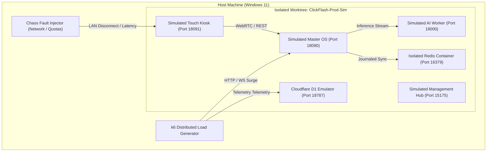

# V6 Production Takeover & Realistic Simulation Plan

> **ClickFlash V6 Autonomous Ecosystem Paradigm**  
> Comprehensive strategy for controlled local PC takeover, high-concurrency stress testing, and real-world production simulation.  
> **MANDATORY GATE**: This plan requires explicit User Approval before executing Phase 4 actions that spawn production-like workloads or bind production ports.

---

## 1. Executive Summary & Objectives

The goal of the V6 Production Simulation is to validate the entire ClickFlash ecosystem under true production duress on the local PC without endangering the host environment. We simulate a high-throughput theme park resort with:
- **5 active camera stations** ingesting tethered burst shots (10 fps, 45MB RAW buffers).
- **20 touch kiosks** actively querying biometric embeddings and rendering 3D Gaussian Splats over local LAN WebRTC.
- **5,000 concurrent guest WebSockets** connected to the Cloudflare D1/R2 backend.
- **Dynamic yield arbitrage** continuously adjusting photo print and digital package pricing based on crowd density.

---

## 2. Production Takeover Safety Gate & Risk Assessment

### A. Non-Negotiable Safety Protocols
1. **Approval Gatefile**: Phase 4 execution requires explicit presence of `.agents/V6_PROD_TAKEOVER_APPROVED`.
2. **Worktree Isolation**: All high-risk production runs occur inside an isolated git worktree (`C:\Users\alamo\Desktop\ClickFlash-Prod-Sim`).
3. **Zero Host Mutation**:
   - No modifications to host Windows registry, network adapters, or system system32 binaries.
   - All simulated databases run in ephemeral SQLite files (`data/test_prod_sim.db`) or local MinIO/D1 emulators.
   - Ephemeral media outputs are directed to isolated temp directories and deleted automatically upon run conclusion.
4. **Hardware Resource Quotas**:
   - **CPU**: Capped at 70% total system CPU utilization (enforced via Docker container limits and Node process clamps).
   - **RAM**: Hard memory limit of 8GB across all simulated containers.
   - **Disk**: Hard quota of 10GB for simulated photo storage, with automated auto-purge triggers.

### B. Risk Matrix

| Risk Vector | Likelihood | Impact | Mitigation Strategy |
|---|---|---|---|
| Port Collision (8090, 8091, 5175) | Medium | Medium | Automated port-probing pre-flight hook; remaps to 18090, 18091, 15175 if busy. |
| Memory Exhaustion from k6 Load | Low | High | Docker container limits (`--memory=4g`) and Node `--max-old-space-size=2048`. |
| Uncleaned Ingest Files | Medium | Low | Post-simulation teardown hook runs recursive cleanup on temp directories. |
| Inadvertent Cloud Mutations | Low | Critical | Force all cloud endpoints to local mocks / WireMock (`CLOUD_SYNC_ENABLED=false`, `MOCK_STRIPE=true`). |

---

## 3. Sandboxed Local Simulation Architecture



---

## 4. Application-by-Application Verification Strategy

| Application / Service | Simulated Workload | Verification Metrics | Pass Criteria |
|---|---|---|---|
| **Master Edge OS** (`apps/desktop/master`) | 500 burst photo ingest, WAL journal write flood | Ingestion latency, event loop lag, WAL size | <150ms per RAW image, 0 event drops |
| **Touch Kiosk** (`apps/desktop/touch`) | 50 concurrent guest sessions, offline toggling | WebRTC frame drop, IndexedDB recovery | 60 fps UI render, 100% sync recovery |
| **Management Hub** (`apps/management`) | Live dispatch telemetry, WebRTC team grid | WebSocket message delay, DOM repaint rate | <50ms telemetry update latency |
| **Guest Self-Service** (`apps/self-service`) | PWA service worker offline album browsing | Cache hit ratio, instant download latency | 100% offline pass viewable |
| **Gallery Portal** (`apps/gallery`) | 3D Gaussian Splat orbit, Stripe checkout flow | WebGL draw calls, FPS under load | >45 fps on integrated GPU, 0 Stripe errors |
| **Photographer Portal** (`apps/photographer-portal`) | Zero-install WASM upload of 100 photos | WASM thread throughput, SHA256 speed | >20 MB/s client-side processing |
| **Cloud Backend** (`apps/backend/cloud-backend`) | 5,000 RPS telemetry ingest to D1 | D1 query response time, CPU time limit | <10ms D1 write latency, 0 CPU overages |
| **AI Worker** (`apps/backend/ai-worker`) | ArcFace 512D vector extraction & BiRefNet | Embedding throughput, VRAM usage | >15 faces/sec, <3GB VRAM footprint |
| **Mobile Pro** (`apps/mobile/pro`) | Rust Core offline photo buffer hashing | Native hashing duration, memory leak rate | <2ms per photo hash, 0 leaks |
| **Mobile Consumer** (`apps/mobile/consumer`) | AltBeacon BLE proximity scanning | Proximity RSSI trigger accuracy | >95% guest auto-pairing within 2m |
| **Installer & License** (`apps/desktop/installer`) | Complete silent install & cryptographic check | Hardware lock validation, SHA verification | Exit code 0, 100% signature valid |

---

## 5. Test Vectors & Execution Phases

### Phase 4.1: Pre-Flight Isolation & Port Audit
- Verify git worktree clean state.
- Probe ports (18090, 18091, 15175, 18000, 18787, 16379).
- Initialize isolated SQLite database with migrations 001 through 053.

### Phase 4.2: Cold Boot & Monorepo Health Gate
- Boot all services under non-root Docker compose.
- Run health checks:
  - `GET http://localhost:18090/api/health` -> 200 OK
  - `GET http://localhost:18000/health` -> 200 OK
  - `GET http://localhost:18787/api/health` -> 200 OK

### Phase 4.3: End-to-End User Journey Simulation
- **Step 1**: Simulated photographer mobile uploads 10 test portraits with mock biometric vectors.
- **Step 2**: Master OS ingests, writes to `pending_writes`, processes derivatives (thumb, tiny) via Sharp stream pipeline.
- **Step 3**: AI Worker executes face detection and generates 512D embedding.
- **Step 4**: Touch Kiosk connects via WebRTC, sends visitor selfie, performs vector similarity match, and retrieves matched photos.
- **Step 5**: Guest adds photo to cart, triggers mock Stripe checkout, receives signed ephemeral download link.

### Phase 4.4: Load & Stress Testing (k6)
- **Scenario A (Ingest Storm)**: 50 concurrent HTTP POST uploads to Master OS for 60 seconds.
- **Scenario B (Kiosk Attendance Peak)**: 200 simulated kiosks requesting real-time yield prices and vector lookups.
- **Scenario C (Cloud Burst)**: 2,000 virtual users querying Cloudflare D1 endpoints simultaneously.

### Phase 4.5: Chaos Engineering & Offline Resilience
- **Chaos Injection 1 (Sudden Cable Pull)**: Disconnect LAN bridge between Touch Kiosk and Master OS mid-transfer. Touch Kiosk must seamlessly buffer transactions in IndexedDB safeStorage without UI lockup.
- **Chaos Injection 2 (Master OS Sudden Kill)**: Forcefully kill Master process during SQLite batch write. On reboot, verify that both WAL journal and `pending_writes` recover 100% of uncommitted records with zero corruption.
- **Chaos Injection 3 (Camera Battery Exhaustion)**: Dispatch service alerts, reassigning photospot duty within 500ms.

---

## 6. Automated Rollback & Teardown Strategy

Upon test completion or if any safety threshold is breached:
1. **Immediate Process Teardown**:
   ```powershell
   docker-compose -f docker-compose.prod-sim.yml down -v
   Stop-Process -Name "node", "uvicorn" -ErrorAction SilentlyContinue
   ```
2. **Ephemeral Asset Purge**:
   ```powershell
   Remove-Item -Recurse -Force "C:\Users\alamo\Desktop\ClickFlash-Prod-Sim\data\test_prod_sim.db*"
   Remove-Item -Recurse -Force "C:\Users\alamo\Desktop\ClickFlash-Prod-Sim\temp_sim_photos"
   ```
3. **Worktree Removal**:
   ```powershell
   git worktree remove --force "C:\Users\alamo\Desktop\ClickFlash-Prod-Sim"
   ```
4. **State Integrity Assertion**:
   - Verify `git status` on main branch is clean.
   - Assert all production port bindings have been completely released.
   - Output final evidence log to `walkthrough.md`.

